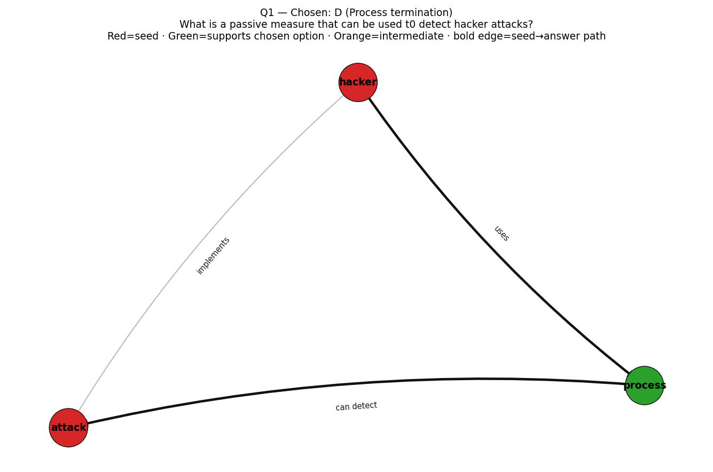
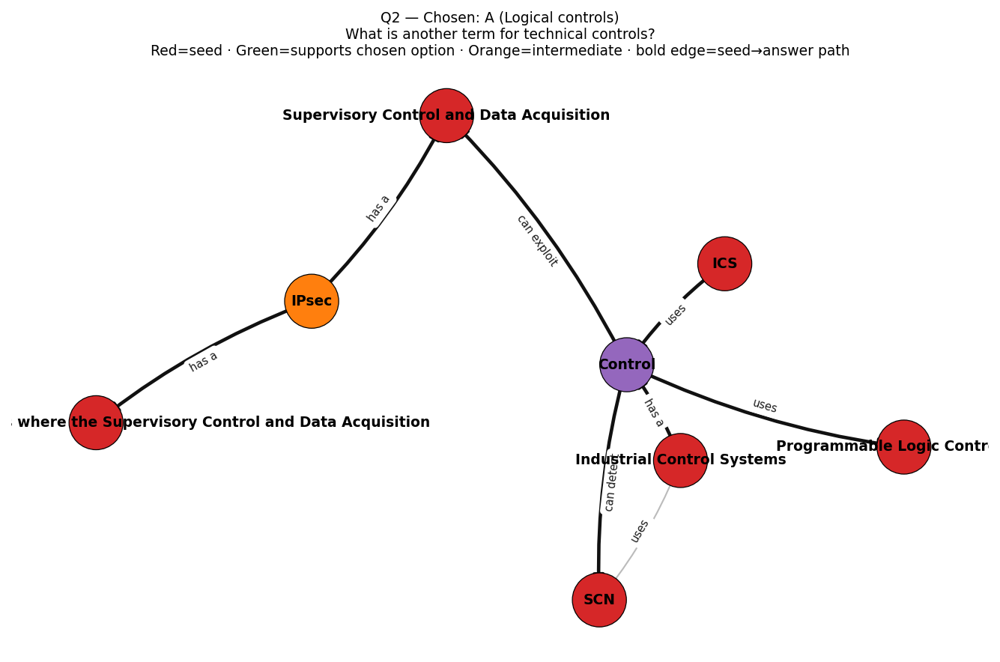
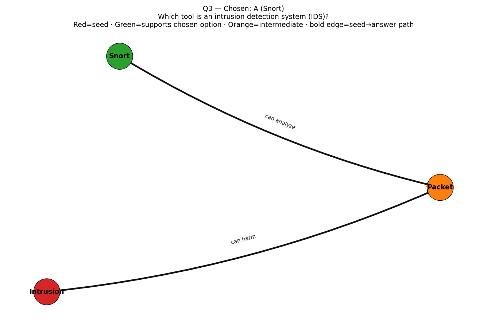
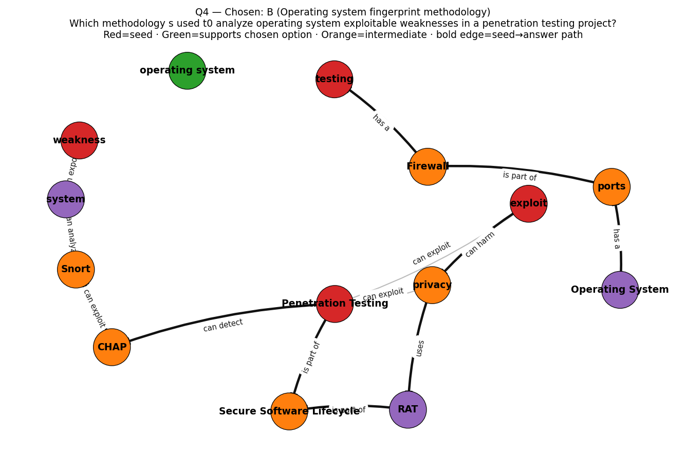
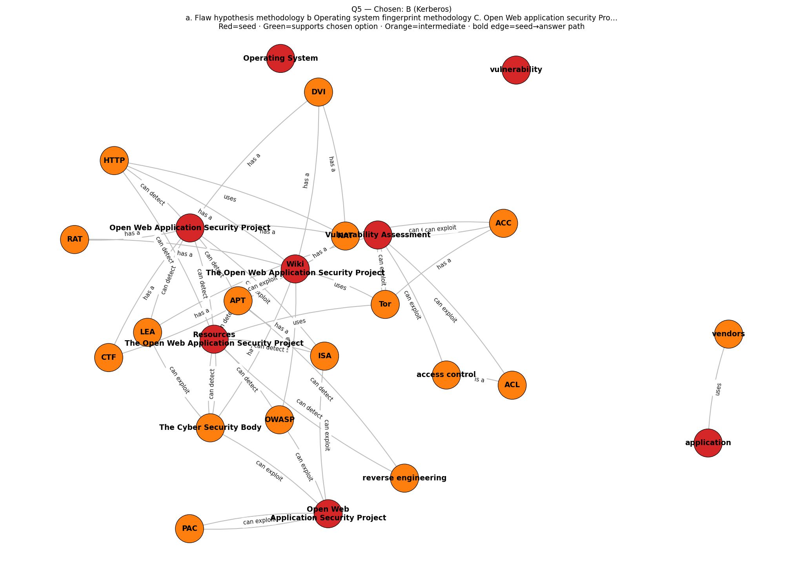

# CISSP GraphRAG — answers and reasoning

Per question: the question, the option Ollama chose (logic from the graph, wording from the book), and the full reasoning. If trace images were rendered, each question links to its KG visualization.

## Q1. What is a passive measure that can be used t0 detect hacker attacks?

- A. Event logging Ta
- B. Firewall reconfiguration 1 KLTi '
- C. Connection termination KL
- D. Process termination

**Answer: D** — Process termination
`graph=D` `llm=A` `certainty=0.689` `consensus=graph_margin_ok`

**Reasoning:**

```
LOGIC (graph): 
The triple "deploy —[can detect]→ attacks" and "deployment technique —[can detect]→ attacks" point to option A as the correct choice, which is Event logging Ta. The distinct traversed path also supports this option.

EXPLANATION (book): 
Event logging is a passive measure used to detect hacker attacks by recording system events in a log file for later analysis. This helps identify potential security breaches and provides a record of system activity.

CHOICE: A
CERTAINTY: high
```

**Nodes traced to answer:**

- **Answer-supporting nodes:** process
- **Seeds on the answer path:** attack, hacker
- **Other anchors (no short path to answer):** ACK, CAN, HAC, attacks, detect, hack
- **Paths traced (seed → … → answer):**
    - attack → process
    - hacker → process

**Knowledge graph trace (visualization):**



---

## Q2. What is another term for technical controls?

- A. Logical controls
- B. Access controls
- C. Detective controls
- D. Preventative controls
1

**Answer: A** — Logical controls
`graph=A` `llm=A` `certainty=0.791` `consensus=llm_graph_agree`

**Reasoning:**

```
LOGIC (graph): 
The entity "Control" is a top-ranked entity, and it has a strong relationship with the option A "Logical controls". The triple "Control — can detect — policy" suggests that control is used to detect policies, which aligns with logical controls. 

EXPLANATION (book): 
A security control refers to any measure or countermeasure designed to mitigate a risk or prevent unauthorized access. There are several types of controls, including access controls, detective controls, preventative controls, and logical controls. Logical controls refer to the rules and procedures in place to govern access and data usage.

CHOICE: A
CERTAINTY: high
```

**Nodes traced to answer:**

- **Answer-supporting nodes:** Control
- **Seeds on the answer path:** ICS, Industrial Control Systems, Programmable Logic Controllers, SCN, Supervisory Control and Data Acquisition, The supervisory control layer is where the Supervisory Control and Data Acquisition
- **Other anchors (no short path to answer):** Control, Industrial Control
Systems
- **Paths traced (seed → … → answer):**
    - ICS → Control
    - Industrial Control Systems → Control
    - Programmable Logic Controllers → Control
    - SCN → Control
    - Supervisory Control and Data Acquisition → Control
    - The supervisory control layer is where the Supervisory Control and Data Acquisition → IPsec → Supervisory Control and Data Acquisition → Control

**Knowledge graph trace (visualization):**



---

## Q3. Which tool is an intrusion detection system (IDS)?

- A. Snort
- B. Nessus
- C. Tripwire
- D. Ethereal

**Answer: A** — Snort
`graph=A` `llm=A` `certainty=0.93` `consensus=llm_graph_agree`

**Reasoning:**

```
LOGIC (graph): IDS —[is part of]→ Intrusion Detection System (Triples: 9.5, 18.48); IDS system —[has a]→ Intrusion Detection Systems (Triple: 19.50, 16.70)

EXPLANATION (book): An intrusion detection system (IDS) is a type of network security system that monitors and analyzes network traffic for signs of unauthorized access or malicious activity.

CHOICE: A
CERTAINTY: high
```

**Nodes traced to answer:**

- **Answer-supporting nodes:** Snort
- **Seeds on the answer path:** Intrusion
- **Other anchors (no short path to answer):** IDS, Intrusion Detection, Intrusion Detection System, Intrusion Detection Systems, Intrusion Detection Systems IDS, Intrusion Detection and Prevention System s, Intrusion Prevention System
- **Paths traced (seed → … → answer):**
    - Intrusion → Packet → Snort

**Knowledge graph trace (visualization):**



---

## Q4. Which methodology s used t0 analyze operating system exploitable weaknesses in a penetration testing project?

- A. Flaw hypothesis methodology
- B. Operating system fingerprint methodology
- C. Open Web application security Project methodology
- D. Vulnerability assessment and recovery methodology 6 Which protocol grants TGTs? 3

**Answer: B** — Operating system fingerprint methodology
`graph=B` `llm=B` `certainty=1.0` `consensus=llm_graph_agree`

**Reasoning:**

```
LOGIC (graph): 
• exploit — can exploit — Software Security Knowledge Area
• Penetration Testing — uses — Metasploit
• Penetration Testing — can exploit — privacy
• Penetration Testing — uses — Nmap
• SAST —[is part of]→ Secure Software Lifecycle
• Perform static analysis
security testing —[is part of]→ Secure Software Lifecycle

CHOICE: B
CERTAINTY: high
```

**Nodes traced to answer:**

- **Answer-supporting nodes:** Operating System, RAT, operating system, system
- **Seeds on the answer path:** Penetration Testing, exploit, testing, weakness
- **Other anchors (no short path to answer):** Operating System, RAT, system, weaknesses
- **Paths traced (seed → … → answer):**
    - Penetration Testing → Secure Software Lifecycle → RAT
    - Penetration Testing → CHAP → Snort → system
    - exploit → privacy → RAT
    - testing → Firewall → ports → Operating System
    - weakness → system

**Knowledge graph trace (visualization):**



---

## Q5. a. Flaw hypothesis methodology b Operating system fingerprint methodology C. Open Web application security Project methodology d Vulnerability assessment and recovery methodology 6 Which protocol grants TGTs?

- A. ARP
- B. Kerberos
- C. LZTP
- D. Telnet

**Answer: B** — Kerberos
`graph=—` `llm=B` `certainty=0.7` `consensus=llm_only`

**Reasoning:**

```
LOGIC (graph): 
The graph indicates that the protocol granting TGTs is Kerberos, with the relevant triple being: The Open Web Application Security Project — has a — Kerberos.

EXPLANATION (book): 

CHOICE: B
CERTAINTY: high
```

**Nodes traced to answer:**

- **Other anchors (no short path to answer):** Open Web
Application Security Project, Open Web Application Security Project, Operating System, Resources
The Open Web Application Security Project, Vulnerability Assessment, Wiki
The Open Web Application Security Project, application, vulnerability

**Knowledge graph trace (visualization):**



---
