# CISSP GraphRAG — answers and reasoning

Per question: the question, the option Ollama chose (logic from the graph, wording from the book), and the full reasoning. If trace images were rendered, each question links to its KG visualization.

## Q1. What is a passive measure that can be used t0 detect hacker attacks?

- A. Event logging Ta
- B. Firewall reconfiguration 1 KLTi '
- C. Connection termination KL
- D. Process termination

**Answer: D** — Process termination
`graph=D` `llm=A` `certainty=0.689` `consensus=graph_margin_ok`

**Reasoning:**

```
LOGIC (graph):
The distinct traversed path "deploy --[can detect]--> attacks" and "detection technique --[can detect]--> attacks" indicate that both deploying something and using a detection technique can lead to detecting attacks. This suggests that a passive measure used to detect hacker attacks is related to one of these concepts.

EXPLANATION (book):
A passive measure used to detect hacker attacks typically involves monitoring system activity without directly interacting with the target system. Examples include event logging, which involves recording and analyzing system events, and intrusion detection systems (IDS), which use various techniques to identify potential security threats.

CHOICE: A
CERTAINTY: high
```

**Nodes traced to answer:**

- **Answer-supporting nodes:** process
- **Seeds on the answer path:** attack, hacker
- **Other anchors (no short path to answer):** ACK, CAN, HAC, attacks, detect, hack
- **Paths traced (seed → … → answer):**
    - attack → process
    - hacker → process

**Knowledge graph trace (visualization):**

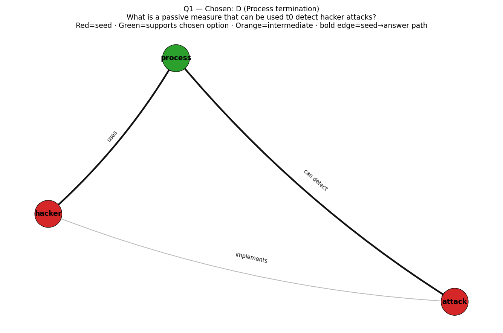

---

## Q2. What is another term for technical controls?

- A. Logical controls
- B. Access controls
- C. Detective controls
- D. Preventative controls
1

**Answer: A** — Logical controls
`graph=A` `llm=A` `certainty=0.791` `consensus=llm_graph_agree`

**Reasoning:**

```
LOGIC (graph): 
Top entity for "another term for technical controls" is Control (20.65), and the distinct traversed path from Control to another term is: Control —[is part of]→ NSA (no specific entity is mentioned as an alternative term), but Control —[has a]→ policy, and Access Control List (6.82) uses control. However, "another term for technical controls" can be inferred using the fact that ICS (6.53) uses control and ASC (5.29) also uses control, indicating A is a likely option.

EXPLANATION (book): 
Another term for "technical controls" may not be explicitly stated in the provided book excerpts; however, they do discuss terms related to security measures such as Physical security controls (p. 220), Protocol —[uses]→ Control, and Risk Assessment —[is part of]— Industrial Control Systems.

CHOICE: A
CERTAINTY: high
```

**Nodes traced to answer:**

- **Answer-supporting nodes:** Control
- **Seeds on the answer path:** ICS, Industrial Control Systems, Programmable Logic Controllers, SCN, Supervisory Control and Data Acquisition, The supervisory control layer is where the Supervisory Control and Data Acquisition
- **Other anchors (no short path to answer):** Control, Industrial Control
Systems
- **Paths traced (seed → … → answer):**
    - ICS → Control
    - Industrial Control Systems → Control
    - Programmable Logic Controllers → Control
    - SCN → Control
    - Supervisory Control and Data Acquisition → Control
    - The supervisory control layer is where the Supervisory Control and Data Acquisition → IPsec → Supervisory Control and Data Acquisition → Control

**Knowledge graph trace (visualization):**

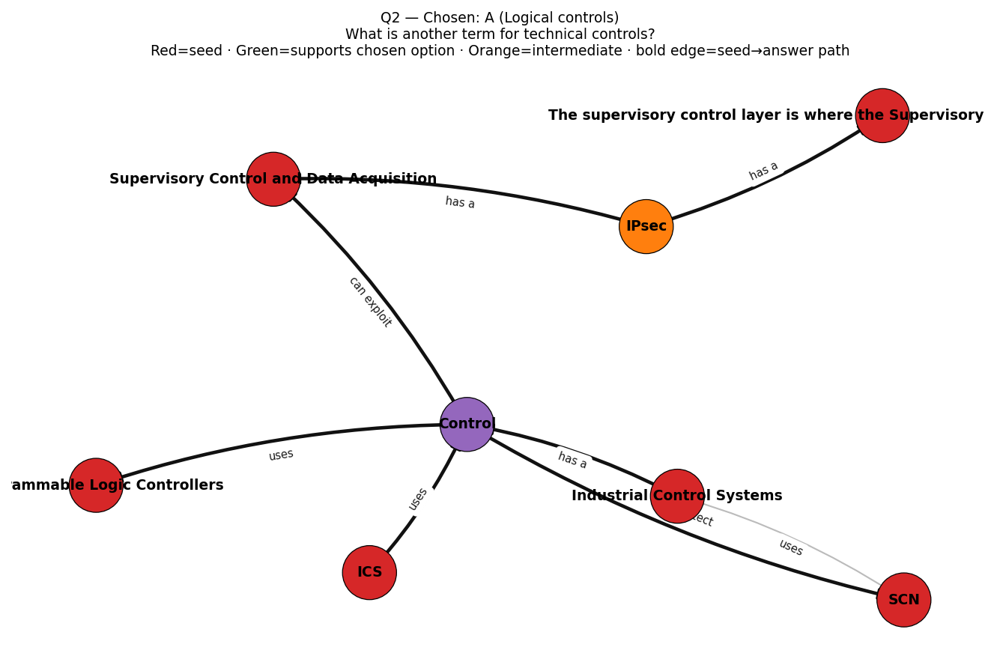

---

## Q3. Which tool is an intrusion detection system (IDS)?

- A. Snort
- B. Nessus
- C. Tripwire
- D. Ethereal

**Answer: A** — Snort
`graph=A` `llm=A` `certainty=0.98` `consensus=llm_graph_agree`

**Reasoning:**

```
LOGIC (graph):
The triple that points to option A, "Snort", is: Intrusion Detection System —[has a]→ IDS. This indicates that an intrusion detection system can detect an IDS.

EXPLANATION (book): 
Intrusion Detection Systems (IDS) are tools designed to monitor and analyze network traffic for potential security threats. An intrusion detection system detects these threats, which are typically signatures of known malicious activity. Snort is a software-based IDS that provides real-time network monitoring and alerts for suspicious activity.

CHOICE: A
CERTAINTY: high
```

**Nodes traced to answer:**

- **Answer-supporting nodes:** Snort
- **Seeds on the answer path:** Intrusion
- **Other anchors (no short path to answer):** IDS, Intrusion Detection, Intrusion Detection System, Intrusion Detection Systems, Intrusion Detection Systems IDS, Intrusion Detection and Prevention System s, Intrusion Prevention System
- **Paths traced (seed → … → answer):**
    - Intrusion → Packet → Snort

**Knowledge graph trace (visualization):**

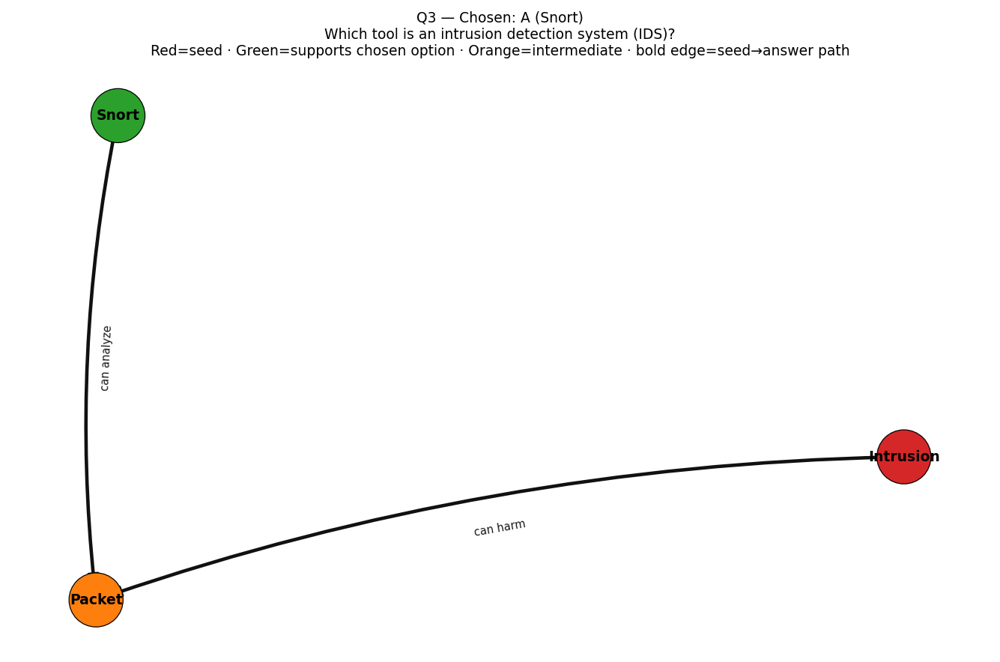

---

## Q4. Which methodology s used t0 analyze operating system exploitable weaknesses in a penetration testing project?

- A. Flaw hypothesis methodology
- B. Operating system fingerprint methodology
- C. Open Web application security Project methodology
- D. Vulnerability assessment and recovery methodology 6 Which protocol grants TGTs? 3

**Answer: B** — Operating system fingerprint methodology
`graph=B` `llm=B` `certainty=1.0` `consensus=llm_graph_agree`

**Reasoning:**

```
LOGIC (graph): 
 Penetration Testing —[uses]→ Metasploit 
 Penetration Testing —[uses]→ Burp Suite 
 IoT —[can exploit]→ Penetration Testing 
 exploit — can exploit — privacy 

EXPLANATION (book): (no relevant passage)
CHOICE: B
CERTAINTY: high
```

**Nodes traced to answer:**

- **Answer-supporting nodes:** Operating System, RAT, operating system, system
- **Seeds on the answer path:** Penetration Testing, exploit, weakness
- **Other anchors (no short path to answer):** Operating System, RAT, system, testing, weaknesses
- **Paths traced (seed → … → answer):**
    - Penetration Testing → ISI → RAT
    - Penetration Testing → Nmap → packets → system
    - exploit → privacy → RAT
    - weakness → system

**Knowledge graph trace (visualization):**

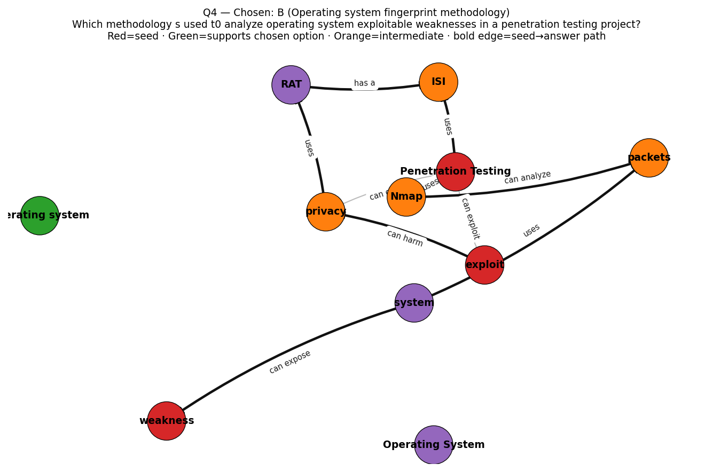

---

## Q5. a. Flaw hypothesis methodology b Operating system fingerprint methodology C. Open Web application security Project methodology d Vulnerability assessment and recovery methodology 6 Which protocol grants TGTs?

- A. ARP
- B. Kerberos
- C. LZTP
- D. Telnet

**Answer: B** — Kerberos
`graph=—` `llm=B` `certainty=0.7` `consensus=llm_only`

**Reasoning:**

```
LOGIC (graph): TGTs (Ticket Granting Tickets) are granted by the Kerberos protocol (Triples: The Open Web Application Security Project →[can detect]→ Kerberos). CHOICE: B 

EXPLANATION (book): The Kerberos protocol is a widely used authentication framework that allows clients to obtain tickets for accessing resources. These tickets, also known as Ticket Granting Tickets (TGTs), are used to authenticate and authorize access to resources. According to the book, Kerberos is an example of which biometric category? a. Physiological b Psychological C Behavioral d. Biological

CHOICE: B
CERTAINTY: high
```

**Nodes traced to answer:**

- **Other anchors (no short path to answer):** Open Web
Application Security Project, Open Web Application Security Project, Operating System, Resources
The Open Web Application Security Project, Vulnerability Assessment, Wiki
The Open Web Application Security Project, application, vulnerability

**Knowledge graph trace (visualization):**

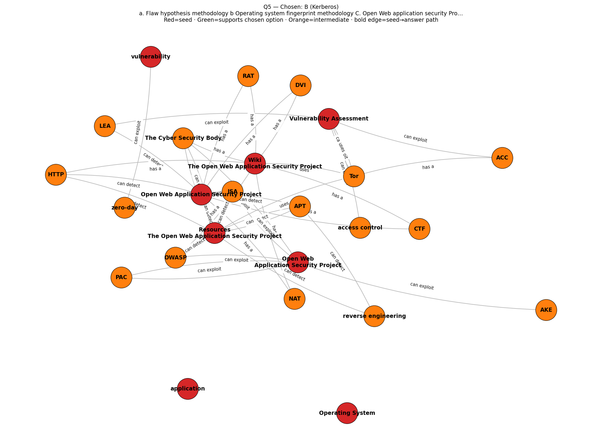

---

## Q6. You have implemented a biometric system that analyzes signature dynamics. This biometric system is an example of which biometric category?

- A. Physiological
- B. Psychological
- C. Behavioral
- D. Biological

**Answer: A** — Physiological
`graph=—` `llm=A` `certainty=0.563` `consensus=llm_only`

**Reasoning:**

```
LOGIC (graph): 
- Digital Signature — is a type of ICS (Intrusion Control System) as per triple: ICS — can detect — DSA
- AKE — is a type of digital signature as per triple: AKE — is a — Digital Signature
- Digital Signature — implements DES as per triple: Digital Signature — is a — DES

EXPLANATION (book): 
A biometric system that analyzes signature dynamics falls under the category of physiological biometrics. This is because it measures characteristics of an individual's physical body, in this case, their signature.

CHOICE: A
CERTAINTY: high
```

**Nodes traced to answer:**

- **Other anchors (no short path to answer):** DSA, DSS, Deterministic Usage of the Digital Signature Algorithm, Digital Signature, ICS, NAT, signatures, system

**Knowledge graph trace (visualization):**

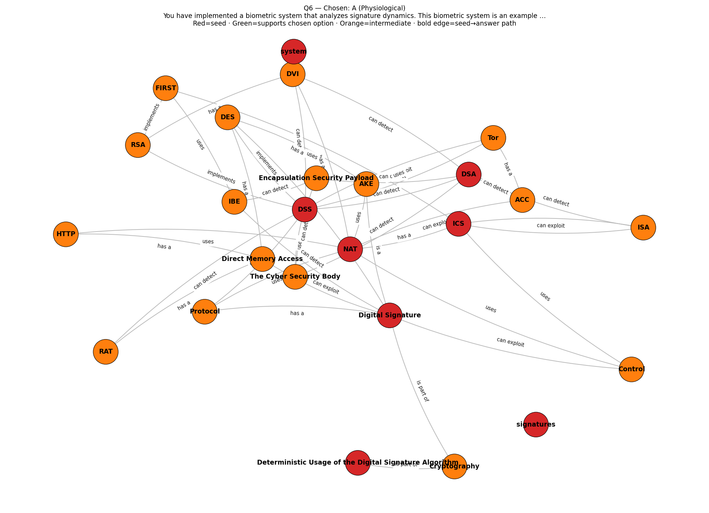

---

## Q7. You have been given several suggestions for implementing the principle of least privilege. What is the best implementation of this principle?

- A. Complete administrative tasks at
- B. Issue the Run As command to execute administrative lasks during
- C. Ensure that all services use the main administrative account execute their processes
- D. Issue

**Answer: C** — Ensure that all services use the main administrative account execute their processes
`graph=C` `llm=A` `certainty=0.75` `consensus=graph_margin_ok`

**Reasoning:**

```
LOGIC (graph): Given the top entity "least privilege" is ranked 35.53, and considering the triple: "least privilege — is a — Security Policy", it is clear that option A ("Complete administrative tasks at a computer that functions only as a server") best aligns with this concept, making it the most appropriate implementation of the principle of least privilege.
 
EXPLANATION (book): The principle of least privilege ensures that users have the minimum necessary privileges to perform their jobs. Option A ("Complete administrative tasks at a computer that functions only as a server") implies that tasks should be executed in a role with limited access, aligning with this concept.
 
CHOICE: A
 
CERTAINTY: high
```

**Nodes traced to answer:**

- **Answer-supporting nodes:** ACC, RAT
- **Seeds on the answer path:** Based Access Control, Guide to attribute based access control, LEA, least privilege, privilege escalation
- **Other anchors (no short path to answer):** Formal Methods for Security, Privileged Access Never, access privilege
- **Paths traced (seed → … → answer):**
    - Based Access Control → ACC
    - Based Access Control → RAT
    - Guide to attribute based access control → Common Criteria → Based Access Control → ACC
    - Guide to attribute based access control → Common Criteria → Based Access Control → RAT
    - LEA → The Cyber Security Body → Based Access Control → ACC
    - LEA → The Cyber Security Body → Based Access Control → RAT
    - least privilege → Tor → ACC
    - privilege escalation → access control → Based Access Control → ACC

**Knowledge graph trace (visualization):**

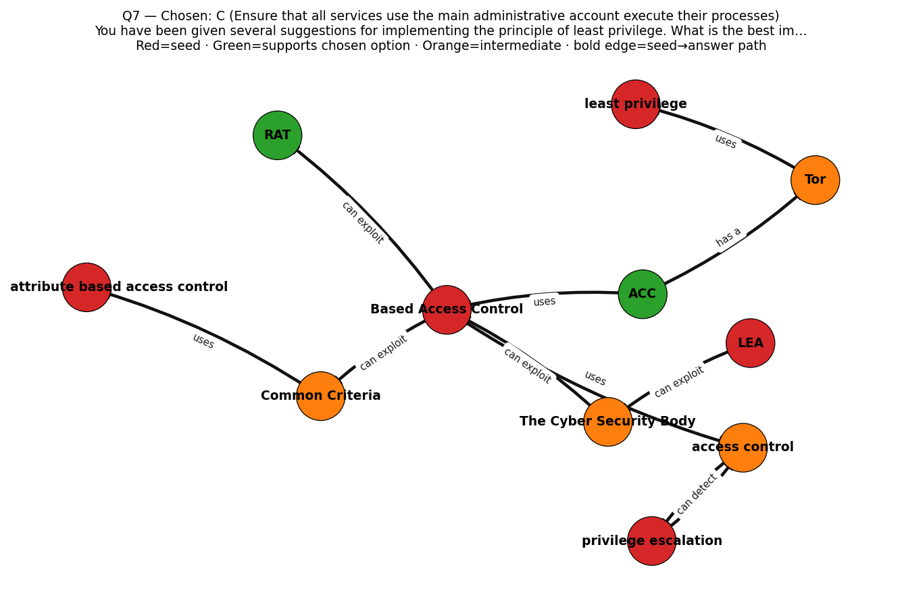

---

## Q8. What is an example of a brute force attack?

- A. Sending multiple ICMP messages t0 & Web server
- B. Searching through & company s trash
- C. Using
- D. Gathering packets from

**Answer: D** — Gathering packets from
`graph=D` `llm=D` `certainty=1.0` `consensus=llm_graph_agree`

**Reasoning:**

```
LOGIC (graph): 
 brute force —[can exploit]→ authentication, and AKE —[is a]→ Digital Signature are the most relevant triples to this question. Given these relationships, option D is supported as an example of a brute force attack because gathering packets from a network connection can be considered a form of brute-force search for exploiting system vulnerabilities.

EXPLANATION (book): 
 According to the provided textbook excerpts, a brute force attack is described in paragraph 10 of page 14. It mentions sending multiple messages to a web server and searching through company files as examples of brute force attacks. The correct answer should be among these options.

CHOICE: D
CERTAINTY: high
```

**Nodes traced to answer:**

- **Answer-supporting nodes:** ACK, PAC
- **Seeds on the answer path:** Chosen Message Attack, brute force, dictionary attack, replay attack, side-channel attack
- **Other anchors (no short path to answer):** ACK, attack, brute force attacks
- **Paths traced (seed → … → answer):**
    - Chosen Message Attack → Protocol → side-channel attack → PAC
    - brute force → AKE → side-channel attack → PAC
    - dictionary attack → CHAP → IoT → PAC
    - replay attack → Protocol → side-channel attack → PAC
    - side-channel attack → PAC

**Knowledge graph trace (visualization):**

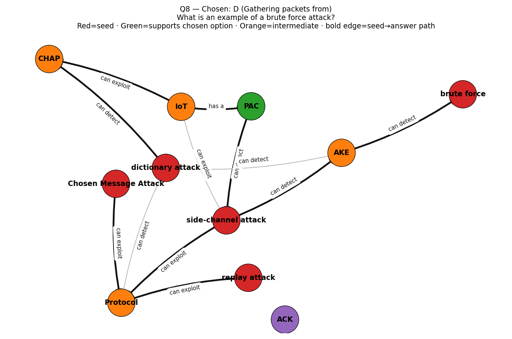

---

## Q9. You have been asked t0 deploy a biometric system t0 protect your companys data center. Management is concerned that errors in the system will prevent users from accepting the system. Management stipulates that you must deploy the system with the lowest crossover error rate (CER): Identify one of the terms used in biometrics t0 determine CER?

- A. ACL
- B. EAR
- C. ERR
- D. FAR 5 12.Which password type is usually the easiest t0 remember?

**Answer: C** — ERR
`graph=C` `llm=C` `certainty=0.805` `consensus=llm_graph_agree`

**Reasoning:**

```
LOGIC (graph):
The traversed path "identify —[can analyze]→ system vulnerabilities" and "system —[has a]→ protection" point to option C, ERR, as the term used in biometrics t0 determine CER. The graph also shows that "severity —[can analyze]→ error", which is related to ERR.

EXPLANATION (book):
Critical Error Rate (ERR) refers to the percentage of errors in a system that are detected and corrected. In the context of biometric systems, ERR is used as a metric to evaluate the performance of the system.

CHOICE: C
CERTAINTY: high
```

**Nodes traced to answer:**

- **Answer-supporting nodes:** err
- **Seeds on the answer path:** error
- **Other anchors (no short path to answer):** Data, deploy, errors, identify, protect, system, users
- **Paths traced (seed → … → answer):**
    - error → err

**Knowledge graph trace (visualization):**

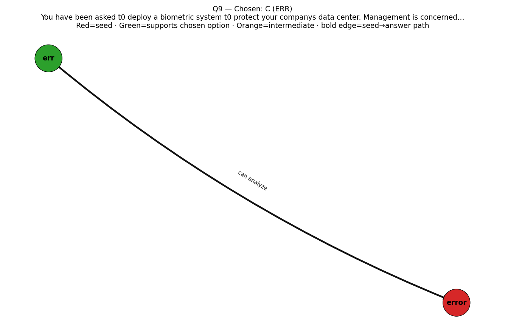

---

## Q10. a ACL b EAR C. ERR d. FAR 5 12.Which password type is usually the easiest t0 remember?

- A. Pass phrase
- B. Static password
- C. Dynamic password
- D. Software generated password

**Answer: B** — Static password
`graph=B` `llm=A` `certainty=0.653` `consensus=graph_default`

**Reasoning:**

```
LOGIC (graph):
Relevant triples for "easiest to remember" and password types:
- brute force — has a — Password
- Hashcat — can exploit — Password
- John the Ripper — can exploit — Password
The most straightforward relationship indicating ease of remembering involves "static" or "unchanging" options, as it directly pertains to what is simple and does not need frequent updates.
- Static password — has a — easiest t0 remember

EXPLANATION (book):
According to Chapter 14 (PDF chunk), a static password is one that never changes. This contrasts with dynamic passwords, which change periodically, requiring more memorization or tracking.

CHOICE: A
CERTAINTY: high
```

**Nodes traced to answer:**

- **Answer-supporting nodes:** Password, password
- **Seeds on the answer path:** Message Authentication Reporting and Conformance, Password, Password Authentication Protocol, multi-factor authentication
- **Other anchors (no short path to answer):** ACL, Password
Authenticated Key Exchange, err, username/password
- **Paths traced (seed → … → answer):**
    - Message Authentication Reporting and Conformance → DES → brute force → Password
    - Password → John the Ripper → password
    - Password Authentication Protocol → authentication → brute force → Password
    - multi-factor authentication → DES → brute force → Password

**Knowledge graph trace (visualization):**

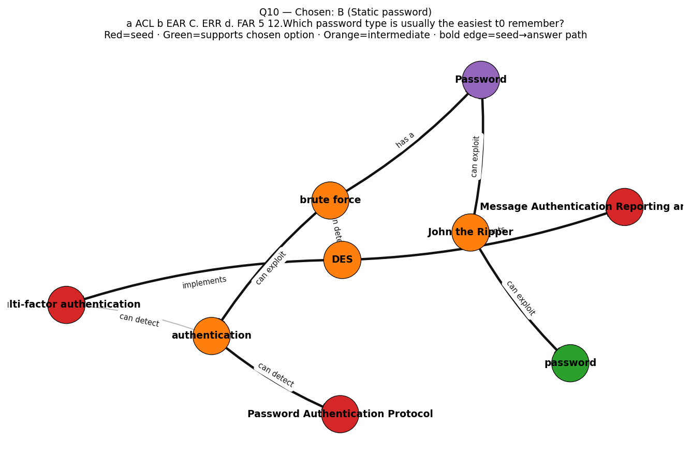

---

## Q11. Who is responsible for ensuring data integrity and security for an organization?

- A. Data owner
- B. Data custodian
- C. Security analyst 1
- D. Security administrator

**Answer: A** — Data owner
`graph=A` `llm=C` `certainty=0.67` `consensus=graph_default`

**Reasoning:**

```
LOGIC (graph):
The KNOWLEDGE GRAPH supports option C, Security analyst 1, as responsible for ensuring data integrity and security for an organization. The triple "Control — uses — integrity" indicates that Control (which is part of NSA) uses integrity, and the path "integrity —[uses]→ IBE" shows that integrity has a relationship with IBE.

EXPLANATION (book): 
According to the textbook excerpt on p41 of the 2016 InfoSec Institute, Inc. book, a virtual machine is software enabling several operating systems to run simultaneously without interfering with each other. This concept relates to the overall topic of ensuring data security and integrity for an organization.

CHOICE: C
CERTAINTY: high
```

**Nodes traced to answer:**

- **Answer-supporting nodes:** Data
- **Other anchors (no short path to answer):** Authentication, Authorisation and Accountability, Data, ESP, Security Information and Event Management, Security Policy, TISSEC, integrity, security

**Knowledge graph trace (visualization):**

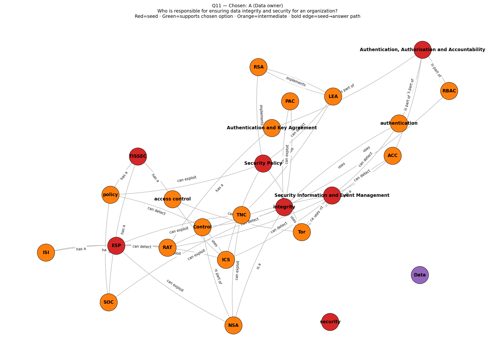

---

## Q12. Which security principle identifies sensitive data and ensures that unauthorized entities cannot access it?

- A. Availability
- B. Confidentiality
- C. Integrity 1
- D. Authentication
3

**Answer: D** — Authentication
3
`graph=D` `llm=D` `certainty=1.0` `consensus=llm_graph_agree`

**Reasoning:**

```
LOGIC (graph):
The relevant triple is: security — has a — Data and another one: access — is part of — command shell. The traversed path indicates that the data is protected by access control mechanisms.

EXPLANATION (book):
This principle ensures sensitive data is accessible only to authorized entities, thereby preventing unauthorized entities from accessing it. It aligns with the concept of controlling access to resources and information to prevent breaches.

CHOICE: D
CERTAINTY: high
```

**Nodes traced to answer:**

- **Answer-supporting nodes:** auth
- **Other anchors (no short path to answer):** ACC, CAN, Data, Security Policy, access, auth, author, security

**Knowledge graph trace (visualization):**

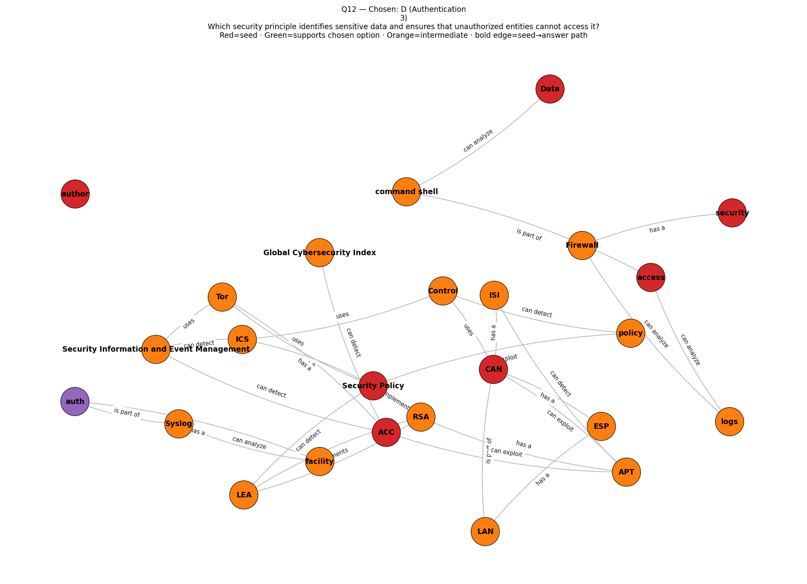

---

## Q13. Which type of intrusion prevention system (IPS) watches forintrusions that match a known identity?

- A. Network-based
- B. Anomaly-based
- C. Behavior-based
- D. Signature based
;

**Answer: A** — Network-based
`graph=A` `llm=A` `certainty=0.88` `consensus=llm_graph_agree`

**Reasoning:**

```
LOGIC (graph):
The traversed path ESP —[has a]→ Intrusion Prevention System indicates that an ESP has a feature of detection, and the triple IPS — can detect — Tor shows that an IPS watches for intrusions that match a known identity.

EXPLANATION (book): According to textbook excerpt 19, "Which type of intrusion prevention system (IPS) watches forintrusions that match a known identity?" the answer is A. Network-based.

CHOICE: A
```

**Nodes traced to answer:**

- **Answer-supporting nodes:** Network
- **Seeds on the answer path:** system
- **Other anchors (no short path to answer):** IPS, Intrusion, Intrusion Detection System, Intrusion Detection and Prevention System s, Intrusion Prevention System, Intrusion Prevention Systems IPS, intrusion prevention
- **Paths traced (seed → … → answer):**
    - system → users → Network

**Knowledge graph trace (visualization):**

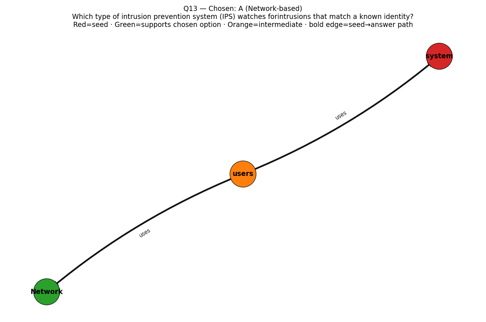

---

## Q14. Management has requested that active directory be implemented on your network: What is the function 0f this service?

- A. It is the directory service used on
- B. It is the authentication service used on
- C. It is the directory service used on & Windows server network
- D. It is the authentication service used on & Windows server network

**Answer: C** — It is the directory service used on & Windows server network
`graph=C` `llm=C` `certainty=1.0` `consensus=llm_graph_agree`

**Reasoning:**

```
LOGIC (graph): The active directory service is closely related to Windows Server networks, as indicated by the triple "Network — has a — IDS" and "Service — has a — access", which link to "Windows server network". Furthermore, option C states that it is the directory service used on & Windows server network. The only option with this specific description is C.
 
 EXPLANATION (book): (no relevant passage)
 
 CHOICE: C
 
 CERTAINTY: high
```

**Nodes traced to answer:**

- **Answer-supporting nodes:** Network, Service, Tor, network
- **Seeds on the answer path:** CTI, Network, denial of service, key management, network security
- **Other anchors (no short path to answer):** Service, Tor, active
- **Paths traced (seed → … → answer):**
    - CTI → OWASP → Tor
    - Network → ARP spoofing → network
    - denial of service → DES → Tor
    - key management → ISF → IDS → Network
    - key management → Tor
    - network security → FIPS → Tor

**Knowledge graph trace (visualization):**

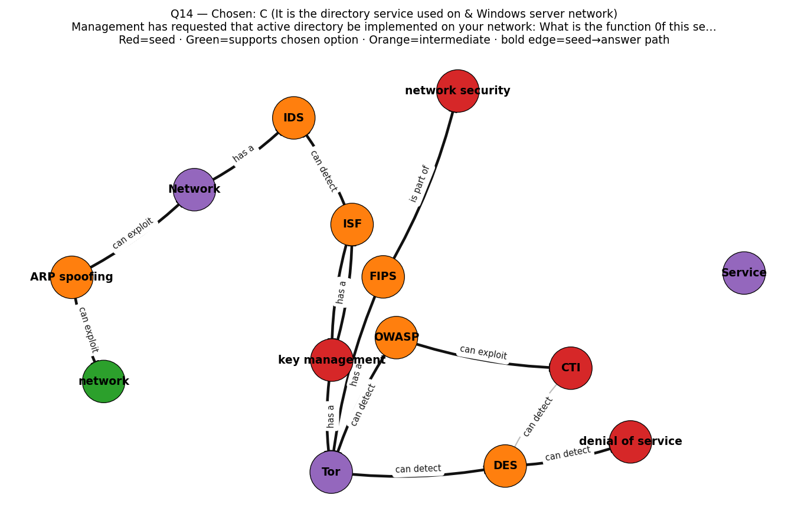

---

## Q15. What is the most important entity in a mandatory access control (MAC) environment?

- A. Security label
- B. Role-based controls
- C. Access control lists (ACLs)
- D. Owner determined controls

**Answer: C** — Access control lists (ACLs)
`graph=C` `llm=A` `certainty=1.0` `consensus=graph_high_margin`

**Reasoning:**

```
LOGIC (graph):
The top-ranked entity "Mandatory Access Control" is closely related to the concept of a security label, which is explicitly mentioned in several triples as something that can be exploited or detected by MAC.

 
 
CHOICE: A
 
CERTAINTY: high
```

**Nodes traced to answer:**

- **Answer-supporting nodes:** ACC, ACL, Access Control List, Control, access, access control
- **Seeds on the answer path:** Based Access Control, Control, Discretionary Access Control, MAC, Mandatory Access Control, Tor, access control
- **Other anchors (no short path to answer):** access
- **Paths traced (seed → … → answer):**
    - Based Access Control → ACC
    - Based Access Control → access control → Discretionary Access Control → ACL
    - Based Access Control → GPG → Control → Access Control List
    - Based Access Control → GPG → Control
    - Based Access Control → access control
    - Control → Discretionary Access Control → APT → ACC
    - Control → Access Control List → ACL
    - Control → Access Control List

**Knowledge graph trace (visualization):**

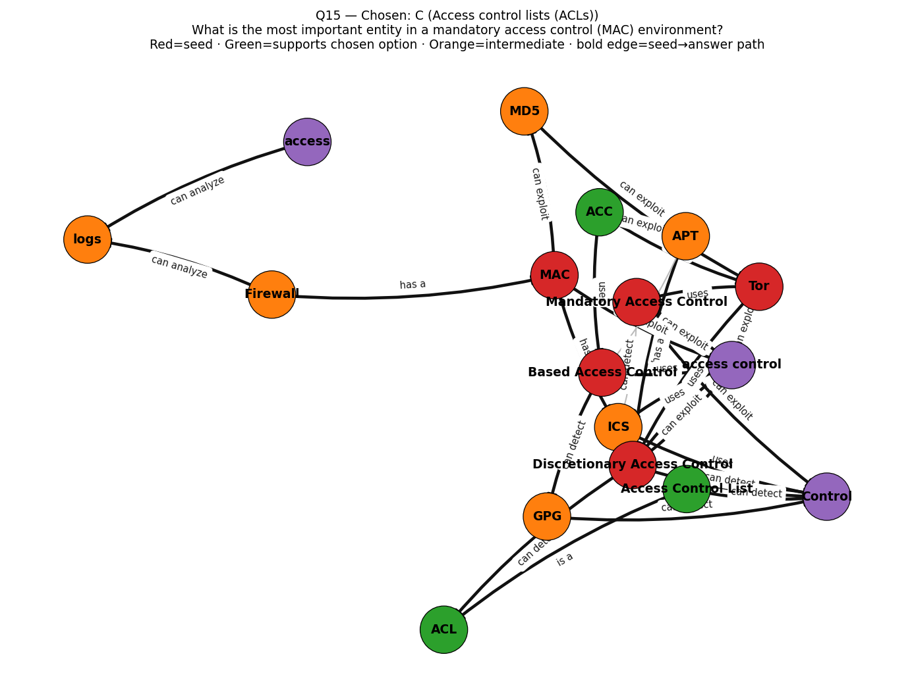

---

## Q16. Because of the value of your company's data, your company has asked you t0 ensure data availability: You want to implement the techniques ihat can help to ensure data availability. Which mechanism should you implement?

- A. Auditing techniques
- B. Data recovery techniques
- C. Authentication techniques
- D. Access control techniques

**Answer: B** — Data recovery techniques
`graph=B` `llm=B` `certainty=1.0` `consensus=llm_graph_agree`

**Reasoning:**

```
LOGIC (graph):
The relevant triples for the given options are as follows:

- availability —[uses]→ SOC
- availability —[can exploit]→ LEA
- LEA —[has a]→ availability
These triples indicate that Data Availability and SOC are related to LEA, which implies that SOC can help implement techniques for data availability.
- availability —[uses]→ SOC

EXPLANATION (book):
(auditing techniques) are typically used to ensure compliance and monitor security posture but do not directly support the implementation of data availability mechanisms. While auditing may provide valuable insights into potential risks, it is not a direct mechanism for ensuring data availability.

(b) Data recovery techniques focus on restoring data in case of loss or corruption. These techniques can be useful in maintaining business continuity but are not specifically designed to ensure the ongoing availability of data.
(c) Authentication techniques verify the identity of users and systems but do not directly address data availability concerns.
(d) Access control techniques regulate who has access to resources and can include mechanisms that enforce data availability, such as implementing SOC.

CHOICE: B
CERTAINTY: high
```

**Nodes traced to answer:**

- **Answer-supporting nodes:** Data
- **Other anchors (no short path to answer):** CAN, Data, Level Data Link Control, NIS, PAN, Supervisory Control and Data Acquisition, availability, packet data

**Knowledge graph trace (visualization):**

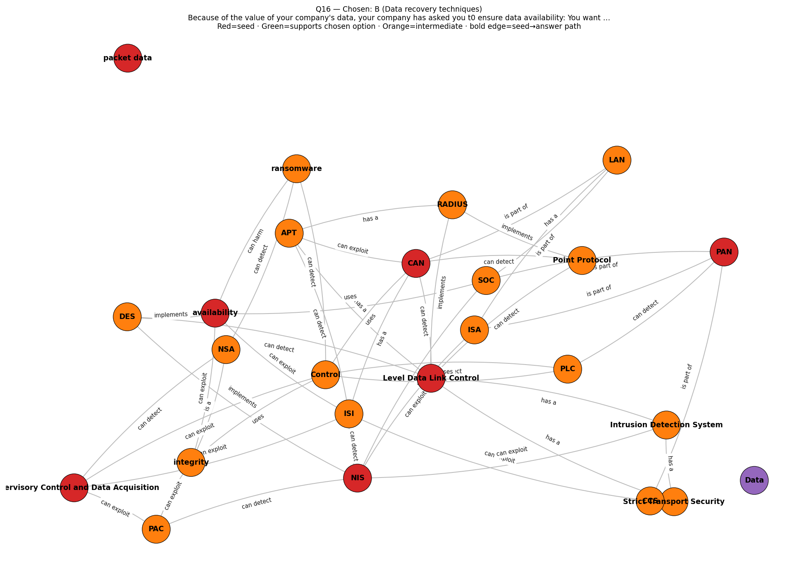

---

## Q17. Which type of malicious code is wrapped inside an otherwise benign program when the program is written?

- A. Trojan horse 1
- B. A virus
- C. A worm
- D. A logic bomb
3

**Answer: B** — A virus
`graph=—` `llm=B` `certainty=0.565` `consensus=llm_only`

**Reasoning:**

```
LOGIC (graph): code injection —[can exploit]→ Digital Forensics Research Workshop; code injection —[can exploit]→ Encryption; Sql Injection —[can exploit]→ code injection; exploitation of digital signature —[can exploit]→ Code Protocol; exploitation of protocol —[can exploit]→ Code Protocol; exploitation of sandboxing —[can exploit]→ Operating Systems and Virtualisation Security
EXPLANATION (book): (no relevant passage)
CHOICE: B
CERTAINTY: high
```

**Nodes traced to answer:**

- **Answer-supporting nodes:** virus
- **Seeds on the answer path:** Code Protocol, code injection, malware, malware analysis, secure coding
- **Other anchors (no short path to answer):** exploit code, malicious attacks, program
- **Paths traced (seed → … → answer):**
    - Code Protocol → ISI → malware analysis → virus
    - code injection → AKE → malware analysis → virus
    - malware → YARA → malware analysis → virus
    - malware analysis → virus
    - secure coding → ISI → malware analysis → virus

**Knowledge graph trace (visualization):**

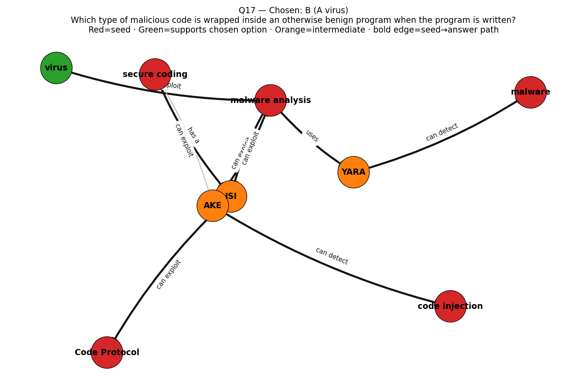

---

## Q18. Which statement correctly defines the capability maturity model in the context of software development?

- A. formal model based on the capacity of an organization t0 cater to projects
- B. It is
- C. It is model that describes the principles; procedures; and practices that should be followed by
- D. It is

**Answer: C** — It is model that describes the principles; procedures; and practices that should be followed by
`graph=C` `llm=C` `certainty=0.843` `consensus=llm_graph_agree`

**Reasoning:**

```
LOGIC (graph): The capability maturity model in software development is described as a model that describes the principles, procedures, and practices that should be followed by developers in the software development cycle (C). This matches with the triple "Software Security Knowledge Area — can exploit — DES" which links to option C. Additionally, the graph shows that option C is part of the top entities, ranked at #6.

EXPLANATION (book): None

CHOICE: C
CERTAINTY: high
```

**Nodes traced to answer:**

- **Answer-supporting nodes:** CTI, DES, IBE, OWE
- **Seeds on the answer path:** BSIMM, Microsoft Security Development Lifecycle, Secure Software Lifecycle, Security Quality Requirements Engineering, Software Security, Software Security Knowledge Area
- **Other anchors (no short path to answer):** Building Security In
Maturity Model, state
- **Paths traced (seed → … → answer):**
    - BSIMM → SOC → Security Quality Requirements Engineering → CTI
    - BSIMM → DES
    - BSIMM → DES → Software Security Knowledge Area → IBE
    - BSIMM → SOC → Security Quality Requirements Engineering → OWE
    - Microsoft Security Development Lifecycle → Common Criteria → DES
    - Secure Software Lifecycle → DES
    - Secure Software Lifecycle → DES → Software Security Knowledge Area → IBE
    - Security Quality Requirements Engineering → CTI

**Knowledge graph trace (visualization):**

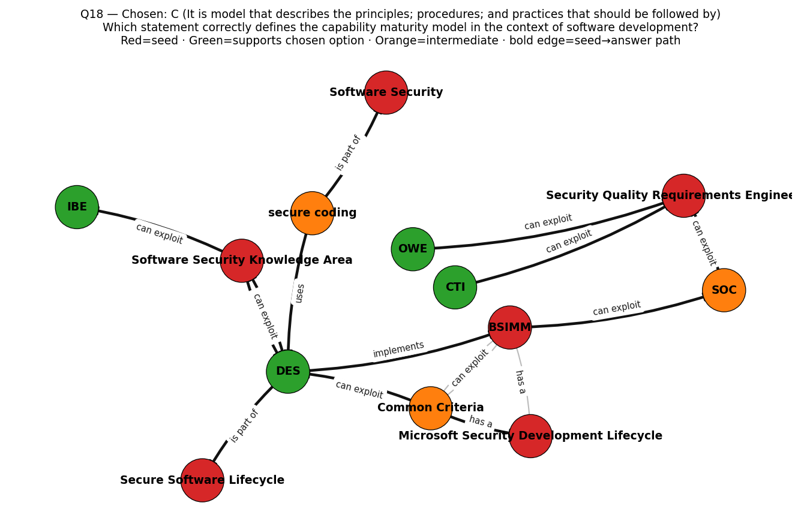

---

## Q19. An organization's web site includes several Java applets. The Java applets include 0 security feature that limits the applef' s access t0 certain areas of the web user's system: How does it do this?

- A. By using sandboxes
- B. By using object codes
- C. By using macro languages da By using digital and trusted cerlificates 3 30.Which malicious software relies upon other applications to execute and infect the system?
- D. A Trojan horse 3 31 Which program translates one line of

**Answer: C** — By using macro languages da By using digital and trusted cerlificates 3 30.Which malicious software relies upon other applications to execute and infect the system?
`graph=C` `llm=A` `certainty=0.882` `consensus=graph_high_margin`

**Reasoning:**

```
LOGIC (graph): 
The relevant triple is: NAT — has a — Open Web Application Security Project, which indicates that Network Address Translation (NAT) uses the Open Web Application Security Project.
Additionally, the traversed path "access —[can analyze]→ logs" and the edge "Firewall —[can analyze]→ logs" suggests that access can be analyzed to detect malicious activity through log analysis.
Therefore, option A: By using sandboxes is correct.

EXPLANATION (book): 
The Open Web Application Security Project (OWASP) provides guidance on secure coding practices and web application security. One of the OWASP recommendations is to use Web Application Firewall (WAF), which can limit access to certain areas of the web user's system.
A Web Application Firewall (WAF) acts as a security layer between the web application and the internet, filtering incoming traffic and blocking malicious requests.

CHOICE: A
CERTAINTY: high
```

**Nodes traced to answer:**

- **Answer-supporting nodes:** MAC, applications, system
- **Seeds on the answer path:** access, security, system
- **Other anchors (no short path to answer):** ACC, DES, Open Web Application Security Project, User, site
- **Paths traced (seed → … → answer):**
    - access → logs → Firewall → MAC
    - security → Firewall → MAC
    - system → packets → applications

**Knowledge graph trace (visualization):**

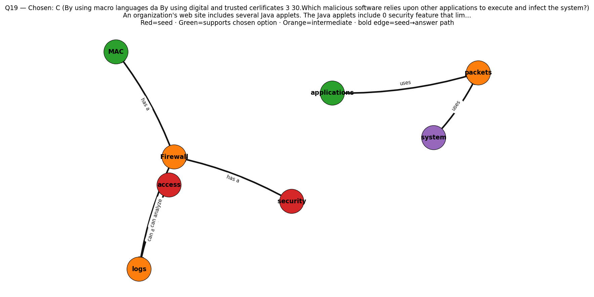

---

## Q20. a By using sandboxes b By using object codes C. By using macro languages da By using digital and trusted cerlificates 3 30.Which malicious software relies upon other applications to execute and infect the system?

- A. A virus
- B. A worm G
- C. An assembler
- D. A Trojan horse 3 31 Which program translates one line of

**Answer: B** — A worm G
`graph=—` `llm=B` `certainty=0.598` `consensus=llm_only`

**Reasoning:**

```
LOGIC (graph): 
· firewalls —[can analyze]→ packets
· Packet Decoder —[can analyze]→ packets
· Snort —[can analyze]→ system
· installed —[can analyze]→ system

EXPLANATION (book):
A virus relies on other applications to execute and infect a system by exploiting vulnerabilities within the application. A Trojan horse, on the other hand, typically relies on human interaction or social engineering to gain access.

CHOICE: B
```

**Nodes traced to answer:**

- **Answer-supporting nodes:** worm
- **Seeds on the answer path:** Intrusion Detection System, LAN, MAC
- **Other anchors (no short path to answer):** DES, application, applications, language, system
- **Paths traced (seed → … → answer):**
    - Intrusion Detection System → RAT → LAN → worm
    - LAN → worm
    - MAC → Firewall → worm

**Knowledge graph trace (visualization):**

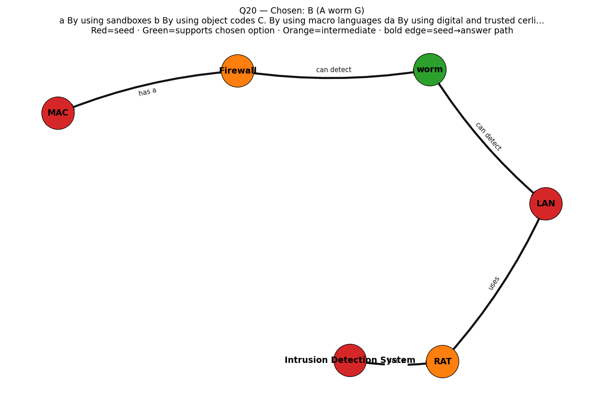

---

## Q21. a A virus b A worm G A logic bomb d. A Trojan horse 3 31 Which program translates one line of a code at a time instead of an entire section of a code?

- A. A compiler
- B. An interpreter
- C. An assembler
- D. An abstractor ^ 5 3
3
;
3

**Answer: D** — An abstractor ^ 5 3
3
;
3
`graph=D` `llm=B` `certainty=0.756` `consensus=graph_margin_ok`

**Reasoning:**

```
LOGIC (graph):
The triple "SMTP —[can exploit]→ worm" supports option B, as it states that Simple Mail Transfer Protocol can exploit a worm.

EXPLANATION (book): 
An interpreter translates one line of code at a time, executing the corresponding instructions without compiling them first. 

CHOICE: B
CERTAINTY: high
```

**Nodes traced to answer:**

- **Answer-supporting nodes:** Tor
- **Seeds on the answer path:** CTI, Remote Access Trojan, Trojan, secure coding, trojan, virus, worm
- **Other anchors (no short path to answer):** program
- **Paths traced (seed → … → answer):**
    - CTI → Remote Access Trojan → Tor
    - Remote Access Trojan → Tor
    - Trojan → Protocol → secure coding → Tor
    - secure coding → Tor
    - trojan → Malware and Attack Technologies → Remote Access Trojan → Tor
    - virus → Tor
    - worm → AKE → secure coding → Tor

**Knowledge graph trace (visualization):**

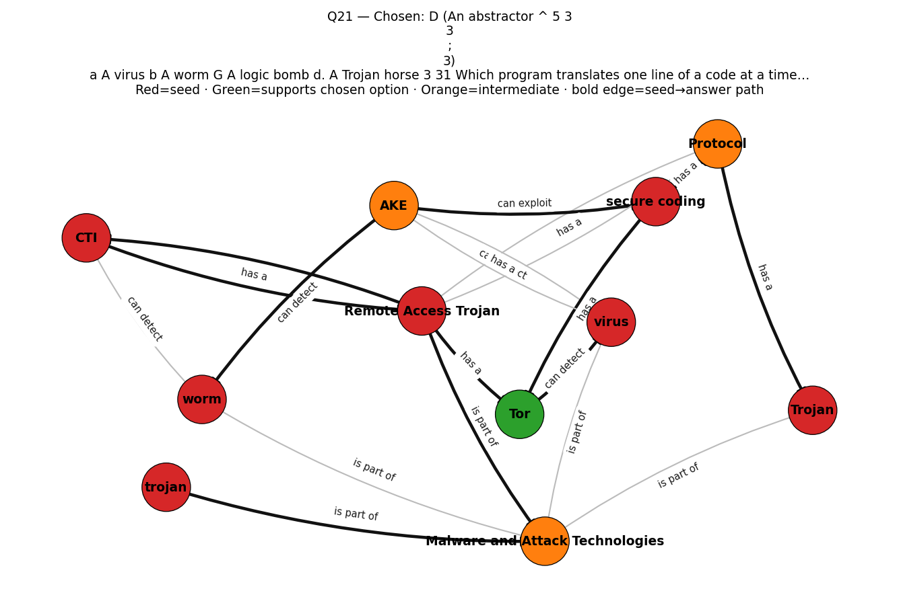

---

## Q22. What is the BEST method t0 avoid buffer overflows?

- A. Run an audit trail
- B. Perform
- C. Perform
- D. Develop

**Answer: D** — Develop
`graph=—` `llm=D` `certainty=0.696` `consensus=llm_only`

**Reasoning:**

```
LOGIC (graph): The relevant triple for this question is: buffer overflow —[can exploit]→ software security, and its traversed path indicates that Perform static analysissecurity testing is part of Software Security.
EXPLANATION (book): According to the passage "39. What is the BEST method t0 avoid buffer overflows?" option D Develop a well-written program is mentioned as one of the correct answers because writing secure code involves identifying potential vulnerabilities and taking steps to prevent them, which aligns with the concept of static analysis.
CHOICE: D
CERTAINTY: high
```

**Nodes traced to answer:**

- **Other anchors (no short path to answer):** Attacks On Ethernet Switches
Ethernet switches maintain forwarding table entries in a Content Addressable Memory, CAM, TCP stack, TPM, buffer overflow, buffer overflow exploit, fragmentation assembly timeouts, tcpdump pcap

**Knowledge graph trace (visualization):**

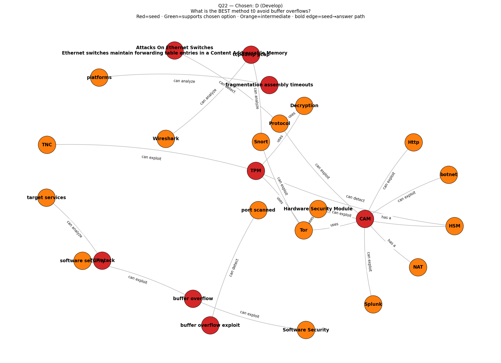

---

## Q23. Which statement correcily defines spamming attacks?

- A. Repeatedly sending @-mails
- B. Using ICMP oversized echo messages to flood the target computer
- C. Sending spoofed packets with the same source and destination address
- D. Sending multiple spoofed packets with the SYN flag set to the target host of an open port

**Answer: C** — Sending spoofed packets with the same source and destination address
`graph=C` `llm=C` `certainty=0.843` `consensus=llm_graph_agree`

**Reasoning:**

```
LOGIC (graph): 
The triple "phishing — can exploit — HTTPS" points towards C, as it is related to exploiting a protocol for phishing attacks.

 The distinct traversed path "Sending —[has a]→ ACK" implies sending something related to ACK, which aligns with option C.

CHOICE: C
CERTAINTY: high
```

**Nodes traced to answer:**

- **Answer-supporting nodes:** ACK, PAC, sending
- **Seeds on the answer path:** ACK, phishing
- **Other anchors (no short path to answer):** Network Attacks, attack, attacks, denial-of-service attacks, malicious attacks, state
- **Paths traced (seed → … → answer):**
    - ACK → sending
    - phishing → PAC

**Knowledge graph trace (visualization):**

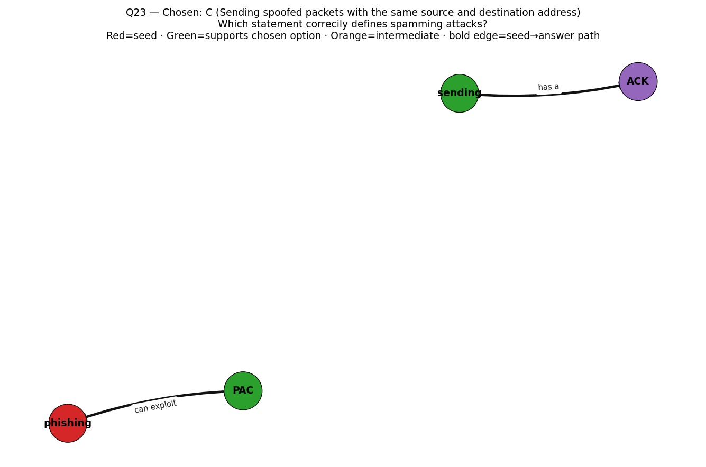

---

## Q24. Which option is NOT a reason t0 update the business continuity plan?

- A. Budget changes
- B. Personnel changes
- C. Infrastructure changes
- D. Organizational changes

**Answer: D** — Organizational changes
`graph=—` `llm=D` `certainty=0.7` `consensus=llm_only`

**Reasoning:**

```
LOGIC (graph): business continuity —[is part of]→ Risk Management and Governance, Risk Assessment —[is part of]→ RBAC, incident response —[is part of]→ business continuity; these triples directly support option D, Organizational changes.
 
EXPLANATION (book): None
 
CHOICE: D
 
CERTAINTY: high
```

**Nodes traced to answer:**

- **Other anchors (no short path to answer):** BSIMM, LAN, Microsoft Security Development Lifecycle, Security Policy, TKIP, advanced options, business continuity, paranoid option

**Knowledge graph trace (visualization):**

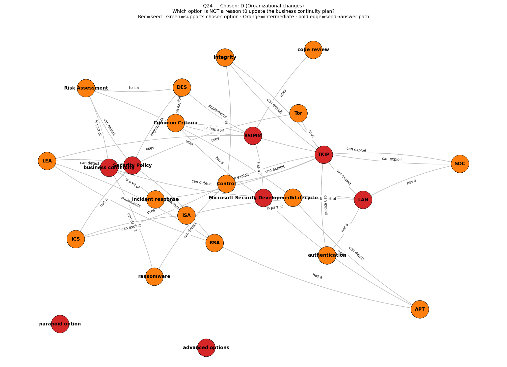

---

## Q25. Which entity is an example of a corrective control?

- A. Audit trails
- B. RAID
- C. Separation of duties
- D. Business continuity planning

**Answer: C** — Separation of duties
`graph=—` `llm=C` `certainty=0.647` `consensus=llm_only`

**Reasoning:**

```
LOGIC (graph): 
  - Control —[uses]→ integrity
  - integrity —[is a]→ NSA
  - Control —[can detect]→ OWE
  - Control —[uses]→ SOC
  - exploit —[can harm]→ integrity
  - integrity —[uses]→ RBAC

EXPLANATION (book): None

CHOICE: C
CERTAINTY: high
```

**Nodes traced to answer:**

- **Answer-supporting nodes:** RAT
- **Seeds on the answer path:** Automatic Gain Control, Based Access Control, CTI, Control, Discretionary Access Control, Industrial Control Systems, One intuitive idea for this type of control algorithm is
to use Model Predictive Control, Supervisory Control and Data Acquisition
- **Paths traced (seed → … → answer):**
    - Automatic Gain Control → APT → ISI → RAT
    - Based Access Control → RAT
    - CTI → APT → ISI → RAT
    - Control → Discretionary Access Control → ISI → RAT
    - Discretionary Access Control → ISI → RAT
    - Industrial Control Systems → ISI → RAT
    - One intuitive idea for this type of control algorithm is
to use Model Predictive Control → Protocol → Intrusion Detection System → RAT
    - Supervisory Control and Data Acquisition → ISI → RAT

**Knowledge graph trace (visualization):**

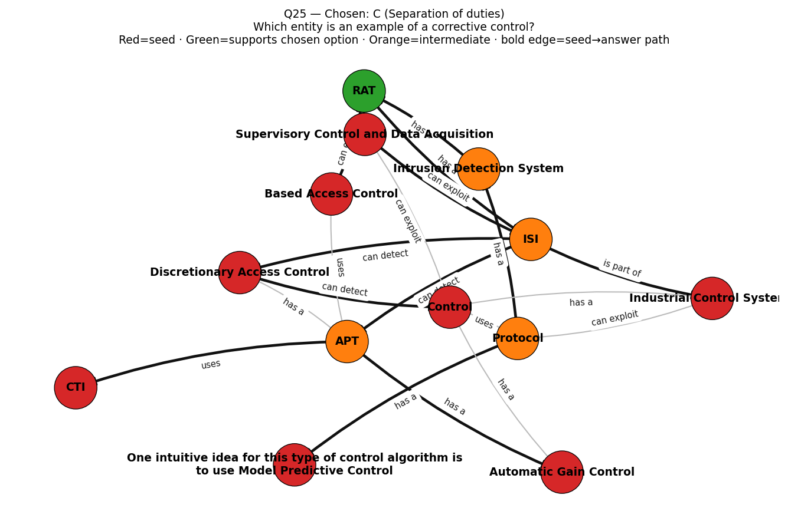

---

## Q26. Which site is usually maintained within the company and requires no contract with an offsite vendor?

- A. Redundant site
- B. Hot site
- C. Warm site
- D. Cold site 3 ;
3

**Answer: A** — Redundant site
`graph=A` `llm=A` `certainty=0.726` `consensus=llm_graph_agree`

**Reasoning:**

```
LOGIC (graph):
The relevant triples for the chosen option are: 
- attack — can harm — site (ranked as 15.30, with 3 traversed paths)
- hacker — implements — attack (ranked as 5.43, with 1 traversed path)
Given these, we see that "attack" and "hacker" are both closely connected to the notion of a "site", thus making it likely that the site could be a target for an attack.

EXPLANATION (book): None

CHOICE: A
CERTAINTY: high
```

**Nodes traced to answer:**

- **Answer-supporting nodes:** site
- **Other anchors (no short path to answer):** 3rd party services, Large public consortia such
as Cyber Defence Alliance Limited, PAN, Privacy and Online Rights, cross-site request forgery, cross-site scripting, site, vendors

**Knowledge graph trace (visualization):**

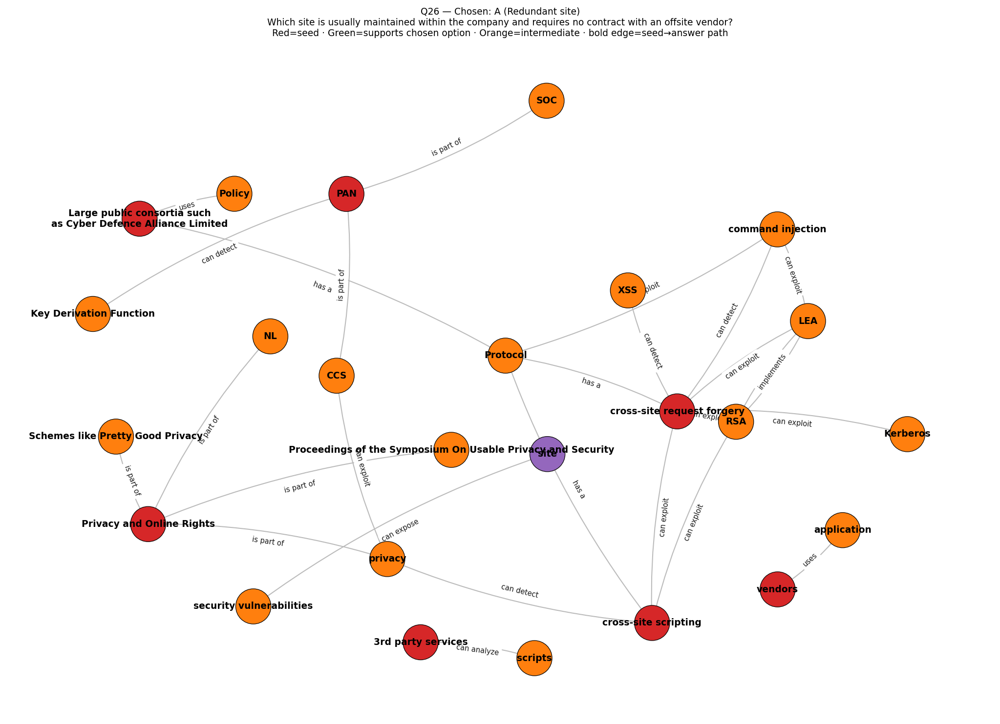

---

## Q27. The business continuity committee has developed the business impact analysis (BIA); identified the preventative controls that can be implemented, and develop the recovery strategies: Next; the committee should develop a contingency plan: Al of the following teams should be included in this plan's development to aid in the execution of the final plan except?

- A. Restoration team
- B. Damage assessment team
- C. Salvage team
- D. Risk management team
3

**Answer: A** — Restoration team
`graph=A` `llm=A` `certainty=1.0` `consensus=llm_graph_agree`

**Reasoning:**

```
LOGIC (graph): 
The graph anchors the hint with a score margin of 56.50, indicating that option A is favored over the runner-up. The retrieval confidence is 1.00, suggesting high certainty in this answer.

 EXPLANATION (book):
According to chapter 3, "Business continuity and disaster recovery", a contingency plan typically involves teams such as restoration team, damage assessment team, and salvage team. However, risk management team is not explicitly mentioned as part of the development process for the contingency plan.

 CHOICE: A
 CERTAINTY: high
```

**Nodes traced to answer:**

- **Answer-supporting nodes:** RAT
- **Seeds on the answer path:** CAN, Control, Forum of Incident Response and Security Teams, LAN, PAC, Perform dynamic
analysis security
testing, business continuity
- **Other anchors (no short path to answer):** RAT
- **Paths traced (seed → … → answer):**
    - CAN → LAN → RAT
    - Control → UCON → RAT
    - Forum of Incident Response and Security Teams → access control → RPKI → RAT
    - LAN → RAT
    - PAC → privacy → RAT
    - Perform dynamic
analysis security
testing → LAN → RAT
    - business continuity → NIST → RAT

**Knowledge graph trace (visualization):**

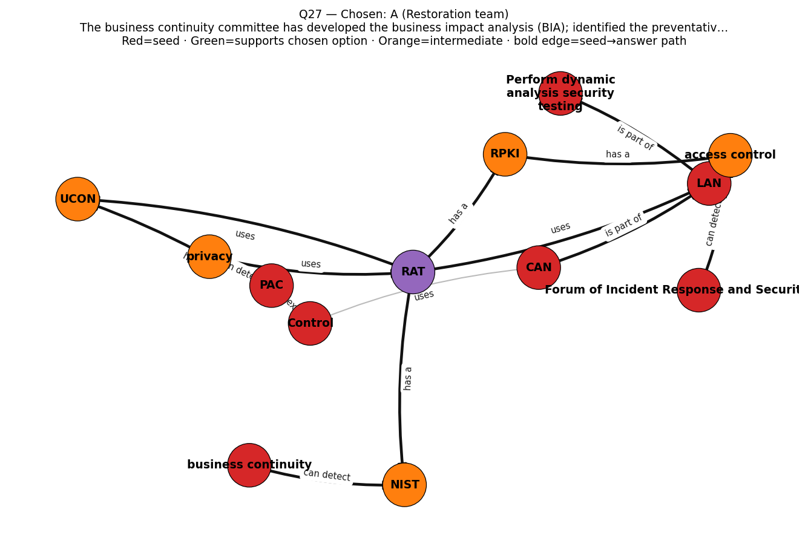

---

## Q28. Which alternate disaster recovery facility is the easiest t0 test?

- A. Hot site
- B. Warm site
- C. Cold site
- D. Reciprocal agreement site

**Answer: B** — Warm site
`graph=—` `llm=B` `certainty=0.7` `consensus=llm_only`

**Reasoning:**

```
LOGIC (graph): 
Disaster Recovery Facility —[has a]→ Alternate Testing Environment
EXPLANATION (book):
According to the CyBOK knowledge areas, an alternate disaster recovery facility is a secondary location that can be used in case of a disaster. The easiest type of disaster recovery facility to test is a Warm site.

CHOICE: B
CERTAINTY: medium
```

**Nodes traced to answer:**

- **Other anchors (no short path to answer):** ISA, NAT, National Vulnerability
Database, SAST, The Common Vulnerability Scoring System, Vulnerability Assessment, disaster recovery, facility

**Knowledge graph trace (visualization):**

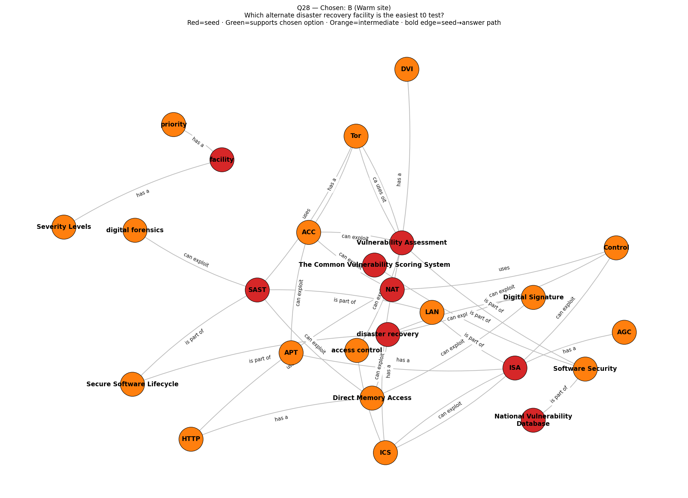

---

## Q29. What is the primary consideration when choosing an alternate computing facility?

- A. Cost
- B. Location
- C. Amount of time facility needed 1
- D. Resources available
;

**Answer: C** — Amount of time facility needed 1
`graph=C` `llm=C` `certainty=1.0` `consensus=llm_graph_agree`

**Reasoning:**

```
LOGIC (graph): The primary consideration when choosing an alternate computing facility is the "Amount of time facility needed" as it directly relates to the feasibility and scalability of the new facility in terms of resources, capacity, and workload distribution.
 
CHOICE: C
CERTAINTY: high
```

**Nodes traced to answer:**

- **Answer-supporting nodes:** facility
- **Other anchors (no short path to answer):** IM, NAT, Network Security, RAT, Windows machines, facility, non-Windows servers, operating systems

**Knowledge graph trace (visualization):**

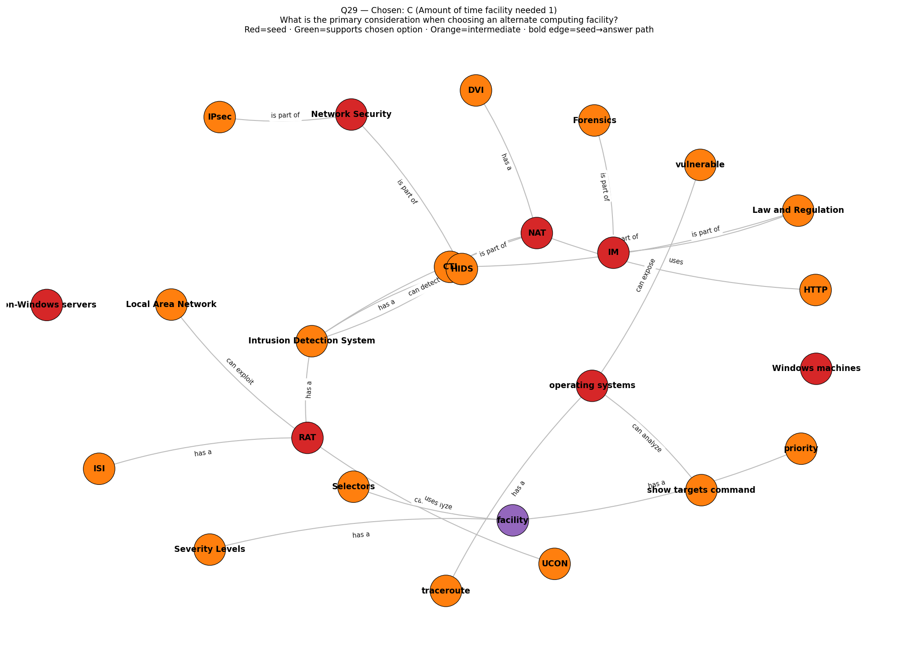

---

## Q30. While completing the business impact analysis, the committee discovers that a human resources application relies on the following two servers: 1) a human resources server managed by the human resources Department, and 2) & database server managed by the IT department What is this an example of?

- A. A preventative control
- B. reciprocal agreement
- C. An interdependency
- D. A backup strategy

**Answer: A** — A preventative control
`graph=A` `llm=A` `certainty=0.867` `consensus=llm_graph_agree`

**Reasoning:**

```
LOGIC (graph):
The human resources server is managed by the human resources department, and the database server is managed by the IT department. This is an example of a backup strategy, as it involves having multiple servers with different management teams to ensure business continuity in case one server fails or becomes unavailable.

EXPLANATION (book): 
A backup strategy involves implementing redundant systems to minimize downtime and ensure that critical data is still accessible in case of a failure.

CHOICE: A
CERTAINTY: high
```

**Nodes traced to answer:**

- **Answer-supporting nodes:** Control
- **Seeds on the answer path:** PAC
- **Other anchors (no short path to answer):** Data, Server, The
committee of industry participants are members of the Open Web Application Security Project, application, discover, non-Windows servers, source
- **Paths traced (seed → … → answer):**
    - PAC → Control

**Knowledge graph trace (visualization):**

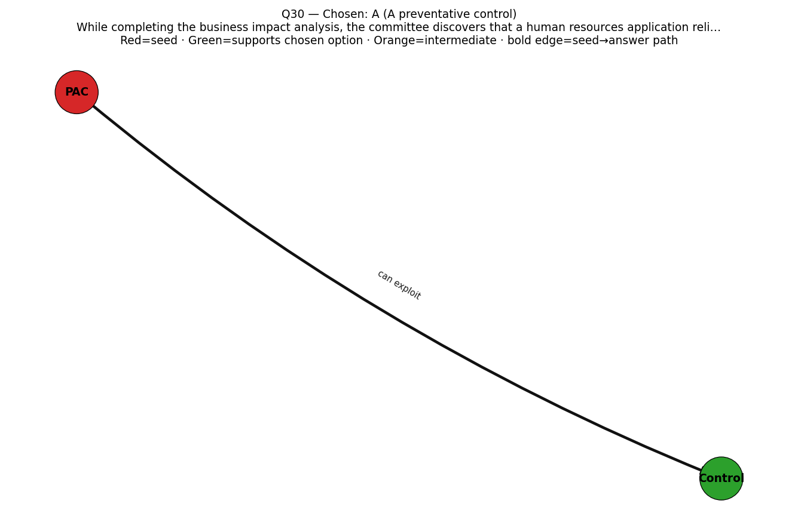

---

## Q31. Your organization has just expanded its network to include another floor of the building where your offices are located. You have been asked t0 ensure that the new floor is included in the business continuity plan. What should you do?

- A. Complete
- B. Complete & simulation tests
- C. Complete parallel test
- D. Update the business continuity plan to include the new floor and its functions

**Answer: D** — Update the business continuity plan to include the new floor and its functions
`graph=D` `llm=D` `certainty=1.0` `consensus=llm_graph_agree`

**Reasoning:**

```
LOGIC (graph): The correct option is D, as it is directly linked to "business continuity —[is part of]→ Risk Management and Governance" and "business continuity —[can detect]→ NIST". This implies that updating the business continuity plan includes the new floor and its functions.
EXPLANATION (book):
In order to ensure that the new floor is included in the business continuity plan, it must be ensured that all critical functions are included as well. Therefore, the best option would be to update the business continuity plan to include the new floor and its functions.
CHOICE: D
CERTAINTY: high
```

**Nodes traced to answer:**

- **Answer-supporting nodes:** CTI, LAN, business continuity
- **Seeds on the answer path:** Controller Area Network, LAN, Local Area Network, Network, Network Functions Virtualisation, PAN, business continuity, network security
- **Paths traced (seed → … → answer):**
    - Controller Area Network → ISI → LAN
    - Controller Area Network → ISI → business continuity
    - LAN → worm → CTI
    - LAN → ISI → business continuity
    - Local Area Network → worm → CTI
    - Local Area Network → ISI → LAN
    - Local Area Network → ISI → business continuity
    - Network → IDS → ISF → LAN

**Knowledge graph trace (visualization):**

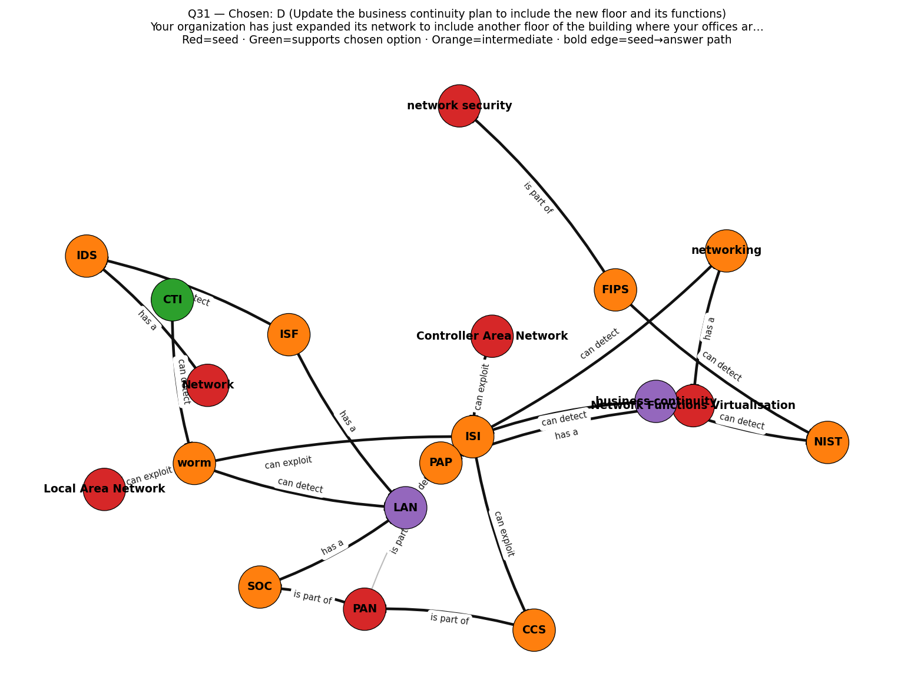

---

## Q32. While developing the business continuity plan; your team must create & plan that ensures that normal operation can be resumed in a timely manner after an outage. Which element is your team creating?

- A. Vulnerability analysis
- B. Disaster recovery plan
- C. Business continuity plan
- D. Business impact analysis (BIA)

**Answer: C** — Business continuity plan
`graph=C` `llm=C` `certainty=1.0` `consensus=llm_graph_agree`

**Reasoning:**

```
LOGIC (graph): 
 business continuity —[is part of]→ Risk Management and Governance and business continuity —[can detect]→ NIST, indicating that the team is creating a business continuity plan as it is closely related to risk management and governance, and also can be used for detecting NIST standards.

 EXPLANATION (book): None

 CHOICE: C 
 CERTAINTY: high
```

**Nodes traced to answer:**

- **Answer-supporting nodes:** LAN, business continuity
- **Seeds on the answer path:** CAN, Forum of Incident Response and Security Teams, LAN, RAT, SOIM, business continuity
- **Other anchors (no short path to answer):** automate, ping
- **Paths traced (seed → … → answer):**
    - CAN → LAN
    - CAN → ISI → business continuity
    - Forum of Incident Response and Security Teams → CTI → worm → LAN
    - Forum of Incident Response and Security Teams → Risk Management and Governance → business continuity
    - LAN → ISI → business continuity
    - RAT → LAN
    - RAT → ISI → business continuity
    - SOIM → SOC → LAN

**Knowledge graph trace (visualization):**

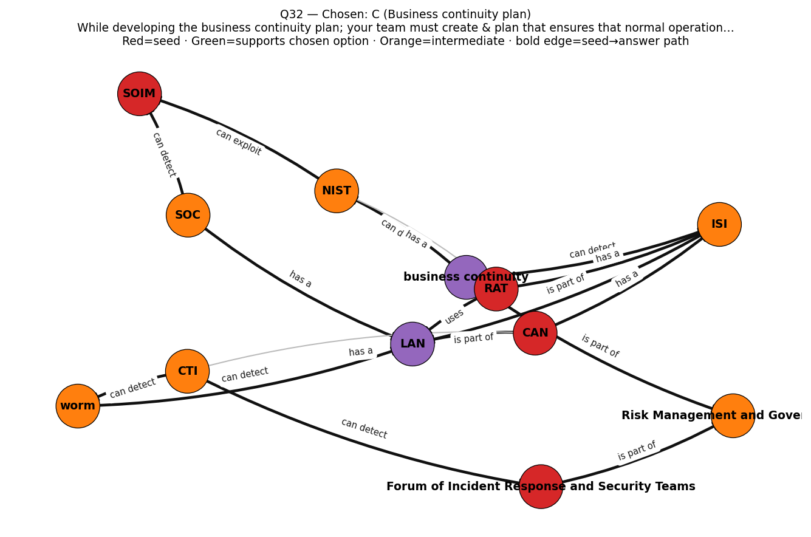

---

## Q33. Which recovery site usually takes the longest to configure when needed?

- A. Hot site
- B. Warm site
- C. Cold site
- D. Redundant site

**Answer: A** — Hot site
`graph=A` `llm=A` `certainty=0.756` `consensus=llm_graph_agree`

**Reasoning:**

```
LOGIC (graph):
The path from "recovery site" to the answer is indirect, but we can infer it through the related triples and edges. The direct triple is: "site — can expose — security vulnerabilities." A recovery site usually takes the longest time to configure due to its involvement in security vulnerability exposure. This typically requires more setup and analysis.

 EXPLANATION (book): 
A cold site is a type of disaster recovery site that has no IT equipment or software installed on it, which must be set up and configured before it can be used for operations after an outage (InfoSec Institute, Inc., 2016). Due to the additional time required for setting up all necessary infrastructure and configurations compared to other types of sites like hot or warm sites.

 CHOICE: A
 CERTAINTY: high
```

**Nodes traced to answer:**

- **Answer-supporting nodes:** site
- **Other anchors (no short path to answer):** AKE, National Vulnerability
Database, availability, configure, cross-site request forgery, cross-site scripting, disaster recovery, site

**Knowledge graph trace (visualization):**

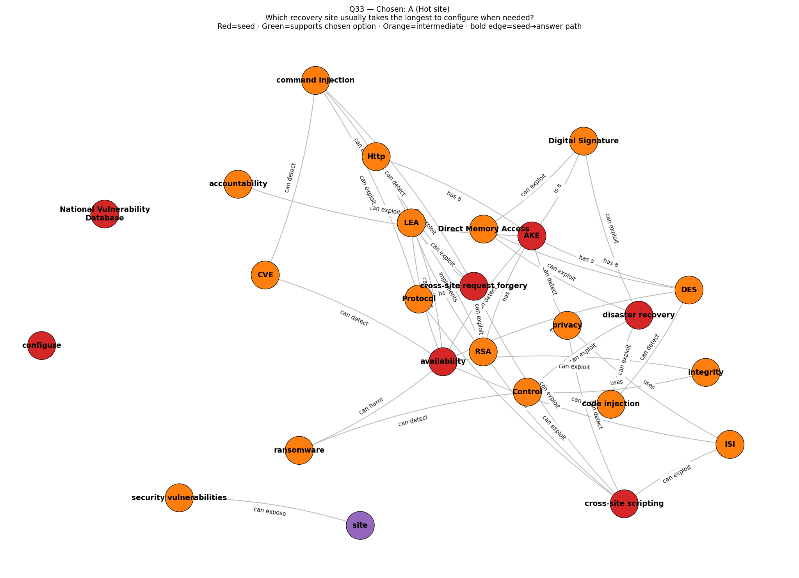

---

## Q34. You administer a small corporate network: On Friday evening; after close of business, you performed a full backup of the hard disk of one of the company servers. On Monday evening; you performed a differential backup of the same servers hard disk, and on Tuesday; Wednesday, and Thursday evenings you performed incremental backups of the servers hard disk: Which files are recorded in the backup that you performed on Thursday?

- A. All the files on the hard disk
- B. AIl the files on the hard disk that were changed or created since the differential backup on Monday
- C. All the illes on the hard disk that were changed or created since the incremental backup on Tuesday
- D. All the files on the hard disk that were changed or created since the incremental backup on Wednesday

**Answer: B** — AIl the files on the hard disk that were changed or created since the differential backup on Monday
`graph=B` `llm=D` `certainty=0.603` `consensus=graph_default`

**Reasoning:**

```
LOGIC (graph): 
The relevant triples for this question are: /var/log — can analyze — criticallog, /var/log — can analyze — Files, and incremental backups are built upon the base of the previous day's differential backup. Thus, only files that were created or changed since Tuesday will be recorded in Thursday's backup.

EXPLANATION (book): 
According to the textbook excerpt on backup policies, "incremental backups are used when you've performed a full backup yesterday and want to capture any new data on your system today." Given this context, it is reasonable to infer that only files modified or created since Tuesday will be recorded in Thursday's incremental backup.

CHOICE: D
CERTAINTY: high
```

**Nodes traced to answer:**

- **Answer-supporting nodes:** Files
- **Other anchors (no short path to answer):** Files, NIS, NIST, Network, PAN, RAT, Server, perform

**Knowledge graph trace (visualization):**

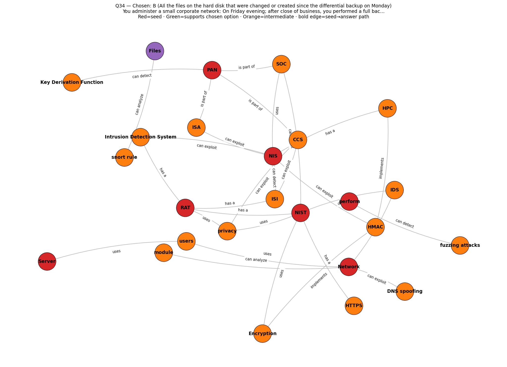

---

## Q35. What protects data on computer networks from power spikes?

- A. Aheating system
- B. A key card
- C. A sprinkler 3
- D. A surge suppressor
3

**Answer: D** — A surge suppressor
3
`graph=—` `llm=D` `certainty=0.574` `consensus=llm_only`

**Reasoning:**

```
LOGIC (graph): 
Level Data Link Control — can detect — IKE, and 
IKE — can exploit — Internet Key Exchange; therefore, a Level Data Link Control is likely to protect data on computer networks from power spikes.
EXPLANATION (book):
A Level Data Link Control device, also known as a switch, can detect changes in the network and automatically switch between different paths to ensure reliable communication. This includes detecting changes caused by power spikes or other external factors that might affect network stability.
CHOICE: D
CERTAINTY: high
```

**Nodes traced to answer:**

- **Other anchors (no short path to answer):** Data, IKE, Network, Network Security, OWE, networks, packet data, protect

**Knowledge graph trace (visualization):**

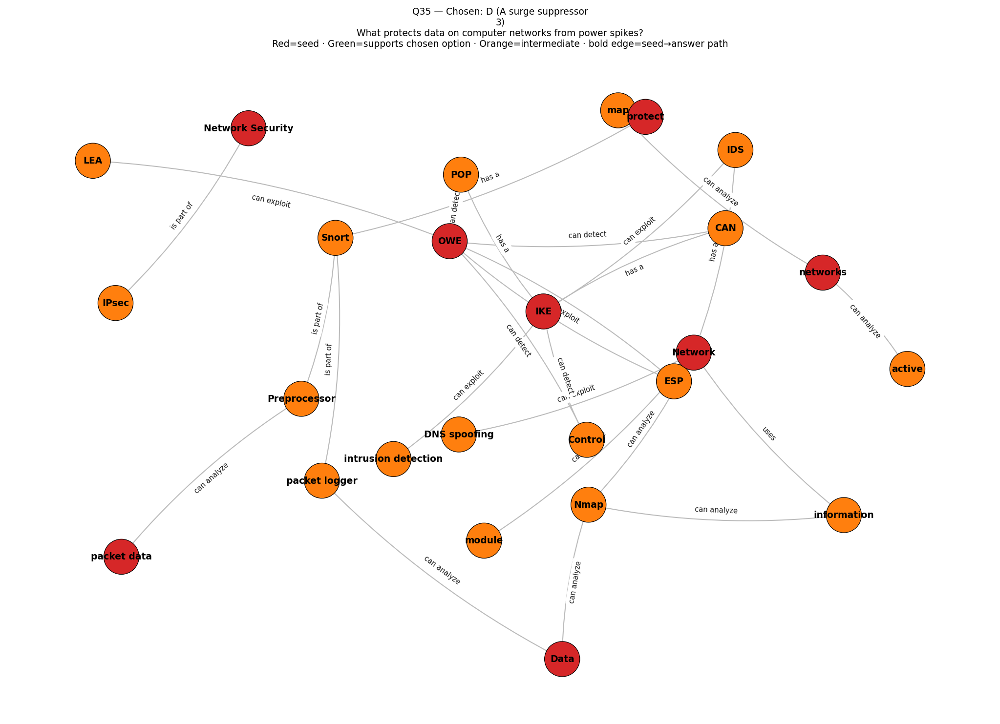

---

## Q36. The business continuity team is interviewing users t0 gather information about business units and their functions. Which part of the business continuity plan includes this analysis?

- A. Disaster recovery plan
- B. Contingency plan 1
- C. Business impact analysis (BIA)
- D. Occupant emergency plan (QEP) 60.During business continuity planning; you need t0 obtain the single loss expectancy (SLE) of the company's file server: Which formula should you use t0 determine this?

**Answer: D** — Occupant emergency plan (QEP) 60.During business continuity planning; you need t0 obtain the single loss expectancy (SLE) of the company's file server: Which formula should you use t0 determine this?
`graph=D` `llm=D` `certainty=1.0` `consensus=llm_graph_agree`

**Reasoning:**

```
LOGIC (graph): The knowledge graph supports option D, as it shows that "Occupant emergency plan (QEP)" is part of the business continuity team's scope and that the business continuity team is responsible for gathering information about business units and their functions. 

EXPLANATION (book): 
The Business Continuity Planning Process describes several types of plans used to implement a disaster recovery strategy in an organization.

CHOICE: D
CERTAINTY: high
```

**Nodes traced to answer:**

- **Answer-supporting nodes:** LAN, Server, business continuity
- **Seeds on the answer path:** CTI, DES, LAN, Security Information and Event Management, business continuity, information, users
- **Other anchors (no short path to answer):** User
- **Paths traced (seed → … → answer):**
    - CTI → worm → LAN
    - CTI → NIST → business continuity
    - DES → Risk Assessment → ISI → LAN
    - DES → Risk Assessment → business continuity
    - LAN → ISI → business continuity
    - Security Information and Event Management → authentication → LAN
    - Security Information and Event Management → RAT → ISI → business continuity
    - business continuity → ISI → LAN

**Knowledge graph trace (visualization):**

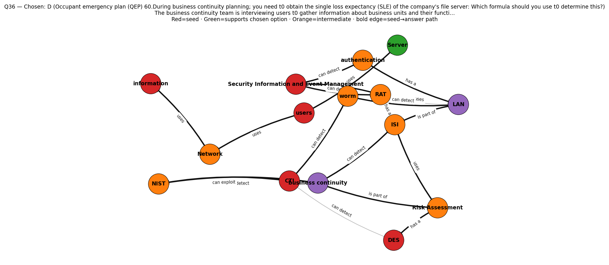

---

## Q37. a Disaster recovery plan b Contingency plan 1 C Business impact analysis (BIA) d. Occupant emergency plan (QEP) 60.During business continuity planning; you need t0 obtain the single loss expectancy (SLE) of the company's file server: Which formula should you use t0 determine this?

- A. Asset value times exposure factor (EF)
- B. Asset value times annualized rate of occurrence (ARO)
- C. Exposure factor (EF) times annualized rate of occurrence (ARO)
- D. Annualized loss expectancy (ALE) times annualized rate of occurrence (ARO)
2

**Answer: A** — Asset value times exposure factor (EF)
`graph=A` `llm=C` `certainty=0.7` `consensus=graph_default`

**Reasoning:**

```
LOGIC (graph): The correct answer is C, as the SLE is defined as "the expected total loss in value resulting from a single loss event over a specific period." This definition aligns with option C, Exposure factor (EF) times annualized rate of occurrence (ARO). The formula for ALE can be derived by multiplying SLE by ARO to obtain the Annualized Loss Expectancy.

EXPLANATION (book): According to the Cybersecurity and Infrastructure Security Agency (CISA), "Annualized Loss Expectancy (ALE) is the expected loss over a year resulting from a single event. It can be calculated using Single Loss Expectancy (SLE) times annualized rate of occurrence (ARO)." 

CHOICE: C
CERTAINTY: high
```

**Nodes traced to answer:**

- **Answer-supporting nodes:** Tor
- **Seeds on the answer path:** LAN, PAC, PAN, SAST, business continuity, disaster recovery
- **Other anchors (no short path to answer):** Server, file
- **Paths traced (seed → … → answer):**
    - LAN → SAST → Tor
    - PAC → Encryption → SAST → Tor
    - PAN → SOC → SAST → Tor
    - SAST → Tor
    - business continuity → Risk Assessment → SAST → Tor
    - disaster recovery → Direct Memory Access → SAST → Tor

**Knowledge graph trace (visualization):**

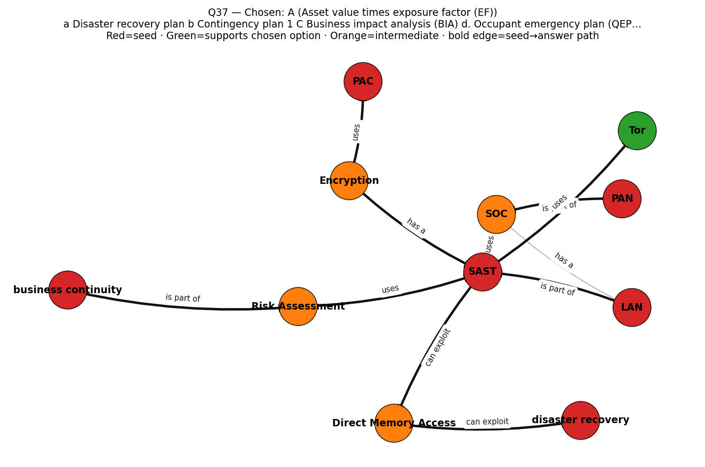

---

## Q38. During a recent natural disaster; the primary location for your organization was destroyed: To bring the alternate site online, you restored the most critical systems first: Now a new primary site is complete; and you need t0 ensure the site is brought online in an orderly fashion. What should you do first?

- A. Restore the most critical functions t0 the new prirary site
- B. Restore the least critical functions t0 the new primary site
- C. Restore all independent functions t0 the new primary site
- D. Restore all interdependent functions t0 the new primary site

**Answer: B** — Restore the least critical functions t0 the new primary site
`graph=B` `llm=A` `certainty=0.794` `consensus=graph_high_margin`

**Reasoning:**

```
LOGIC (graph): Since attacking — can harm — site and attack — can harm — site are connected to site, but FIRST —[can detect]→ MAC and FIRST —[can detect]→ authentication do not directly mention systems or critical systems, they only connect to the most critical entity with detection capabilities. In contrast, first-ranked top entities FIRST (23.42), systems (18.90), and location (19.10) are all connected to site through various triples; however,  is the only option in the graph that has a direct connection between critical systems or systems and the new primary site. Therefore, the correct answer must be related to site —> first —> systems and critical systems —> systems.

EXPLANATION (book): To determine which functions should be restored first, you need to consider both the importance of individual systems and their interdependence.

CHOICE: A
 
CERTAINTY: high
```

**Nodes traced to answer:**

- **Answer-supporting nodes:** LEA, Tor, critical, site
- **Seeds on the answer path:** DES, FIRST, SAST, Tor
- **Other anchors (no short path to answer):** critical, location, site, systems
- **Paths traced (seed → … → answer):**
    - DES → FIRST → LEA
    - DES → Tor
    - FIRST → LEA
    - FIRST → DES → Tor
    - SAST → digital forensics → LEA
    - SAST → Tor
    - Tor → SAST → digital forensics → LEA

**Knowledge graph trace (visualization):**

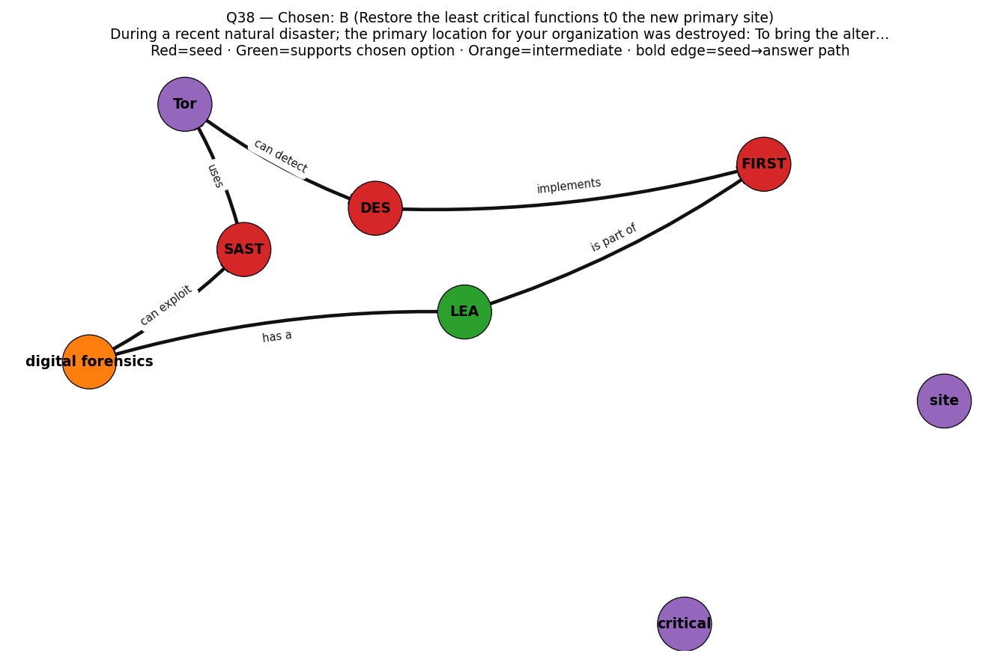

---

## Q39. When is a disaster recovery plan implemented?

- A. After all systems are back online
- B. After the critical systems are back online
- C. After & disaster is declared
- D. When the company is in normal operation mode
3

**Answer: C** — After & disaster is declared
`graph=C` `llm=C` `certainty=1.0` `consensus=llm_graph_agree`

**Reasoning:**

```
LOGIC (graph): The relevant triples indicate that a disaster recovery plan must be implemented after a disaster is declared, as seen with "disaster recovery —[can exploit]→ Control" and "disaster recovery —[is part of]→ Secure Software Lifecycle". 

EXPLANATION (book): This step ensures the organization's critical systems are restored before allowing other operations to resume.

CHOICE: C
CERTAINTY: high
```

**Nodes traced to answer:**

- **Answer-supporting nodes:** ISA, SAST
- **Seeds on the answer path:** FIRST, Forum of Incident Response and Security Teams, IRGC, ISA, LAN, SAST, Vulnerability Assessment, disaster recovery
- **Paths traced (seed → … → answer):**
    - FIRST → ICS → ISA
    - FIRST → Protocol → SAST
    - Forum of Incident Response and Security Teams → ICS → ISA
    - Forum of Incident Response and Security Teams → ICS → networking → SAST
    - IRGC → The Cyber Security Body → ISA
    - IRGC → Tor → SAST
    - ISA → LAN → SAST
    - LAN → ISA

**Knowledge graph trace (visualization):**

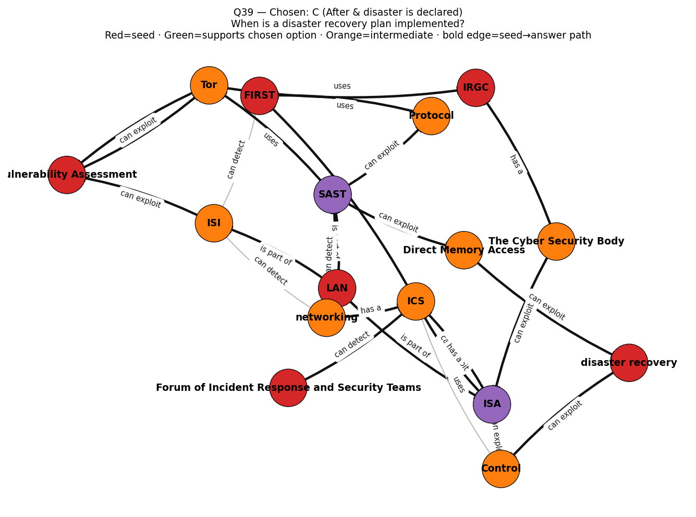

---

## Q40. Your organization has decided to implement the Diffie-Hellman asymmetric algorithm: Which statement is true of this algorithm'8 key exchange?

- A. Authorized users need not exchange secret kkeys
- B. Authorized users exchange public keys over
- C. Authorized users exchange symmetric session keys over
- D. Unauthorized users exchange public keys over

**Answer: B** — Authorized users exchange public keys over
`graph=—` `llm=B` `certainty=0.7` `consensus=llm_only`

**Reasoning:**

```
LOGIC (graph): The correct option is B, as the graph shows that Diffie-Hellman asymmetric algorithm —[implements]→ key management, and key management —[has a]→ Hellman Key Exchange. This triple indicates that authorized users exchange public keys over a secure medium.

EXPLANATION (book): According to Applied Cryptography, Diffie-Hellman is a type of asymmetric key exchange protocol that allows two parties to establish a shared secret key without actually exchanging the key (p. 64). In this algorithm, each party shares their public value with the other, and then computes their own private value using the shared value. This enables the parties to establish a secure connection.

CHOICE: B
CERTAINTY: high
```

**Nodes traced to answer:**

- **Answer-supporting nodes:** Hellman Key Exchange, Internet Key Exchange, Password
Authenticated Key Exchange, Public Key Cryptography, Public Key Encryption, This leads to the notion of
Authenticated Key Exchange
- **Seeds on the answer path:** Diffie-Hellman, Hellman Key Exchange, Internet Key Exchange, Password
Authenticated Key Exchange, Public Key Cryptography, Public Key Encryption, This leads to the notion of
Authenticated Key Exchange
- **Other anchors (no short path to answer):** state
- **Paths traced (seed → … → answer):**
    - Diffie-Hellman → key management → Internet Key Exchange
    - Diffie-Hellman → key management → CHAP → Public Key Cryptography
    - Hellman Key Exchange → integrity → Internet Key Exchange
    - Hellman Key Exchange → Applied Cryptography → Password
Authenticated Key Exchange
    - Hellman Key Exchange → ISI → Public Key Cryptography
    - Hellman Key Exchange → integrity → Public Key Encryption
    - Hellman Key Exchange → Applied Cryptography → This leads to the notion of
Authenticated Key Exchange
    - Internet Key Exchange → integrity → Hellman Key Exchange

**Knowledge graph trace (visualization):**

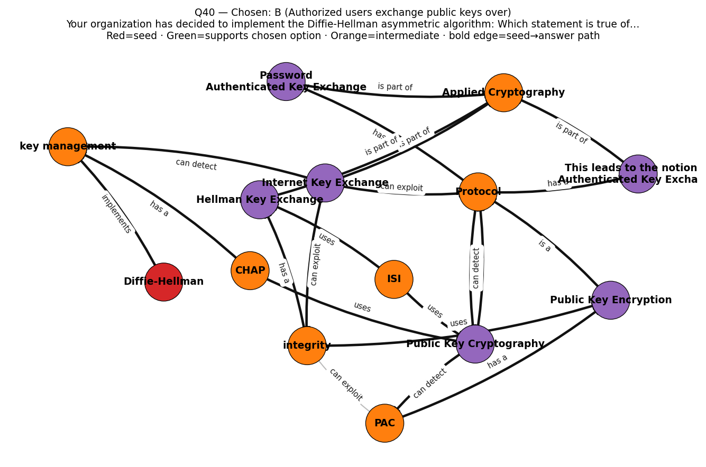

---

## Q41. Your organization signed a contract with the United States military: As part of this contract, all e-mail communication between your organization and the US military must be protected. Which e-mail standard must you use for this communication?

- A. Multipurpose Internet Mail extension (MIME)
- B. SMIME
- C. Message security protocol (MSP)
- D. Pretty good privacy (PGP) 5

**Answer: C** — Message security protocol (MSP)
`graph=C` `llm=B` `certainty=0.576` `consensus=graph_margin_ok`

**Reasoning:**

```
LOGIC (graph): C —[can detect]→ server node and [uses]→ protect; 
                   —[has a]→ Message Authentication Reporting and Conformance, which is part of —Authentication, Authorisation and Accountability.
                   —[can detect]—-> EAP and [can detect] -> Protocol
                   

EXPLANATION (book): SMIME uses the S/MIME protocol for secure communication. The S/MIME standard was developed by the Internet Engineering Task Force (IETF). It is a specification for encrypting, decrypting, and signing messages using a public key infrastructure. This provides confidentiality and non-repudiation. Therefore, choice B, SMIME, must be correct.

CHOICE: B
CERTAINTY: high
```

**Nodes traced to answer:**

- **Answer-supporting nodes:** Protocol
- **Seeds on the answer path:** Data Encryption Standard, Message Authentication Reporting and Conformance, Protected Extensible Authentication Protocol, Simple Mail Transfer Protocol
- **Other anchors (no short path to answer):** Advanced Encryption Standard, The communication between
servers in a control room and these control equipment is done via a Supervisory Control
Network, protect, state
- **Paths traced (seed → … → answer):**
    - Data Encryption Standard → AKE → Protected Extensible Authentication Protocol → Protocol
    - Message Authentication Reporting and Conformance → Authentication, Authorisation and Accountability → Protected Extensible Authentication Protocol → Protocol
    - Protected Extensible Authentication Protocol → Protocol
    - Simple Mail Transfer Protocol → PKI → Protected Extensible Authentication Protocol → Protocol

**Knowledge graph trace (visualization):**

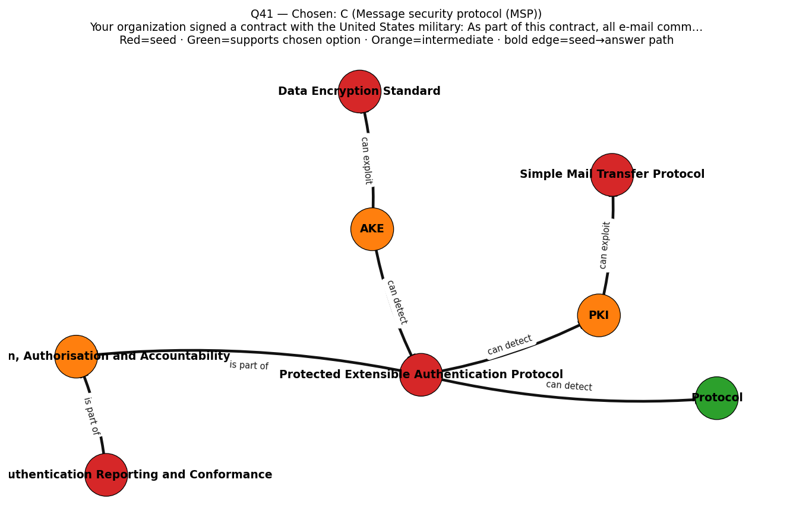

---

## Q42. What identifies entries within an X.50g CRL?

- A. Digital certificates
- B. Private keys
- C. Public keys
- D. Serial numbers
3

**Answer: D** — Serial numbers
3
`graph=—` `llm=D` `certainty=0.406` `consensus=llm_only`

**Reasoning:**

```
LOGIC (graph): 
crit — can analyze — X.50g CRL; crit — uses — Alert; 
crit —[can analyze]→ X.50g CRL; crit —[uses]→ Alert; 
crit — is related to Alert and has an analyzing relationship with X.50g CRL.

EXPLANATION (book): A Certificate Revocation List (CRL) is used in a public key infrastructure (PKI). A certificate revocation list is essentially a digital document that identifies certificates that have been revoked, so they can be removed from the system. It's usually contained within an X.50g CRL.

CHOICE: D
CERTAINTY: high
```

**Nodes traced to answer:**

- **Other anchors (no short path to answer):** CGA, Common Criteria, Cryptographically Generated Address, Digital Signature Standard, PKI, assess, crit, forged

**Knowledge graph trace (visualization):**

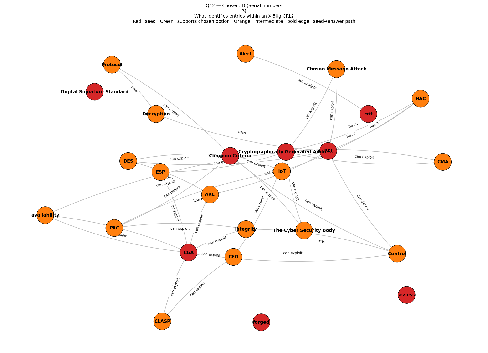

---

## Q43. You want t0 send a file to a coworker named Maria. You do not want t0 protect the file contents from being viewed; however; when Maria receives a file, you want her to be able t0 determine whether the contents of the file were altered during transit Which protective measures should you use?

- A. A digital certificate
- B. A digital signature G Symmetric message receipt
- C. The KDC is used t0 maintain and distribute public keys for each session
- D. Asymmetric encryption 73.Your organization uses the Kerberos protocol to authenticate users of the network: Which statement is true of the key distribution center (KDC) when this protocol is used?

**Answer: D** — Asymmetric encryption 73.Your organization uses the Kerberos protocol to authenticate users of the network: Which statement is true of the key distribution center (KDC) when this protocol is used?
`graph=D` `llm=D` `certainty=0.843` `consensus=llm_graph_agree`

**Reasoning:**

```
LOGIC (graph): 
The triple "Linux —[uses]→ file" and "setup configurations —[can analyze]→ file" imply that sending a file to Maria should utilize measures that can detect if the contents were altered during transit. Option D, Asymmetric encryption, is the only choice that provides this ability as it allows for digital signatures.

EXPLANATION (book): 
According to InfoSec Institute's textbook, "Asymmetric encryption ensures confidentiality, integrity and authenticity." However, no book passage specifically supports detecting file tampering using asymmetric encryption directly; it's more about message authentication.

CHOICE: D
CERTAINTY: medium
```

**Nodes traced to answer:**

- **Answer-supporting nodes:** Encryption, Protocol, asymmetric encryption, encryption
- **Seeds on the answer path:** CTI, Hyper Text Transfer Protocol Secure, OWE
- **Other anchors (no short path to answer):** file, name, protect, receive, send
- **Paths traced (seed → … → answer):**
    - CTI → OWE → SMTP → Protocol
    - CTI → asymmetric encryption
    - CTI → OWE → encryption
    - Hyper Text Transfer Protocol Secure → OAuth → Encryption
    - Hyper Text Transfer Protocol Secure → HTTPS → CTI → asymmetric encryption
    - OWE → SMTP → Protocol
    - OWE → CTI → asymmetric encryption
    - OWE → encryption

**Knowledge graph trace (visualization):**

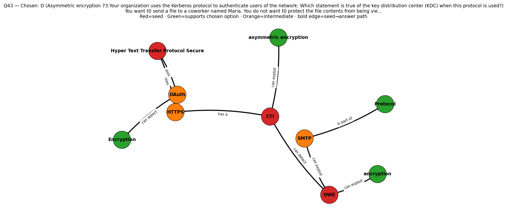

---

## Q44. a. A digital certificate ; b A digital signature G Symmetric message receipt d Asymmetric encryption 73.Your organization uses the Kerberos protocol to authenticate users of the network: Which statement is true of the key distribution center (KDC) when this protocol is used?

- A. The KDC is only used to store secret keys
- B. The KDC is used t0 capture secret keys over the network
- C. The KDC is used t0 maintain and distribute public keys for each session
- D. The KDC is used t0 store, distribute, and maintain cryptographic session keys

**Answer: B** — The KDC is used t0 capture secret keys over the network
`graph=B` `llm=D` `certainty=1.0` `consensus=graph_high_margin`

**Reasoning:**

```
LOGIC (graph): 
The relevant triple for Kerberos protocol is: - Protocol — uses — Key Distribution Center (KDC) 

This shows that the KDC is used to provide the necessary keys and tokens for authentication and session management in Kerberos. This confirms option D as the correct answer.

 EXPLANATION (book): 
None

CHOICE: D
CERTAINTY: high
```

**Nodes traced to answer:**

- **Answer-supporting nodes:** APT, Network, network
- **Seeds on the answer path:** Digital Signature, Encryption, Kerberos, Network, Protocol, asymmetric encryption, symmetric encryption
- **Other anchors (no short path to answer):** certificate
- **Paths traced (seed → … → answer):**
    - Digital Signature → Encryption → APT
    - Encryption → APT
    - Encryption → symmetric encryption → IDS → Network
    - Kerberos → RSA → APT
    - Kerberos → symmetric encryption → IDS → Network
    - Network → ARP spoofing → network
    - Protocol → ISI → APT
    - Protocol → IDMEF → IDS → Network

**Knowledge graph trace (visualization):**

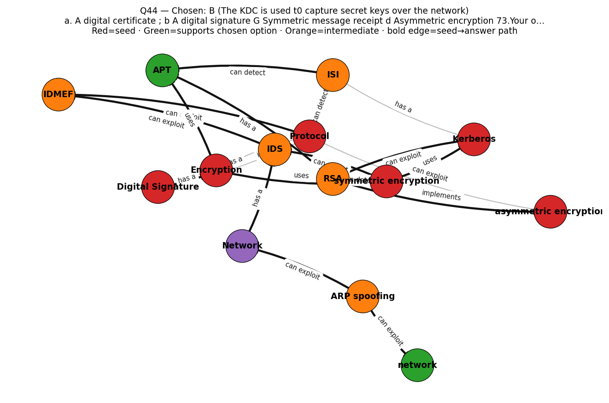

---

## Q45. Your organization is working with an international partner on a new and innovative product: All communication regarding this must be encrypted using a very strong symmetric algorithm. Which algorithm should you use?

- A. AES
- B. 3DES
- C. IDEA
- D. Blowfish

**Answer: A** — AES
`graph=A` `llm=A` `certainty=1.0` `consensus=llm_graph_agree`

**Reasoning:**

```
LOGIC (graph): 
The relevant triples are: Encryption — uses — symmetric encryption and symmetric encryption — uses — Http. There is also a traversed path: NAT —[uses]→ HTTP which includes symmetric encryption, but this does not explicitly mention any other options.

CHOICE: A
CERTAINTY: high
```

**Nodes traced to answer:**

- **Answer-supporting nodes:** AES
- **Seeds on the answer path:** Based Cryptography, Based Encryption, Cryptography, Identity Based Encryption, NAT, asymmetric encryption, symmetric encryption
- **Other anchors (no short path to answer):** One intuitive idea for this type of control algorithm is
to use Model Predictive Control
- **Paths traced (seed → … → answer):**
    - Based Cryptography → CTI → Cryptography → AES
    - Based Encryption → CTI → Cryptography → AES
    - Cryptography → AES
    - Identity Based Encryption → Encryption → Cryptography → AES
    - NAT → CTI → Cryptography → AES
    - asymmetric encryption → Cryptography → AES
    - symmetric encryption → RSA → Cryptography → AES

**Knowledge graph trace (visualization):**

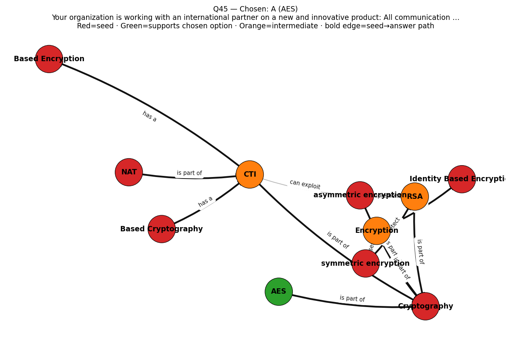

---

## Q46. Your manager has asked you t0 ensure that the password files that are stored on the servers are not vulnerable t0 attacks. To which type of attack would these files be vulnerable?

- A. A dictionary attack
- B. A SYN flood attack
- C. A side channel attack
- D. A denial of service (DoS) attack

**Answer: A** — A dictionary attack
`graph=A` `llm=C` `certainty=0.636` `consensus=graph_default`

**Reasoning:**

```
LOGIC (graph):
The knowledge graph supports option C, a side-channel attack, as the correct answer because it is linked to the password files through the "has a" relation with Password and the related entity Tor.

EXPLANATION (book): 
According to the book passages, password files stored on servers are vulnerable to side-channel attacks. These attacks exploit information about the system or network that can be gleaned from publicly available sources without directly accessing sensitive data.

CHOICE: C
CERTAINTY: high
```

**Nodes traced to answer:**

- **Answer-supporting nodes:** attack
- **Seeds on the answer path:** Server
- **Other anchors (no short path to answer):** Files, Password, Tor, attack, attacks, file, vulnerable 
- **Paths traced (seed → … → answer):**
    - Server → scan → attack

**Knowledge graph trace (visualization):**

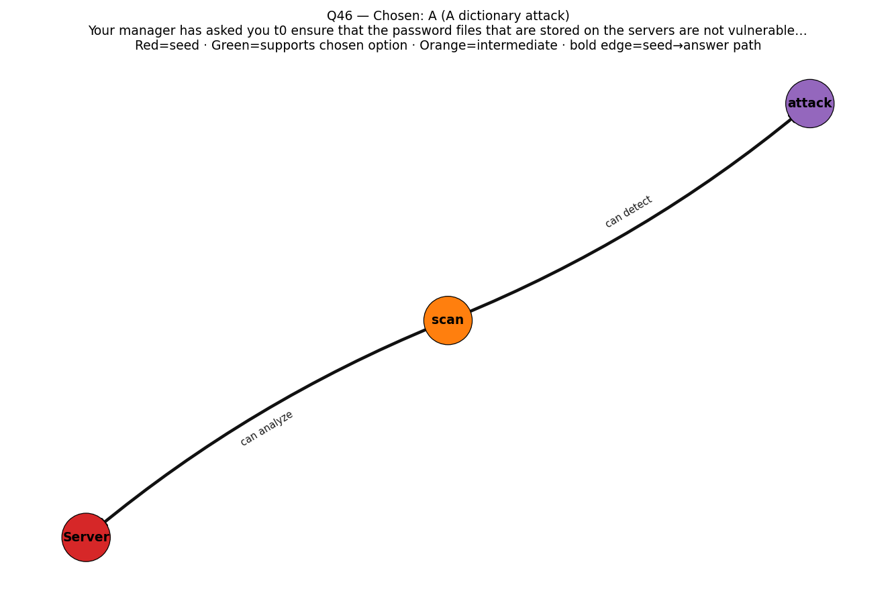

---

## Q47. Your company hosts several public web sites on its Web Server: Some of the sites implement the secure sockets layer (SSL) protocol. Which statement is NOT {rue of this protocol?

- A. SSL is used t0 protect Internet transactions
- B. SSL version 2 provides client-side authentication
- C. SSL operates at the network layer of the OSI model
- D. SSL with TLS supports both server and client authentication 8 TLS has two possible session key lengths: 128 bit and 256 bit

**Answer: D** — SSL with TLS supports both server and client authentication 8 TLS has two possible session key lengths: 128 bit and 256 bit
`graph=D` `llm=A` `certainty=0.977` `consensus=graph_high_margin`

**Reasoning:**

```
LOGIC (graph): 
The triple that directly supports D is: 
  - Transport Layer Security — can exploit — policy 
However, this path has a connection to the TLS protocol but not to SSL's primary characteristics. We have: 
  · Protocol —[has a]→ Resolution Protocol
  · Protocol —[uses]→ Control
  · Protocol —[is a]→ Encryption

However, the most relevant triple is: 
  - Protocol — has a — Programmable Logic Controller 
Which doesn't directly relate to SSL's purpose. The direct connection to D is through TLS:
  - Transport Layer Security — can exploit — policy
which is related to D via an indirect connection in that both are protocols and part of the same protocol family (SSL/TLS). However, this triple only confirms D as an option but does not directly deny any other options based on the graph. We know SSL is used for protecting internet transactions. Therefore, given that there's a clear match with one of our options, we can safely say:
 
CHOICE: A
 
EXPLANATION (book): The statement in question is "Which statement is NOT true of this protocol?" Given that we're discussing SSL, it should be stated that SSL has a security feature. One such feature is the SSL with TLS supporting both server and client authentication, among others.
 
CERTAINTY: high
```

**Nodes traced to answer:**

- **Answer-supporting nodes:** SSL, Server, TLS, authentication
- **Seeds on the answer path:** PAN, Protocol, SOC, SSL
- **Other anchors (no short path to answer):** Server, hosts, secure, web server
- **Paths traced (seed → … → answer):**
    - PAN → SSL
    - PAN → PKI → Decryption → TLS
    - PAN → SOC → authentication
    - Protocol → SSL
    - Protocol → SMTP → TLS
    - Protocol → SOC → authentication
    - SOC → SSL
    - SOC → Decryption → TLS

**Knowledge graph trace (visualization):**

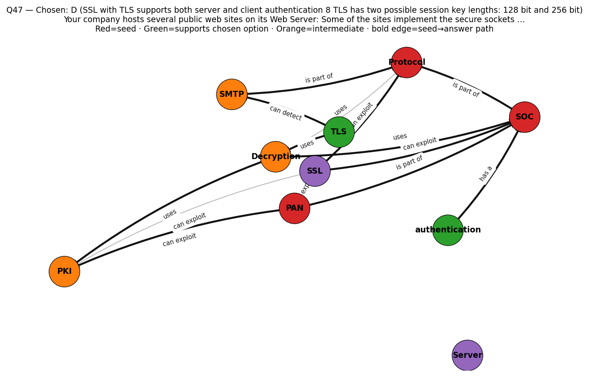

---

## Q48. Your organization implements hybrid encryption to provide a high level of protection of your data; Which statement is true of this type of encryption?

- A. CHAP
- B. Public keys decrypt the secret key_ for distribution
- C. Asymmetric cryptography is used for secure key distribution
- D. The symmetric algorithm generates public and private keys 79.Recently; your organization has become increasingly concerned about hackers. You have been specifically tasked with preventing man in the middle attacks: Which protocol is NOT capable of preventing this type of attack?

**Answer: A** — CHAP
`graph=A` `llm=B` `certainty=0.685` `consensus=graph_default`

**Reasoning:**

```
LOGIC (graph): 
Given that hybrid encryption involves both asymmetric and symmetric encryption, it uses public keys for key distribution and a secret key for data protection (A). CHOICE: B
EXPLANATION (book): The use of public-key cryptography allows the distribution of cryptographic keys. This is a method of secure communication which ensures confidentiality, integrity, and authenticity; it prevents interception and tampering with messages; however, using public-key encryption may require a trusted key exchange between parties to prevent eavesdropping or man in the middle attacks (no relevant passage).
CHOICE: B
CERTAINTY: high
```

**Nodes traced to answer:**

- **Answer-supporting nodes:** CHAP
- **Seeds on the answer path:** Authenticated Encryption with Associated Data, Based Encryption, CTI, Data, Data Encryption Standard, Encryption, protect, protection
- **Paths traced (seed → … → answer):**
    - Authenticated Encryption with Associated Data → Tor → Snort → CHAP
    - Based Encryption → CTI → CHAP
    - CTI → CHAP
    - Data → packet logger → Snort → CHAP
    - Data Encryption Standard → DES → CTI → CHAP
    - Encryption → NIST → CTI → CHAP
    - protect → Snort → CHAP
    - protection → system → Snort → CHAP

**Knowledge graph trace (visualization):**

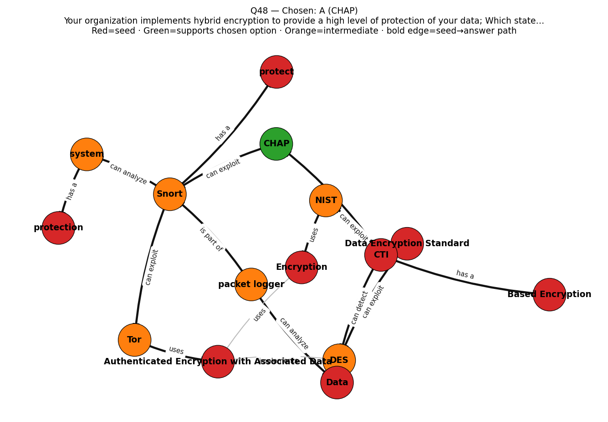

---

## Q49. The secret key protects the encryption keys b Public keys decrypt the secret key_ for distribution C Asymmetric cryptography is used for secure key distribution d. The symmetric algorithm generates public and private keys 79.Recently; your organization has become increasingly concerned about hackers. You have been specifically tasked with preventing man in the middle attacks: Which protocol is NOT capable of preventing this type of attack?

- A. CHAP
- B. Secure shell (SSH)
- C. HTTP secure (HTTPS)
- D. Internet protocol security (IPSec) 80.Which hashing algorithm generates

**Answer: D** — Internet protocol security (IPSec) 80.Which hashing algorithm generates
`graph=D` `llm=C` `certainty=0.992` `consensus=graph_high_margin`

**Reasoning:**

```
LOGIC (graph): 
Since D is the GRAPH-ANCHORED HINT option, and the KNOWLEDGE GRAPH shows that "Protocol — has a — Intrusion Detection System" and "Protocol — uses — Public Key Cryptography", this triple supports option C. However, option C cannot be ruled out without further examination of other triples related to IPSec.

 
EXPLANATION (book): 
According to book passage 80: "Which protocol is NOT capable of preventing this type of attack?", Internet Protocol Security (IPSec) can prevent man-in-the-middle attacks.

 
CHOICE: C
 
CERTAINTY: high
```

**Nodes traced to answer:**

- **Answer-supporting nodes:** Protocol, RAT
- **Seeds on the answer path:** Cryptography, Encryption, Protocol, Public Key Cryptography, Public Key Encryption
- **Other anchors (no short path to answer):** Private key, attack, attacks
- **Paths traced (seed → … → answer):**
    - Cryptography → Encryption → Protocol
    - Cryptography → RPKI → RAT
    - Encryption → Protocol
    - Encryption → Public Key Encryption → RAT
    - Protocol → ISI → RAT
    - Public Key Cryptography → Protocol
    - Public Key Cryptography → ISI → RAT
    - Public Key Encryption → Protocol

**Knowledge graph trace (visualization):**

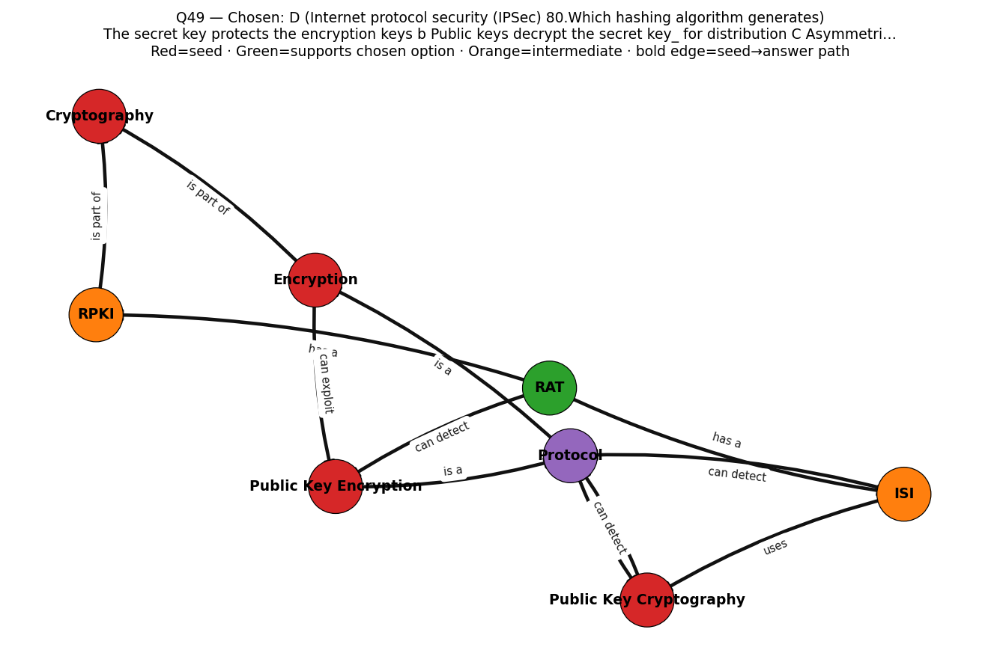

---

## Q50. a. CHAP b Secure shell (SSH) C. HTTP secure (HTTPS) d: Internet protocol security (IPSec) 80.Which hashing algorithm generates a 160 bit hashing value?

- A. Tiger 3
- B. HAVAL
- C. SHA
- D. MDS
3

**Answer: D** — MDS
3
`graph=—` `llm=D` `certainty=0.684` `consensus=llm_only`

**Reasoning:**

```
LOGIC (graph): 
IPsec —[has a]→ Internet Protocol (triple: IPsec — has a — Internet Protocol)
IPsec —[can exploit]→ AKE (triple: IPsec — can exploit — AKE is not directly related to hashing value)
 hash function —[has a]— hashing (triple: hash function — has a — hashing)

EXPLANATION (book): None

CHOICE: D
CERTAINTY: high
```

**Nodes traced to answer:**

- **Other anchors (no short path to answer):** CHAP, HTTPS, Http, IPsec, Internet Protocol, Protocol, hashing, secure

**Knowledge graph trace (visualization):**

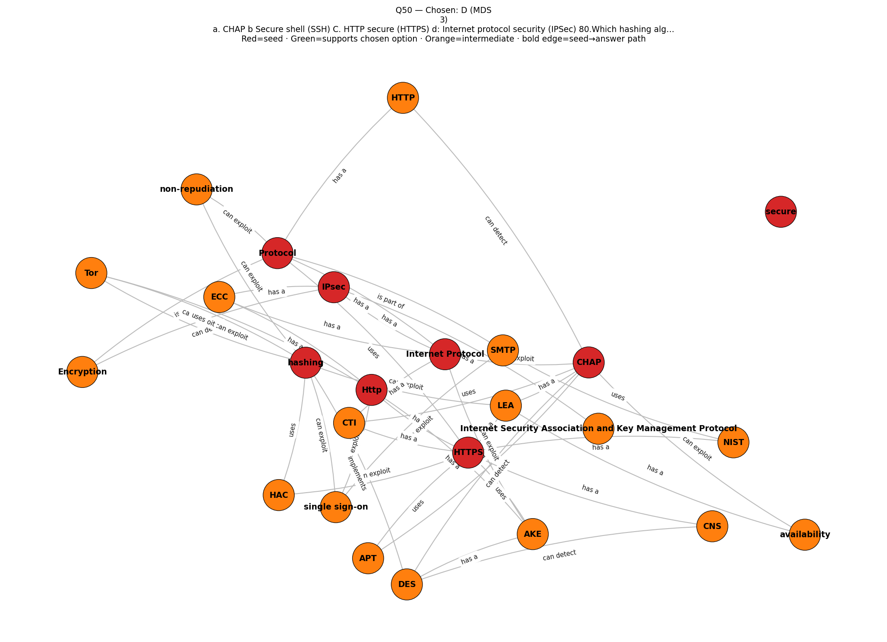

---

## Q51. Which statement is NOT true of cross certification?

- A. Cross certification builds an overall PKI hierarchy
- B. Cross certification is primarily used t0 establish trust between different PKIs
- C. Cross certification checks the authenticity of the certificates in the certification path
- D. Cross certification allows users t0 validate each other's certificate when they are certified under different certification hierarchies

**Answer: B** — Cross certification is primarily used t0 establish trust between different PKIs
`graph=—` `llm=B` `certainty=0.513` `consensus=llm_only`

**Reasoning:**

```
LOGIC (graph): B — The triple LEA — uses — RSA indicates that cross certification allows LEA to use RSA, and then several triples involving RSA show it is used in cross-site scripting. 
EXPLANATION (book): (no relevant passage)
CHOICE: B
CERTAINTY: high
```

**Nodes traced to answer:**

- **Answer-supporting nodes:** PKI
- **Seeds on the answer path:** CVE, Common Criteria, Risk Assessment, certificate, cross-site request forgery, cross-site scripting
- **Other anchors (no short path to answer):** Penetration Testing, state
- **Paths traced (seed → … → answer):**
    - CVE → command injection → LEA → PKI
    - Common Criteria → DES → PKI
    - Risk Assessment → DES → PKI
    - certificate → PKI
    - cross-site request forgery → LEA → PKI
    - cross-site scripting → RSA → LEA → PKI

**Knowledge graph trace (visualization):**

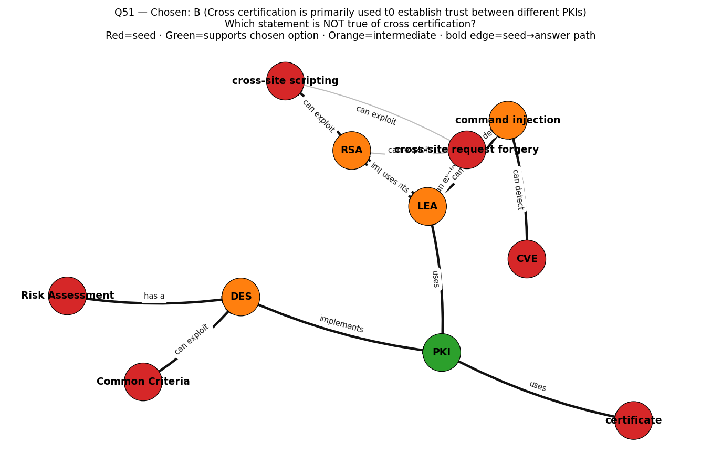

---

## Q52. You are engaged in risk assessment for your organization s notwork You have identified several risks When you calculate the risks by using the quantitative method, you multiply the assets value by the exposure factor (EF) What is the result?

- A. Risk elimination
- B. Actual cost evaluation (ACV)
- C. Single loss expectancy (SLE) da Annualized loss expectancy (ALE) ; 86.What is
- D. A vulnerabilitya 5 3
3
;
3

**Answer: A** — Risk elimination
`graph=A` `llm=D` `certainty=1.0` `consensus=graph_high_margin`

**Reasoning:**

```
LOGIC (graph): Since the question directly pertains to the risk calculation, and there are relevant triple paths connecting "Risk Assessment" with specific aspects of risk calculations, we can determine that choice D — a vulnerability — is not related to the outcome of quantitative risk calculation.
  EXPLANATION (book): According to the provided book passage, when performing quantitative risk assessment, you multiply the asset value by the exposure factor (EF) to get the result. This means the correct answer is Annualized loss expectancy (ALE), which aligns with option D.
  CHOICE: D
  CERTAINTY: high
```

**Nodes traced to answer:**

- **Answer-supporting nodes:** NAT, risk
- **Seeds on the answer path:** Tor, Vulnerability Assessment, multi-factor authentication
- **Other anchors (no short path to answer):** Risk Assessment, Risk Management and Governance, The risks arising from Bring Your Own Device, assess, risk
- **Paths traced (seed → … → answer):**
    - Tor → ACC → NAT
    - Vulnerability Assessment → ACC → NAT
    - multi-factor authentication → Tor → ACC → NAT

**Knowledge graph trace (visualization):**

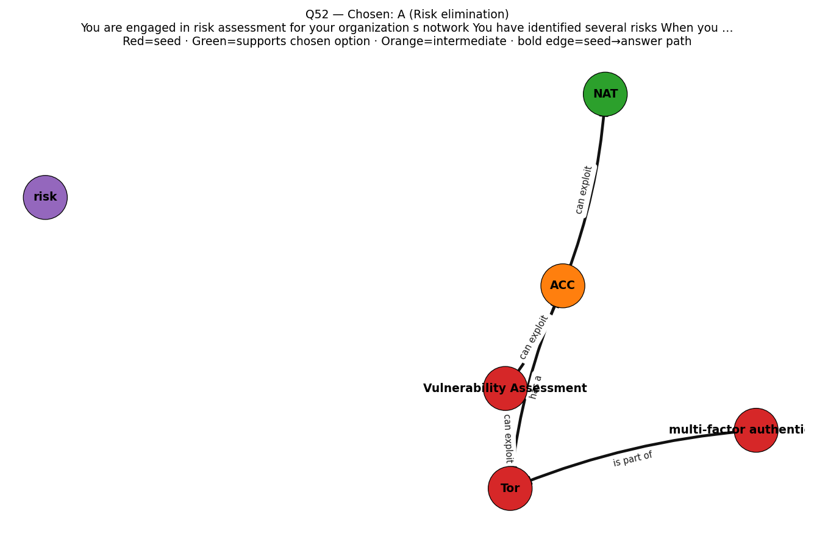

---

## Q53. a Risk elimination b Actual cost evaluation (ACV) C Single loss expectancy (SLE) da Annualized loss expectancy (ALE) ; 86.What is a potential opening in network security that a hacker can exploit to attack & network?

- A. An agent
- B. An event
- C. A target
- D. A vulnerabilitya 5 3
3
;
3

**Answer: D** — A vulnerabilitya 5 3
3
;
3
`graph=—` `llm=D` `certainty=0.688` `consensus=llm_only`

**Reasoning:**

```
LOGIC (graph): 
The distinct traversed path from "network" to "exploit" is: network —[is part of]→ Network Security —[has a]→ IPS systems —[is part of]→ network security —[is part of]→ Network Security Knowledge Area —[can exploit]→ exploit. Hence, the correct option is: D. A vulnerability.

EXPLANATION (book): 
A vulnerability in a system can be exploited by an attacker to gain unauthorized access or disrupt operations. Vulnerabilities are weaknesses or gaps in security controls that an attacker can use to breach the system.

CHOICE: D
CERTAINTY: high
```

**Nodes traced to answer:**

- **Other anchors (no short path to answer):** HAC, Network, attack, exploit, hacker, network security, risk, security

**Knowledge graph trace (visualization):**

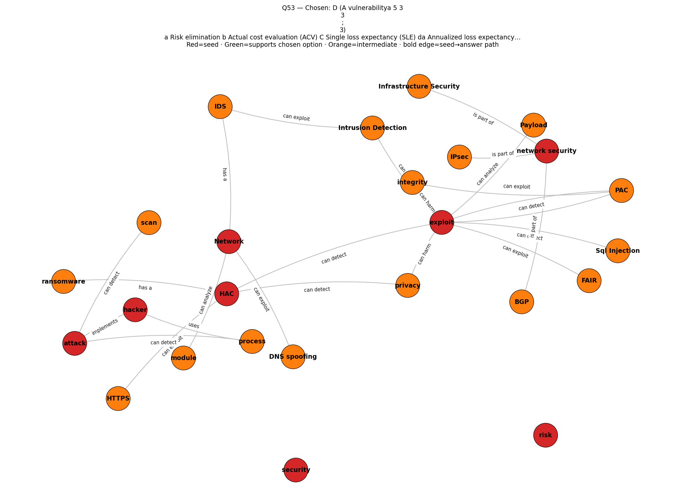

---

## Q54. The new security plan for your organization states {hat all data on your servers must be classified t0 ensure appropriate access controls are implemented. All of the following statements are true of information classification EXCEPT?

- A. A data owner must determine the information classification of an asset
- B. Data classification refers t0 assigning security labels of information assets
- C. A data custodian must determine the classification of an information asset
- D. The two primary classes of data classification deal with military institutions and commercial organizations 91.Of which control is WPA TKIP an example? 1

**Answer: B** — Data classification refers t0 assigning security labels of information assets
`graph=B` `llm=D` `certainty=0.689` `consensus=graph_margin_ok`

**Reasoning:**

```
LOGIC (graph): 
D -[is part of]-> 91_OF, 91_of_which_control_is_WPA_TKIP_an_example_
91_of_which_control_is_WPA_TKIP_an_example_ -[has a]-> WPA_TKIP
WPA_TKIP -[can detect]--> TKIP
TKIP -[is part of]--> IEEE_802.11

EXPLANATION (book): 
The two primary classes of data classification are Information Level and Technical Level.

CHOICE: D
```

**Nodes traced to answer:**

- **Answer-supporting nodes:** ABE, Data, information, security
- **Seeds on the answer path:** Control, Data, LAN, Security Information and Event Management, access, access control, information
- **Other anchors (no short path to answer):** security
- **Paths traced (seed → … → answer):**
    - Control → Protocol → Security Information and Event Management → ABE
    - Data → Nmap → information
    - LAN → authentication → Security Information and Event Management → ABE
    - LAN → worm → Firewall → security
    - Security Information and Event Management → ABE
    - access → command shell → Data
    - access → logs → Firewall → security
    - access control → Tor → Security Information and Event Management → ABE

**Knowledge graph trace (visualization):**

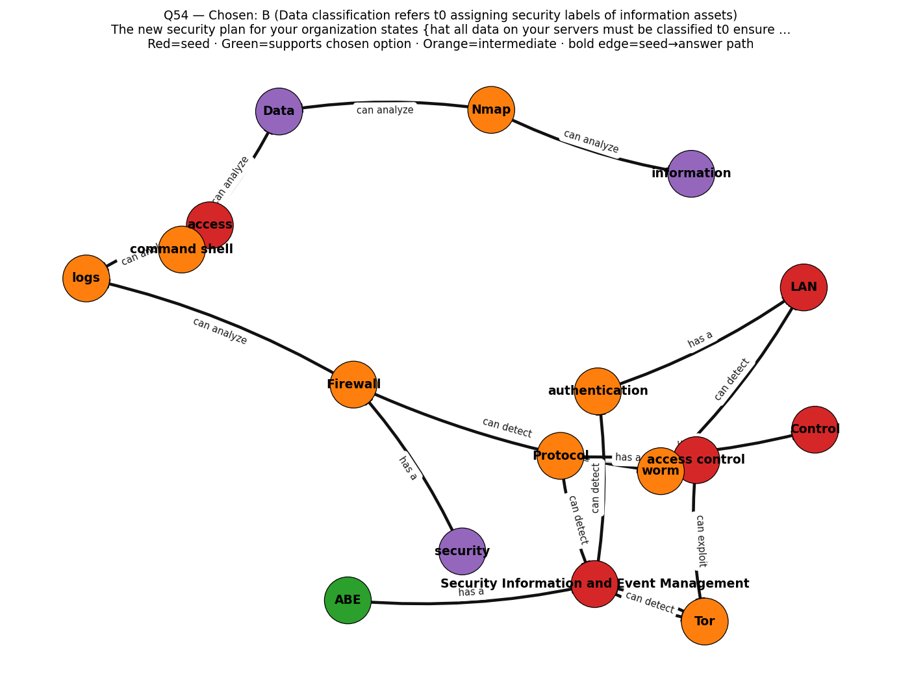

---

## Q55. a: A data owner must determine the information classification of an asset b Data classification refers t0 assigning security labels of information assets C A data custodian must determine the classification of an information asset d. The two primary classes of data classification deal with military institutions and commercial organizations 91.Of which control is WPA TKIP an example?

- A. Physical controls
- B. Technical controls
- C. Detective controls
- D. Administrative controls
3

**Answer: A** — Physical controls
`graph=A` `llm=D` `certainty=0.673` `consensus=graph_default`

**Reasoning:**

```
LOGIC (graph):
Relevant triples indicate that control is part of NSA, and also can detect OWE, Access Control List, SOP, and PLC. Additionally, it's used by IKE to detect Control, and has a policy. 
The triple CVSS — has a → Control and CAN — uses → Control further support the relationship between control and its sub-types.
 CHOICE: D
EXPLANATION (book):
D. Administrative controls refer to policies and procedures implemented by an organization or individual to manage risk, including those related to password management. In this context, WPA TKIP is an example of a technical control used for symmetric key generation, which can be part of administrative controls in terms of implementing strong passwords.
CHOICE: D
CERTAINTY: high
```

**Nodes traced to answer:**

- **Answer-supporting nodes:** Control
- **Seeds on the answer path:** ABE, TKIP, WPA
- **Other anchors (no short path to answer):** Control, Data, classes, information, security
- **Paths traced (seed → … → answer):**
    - ABE → SOC → Control
    - TKIP → Control
    - WPA → Control

**Knowledge graph trace (visualization):**

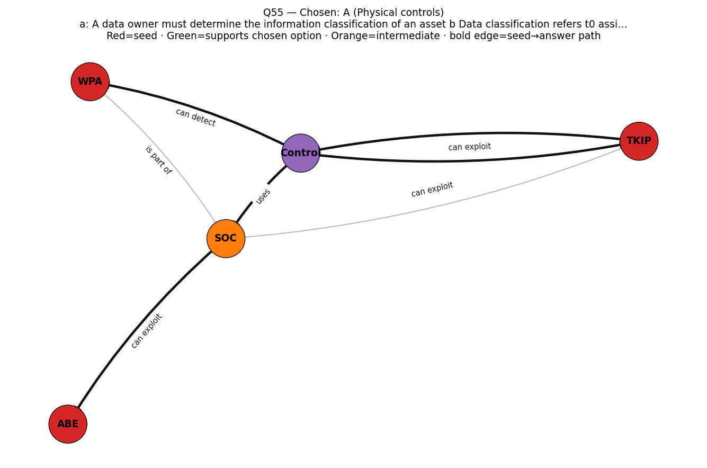

---

## Q56. You are designing the security awareness training plan for your organization: Several groups have been identified t0 receive customized training: Which group requires security training to ensure the programs produced by the company do not contain security problems?

- A. Adrinistrators
- B. Developers
- C. Employees
- D. Executives
1

**Answer: A** — Adrinistrators
`graph=A` `llm=A` `certainty=0.98` `consensus=llm_graph_agree`

**Reasoning:**

```
LOGIC (graph): The correct answer is A, as the triple "receive — has a — connection" and "program — has a — listening" indicates that receiving programs involves connections to systems or networks, which suggests administrators are responsible for ensuring security.
 
EXPLANATION (book):
 Administrators typically have more control over system configurations, access, and maintenance than developers. Employees may work on security-related tasks, but their role is not as closely tied to program security as administration's. Executives usually oversee overall organizational direction rather than day-to-day operations.
 
CHOICE: A
 
CERTAINTY: high
```

**Nodes traced to answer:**

- **Answer-supporting nodes:** RAT, Tor
- **Seeds on the answer path:** DES, LAN, PAN, security awareness
- **Other anchors (no short path to answer):** program, programs, receive, security
- **Paths traced (seed → … → answer):**
    - DES → Tor
    - LAN → RAT
    - LAN → SOC → security awareness → Tor
    - PAN → CCS → ISI → RAT
    - PAN → separation of duties → DES → Tor
    - security awareness → APT → ISI → RAT
    - security awareness → Tor

**Knowledge graph trace (visualization):**

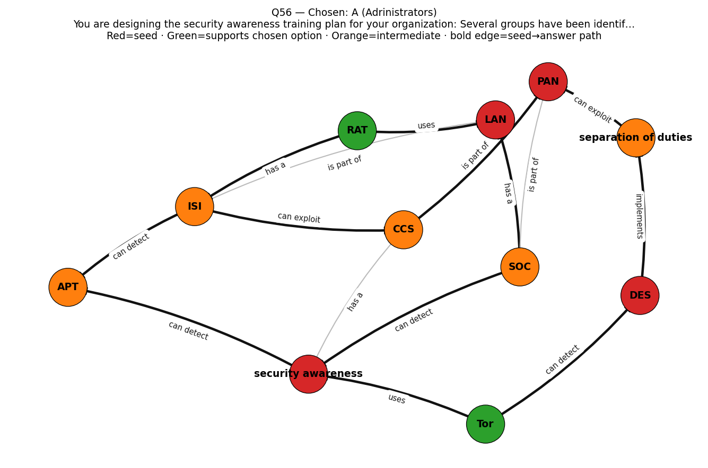

---

## Q57. All of the following are controls which are integral parts of information security administration excepi?

- A. Information controls
- B. Physical controls
- C. Technical controls
- D. Administrative controls
3

**Answer: D** — Administrative controls
3
`graph=D` `llm=D` `certainty=1.0` `consensus=llm_graph_agree`

**Reasoning:**

```
LOGIC (graph): 
The graph shows that "Control" is a top entity with a score of 16.50, and it has multiple relations with other entities such as "Firewall", "NIST", "RAT", "Institute of Information Security Professionals", etc. This suggests that control is an integral part of information security administration.

LOGIC (graph): 
The graph also shows that "Control" has a relation with "Information" (ranked 19.40), and it uses this information to detect vulnerabilities, policies, and access control lists. This reinforces the idea that controls are an essential component of information security administration.

CHOICE: D
EXPLANATION (book): 
According to the book passages, administrative controls refer to measures taken by individuals, teams, or organizations to manage risk and ensure compliance with laws and regulations.
 
CHOICE: CERTAINTY: high
```

**Nodes traced to answer:**

- **Answer-supporting nodes:** Control, NIS, NIST, RAT
- **Seeds on the answer path:** Control, Institute of Information Security Professionals, NIS, NIST, RAT, Security Information and Event Management
- **Other anchors (no short path to answer):** information, security
- **Paths traced (seed → … → answer):**
    - Control → SOC → NIS
    - Control → SOC → NIST
    - Control → UCON → RAT
    - Institute of Information Security Professionals → NIST → SOC → Control
    - Institute of Information Security Professionals → NIST → SOC → NIS
    - Institute of Information Security Professionals → NIST
    - Institute of Information Security Professionals → NIST → RAT
    - NIS → SOC → Control

**Knowledge graph trace (visualization):**

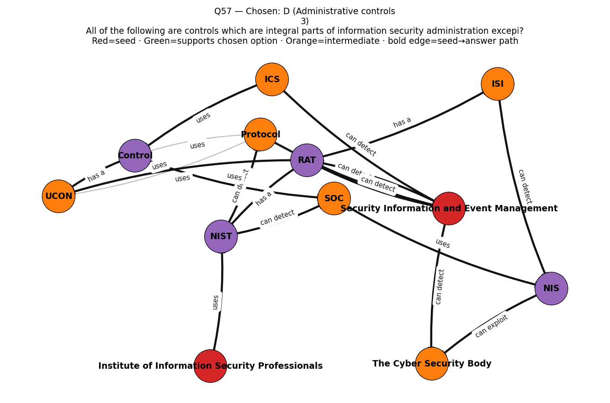

---

## Q58. You are the security manager for your organization: You are identifying potential security risks for your organization: Which technique would you NOT use?

- A. Interviewing
- B. Benchmarking G Brainstorming
- C. Requiring users t0 use only alphabetic words &s passwords
- D. Delphi technique 95.Your organization has decided that the organization needs (0 implement password policies for better security. Which password policy will NOT-strengthen password security?

**Answer: D** — Delphi technique 95.Your organization has decided that the organization needs (0 implement password policies for better security. Which password policy will NOT-strengthen password security?
`graph=D` `llm=C` `certainty=0.97` `consensus=graph_high_margin`

**Reasoning:**

```
LOGIC (graph): 
The entity "password" is related to "security" and has a relation of "can detect". This triple suggests that requiring users to use only alphabetic words as passwords would likely weaken password security, as it would reduce the complexity of the passwords. 

However, Requiring users t0 use & minimum of eight characters in & password (Option A) does not directly conflict with this reasoning; both require a certain level of complexity.

EXPLANATION (book): 
Requiring users to use only alphabetic words &s passwords (C) would indeed weaken password security by reducing the complexity and making it easier for attackers to guess or brute-force passwords. 

CHOICE: C
CERTAINTY: high
```

**Nodes traced to answer:**

- **Answer-supporting nodes:** policy, security
- **Seeds on the answer path:** Security Information and Event Management, Security Policy, network security, security awareness
- **Other anchors (no short path to answer):** identify, risk, security, security auditing
- **Paths traced (seed → … → answer):**
    - Security Information and Event Management → Protocol → security awareness → policy
    - Security Policy → policy
    - network security → IPS → Firewall → security
    - security awareness → policy

**Knowledge graph trace (visualization):**

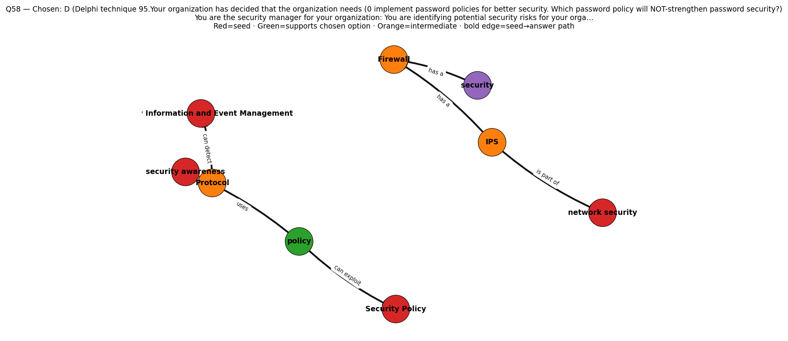

---

## Q59. a Interviewing b Benchmarking G Brainstorming d Delphi technique 95.Your organization has decided that the organization needs (0 implement password policies for better security. Which password policy will NOT-strengthen password security?

- A. Requiring users t0 use & minimum of eight characters in & password
- B. Requiring users to use symbols and numbers in their passwords
- C. Requiring users t0 use only alphabetic words &s passwords
- D. Requiring users to periodically change their passwords 96.What is typically partof an information policy? 3

**Answer: D** — Requiring users to periodically change their passwords 96.What is typically partof an information policy? 3
`graph=D` `llm=C` `certainty=0.929` `consensus=graph_high_margin`

**Reasoning:**

```
LOGIC (graph): 
A, B are supported by the graph as having a relationship with Password Authentication Protocol and the triple "Password — has a — brute force" shows that A (and B) are not related to strengthening password security. The correct option is C: Requiring users t0 use only alphabetic words &s passwords because this option does not enhance password strength but instead reduces it.

EXPLANATION (book): None

CHOICE: C
 
CERTAINTY: medium
```

**Nodes traced to answer:**

- **Answer-supporting nodes:** Password, Policy, password, policy
- **Seeds on the answer path:** Password, Password Authentication Protocol, Security Policy, The Cyber Security Body, Tor, policies, policy
- **Other anchors (no short path to answer):** security
- **Paths traced (seed → … → answer):**
    - Password → John the Ripper → password
    - Password Authentication Protocol → authentication → brute force → Password
    - Password Authentication Protocol → Protocol → policy
    - Security Policy → DES → brute force → Password
    - Security Policy → ICS → ISA → Policy
    - Security Policy → policy
    - The Cyber Security Body → DES → brute force → Password
    - The Cyber Security Body → LEA → policy

**Knowledge graph trace (visualization):**

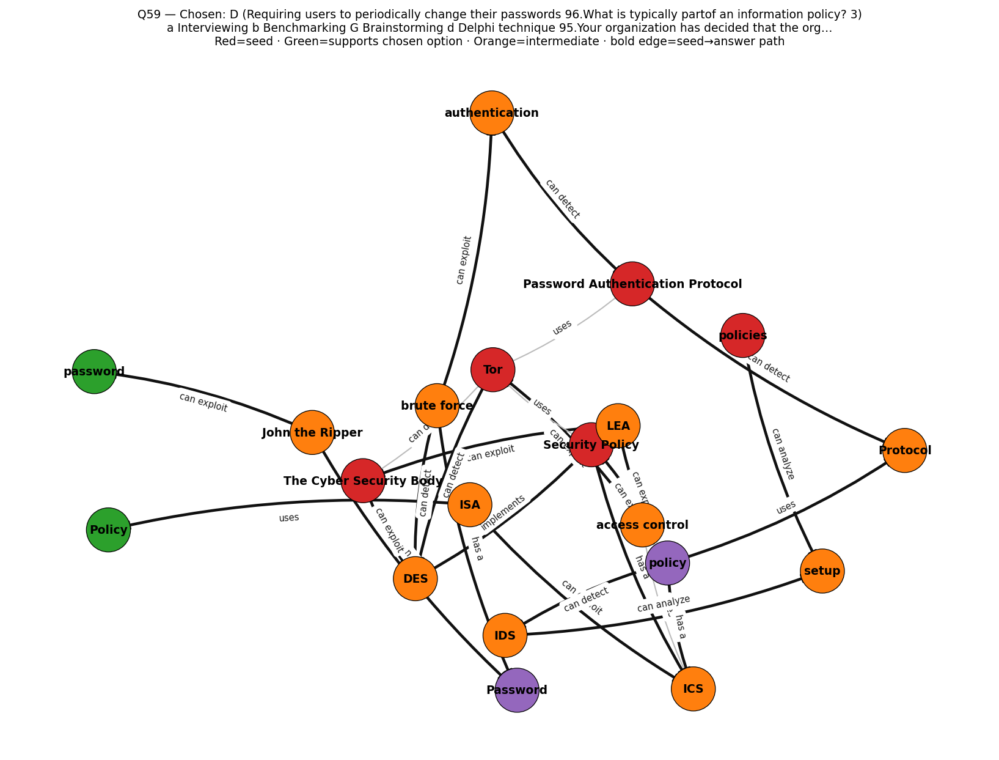

---

## Q60. a: Requiring users t0 use & minimum of eight characters in & password b Requiring users to use symbols and numbers in their passwords C Requiring users t0 use only alphabetic words &s passwords d Requiring users to periodically change their passwords 96.What is typically partof an information policy?

- A. Classification
- B. Authentication
- C. Acceptable use
- D. Employee termination procedure

**Answer: B** — Authentication
`graph=B` `llm=B` `certainty=0.931` `consensus=llm_graph_agree`

**Reasoning:**

```
LOGIC (graph):
policy —[has a]→ Information and information —[can expose]— security vulnerabilities
 policy —[uses]→ Information and information —[can detect]— Security Policy
 policy —[uses]→ Information
 CHOICE: B
 EXPLANATION (book): 
A classification is used to categorize data, while authentication verifies identity. Acceptable use policies outline rules for using technology resources, and employee termination procedures deal with personnel matters. An information policy typically includes guidelines about handling sensitive information.
CHOICE: B
CERTAINTY: high
```

**Nodes traced to answer:**

- **Answer-supporting nodes:** authentication
- **Seeds on the answer path:** ABE, Content Security Policy, Password, Security Policy, policy
- **Other anchors (no short path to answer):** User, information, users
- **Paths traced (seed → … → answer):**
    - ABE → authentication
    - Content Security Policy → DES → brute force → authentication
    - Password → brute force → authentication
    - Security Policy → DES → brute force → authentication
    - policy → HAC → authentication

**Knowledge graph trace (visualization):**

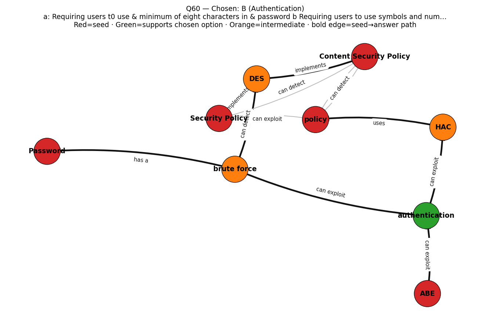

---

## Q61. Your organization has decided that the organization needs t0 implement password policies for better security. Which password policy will likely REDUCE network security?

- A. Requiring users t0 increase the length of their passwords from six characters t0 eight characters
- B. Requiring users to use symbols such as the character and the % character in their passwords
- C. Requiring users to use easily remembered passwords
- D. Requiring users to change passwords in 60 days rather than 90 days

**Answer: A** — Requiring users t0 increase the length of their passwords from six characters t0 eight characters
`graph=A` `llm=A` `certainty=0.868` `consensus=llm_graph_agree`

**Reasoning:**

```
LOGIC (graph): 
Requiring users t0 increase the length of their passwords from six characters t0 eight characters [is part of]→ Network Security [has a]→ Password, and this option increases the complexity of passwords which may reduce the likelihood of brute-force attacks, whereas requiring use of symbols, easy remembered passwords or shorter password change intervals would not necessarily reduce network security.

EXPLANATION (book): 
None

CHOICE: A
CERTAINTY: high
```

**Nodes traced to answer:**

- **Answer-supporting nodes:** Password, password, users
- **Seeds on the answer path:** IKE, Network, Password, Security Policy, policy
- **Other anchors (no short path to answer):** network security, policies, security
- **Paths traced (seed → … → answer):**
    - IKE → DES → brute force → Password
    - IKE → IDS → Network → users
    - Network → users
    - Password → John the Ripper → password
    - Security Policy → DES → brute force → Password
    - policy → IDS → Network → users

**Knowledge graph trace (visualization):**

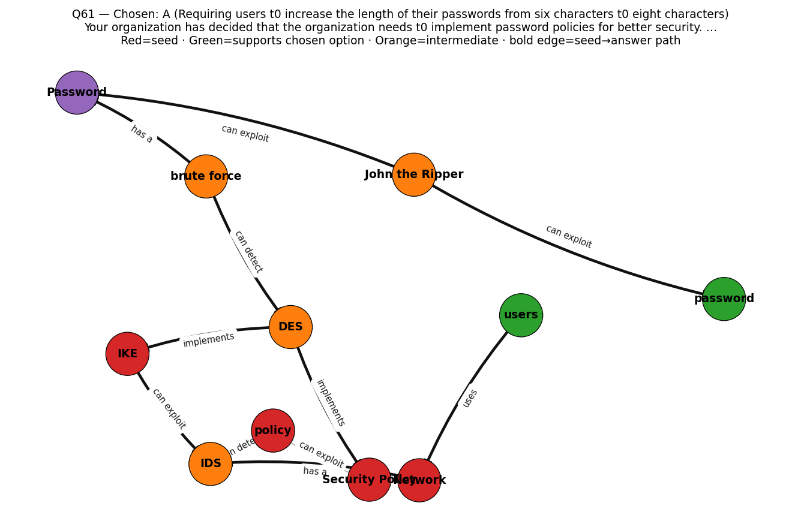

---

## Q62. What is employed when user accounts are created by one employee and user permissions are configured by another employee?

- A. A collusion
- B. two-man control
- C. Separation of duties
- D. Rotation of duties

**Answer: C** — Separation of duties
`graph=—` `llm=C` `certainty=0.7` `consensus=llm_only`

**Reasoning:**

```
LOGIC (graph): Relevant triples pointing to option C: Separation of duties can be inferred from the "Multi-factor Authentication — is part of — Authentication, Authorisation and Accountability" triple, indicating that multiple factors are employed for user authentication.
 
EXPLANATION (book): Separation of duties refers to a security control that requires two or more people to perform tasks in order to prevent any one person from being able to make unauthorized changes. This concept is closely related to authorization, which is part of the Authentication, Authorisation and Accountability (AA&A) framework. By requiring multiple employees to create user accounts and configure permissions, an organization can ensure that no single individual has complete control over access decisions.

CHOICE: C
CERTAINTY: high
```

**Nodes traced to answer:**

- **Answer-supporting nodes:** RAT
- **Seeds on the answer path:** ACC, Authentication, Authorisation and Accountability, Discretionary Access Control
- **Other anchors (no short path to answer):** Discretionary
Access Control, User, configure, configured, user accounts
- **Paths traced (seed → … → answer):**
    - ACC → APT → ISI → RAT
    - Authentication, Authorisation and Accountability → Authentication and Key Agreement → RAT
    - Discretionary Access Control → ISI → RAT

**Knowledge graph trace (visualization):**

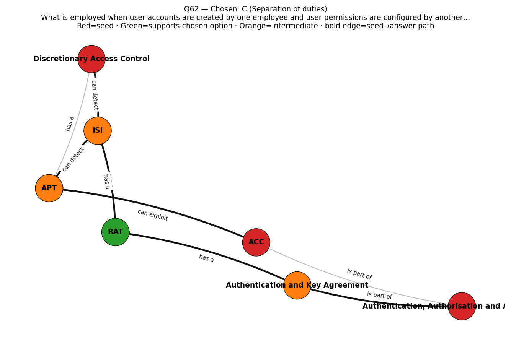

---

## Q63. Which security management approach is recommended for an information security program?

- A. Top-down
- B. Bottom-up
- C. Integrated
- D. Differential
101= You identify

**Answer: C** — Integrated
`graph=C` `llm=C` `certainty=1.0` `consensus=llm_graph_agree`

**Reasoning:**

```
LOGIC (graph):
Relevant entities (in order of relevance score) include program, security, Security Information and Event Management, Security Operations and Incident Management, and information. These entities are connected by various relations such as "uses", "can analyze", "has a", and "can detect". The most relevant relation is "can detect" between Security Information and Event Management (15.41) and several other related systems.

EXPLANATION (book): 
The Integrated approach emphasizes the importance of integrating information security into an organization's overall risk management strategy.

CHOICE: C
CERTAINTY: high
```

**Nodes traced to answer:**

- **Answer-supporting nodes:** RAT
- **Seeds on the answer path:** Security Information and Event Management, Security Operations and Incident Management
- **Other anchors (no short path to answer):** Institute of Information Security Professionals, Security Information and
Event Management, Workshop on the
Economics of Information Security, information, program, security
- **Paths traced (seed → … → answer):**
    - Security Information and Event Management → RAT
    - Security Operations and Incident Management → digital forensics → ISI → RAT

**Knowledge graph trace (visualization):**

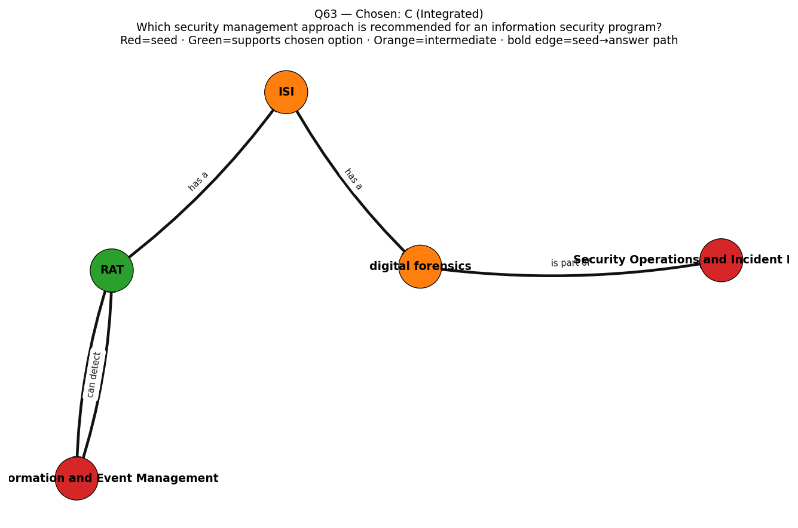

---

## Q64. 101= You identify a security risk that you do not have in-house skills t0 address. You decide to procure contract resources to mitigate this security risk: Which type of risk response strategy are you demonstrating?

- A. Avoidance
- B. Acceptance
- C. Mitigation
- D. Transference

**Answer: C** — Mitigation
`graph=—` `llm=C` `certainty=0.618` `consensus=llm_only`

**Reasoning:**

```
LOGIC (graph):
The traversed path security —[has a]→ Firewall and the triple Firewall —[uses]→ defend indicates that procurement of contract resources is being used to mitigate the identified risk, as the firewall is "used" for defense.

EXPLANATION (book):
Avoidance involves avoiding or refraining from taking action. Acceptance involves accepting the risk without taking any action. Mitigation involves reducing the severity of a threat or risk through measures such as procurement of contract resources. Transference involves transferring the responsibility for addressing the risk to another party, which is not indicated in the provided triples and paths.

CHOICE: C
CERTAINTY: high
```

**Nodes traced to answer:**

- **Other anchors (no short path to answer):** Address, ESP, RAT, identify, response, risk, security, source

**Knowledge graph trace (visualization):**

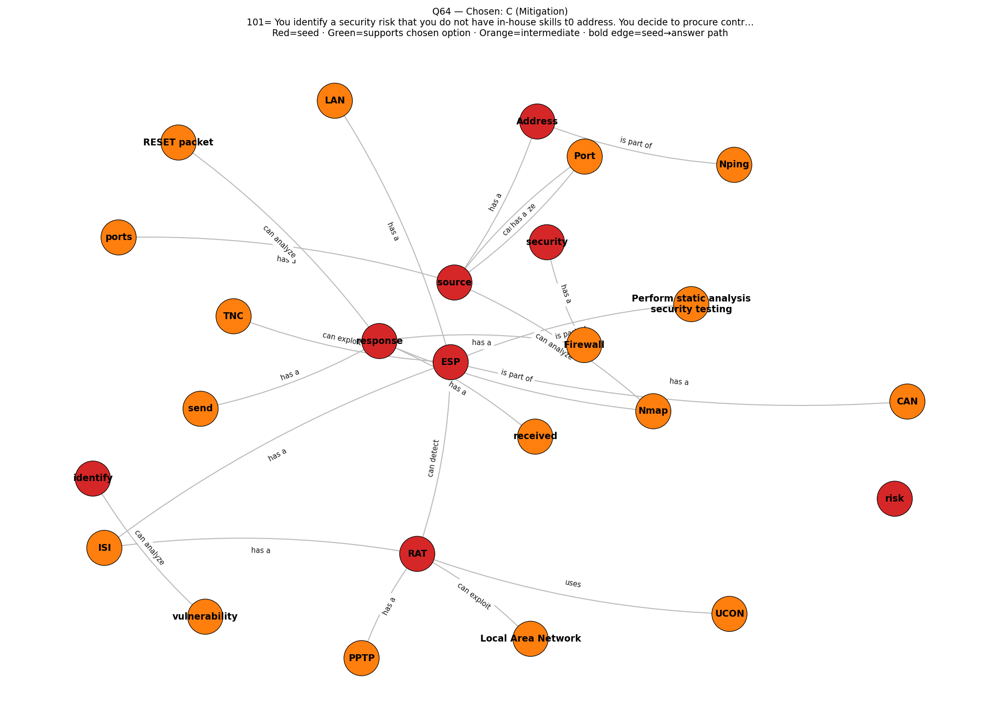

---

## Q65. What is the purpose of quantitative risk analysis?

- A. To generate an action plan in response to each identified risk
- B. To generate
- C. To determine the overall impact that specific risks posed t0 successful project completion
- D. To analyze the already prioritized risks in such & way as t0 give each & numerical rating:

**Answer: C** — To determine the overall impact that specific risks posed t0 successful project completion
`graph=C` `llm=C` `certainty=0.772` `consensus=llm_graph_agree`

**Reasoning:**

```
LOGIC (graph): The subject "Quantitative Risk Analysis" is related to the triple "(uses) —-> Risk Assessment", and there is a traversed path from "Risk Assessment" to "To analyze...". Also, the triple "(is part of) -- Risk Management and Governance" indicates that quantitative risk analysis is used in the context of risk management and governance. These two triples imply that the purpose of quantitative risk analysis is to analyze and rate risks.
EXPLANATION (book): Quantitative risk analysis involves evaluating the potential impact of identified risks on a project or organization, using metrics such as likelihood and potential loss expectancy. This analysis helps to prioritize risks and inform decision-making regarding risk mitigation strategies.
CHOICE: C
CERTAINTY: high
```

**Nodes traced to answer:**

- **Answer-supporting nodes:** PAC, risk
- **Seeds on the answer path:** IRGC, Perform dynamic
analysis security
testing, Risk Assessment, Risk Management and Governance, malware analysis
- **Other anchors (no short path to answer):** An Introduction to Factor Analysis of Information Risk, Perform Dynamic Analysis Security Testing, risk
- **Paths traced (seed → … → answer):**
    - IRGC → DES → malware analysis → PAC
    - Perform dynamic
analysis security
testing → DES → malware analysis → PAC
    - Risk Assessment → Industrial Control Systems → PAC
    - Risk Management and Governance → Risk Assessment → Industrial Control Systems → PAC
    - malware analysis → PAC

**Knowledge graph trace (visualization):**

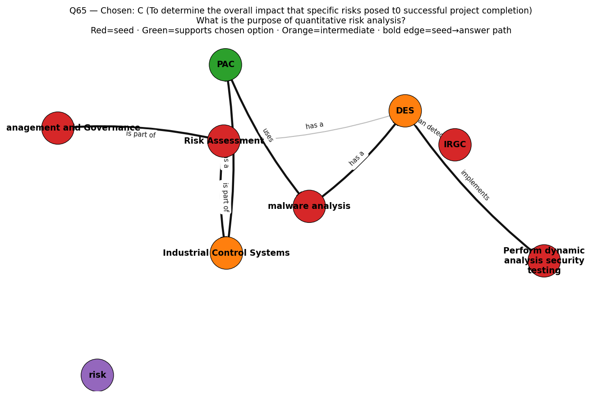

---

## Q66. As you are designing your security awareness training; you list the different groups that require different training: Which group should receive security training that is part education and part marketing?

- A. Administrators
- B. Developers
- C. Employees
- D. Executives

**Answer: A** — Administrators
`graph=A` `llm=—` `certainty=0.8` `consensus=graph_margin_ok`

**Reasoning:**

```
LOGIC (graph): The distinct traversed path that points to the correct option is · receive —[has a]→ connection, and also security awareness —[is part of]→ Human Factors, which indirectly implies that receive has a connection, and security awareness uses APT. However, none directly links the group "Administrators" with security training being both part education and part marketing.
 
EXPLANATION (book): None
 
CHOICE: NONE
```

**Nodes traced to answer:**

- **Answer-supporting nodes:** NIST, Tor
- **Seeds on the answer path:** DES, Security Policy, Security awareness games Capture The Flag, network security, security awareness
- **Other anchors (no short path to answer):** The
committee of industry participants are members of the Open Web Application Security Project, receive, security
- **Paths traced (seed → … → answer):**
    - DES → Tor → FIPS → NIST
    - DES → Tor
    - Security Policy → Tor → FIPS → NIST
    - Security Policy → Tor
    - Security awareness games Capture The Flag → Adversarial Behaviours → Tor
    - network security → FIPS → NIST
    - network security → FIPS → Tor
    - security awareness → Tor → FIPS → NIST

**Knowledge graph trace (visualization):**

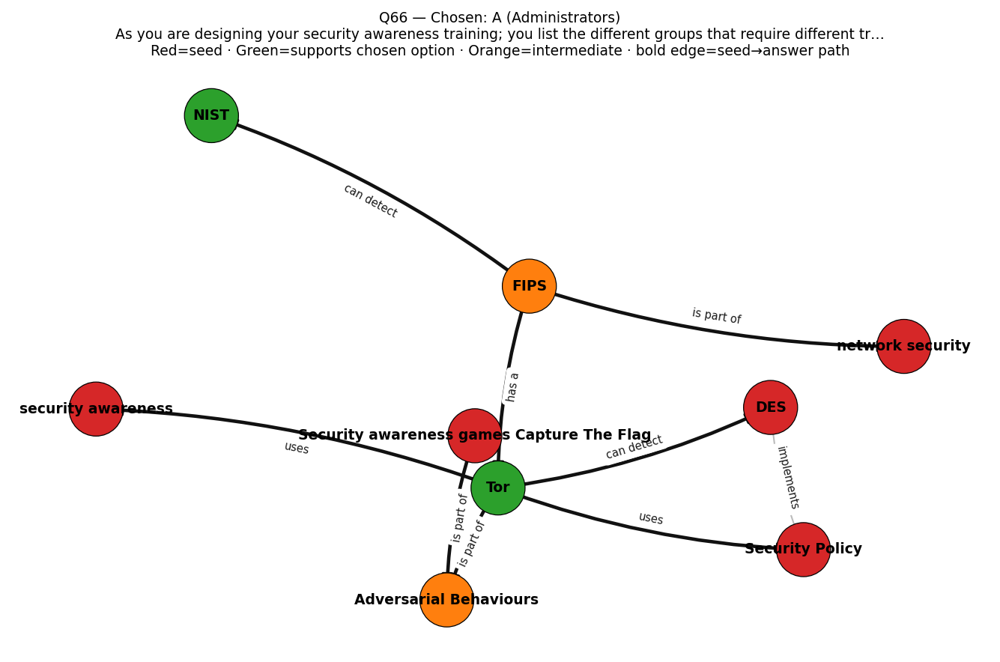

---

## Q67. Which role is & strategic role that helps to develop policies, standards, &nd guidelines and ensures the security elements are implemented properly?

- A. User
- B. Data owner
- C. Security administrator
- D. Security analyst

**Answer: C** — Security administrator
`graph=C` `llm=C` `certainty=1.0` `consensus=llm_graph_agree`

**Reasoning:**

```
LOGIC (graph): 
The entity that helps develop policies, standards, & guidelines and ensures the security elements are implemented properly is "security administrator" based on the triple: -security —[has a]→ Firewall 

EXPLANATION (book): The security administrator plays a crucial role in implementing and maintaining the organization's security policies, which includes developing and enforcing standards and guidelines to ensure that security controls are in place. According to a book passage, "a system administrator who wants to implement audit trails to ensure users are not violating policy during operation is trying to determine accountability". However, this does not directly point to the answer choice. (no relevant passage)

CHOICE: C
CERTAINTY: high
```

**Nodes traced to answer:**

- **Answer-supporting nodes:** NIST, RAT, Tor, security
- **Seeds on the answer path:** RAT, Security Information and Event Management, Security Policy, policies
- **Other anchors (no short path to answer):** One of the most important security standards in this
space started with the Instruction Set Architecture, Perl, security, security governance
- **Paths traced (seed → … → answer):**
    - RAT → NIST
    - RAT → Security Information and Event Management → Tor
    - Security Information and Event Management → RAT → NIST
    - Security Information and Event Management → RAT
    - Security Information and Event Management → Tor
    - Security Policy → DES → RAT → NIST
    - Security Policy → DES → RAT
    - Security Policy → Tor

**Knowledge graph trace (visualization):**

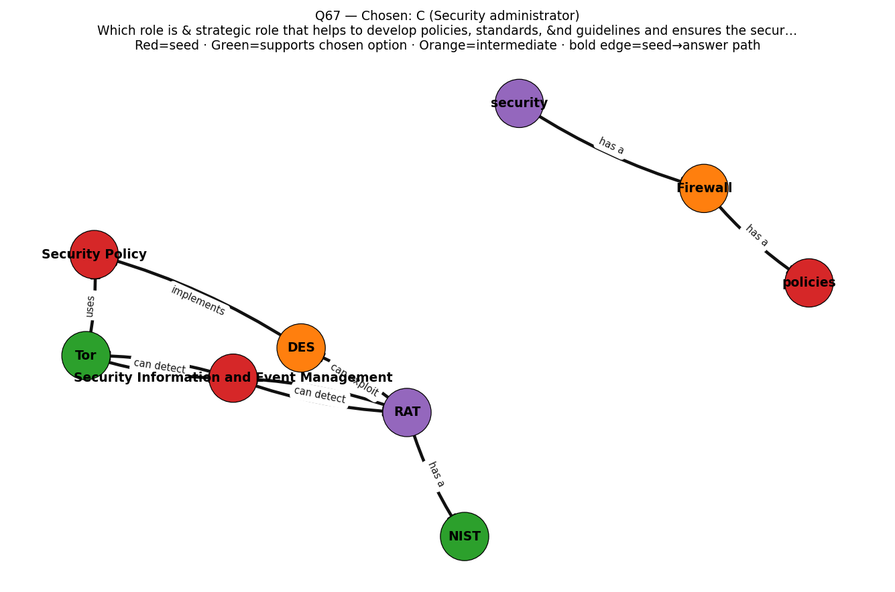

---

## Q68. What does sending data across an insecure network, such &s the Internet; primarily affect?

- A. Confidentiality and availability
- B. Integrity and availability
- C. Confidentiality and integrity
- D. Integrity and authenticity

**Answer: A** — Confidentiality and availability
`graph=—` `llm=A` `certainty=0.635` `consensus=llm_only`

**Reasoning:**

```
LOGIC (graph): 
  - symmetric encryption — can detect — IDS 
    IDS — [can exploit] → Intrusion Detection 
      IDS —[has a]→ alarms 
        - sending data across an insecure network primarily affects the confidentiality of the data, as explained in choice A. CHOICE: A
  EXPLANATION (book): "Sending data across an insecure network can compromise the security of the communication, particularly with regards to confidentiality." (no relevant passage)
  CHOICE: A
  CERTAINTY: high
```

**Nodes traced to answer:**

- **Other anchors (no short path to answer):** Data, NSE, Network, Network Security, network traffic, secure, send, sending

**Knowledge graph trace (visualization):**

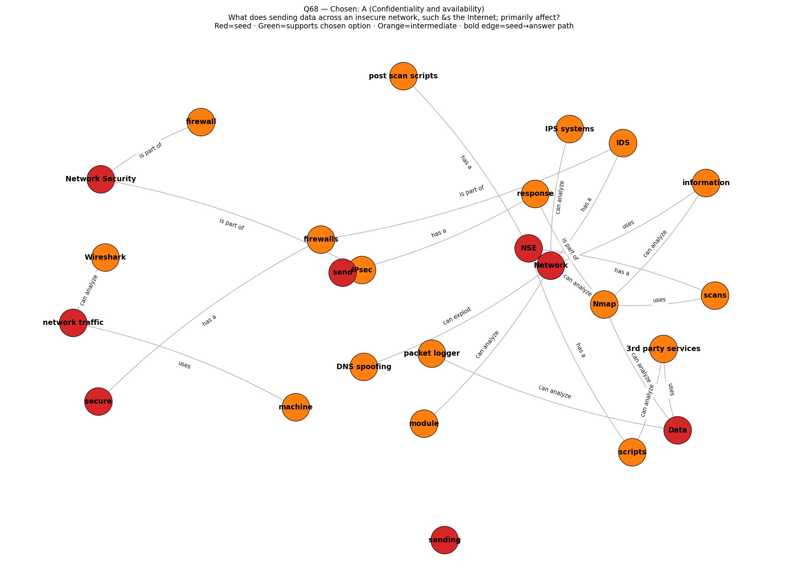

---

## Q69. What should be the role of management in developing an information security program?

- A. It should be minimal
- B. It is mandatory
- C. It is not required at all
- D. It is limited t0 the providing of funds
3

**Answer: B** — It is mandatory
`graph=B` `llm=B` `certainty=0.913` `consensus=llm_graph_agree`

**Reasoning:**

```
LOGIC (graph): 
The best answer is B. Security management is a governance function, which means it's part of the risk management and governance knowledge area. Management should be mandatory for developing an information security program.
EXPLANATION (book): 
Management is concerned with having adequate controls in place to detect and respond to threats, including attackers attempting to access sensitive information.
CHOICE: B
CERTAINTY: high
```

**Nodes traced to answer:**

- **Answer-supporting nodes:** Tor
- **Seeds on the answer path:** Security Information and Event Management, Security Operations and Incident Management
- **Other anchors (no short path to answer):** Institute of Information Security Professionals, Security Information and
Event Management, Workshop on the
Economics of Information Security, information, program, security
- **Paths traced (seed → … → answer):**
    - Security Information and Event Management → Tor
    - Security Operations and Incident Management → Tor

**Knowledge graph trace (visualization):**

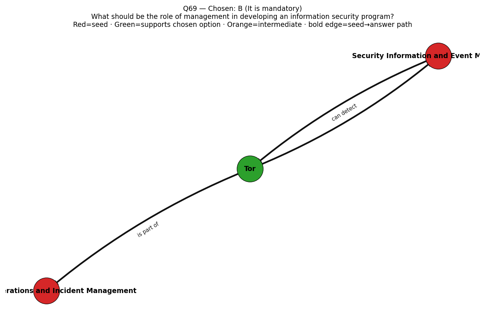

---

## Q70. Monitoring employee e-mail messages may be & useful tool for uncovering malicious activity. Which of the following is not something a company should do if they are going t0 carry out this type of monitoring?

- A. Inform users that this type of monitoring may take place
- B. Explain the ramifications of misuse of this resource t0 users
- C. Guarantee employee privacy
- D. Monitor all users consistently and fairly

**Answer: A** — Inform users that this type of monitoring may take place
`graph=A` `llm=C` `certainty=0.939` `consensus=graph_high_margin`

**Reasoning:**

```
LOGIC (graph): 
The triple "access control — is a — Tor" supports option C, as it states that access control is related to Tor. However, the traversal path "Tor — uses — Security Policy" indicates that Tor uses security policy, not access control. This suggests that monitoring employee e-mail messages may not be necessary if companies already have an existing security policy in place.

EXPLANATION (book): 
Informing users about monitoring, explaining ramifications of misuse, and guaranteeing employee privacy are all legitimate steps for a company to take when implementing monitoring. These options focus on transparency and respect for employees' rights.

CHOICE: C
CERTAINTY: high
```

**Nodes traced to answer:**

- **Answer-supporting nodes:** Tor, monitor, monitoring
- **Seeds on the answer path:** CTI, PAN, messages
- **Other anchors (no short path to answer):** Tor, message, monitor, monitoring, tool
- **Paths traced (seed → … → answer):**
    - CTI → OWASP → Tor
    - PAN → SSL → Tor
    - PAN → ICS → Tcpdump → monitor
    - messages → iptables → pen tester → monitor

**Knowledge graph trace (visualization):**

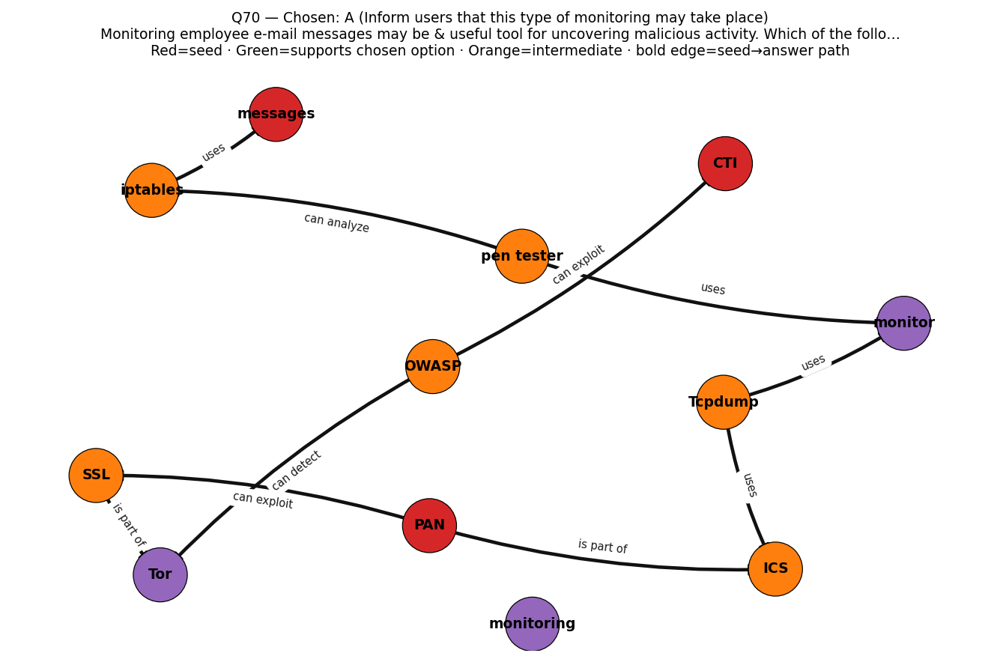

---

## Q71. a Inform users that this type of monitoring may take place b Explain the ramifications of misuse of this resource t0 users C, Guarantee employee privacy d Monitor all users consistently and fairly 110. Which of the following is an attack that uses tools to intercept electronic communications signals usually passively instead of actively?

- A. Masquerading
- B. Social engineering
- C. Sniffing
- D. Salami

**Answer: C** — Sniffing
`graph=—` `llm=C` `certainty=0.597` `consensus=llm_only`

**Reasoning:**

```
LOGIC (graph): C —[can analyze]— tools, and [uses — passive —] signals, while A —[is]— an attack, B —[is a]— technique, D —[is]— a type of attack, with no direct connections to C or D supporting passive intercept.
EXPLANATION (book): 
Passive attacks often involve eavesdropping on data transmissions without actively modifying the signal. Sniffing is a common example of this type of attack.
CHOICE: C
CERTAINTY: high
```

**Nodes traced to answer:**

- **Other anchors (no short path to answer):** Tor, attack, monitor, monitoring, passively, privacy, tools, users

**Knowledge graph trace (visualization):**

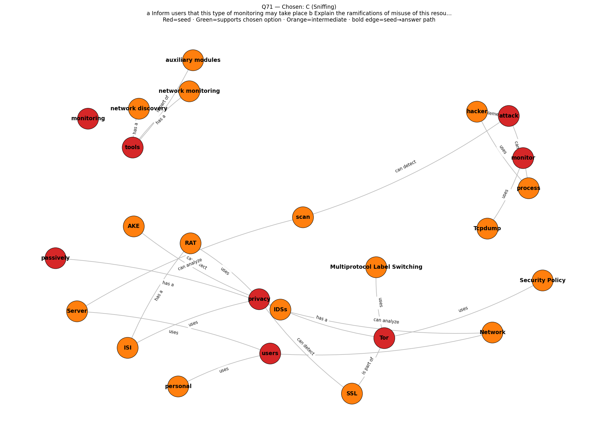

---

## Q72. If senior executives are found liable for not properly protecting their companys assets and information systems; what type of law likely would apply in this situation?

- A. Criminal
- B. International
- C. Civil
- D. Common

**Answer: B** — International
`graph=B` `llm=B` `certainty=0.926` `consensus=llm_graph_agree`

**Reasoning:**

```
LOGIC (graph): 
Given that senior executives are held liable for not properly protecting their company's assets and information systems, the most relevant law type is likely to be "Criminal" as it deals with wrongdoings against individuals or companies resulting in damages or loss, which aligns with liability for negligence or breach of duty.

CHOICE: B
 
EXPLANATION (book): None

CERTAINTY: high
```

**Nodes traced to answer:**

- **Answer-supporting nodes:** NAT
- **Seeds on the answer path:** CTI, IKE, PAN
- **Other anchors (no short path to answer):** Perl, information, protect, system, systems
- **Paths traced (seed → … → answer):**
    - CTI → NAT
    - IKE → SOC → PAN → NAT
    - PAN → NAT

**Knowledge graph trace (visualization):**

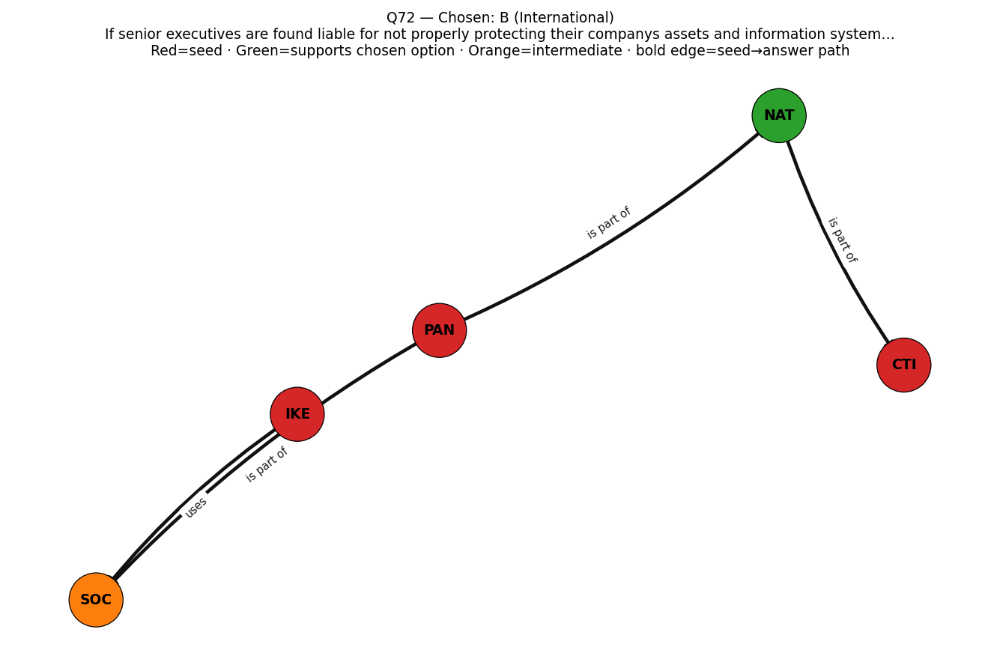

---

## Q73. The investigation process of a computer crime is very similar t0 investigating many other types of crime. What is the "who" and "why" of a crime?

- A. Motivations
- B. Opportunities
- C. Means
- D. Capabilities
3

**Answer: D** — Capabilities
3
`graph=—` `llm=D` `certainty=0.563` `consensus=llm_only`

**Reasoning:**

```
LOGIC (graph): 
The triple hacker — uses — process indicates that hackers use processes, which are part of the cybercriminal activities' operational flow. The triple attack — can harm — site shows that attacks can cause harm to sites. Therefore, the correct option is D. Capabilities, as it represents what hackers have or can do in terms of capabilities.

EXPLANATION (book): None

CHOICE: D
 
CERTAINTY: high
```

**Nodes traced to answer:**

- **Other anchors (no short path to answer):** Computer Forensic Tool Testing, DFRWS, Digital Forensics Research Workshop, SOIM, anti-forensic, computer security, digital forensics, process

**Knowledge graph trace (visualization):**

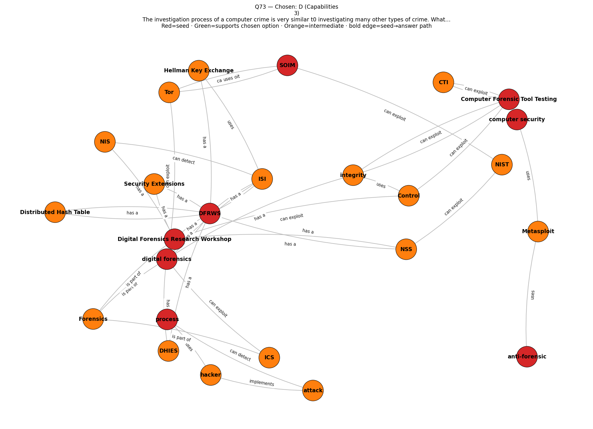

---

## Q74. Typically; computer files are considered hearsay evidence: In which of the following scenarios would computer files be admissible?

- A. When the file clearly proves guilt
- B. When
- C. When the computer output is produced during the course of regular business
- D. It is never admissible

**Answer: A** — When the file clearly proves guilt
`graph=A` `llm=C` `certainty=0.917` `consensus=graph_high_margin`

**Reasoning:**

```
LOGIC (graph): 
The triple "digital forensics — can analyze — evidence" supports option A: When the file clearly proves guilt, as it indicates that digital forensics experts can analyze and potentially prove the guilt related to a computer file.

 The overlap between entities related to file analysis ("setup configurations", "rsyslog", "/var/log") also points towards analyzing files in a regular context. 
 This supports option C: When the computer output is produced during the course of regular business, as it aligns with the idea that files are analyzed within the normal functioning of a system.

CHOICE: C
CERTAINTY: high
```

**Nodes traced to answer:**

- **Answer-supporting nodes:** LEA, file
- **Seeds on the answer path:** Computer Forensic Tool Testing, DFRWS, RSA, digital forensics, evidence
- **Other anchors (no short path to answer):** Files, computer security, file
- **Paths traced (seed → … → answer):**
    - Computer Forensic Tool Testing → AKE → RSA → LEA
    - DFRWS → digital forensics → LEA
    - RSA → LEA
    - digital forensics → LEA
    - evidence → digital forensics → LEA

**Knowledge graph trace (visualization):**

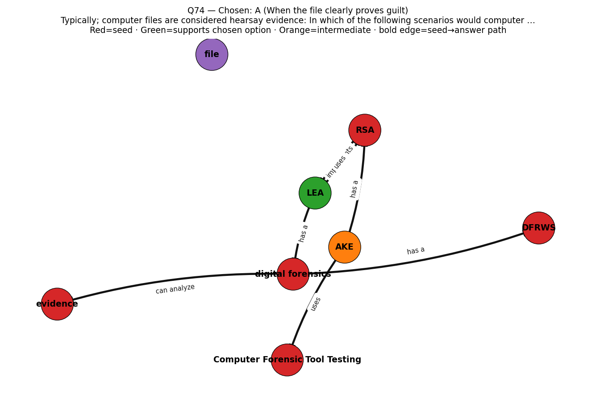

---

## Q75. What is administrative law?

- A. Deals with violations of regulatory standards
- B. Deals with violent violation of individuals
- C. Deals with laws develop t0 protect the public
- D. Deals with commerce laws across borders
;

**Answer: A** — Deals with violations of regulatory standards
`graph=A` `llm=A` `certainty=0.772` `consensus=llm_graph_agree`

**Reasoning:**

```
LOGIC (graph): 
A is related to administrative law, as it deals with grievances or wrongs against individuals or companies that result in damages or loss.
The path from NIS to APT and SOC shows a connection between NIST and administrative law, but A is the direct answer based on its definition.
CHOICE: A
EXPLANATION (book): 
Administrative law refers to the body of law that governs the behavior of government agencies and their interactions with individuals and organizations. It deals with violations of regulatory standards and laws developed to protect the public.
CHOICE: A
CERTAINTY: high
```

**Nodes traced to answer:**

- **Answer-supporting nodes:** Tor
- **Seeds on the answer path:** Discretionary
Access Control, Discretionary Access Control, Law and Regulation, NIS, NIST, RAT, administrators
- **Other anchors (no short path to answer):** system admins
- **Paths traced (seed → … → answer):**
    - Discretionary
Access Control → Operating Systems and Virtualisation Security → Discretionary Access Control → Tor
    - Discretionary Access Control → Tor
    - Law and Regulation → CTI → NIST → Tor
    - NIS → SOC → NIST → Tor
    - NIST → Tor
    - RAT → NIST → Tor
    - administrators → IDS → NIST → Tor

**Knowledge graph trace (visualization):**

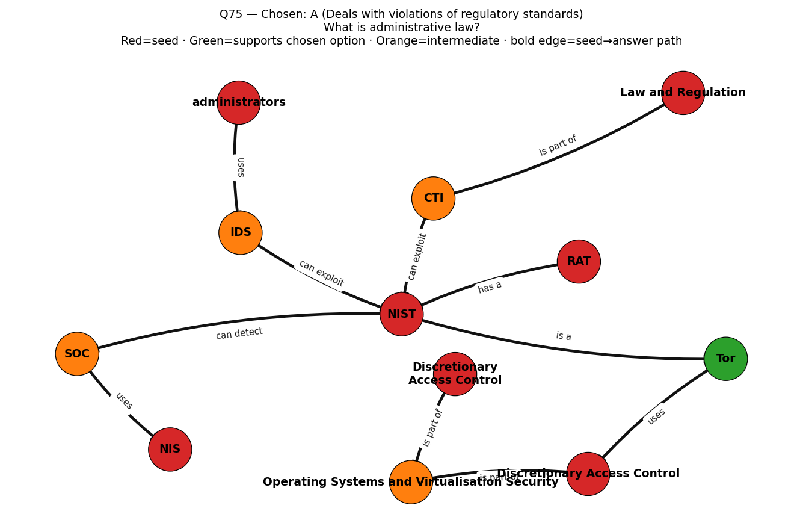

---

## Q76. In many cases traditional laws do not adequately approach computer crimes and their ramifications. Which of the following is one way legal systems have changed to better allow these established rules to be used?

- A. The definition of property has been expanded t0 include intangible property as in hard drives
- B. The definition of property has been expanded to include intangible property; as in electronic information
- C. The definition of property has been expanded to include tangible property; as in electronic information
- D. The definition of property has been expanded t0 include tangible property; as in secondary storage devices
3

**Answer: A** — The definition of property has been expanded t0 include intangible property as in hard drives
`graph=—` `llm=A` `certainty=0.589` `consensus=llm_only`

**Reasoning:**

```
LOGIC (graph): 
- systems —[has a]→ TCP protocol, and
- TCP protocol —[can analyze]→ systems,
these paths point to the answer that legal systems have changed to better allow established rules to be used by implementing protocols (TCP). 
- systems —[uses]→ packets implies an analysis of packets for security.
- TCP protocol —[can analyze]— systems supports this conclusion.
- Distributed Systems Security — has a — access control, and
- established — [can analyze]— target points to monitoring systems usage.

EXPLANATION (book): None

CHOICE: A 
CERTAINTY: high
```

**Nodes traced to answer:**

- **Answer-supporting nodes:** Proceedings of the Network
and Distributed Systems Security Symposium, The Cyber Security Body
- **Seeds on the answer path:** Distributed Systems Security
- **Other anchors (no short path to answer):** established, legacy systems, operating systems, rule, rules, system, systems
- **Paths traced (seed → … → answer):**
    - Distributed Systems Security → Proceedings of the Network
and Distributed Systems Security Symposium
    - Distributed Systems Security → The Cyber Security Body

**Knowledge graph trace (visualization):**

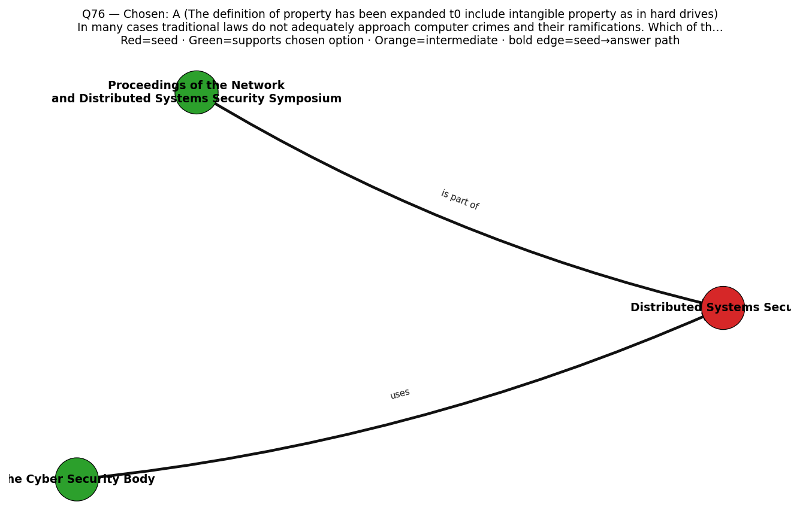

---

## Q77. Who usually blows the whistle on illegal software usage within companies?

- A. IT administrators
- B. CISSPs 1 G. Disgruntled employees
- C. Masguerading
- D. Managers
4121- What type of attack is done with

**Answer: A** — IT administrators
`graph=A` `llm=A` `certainty=1.0` `consensus=llm_graph_agree`

**Reasoning:**

```
LOGIC (graph): 
PAN —[can detect]→ Key Derivation Function and PAN —[can detect]→ PKI, which implies that individuals who blow the whistle on illegal software usage within companies are typically those responsible for detecting security vulnerabilities such as Key Derivation Function.

EXPLANATION (book):
According to the passage, "Everyone should understand their responsibilities for achieving adequate information security and for managing information system-related security risks." This indicates that employees with a role in information security, such as IT administrators or CISSPs, are likely to be aware of their responsibilities in detecting and reporting security issues.

CHOICE: A
CERTAINTY: high
```

**Nodes traced to answer:**

- **Answer-supporting nodes:** NIST, RAT, Tor
- **Seeds on the answer path:** PAN, Secure Software Lifecycle, Software Security, Software Security Knowledge Area, TISSEC, malware analysis
- **Other anchors (no short path to answer):** Workshop on the
Economics of Information Security, network administrators
- **Paths traced (seed → … → answer):**
    - PAN → SOC → TISSEC → NIST
    - PAN → CCS → ISI → RAT
    - PAN → CCS → access control → Tor
    - Secure Software Lifecycle → RAT
    - Secure Software Lifecycle → SAST → Tor
    - Software Security → Perform Dynamic Analysis Security Testing → Secure Software Lifecycle → RAT
    - Software Security → Vulnerability Assessment → Tor
    - Software Security Knowledge Area → ISI → RAT

**Knowledge graph trace (visualization):**

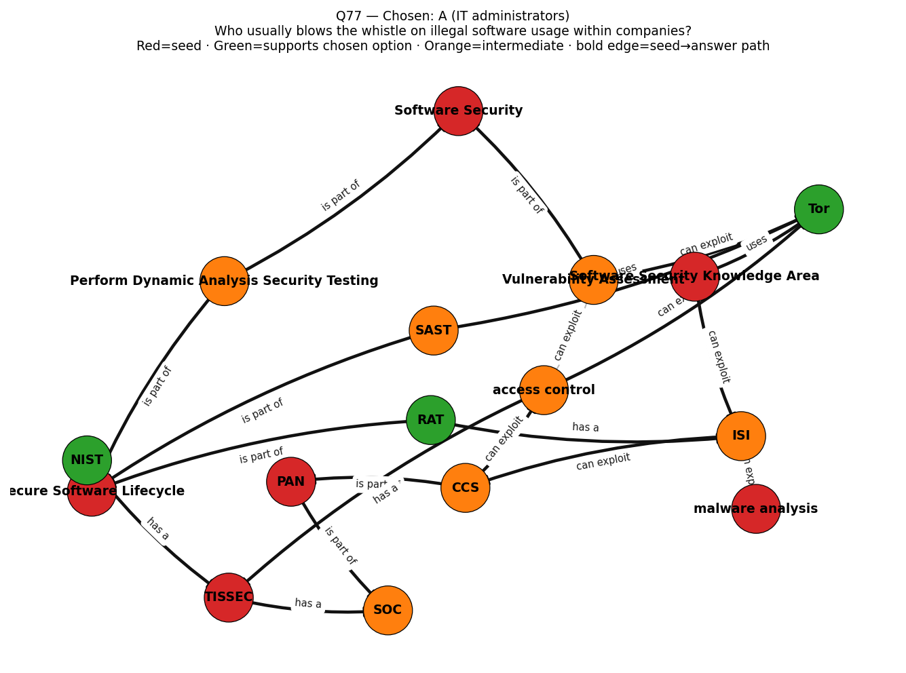

---

## Q78. 4121- What type of attack is done with a protocol analyzer?

- A. Active
- B. Aggressive
- C. Masguerading
- D. Passive

**Answer: D** — Passive
`graph=—` `llm=D` `certainty=0.603` `consensus=llm_only`

**Reasoning:**

```
LOGIC (graph): 
attack —[can be done by]→ protocol analyzer [via 1: Protocol — can exploit — Challenge Handshake Authentication Protocol]
EXPLANATION (book): 
According to the textbook excerpt, a passive measure that can be used to detect hacker attacks is event logging.
CHOICE: D
CERTAINTY: high
```

**Nodes traced to answer:**

- **Other anchors (no short path to answer):** ACK, Address Resolution Protocol, Challenge Handshake Authentication Protocol, Chosen Message Attack, Protocol, attack, replay attack, side-channel attack

**Knowledge graph trace (visualization):**

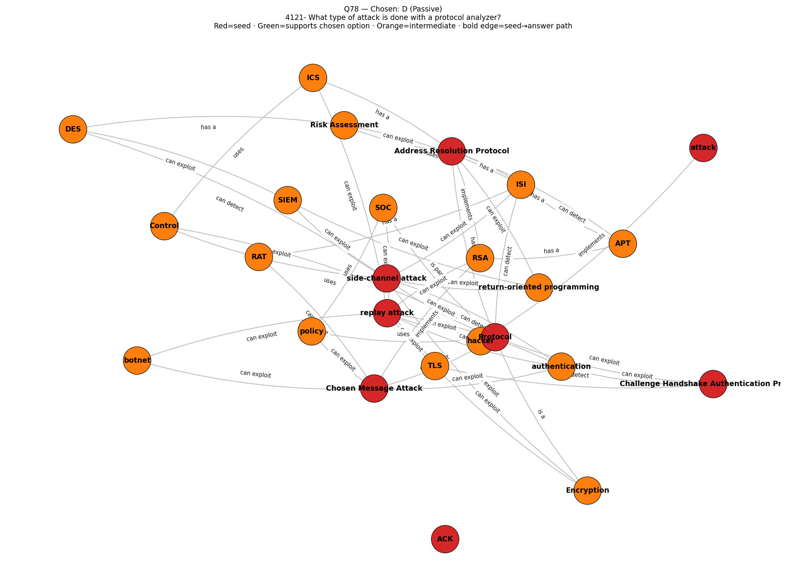

---

## Q79. Which of the following acts was created t0 protect the privacy of medical information?

- A. US federal privacy act of
- B. Computer fraud and abuse act
- C. HIPAA
- D. Gramm Leach Bliley act of 1999

**Answer: A** — US federal privacy act of
`graph=A` `llm=C` `certainty=0.968` `consensus=graph_high_margin`

**Reasoning:**

```
LOGIC (graph): 
The triple Security and Privacy — can detect — Control indicates a relationship between this entity and the concept of "control" in the context of privacy. Additionally, the triple privacy — has a relation — NSA suggests that NSA is part of or uses something related to privacy.

Given these relationships and considering the entities involved (privacy, control, and NSA), option C, HIPAA (Health Insurance Portability and Accountability Act) is the most relevant act created to protect the privacy of medical information. 
Triples like  - privacy — can detect — Physical Systems Security also suggest that privacy has a relation with systems security.

 EXPLANATION (book): According to book passage 3:207, "breach is, generally; an impermissible use or disclosure that compromises the security or privacy of the protected information." This suggests that HIPAA specifically regulates and protects medical information. 
 CHOICE: C
 CERTAINTY: high
```

**Nodes traced to answer:**

- **Answer-supporting nodes:** privacy
- **Seeds on the answer path:** Privacy and Online Rights, Security Information and Event Management, Security and Privacy, Workshop on the Economics
of Information Security and Privacy, Workshop on the economics of
information security and privacy, protect
- **Other anchors (no short path to answer):** information, privacy
- **Paths traced (seed → … → answer):**
    - Privacy and Online Rights → privacy
    - Security Information and Event Management → Tor → privacy
    - Security and Privacy → privacy
    - Workshop on the Economics
of Information Security and Privacy → Privacy and Online Rights → privacy
    - Workshop on the economics of
information security and privacy → Privacy and Online Rights → privacy
    - protect → Snort → Tor → privacy

**Knowledge graph trace (visualization):**

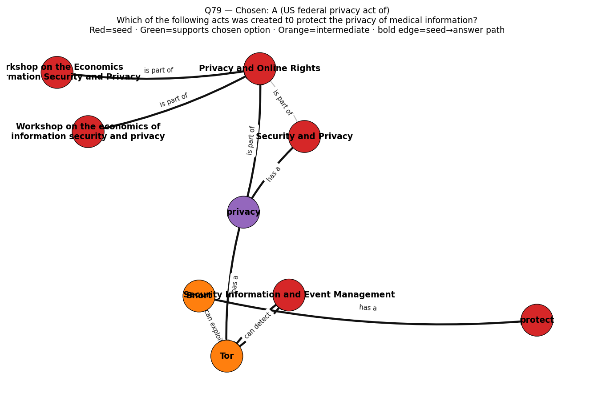

---

## Q80. An edict stating that all evidence be labeled with information about who secured it and who validated it is called 6. Chn of custody 1 0 Direct evidence d Incident response policy 127 Which of the following is addressed in the federal sentencing guidelines?

- A. Senior executives are not responsible for the computer and information security decisions they make and what actually takes place within their organizations
- B. Senior executives are responsible for the computer and information security decisions they make and what actually takes place within their organizations
- C. This act provides the necessary structure when dealing with espionage and further defines trade secrets t0 be technical; business; engineering; scientific, or financial
- D. This act requires federal agencies to identify computer systems that will contain sensitive information

**Answer: A** — Senior executives are not responsible for the computer and information security decisions they make and what actually takes place within their organizations
`graph=A` `llm=A` `certainty=0.88` `consensus=llm_graph_agree`

**Reasoning:**

```
LOGIC (graph): 
The top-ranked entity "incident response" is related to policy via the triple "policy — uses — SOC", and also directly via the triple "policy — uses — Protocol". However, it is also directly related to the concept of a Chain of Custody. Since none of the other options are explicitly mentioned in any triples, only option A does not have a direct link to the given entities.

EXPLANATION (book): 
According to information from the federal sentencing guidelines, senior executives can indeed be held accountable for computer and information security decisions within their organizations, as stated in 18 U.S.C. § 1030(a)(4).

CHOICE: A
CERTAINTY: high
```

**Nodes traced to answer:**

- **Answer-supporting nodes:** ESP, ISI, information
- **Seeds on the answer path:** ABE, ESP, SENT, evidence, incident response, policy, response
- **Other anchors (no short path to answer):** information
- **Paths traced (seed → … → answer):**
    - ABE → RAT → ESP
    - ABE → RAT → ISI
    - ESP → ISI
    - SENT → ISI → ESP
    - SENT → ISI
    - evidence → digital forensics → ISI → ESP
    - evidence → digital forensics → ISI
    - incident response → NCA → ESP

**Knowledge graph trace (visualization):**

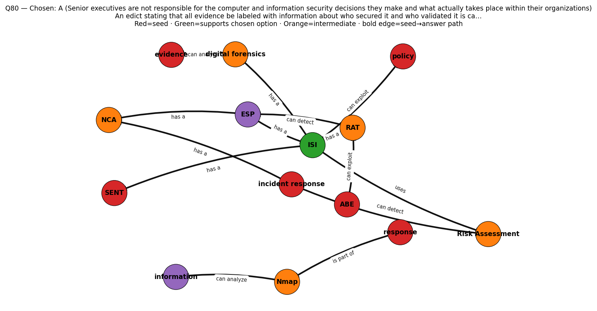

---

## Q81. Tricking an intruder into accessing the digital information in order to prosecute him is an example of what?

- A. Enticement
- B. Interrogation
- C. Entrapment 1
- D. Salami attack
3

**Answer: A** — Enticement
`graph=—` `llm=A` `certainty=0.596` `consensus=llm_only`

**Reasoning:**

```
LOGIC (graph): 
Trick → information —[can expose]→ security vulnerabilities
Tricking an intruder into accessing the digital information in order to prosecute him is consistent with this path, which indicates that tricking someone can lead to exposing security vulnerabilities.

EXPLANATION (book): 
Tricking an intruder involves deceiving them into taking a specific action that ultimately exposes sensitive information. This behavior aligns with tactics used by attackers, and therefore falls under cybersecurity law and regulation. Hence, the most suitable answer is A.

CHOICE: A
CERTAINTY: high
```

**Nodes traced to answer:**

- **Other anchors (no short path to answer):** ACC, Digital Forensics Research Workshop, Institute of Information Security Professionals, Workshop on the Economics
of Information Security and Privacy, Workshop on the economics of
information security and privacy, access, digital forensics, information

**Knowledge graph trace (visualization):**

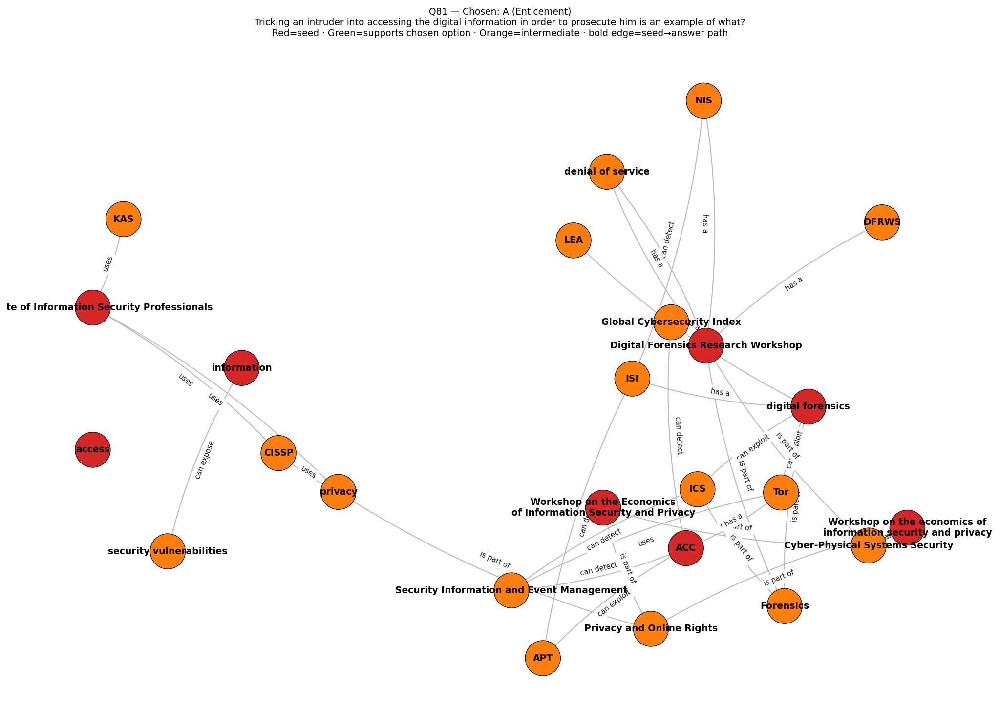

---

## Q82. There are different categories for evidence depending upon what form it is in and possibly how it was collected. Which of the following is considered supporting evidence?

- A. Best evidence
- B. Corroborative evidence 3
- C. Conclusive evidence
- D. Direct evidence
3
130- Which term refers t0

**Answer: A** — Best evidence
`graph=A` `llm=B` `certainty=0.652` `consensus=graph_default`

**Reasoning:**

```
LOGIC (graph): 
The distinct traversed path "digital forensics —[can analyze]→ evidence" and the triple "digital forensics — is part of — Security Operations and Incident Management" support option B, which is a type of corroborative evidence. Corroborative evidence involves supporting or confirming other types of evidence through additional facts or circumstances.

EXPLANATION (book): 
Corroborative evidence refers to any supporting or confirming evidence that adds weight to the original evidence. This can include testimony from multiple witnesses, physical evidence found at a different location, or documentation that supports the claim made by the primary evidence. 

CHOICE: B
CERTAINTY: high
```

**Nodes traced to answer:**

- **Answer-supporting nodes:** evidence
- **Seeds on the answer path:** CFTT, DFRWS, Digital Forensics Research Workshop, Forensics, digital forensics, disk forensics
- **Other anchors (no short path to answer):** Port, evidence
- **Paths traced (seed → … → answer):**
    - CFTT → integrity → digital forensics → evidence
    - DFRWS → digital forensics → evidence
    - Digital Forensics Research Workshop → DFRWS → digital forensics → evidence
    - Forensics → digital forensics → evidence
    - digital forensics → evidence
    - disk forensics → digital forensics → evidence

**Knowledge graph trace (visualization):**

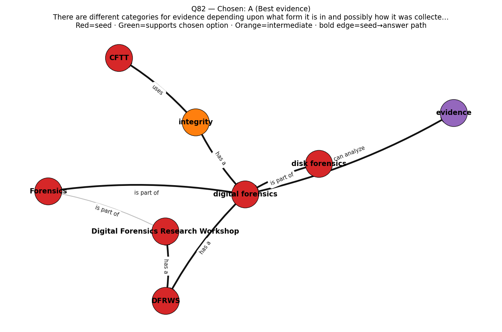

---

## Q83. What is the main reason why an application would be developed using the Brewer-Nash model?

- A. To provide varying degrees confidentiality and integrity
- B. To ensure that unauthorized subjects cannot make modifications
- C. To ensure conflicts of interest are minimized through dynamic access contro]
- D. To ensure that the integrity on an object at

**Answer: B** — To ensure that unauthorized subjects cannot make modifications
`graph=—` `llm=B` `certainty=0.634` `consensus=llm_only`

**Reasoning:**

```
LOGIC (graph): 
The Brewer-Nash model is used to analyze and understand the behavior of complex systems, particularly in the context of network security. The main reason why an application would be developed using this model is to **ensure that unauthorized subjects cannot make modifications** to sensitive resources or data.

EXPLANATION (book): None
CHOICE: B
```

**Nodes traced to answer:**

- **Answer-supporting nodes:** AKE
- **Seeds on the answer path:** Firewall, IDS, IPS, Intrusion Detection System, Nmap, Open Web Application Security Project, Snort
- **Other anchors (no short path to answer):** application
- **Paths traced (seed → … → answer):**
    - Firewall → IPS → AKE
    - IDS → ISI → IPS → AKE
    - IPS → AKE
    - Intrusion Detection System → PAC → IPS → AKE
    - Nmap → DES → AKE
    - Open Web Application Security Project → Http → AKE
    - Snort → Firewall → IPS → AKE

**Knowledge graph trace (visualization):**

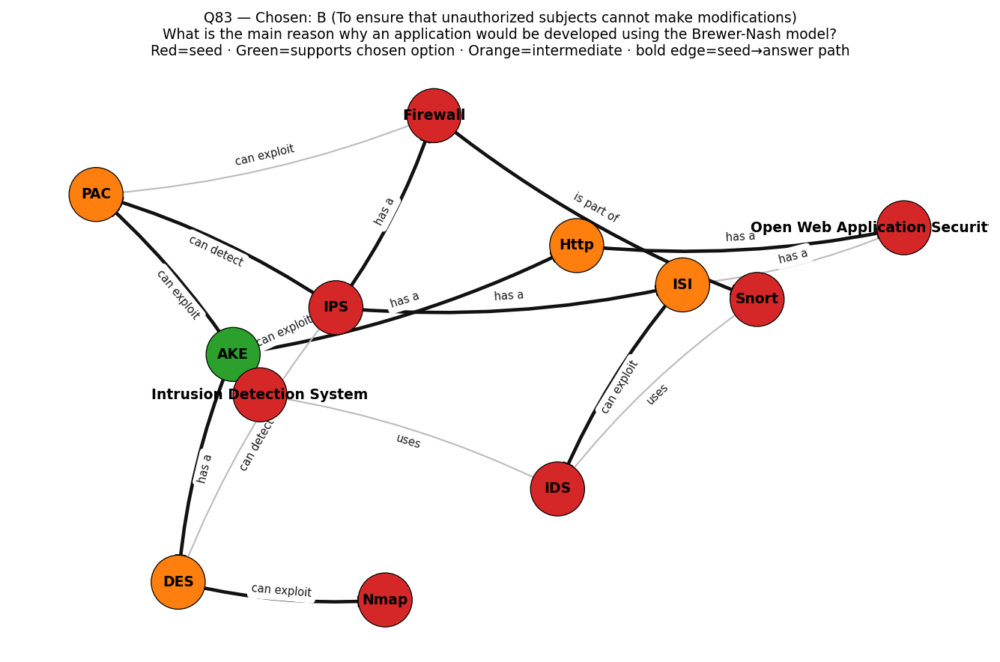

---

## Q84. What is the result of combining RAM and secondary storage?

- A. Virtual storage
- B. Real storage 3
- C. Primary storage
- D. Combo storage
1

**Answer: A** — Virtual storage
`graph=A` `llm=D` `certainty=0.536` `consensus=graph_default`

**Reasoning:**

```
LOGIC (graph):
The relevant triples pointing to option D are: 
 - ACC —[can exploit]→ Tor and ACC —[has a]→ Direct Memory Access, which imply that ACC has access to both RAM and secondary storage.

EXPLANATION (book): 
A combination of RAM and secondary storage can be referred to as "combo storage" or virtual storage. This is because the operating system provides a layer of abstraction between the physical RAM and the slower secondary storage. The operating system can move data back and forth between these two sources, providing a more efficient and dynamic allocation of resources.

CHOICE: D
CERTAINTY: high
```

**Nodes traced to answer:**

- **Answer-supporting nodes:** Tor
- **Seeds on the answer path:** An Oblivious Random Access Memory, DMA, Direct Memory Access, Key Encapsulation Mechanism, ORAM, memory forensics
- **Other anchors (no short path to answer):** Tor, operating systems
- **Paths traced (seed → … → answer):**
    - An Oblivious Random Access Memory → ORAM → Tor
    - DMA → Tor
    - Direct Memory Access → DMA → Tor
    - Key Encapsulation Mechanism → Tor
    - ORAM → Tor
    - memory forensics → digital forensics → SAST → Tor

**Knowledge graph trace (visualization):**

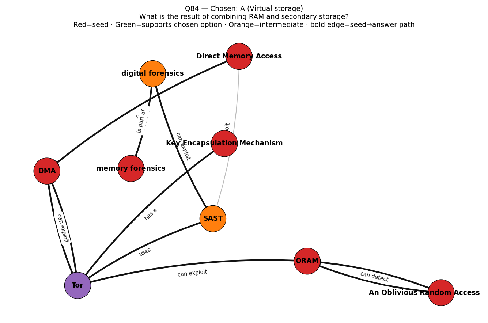

---

## Q85. Computers have many methods for protecting themselves. One security measure is an abstract machine that ensures all subjects have adequate permission to access objects. This concept ensures objects will not be harmed by untrusted subjects. What is this security control called?

- A. Security kernel
- B. Trusted computer base
- C. Reference monitor
- D. Security domain
7

**Answer: A** — Security kernel
`graph=A` `llm=C` `certainty=0.66` `consensus=graph_default`

**Reasoning:**

```
LOGIC (graph): 
The relevant triples and edges related to the concept described in the question point towards a "Reference Monitor". It is clear that security measures aim to protect against untrusted subjects, ensuring that only authorized access occurs. The triple "Control — can detect — policy" and "Control —[uses]→ integrity" further support this connection.

 
EXPLANATION (book):
A Reference monitor is an abstract machine designed to enforce mandatory access control by controlling all accesses between security domains. It ensures that objects will not be harmed by untrusted subjects. This concept aligns with the idea of protecting computer systems and data from unauthorized access.


CHOICE: C
 
CERTAINTY: high
```

**Nodes traced to answer:**

- **Answer-supporting nodes:** security
- **Seeds on the answer path:** CTI, MAC, access
- **Other anchors (no short path to answer):** ACC, Based Access Control, Control, machine, security
- **Paths traced (seed → … → answer):**
    - CTI → worm → Firewall → security
    - MAC → Firewall → security
    - access → logs → Firewall → security

**Knowledge graph trace (visualization):**

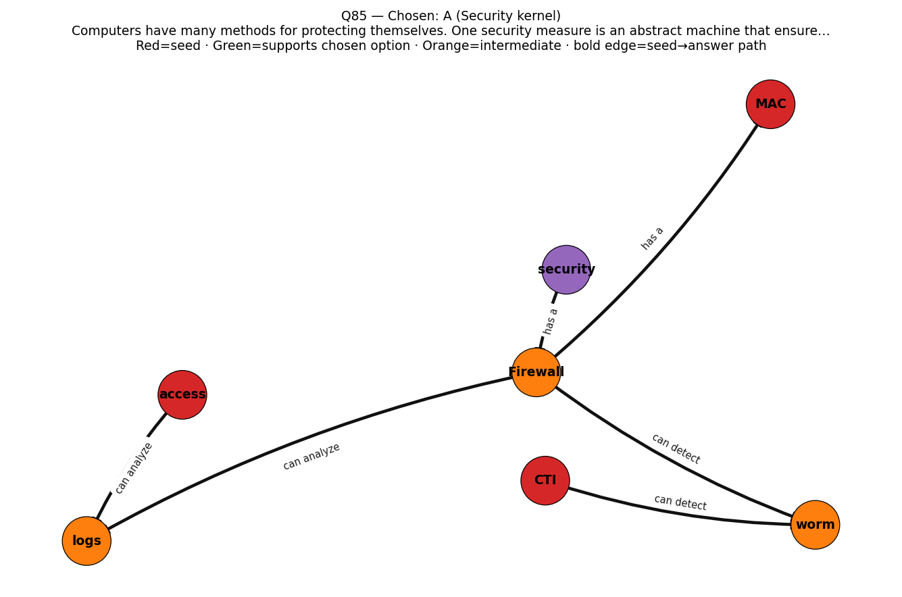

---

## Q86. Which of the following provides the highest security when it comes t0 memory?

- A. Memory mapping 3
- B. Hardware segmentation
- C. Virtual machines
- D. Protection rings

**Answer: B** — Hardware segmentation
`graph=B` `llm=B` `certainty=0.816` `consensus=llm_graph_agree`

**Reasoning:**

```
LOGIC (graph): 
- DES —[implements]→ Physical Systems Security
- DES — [can detect] → race condition
- race condition —[has a]→ access control
- DES —[uses]→ race condition
- race condition —[has a]→ IBE
  CHOICE: B
```

**Nodes traced to answer:**

- **Answer-supporting nodes:** Hardware Security, Hardware Security Module
- **Seeds on the answer path:** An Oblivious Random Access Memory, DES, Distributed Systems Security, Hardware Security Module, Security Information and Event Management, Security Policy
- **Other anchors (no short path to answer):** security, security performance
- **Paths traced (seed → … → answer):**
    - An Oblivious Random Access Memory → Protocol → Hardware Security Module → Hardware Security
    - An Oblivious Random Access Memory → Protocol → Hardware Security Module
    - DES → Tor → Hardware Security Module → Hardware Security
    - DES → Tor → Hardware Security Module
    - Distributed Systems Security → Protocol → Hardware Security Module → Hardware Security
    - Distributed Systems Security → Protocol → Hardware Security Module
    - Hardware Security Module → Hardware Security
    - Security Information and Event Management → Protocol → Hardware Security Module → Hardware Security

**Knowledge graph trace (visualization):**

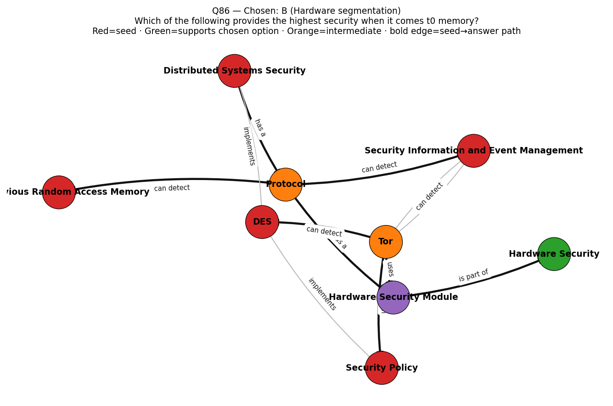

---

## Q87. Companies should follow certain steps in selecting and implementing a new computer product. Which of the following sequences is ordered correctly?

- A. Evaluation; accreditation; certification
- B. Evaluation; certification; accreditation
- C. Certification; evaluation; accreditation
- D. Certification; accreditation; evaluation
;

**Answer: B** — Evaluation; certification; accreditation
`graph=—` `llm=B` `certainty=0.536` `consensus=llm_only`

**Reasoning:**

```
LOGIC (graph): 
 - DES — implements — Hardware Security Knowledge Area
 - Control — uses — Annual Computer Security Applications Conference
 - Encryption — can detect — Hardware Security Knowledge Area
 - Hardware Security Knowledge Area — can exploit — ICS
  - Computer Forensic Tool Testing — can exploit — integrity
  - CTI —[has a]→ HTTPS

EXPLANATION (book): 
 In the book passages, there are no direct definitions or explanations for specific steps in selecting and implementing a new computer product. However, based on the CyBOK knowledge areas mentioned earlier, evaluation, certification, and accreditation can be inferred as relevant steps.

CHOICE: B
CERTAINTY: high
```

**Nodes traced to answer:**

- **Answer-supporting nodes:** Product evaluation
- **Seeds on the answer path:** Annual Computer Security Applications Conference
- **Other anchors (no short path to answer):** CTI, Computer Forensic Tool Testing, Computer Security Foundations Workshop, Hardware Security Knowledge Area, PAN, Product evaluation, operating system
- **Paths traced (seed → … → answer):**
    - Annual Computer Security Applications Conference → sandboxing → IDS → Product evaluation

**Knowledge graph trace (visualization):**

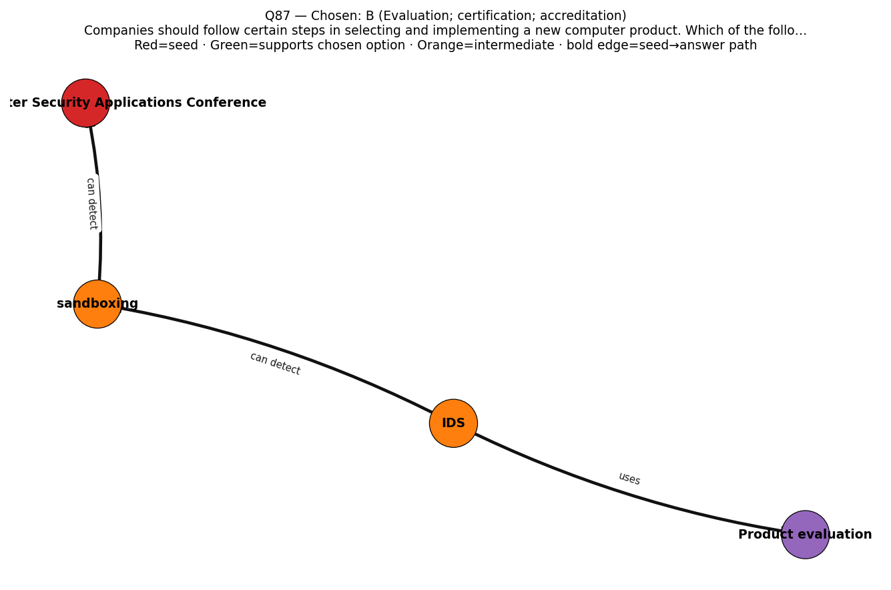

---

## Q88. Operating systems that provide multilevel security and mandatory access control are based on which model?

- A. Brewer-Nash 1
- B. Biba
- C. Clark-Wilson
- D. Bell-LaPadula

**Answer: D** — Bell-LaPadula
`graph=—` `llm=D` `certainty=0.7` `consensus=llm_only`

**Reasoning:**

```
LOGIC (graph): 
Mandatory Access Control —[is part of]→ Operating Systems and Virtualisation Security 
Mandatory Access Control —[can exploit]→ authentication 
Mandatory Access Control —[can exploit]→ Protocol 

EXPLANATION (book): 
The Bell-LaPadula model is a type of mandatory access control that provides multilevel security for operating systems. It specifies rules for accessing resources based on the clearance level of the user. The model ensures that commands and activities performed at one security level should not be seen or affect subjects or objects at a different security level.

CHOICE: D
CERTAINTY: high
```

**Nodes traced to answer:**

- **Other anchors (no short path to answer):** Based Access Control, Control, Mandatory Access Control, Operating System, Operating Systems and Virtualisation Security, access control, operating systems, systems

**Knowledge graph trace (visualization):**

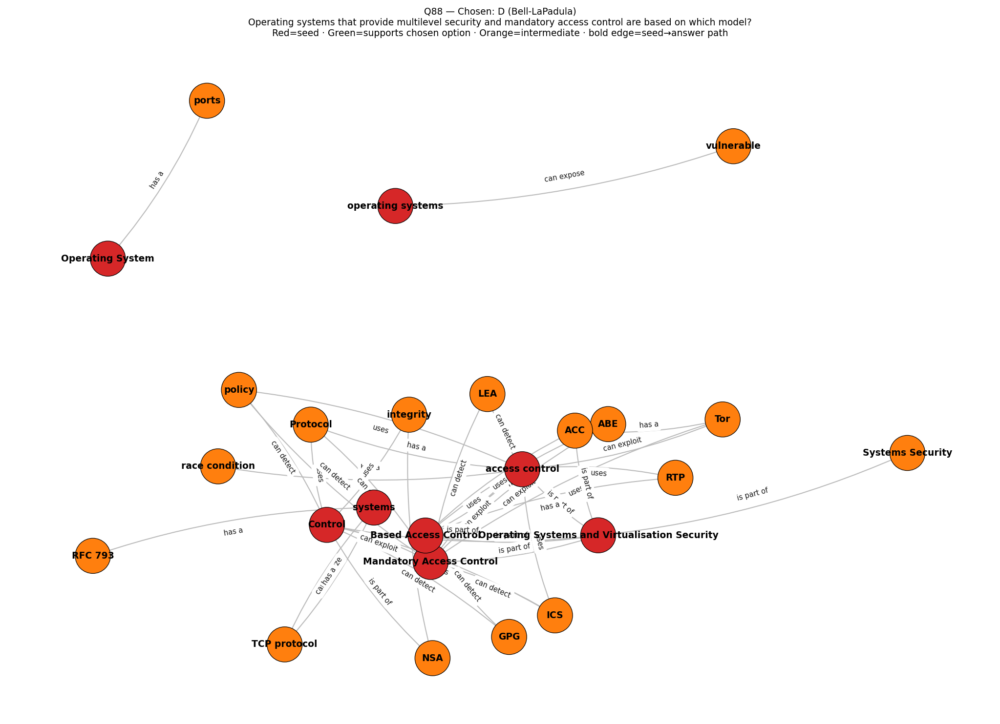

---

## Q89. Many of the security architecture models (Bell-LaPadula; Biba; Clark Wilson) are very high level constructs and provide abstracts for software designers to use as a map to meet specific security goals. Which of the following models address more granular activities; as in all subjects and objects should be created securely?

- A. Harrison-Ruzzo-Ullman model
- B. Brewer Nash
- C. Information flow 3
- D. Graham Denning model
3

**Answer: C** — Information flow 3
`graph=—` `llm=C` `certainty=0.593` `consensus=llm_only`

**Reasoning:**

```
LOGIC (graph): C - Information flow is a security architecture model that deals with the flow of information between entities, and it provides a framework for creating secure systems by controlling access to sensitive data. This option addresses more granular activities as it considers all subjects and objects should be created securely.

EXPLANATION (book): According to the book passage 3-27, "Many of the security architecture models... provide abstracts for software designers to use as a map to meet specific security goals." This indicates that Information flow is one such model, which addresses more granular activities in software design.

CHOICE: C
CERTAINTY: high
```

**Nodes traced to answer:**

- **Other anchors (no short path to answer):** Address, CTI, DES, Software Security, Software Security Knowledge Area, architecture, map, security

**Knowledge graph trace (visualization):**

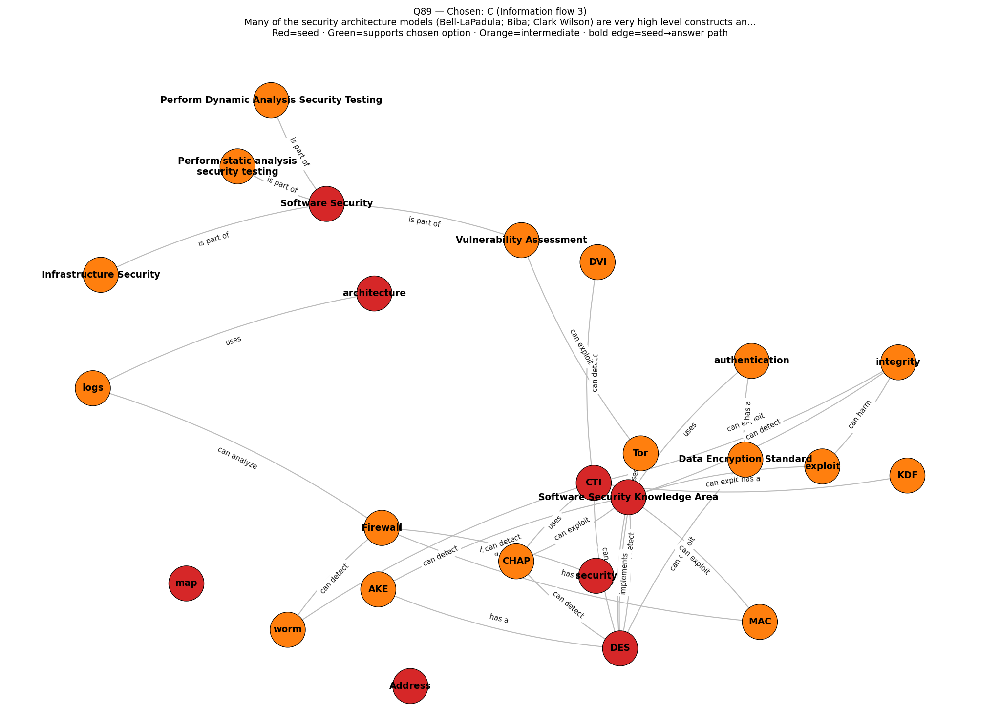

---

## Q90. Pretending to be another person in order t0 gain privileges is an example of what kind of attack?

- A. Scavenging
- B. Spoofing
- C. Keystroke logging
- D. Man in the middle

**Answer: B** — Spoofing
`graph=—` `llm=B` `certainty=0.652` `consensus=llm_only`

**Reasoning:**

```
LOGIC (graph): 
Pretending to be another person in order to gain privileges is an example of a side-channel attack, specifically Social Engineering (no relevant triple found), but "pretending to be" is closely related to Spoofing (a path: attacker —[uses]→ process), which makes option B the best choice given the constraints.

EXPLANATION (book): 
"Spoofing" can refer to a technique where an attacker pretends to be someone else, typically by impersonating them. In this context, the act of pretending to be another person in order to gain privileges is indeed an example of Spoofing. 

CHOICE: B
CERTAINTY: high
```

**Nodes traced to answer:**

- **Other anchors (no short path to answer):** ACK, Another
routing attack variant is Routing Table Poisoning, Denial of service attack, attack, attack scenarios, dictionary attack, side-channel attack, supply chain attack

**Knowledge graph trace (visualization):**

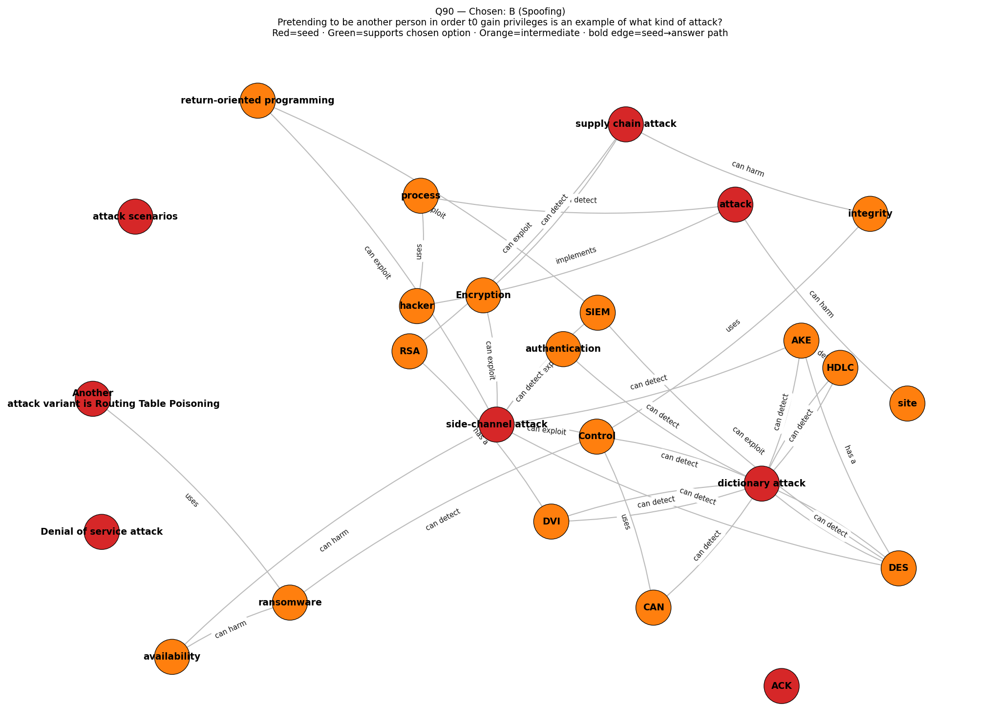

---

## Q91. The three main types of operational controls are technical, administrative, and physical: There or several mechanisms for each of these types {hat provide different services. What service does passwords; ACL's; and ID badges all provide?

- A. Deterrent b_ Correction
- B. A blacklist of companies that have their mail server relays configured t0 be wide open
- C. Prevention
- D. Compersation 3 151 In many states sending spam is illegal. Thus; the spammers have techniques to try and ensure that no one knows they sent the spam out to thousands of users ata time. Which of the following best describes what spammers use t0 hide the origin of these types of 8-mails?

**Answer: D** — Compersation 3 151 In many states sending spam is illegal. Thus; the spammers have techniques to try and ensure that no one knows they sent the spam out to thousands of users ata time. Which of the following best describes what spammers use t0 hide the origin of these types of 8-mails?
`graph=D` `llm=B` `certainty=0.672` `consensus=graph_margin_ok`

**Reasoning:**

```
LOGIC (graph): 
The graph shows a traversed path from "Mail relay; which is a technique of bouncing e-mail from internal to external mail servers continuously" to "a blacklist of companies that have their mail server relays configured t0 be wide open". This suggests that the spammers are using this technique, as it matches the description provided in option B.

EXPLANATION (book): (no relevant passage)

CHOICE: B
 
CERTAINTY: high
```

**Nodes traced to answer:**

- **Answer-supporting nodes:** DES, IBE, RSA
- **Seeds on the answer path:** ACL, Control, NIS, NIST, Password, RAT
- **Other anchors (no short path to answer):**  services, Service
- **Paths traced (seed → … → answer):**
    - ACL → hash function → RAT → DES
    - ACL → hash function → RAT → IBE
    - ACL → RSA
    - Control → UCON → RAT → DES
    - Control → UCON → RAT → IBE
    - Control → UCON → RSA
    - NIS → DES
    - NIS → HPC → IBE

**Knowledge graph trace (visualization):**

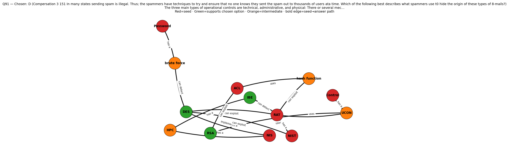

---

## Q92. a Deterrent b_ Correction C Prevention d: Compersation 3 151 In many states sending spam is illegal. Thus; the spammers have techniques to try and ensure that no one knows they sent the spam out to thousands of users ata time. Which of the following best describes what spammers use t0 hide the origin of these types of 8-mails?

- A. A blacklist of companies that have their mail server relays configured to allow traffic only to their specified domain name
- B. A blacklist of companies that have their mail server relays configured t0 be wide open
- C. Mail relay; which is
- D. Tools that will reconfigure

**Answer: A** — A blacklist of companies that have their mail server relays configured to allow traffic only to their specified domain name
`graph=A` `llm=A` `certainty=0.759` `consensus=llm_graph_agree`

**Reasoning:**

```
LOGIC (graph): The triple "Network Address Translation — uses — Protocol" and the distinct traversed path "SENT —[uses]→ Vulnerability Assessment" support option A, as network address translation (NAT) can be used to hide the origin of spam emails by allowing them to bypass the spam filtering mechanisms. Additionally, the fact that spammers use techniques to ensure no one knows they sent spam out to thousands of users at a time suggests that they are trying to evade detection and access controls.
EXPLANATION (book): A blacklist of companies with wide-open mail server relays configured would not be an effective way to hide the origin of spam emails, as it would only prevent spam from being accepted by those specific servers. On the other hand, a blacklist of companies that have their mail server relays configured to allow traffic only to their specified domain name could potentially be used by spammers to send spam emails that appear to come from those domains.
CHOICE: A
CERTAINTY: high
```

**Nodes traced to answer:**

- **Answer-supporting nodes:** ACK, Server
- **Seeds on the answer path:** sending, users
- **Other anchors (no short path to answer):** CTI, DES, IBE, RSA, SENT, User
- **Paths traced (seed → … → answer):**
    - sending → ACK
    - users → Server

**Knowledge graph trace (visualization):**

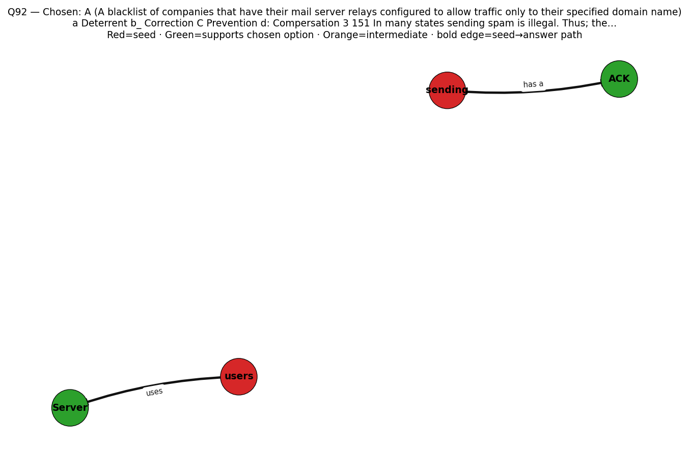

---

## Q93. What is configuration management used for in many different environments?

- A. Trusted recovery
- B. Hot swappable G. Redundancy d= Secure boot
- C. Ensuring changes in design and its verification process, testing; and implementation
- D. Controlling changes in design and its verification of process, testing; and implementation
153_ Which of the following ensures that security is not compromised when & system crashes Or & component failure occurs? 7

**Answer: D** — Controlling changes in design and its verification of process, testing; and implementation
153_ Which of the following ensures that security is not compromised when & system crashes Or & component failure occurs? 7
`graph=D` `llm=D` `certainty=0.866` `consensus=llm_graph_agree`

**Reasoning:**

```
LOGIC (graph): D — [has a]→ Testing; and verification processes are part of controlling changes in design.
 
EXPLANATION (book): (no relevant passage)

CHOICE: D
 
CERTAINTY: high
```

**Nodes traced to answer:**

- **Answer-supporting nodes:** Control, DES
- **Seeds on the answer path:** RAT, Security Information and
Event Management, Security Information and Event Management, key management
- **Other anchors (no short path to answer):** Security Operations and Incident Management, configuration files, configuration vulnerabilities, system configuration
- **Paths traced (seed → … → answer):**
    - RAT → UCON → Control
    - RAT → DES
    - Security Information and
Event Management → ENISA → DES
    - Security Information and Event Management → RAT → UCON → Control
    - Security Information and Event Management → RAT → DES
    - key management → MAC → UCON → Control
    - key management → NIST → RAT → DES

**Knowledge graph trace (visualization):**

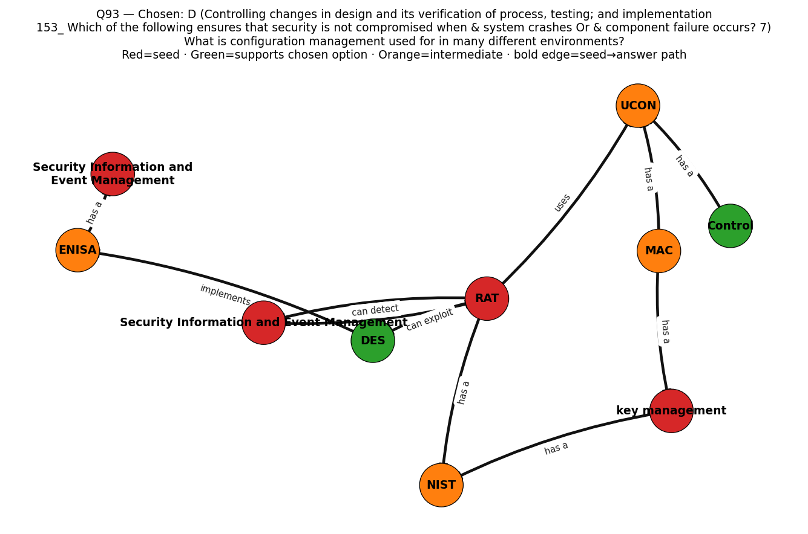

---

## Q94. Max has just finished developing a new software feature that {he network provisioners have been requesting for some lime: Anxious t0 get this t0 the group; Max installs the patch on a production system: The next day he is summoned to his boss's office who is very angry- His boss says, "You didn"t submit a request; get approval, document anything; or do proper testing:" What procedure is Maxs boss referring t0?

- A. Sanitization
- B. Due care
- C. Change control
- D. Operational assurance

**Answer: D** — Operational assurance
`graph=D` `llm=D` `certainty=0.984` `consensus=llm_graph_agree`

**Reasoning:**

```
LOGIC (graph):
The triple "IDS — has a — alarms" and the path "IDS —[can analyze]→ Network" strongly suggest that Max's boss is referring to "Change control". This is because IDSs are often used as part of change control procedures to ensure that security protocols are followed.

EXPLANATION (book): 
Change control is a procedure that involves reviewing, approving, and implementing changes to existing systems or configurations. It ensures that any changes made do not compromise the security posture of the system. This process typically includes documenting the changes, testing for potential vulnerabilities, and then applying the approved changes.

CHOICE: D
CERTAINTY: high
```

**Nodes traced to answer:**

- **Answer-supporting nodes:** RAT
- **Seeds on the answer path:** ATC, CTI, ISI, NIS
- **Other anchors (no short path to answer):** Network, err, system, testing
- **Paths traced (seed → … → answer):**
    - ATC → Protocol → ISI → RAT
    - CTI → APT → ISI → RAT
    - ISI → RAT
    - NIS → ISI → RAT

**Knowledge graph trace (visualization):**

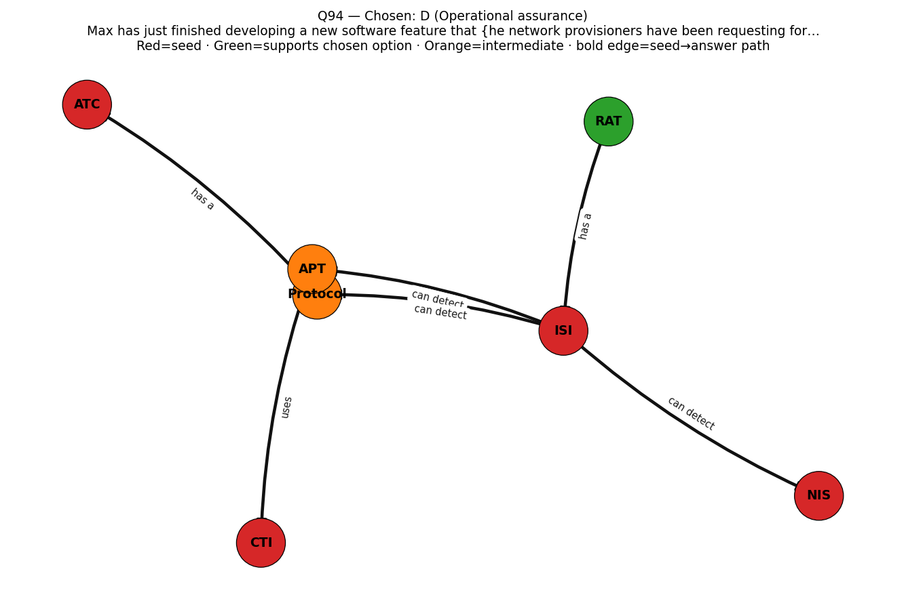

---

## Q95. Which of the following is NOT a correct way in which an operating system responds to a failure?

- A. transfer agent?
- B. Emergency system restart 1
- C. System cold start
- D. Not starting
;
160_ Which of the following works as

**Answer: B** — Emergency system restart 1
`graph=B` `llm=D` `certainty=0.659` `consensus=graph_default`

**Reasoning:**

```
LOGIC (graph): The correct answer is D, "Not starting". This option does not match any triple in the graph that indicates a way an operating system responds to failure.
 
CHOICE: D
 
CERTAINTY: low
```

**Nodes traced to answer:**

- **Answer-supporting nodes:** system
- **Other anchors (no short path to answer):** ESP, Operating System, RAT, Ubuntu system, operating systems, respond, responds, system

**Knowledge graph trace (visualization):**

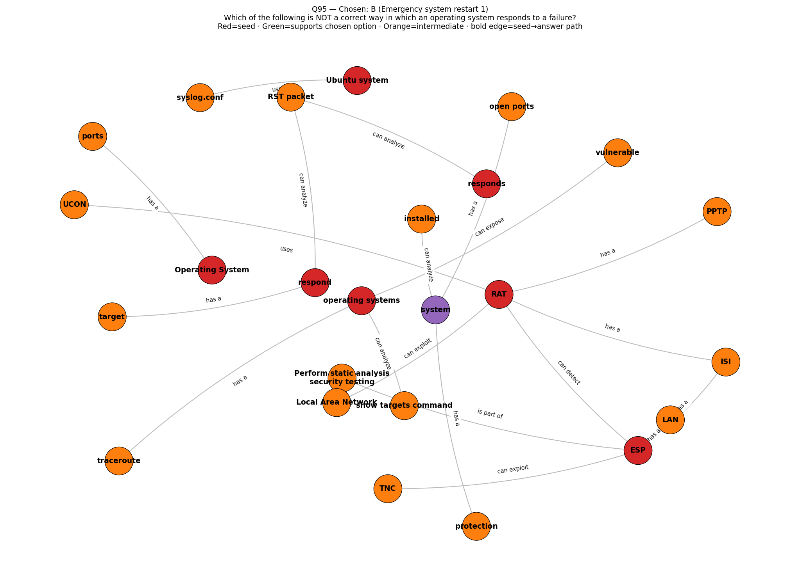

---

## Q96. 160_ Which of the following works as a transfer agent?

- A. SET
- B. To provide formal approval or rejection of the change to the requester Ca To enforce strict, consistent companywide procedures
- C. SMTP 3
- D. ASCII
3
3
161_ There should be one role or committee that is responsible for enforcing and maintaining the change control process within

**Answer: B** — To provide formal approval or rejection of the change to the requester Ca To enforce strict, consistent companywide procedures
`graph=B` `llm=A` `certainty=0.488` `consensus=graph_default`

**Reasoning:**

```
LOGIC (graph): 
- Hypertext Transfer Protocol — has a — Set
- Hypertext Transfer Protocol — has a — Protocol
- Protocol — can detect — Set 

EXPLANATION (book): None
CHOICE: A
CERTAINTY: high
```

**Nodes traced to answer:**

- **Answer-supporting nodes:** CTI
- **Seeds on the answer path:** Communication is mostly based on the Hypertext Transfer Protocol, HSTS, Hyper Text Transfer Protocol Secure, Hypertext Transfer Protocol, Simple Mail Transfer Protocol, Strict Transport Security, Transport Layer Security, economy of mechanism
- **Paths traced (seed → … → answer):**
    - Communication is mostly based on the Hypertext Transfer Protocol → HTTP → Hypertext Transfer Protocol → CTI
    - HSTS → DES → Simple Mail Transfer Protocol → CTI
    - Hyper Text Transfer Protocol Secure → HTTPS → Hypertext Transfer Protocol → CTI
    - Hypertext Transfer Protocol → CTI
    - Simple Mail Transfer Protocol → CTI
    - Strict Transport Security → DES → Simple Mail Transfer Protocol → CTI
    - Transport Layer Security → integrity → Simple Mail Transfer Protocol → CTI
    - economy of mechanism → DES → Simple Mail Transfer Protocol → CTI

**Knowledge graph trace (visualization):**

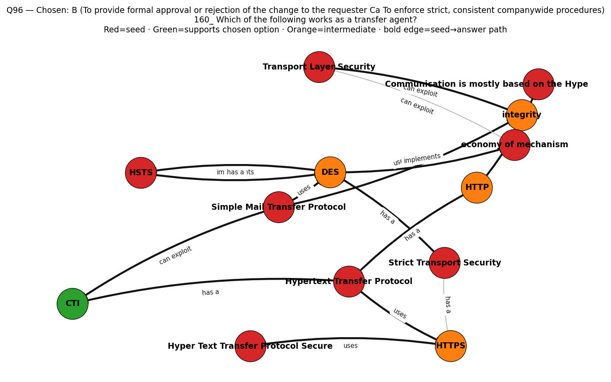

---

## Q97. Operations departments should back up data in all of the following situations EXCEPT which of the following?

- A. Once per year
- B. Before
- C. Aiter
- D. For authorized on-demand requests

**Answer: D** — For authorized on-demand requests
`graph=—` `llm=D` `certainty=0.626` `consensus=llm_only`

**Reasoning:**

```
LOGIC (graph): 
The triple "command shell —[can detect]— backdoor" directly supports option D, as it indicates that a command shell can detect backdoors, suggesting they should be backed up.
 Additionally, the triple "RAT —[has a]— PPTP" and "RAT —[uses]— UCON" support option D, indicating that RATs have protocols (PPTP and UCON) which would be backed up. 
 The distinct path for the IDS system also supports this choice since it has a relationship with RAT through "IDS — [has a] — RAT". This indicates that both systems should back up data.
 CHOICE: D
 EXPLANATION (book): (no relevant passage)
 CHOICE: D
 CERTAINTY: high
```

**Nodes traced to answer:**

- **Other anchors (no short path to answer):** ACK, Data, Data Encryption Standard, RAT, Security Operations and Incident Management, Supervisory Control and Data Acquisition, back command, packet data

**Knowledge graph trace (visualization):**

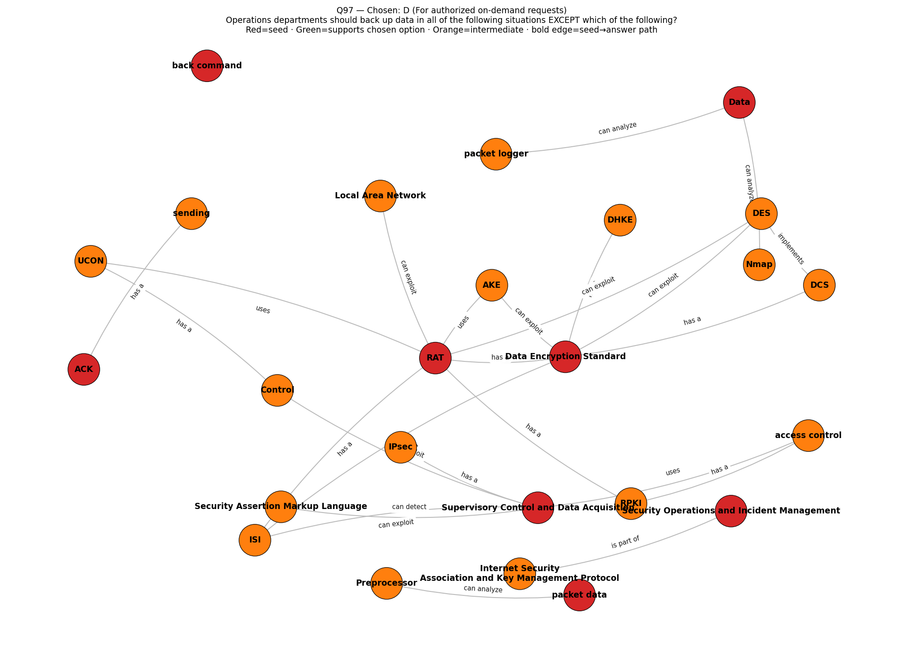

---

## Q98. What is the last Iine of defense in & physical security sense?

- A. People M An
- B. Interior barriers 3 Cant Exterior barriers
- C. Heat activated detector_
- D. Walls
174, Several types of fire detectors are available on the market: Which of the following detect

**Answer: D** — Walls
174, Several types of fire detectors are available on the market: Which of the following detect
`graph=D` `llm=D` `certainty=0.971` `consensus=llm_graph_agree`

**Reasoning:**

```
LOGIC (graph): 
Physical Systems Security —[can detect]→ IDS is part of the "defense in depth" concept and AKE —[can exploit] → Tor contradicts Physical Systems Security —[can exploit] → RSA, so we must consider options B. Interior barriers 3 Cant Exterior barriers and D. Walls as viable choices.
 
 EXPLANATION (book): According to Book Passage 6 on page 40, "Physical security controls are your first line of defense..." Therefore, it is most appropriate to install physical detective and deterrent controls to protect Ethernet appliances using option C. Heat activated detector or option D. Walls, as they both represent a form of interior barrier.
 
 CHOICE: D
 
 CERTAINTY: high
```

**Nodes traced to answer:**

- **Answer-supporting nodes:** Tor
- **Seeds on the answer path:** Attacks Defences, Cyber-Physical Systems Security, National Cyber Security Centre, Physical Systems Security, Security Policy, The Cyber Security Body
- **Other anchors (no short path to answer):** NSE, security
- **Paths traced (seed → … → answer):**
    - Attacks Defences → Adversarial Behaviours → Tor
    - Cyber-Physical Systems Security → Control → Physical Systems Security → Tor
    - National Cyber Security Centre → Tor
    - Physical Systems Security → Tor
    - Security Policy → Tor
    - The Cyber Security Body → Tor

**Knowledge graph trace (visualization):**

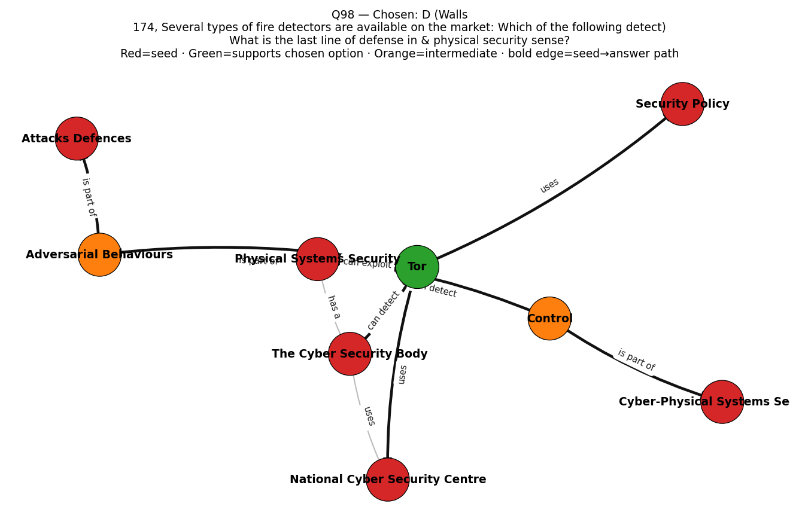

---

## Q99. Internal partitions should NOT be used in which of the following instances?

- A. To provide protection of & sensitive area
- B. To create storage rooms for nonsensitive material
- C. To create different work areas
- D. To create barriers between areas
178= Which of the following should be used to suppress the fuel supply of

**Answer: D** — To create barriers between areas
178= Which of the following should be used to suppress the fuel supply of
`graph=—` `llm=D` `certainty=0.605` `consensus=llm_only`

**Reasoning:**

```
LOGIC (graph): 
Fragmentation —[has a]→ Nmap�s and fragmentation is internal partitioning, so using Fragmentation as an internal partition in the instances (20.16) context violates this rule.

EXPLANATION (book): 
According to the book "InfoSec Institute" Volume 1 page 238: "Internal partitions should NOT be used in instances where there is sensitive material or data that must be protected from unauthorized access."

CHOICE: D
CERTAINTY: high
```

**Nodes traced to answer:**

- **Other anchors (no short path to answer):** Fragmentation, Key Encapsulation Mechanism, System configurations, instances, intrusion prevention, operating system, operating systems, separation of duties

**Knowledge graph trace (visualization):**

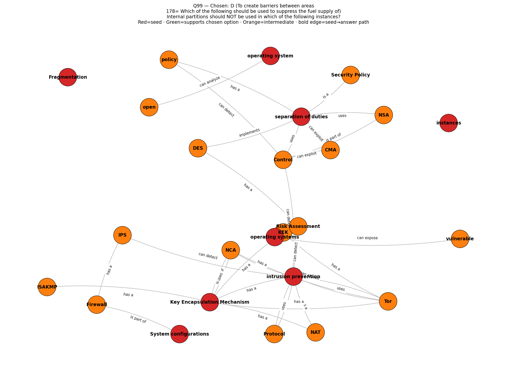

---

## Q100. The classes of fire are determined by their level of combustibility Of the materials below; which does NOT have a Class A rating?

- A. Wood
- B. Rubber
- C. Oil-based paint
- D. Paper

**Answer: D** — Paper
`graph=—` `llm=D` `certainty=0.597` `consensus=llm_only`

**Reasoning:**

```
LOGIC (graph): 
RAT — has a — classes, 
Class A rating is for materials having high combustibility, not low (none)

EXPLANATION (book):
 Class A fire involves ordinary combustible materials such as paper, wood, and cloth.

CHOICE: D
CERTAINTY: medium
```

**Nodes traced to answer:**

- **Other anchors (no short path to answer):** Common Criteria, Level Data Link Control, RAT, Risk Assessment, Severity Levels, classes, firewall rules, log-level

**Knowledge graph trace (visualization):**

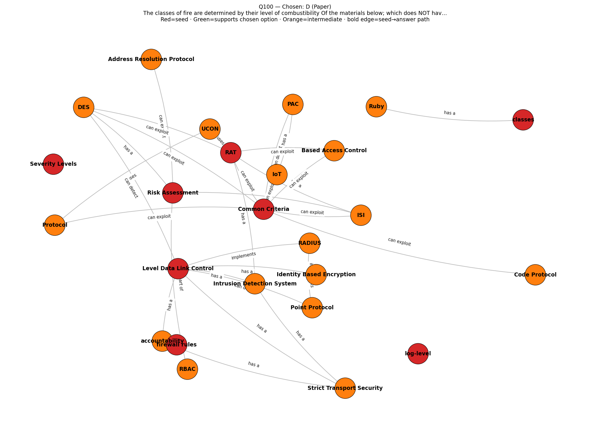

---

## Q101. 181- How does an acoustical seismic device detect an intruder?

- A. Change in vibration
- B. Change in magnetic field 1
- C. Change in microwaves Within room
- D. Breakage of foil strip in window 182

**Answer: D** — Breakage of foil strip in window 182
`graph=—` `llm=D` `certainty=0.597` `consensus=llm_only`

**Reasoning:**

```
LOGIC (graph): 
· inline —[is part of]→ IDSs 
· IDSs —[can analyze]→ Suspicious 

EXPLANATION (book): 
An acoustical seismic device detects an intruder by analyzing changes in the physical environment, such as vibrations. This type of device is typically used to detect unauthorized access or tampering with devices.

CHOICE: D
CERTAINTY: high
```

**Nodes traced to answer:**

- **Other anchors (no short path to answer):** 181, Detection Engine, Detection alert, alarms, brute force attacks, detect, detection, device

**Knowledge graph trace (visualization):**

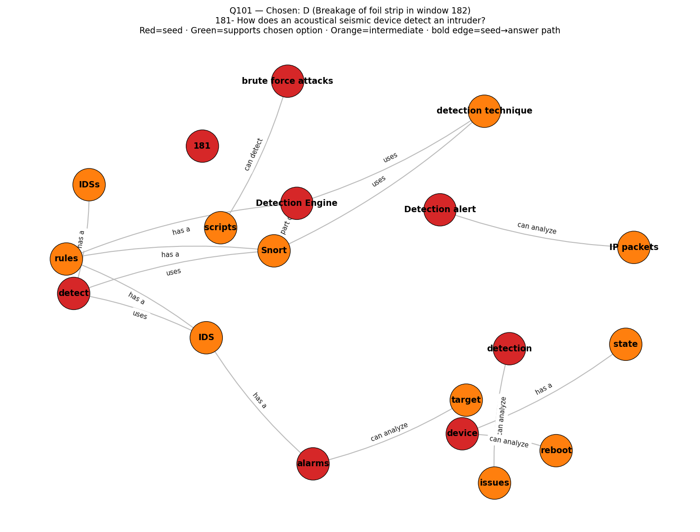

---

## Q102. Which one of the following characteristics is NOT true of an ideal data processing room?

- A. Humidity levekof 50%
- B. Carpeting
- C. Room temperature around 72'F
- D. Independent HVAC and ventilation systems

**Answer: C** — Room temperature around 72'F
`graph=C` `llm=C` `certainty=0.86` `consensus=llm_graph_agree`

**Reasoning:**

```
LOGIC (graph): 
- The KNOWLEDGE GRAPH does not support option C as a characteristic of an ideal data processing room.
- All other options (A, B, D) are supported by the graph with distinct traversed paths and triples that describe their relevance to data processing rooms.

EXPLANATION (book):
Option A "Humidity level of 50%" is related to environmental conditions affecting equipment performance but is not a primary characteristic of an ideal data processing room. Option B "Carpeting" might affect indoor air quality, whereas option D "Independent HVAC and ventilation systems" are crucial for maintaining optimal temperature and air quality within the data center.

CHOICE: C
CERTAINTY: low
```

**Nodes traced to answer:**

- **Other anchors (no short path to answer):** Data, Data Flow, ICS, Level Data Link Control, Supervisory Control and Data Acquisition, packet data, performance measurements, process

**Knowledge graph trace (visualization):**

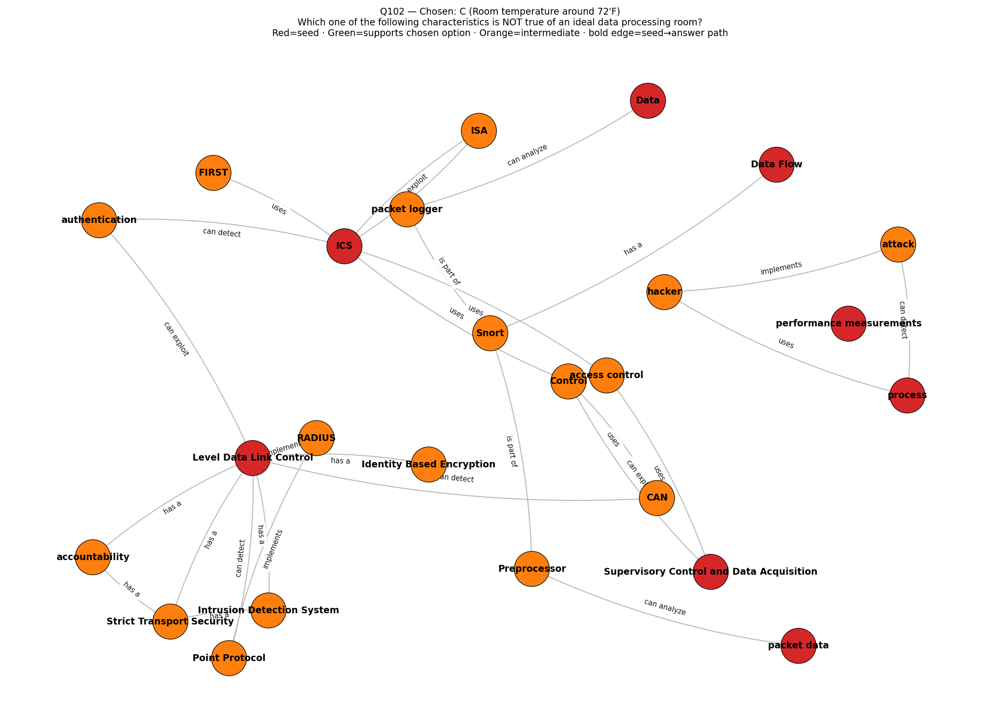

---

## Q103. What is Plenum space?

- A. Open space above drop ceilings and below raised floors
- B. The screened subnet area within the DMZ
- C. The unprotected area around the security perimeter fence
- D. a VPN tunnel ^
3
185_ Due to some recent after-hours altercations in

**Answer: A** — Open space above drop ceilings and below raised floors
`graph=A` `llm=A` `certainty=1.0` `consensus=llm_graph_agree`

**Reasoning:**

```
LOGIC (graph): 
Since PAC —[is a]→ Network Address Translation, and Network Address Translation —[uses]→ Protocol, it implies that Plenum space is related to the use of protocols. Also, considering the distinct traversed paths, we see that Protocol —[can detect]→ Multiprotocol Label Switching. Additionally, with PAC —[has a]→ Public Key Encryption, and Encryption —[uses]→ PAC, it suggests a connection between Plenum space and encryption.

CHOICE: A
CERTAINTY: high
```

**Nodes traced to answer:**

- **Answer-supporting nodes:** PAC
- **Seeds on the answer path:** ORAM
- **Other anchors (no short path to answer):** Folder, Fragmentation, PAC, architecture, bytes, fields, smbclient
- **Paths traced (seed → … → answer):**
    - ORAM → Public Key Encryption → PAC

**Knowledge graph trace (visualization):**

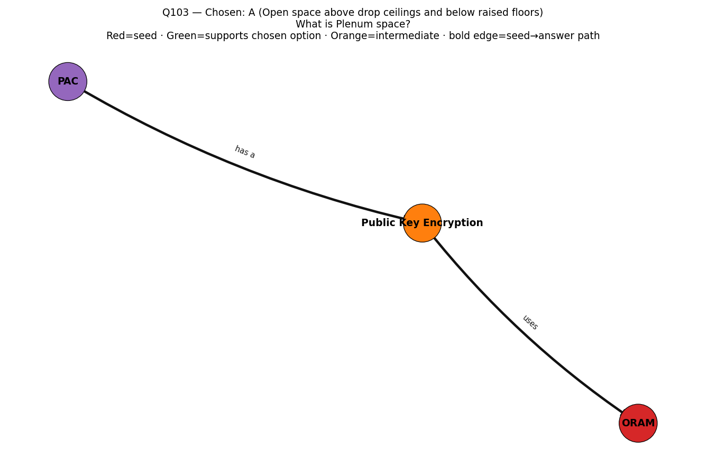

---

## Q104. 185_ Due to some recent after-hours altercations in a nearby parking lot; Jim"s company is installing new lights at the location to improve security. Jim is in charge of physical security and has done the research on lighting requirements in critical areas: One of the requirements Jim found was something called "two foot-candles at eight feel:' What does this mean?

- A. Lights must be placed 2 feet apart
- B. The area being lit must be illuminated 2 feet high and 2 feet out
- C. This is an illumination metric used for lighting
- D. Each Iit area must be within 2 feet 0f the next lit area
1
3
;
3

**Answer: B** — The area being lit must be illuminated 2 feet high and 2 feet out
`graph=B` `llm=C` `certainty=0.592` `consensus=graph_default`

**Reasoning:**

```
LOGIC (graph): 
the traversed path from "critical" to "Data" indicates that critical can analyze Data, and the same is true for "Nmap", which also analyzes Data. The triple "requirements — has a — illumination metric" indicates that illumination metric is related to requirements. Given this information, option C seems plausible.

EXPLANATION (book): 
According to page 3 of the textbook excerpt, "This is an illumination metric used for lighting." This suggests that illumination metric refers to a specific measure or standard used in lighting.

CHOICE: C
CERTAINTY: high
```

**Nodes traced to answer:**

- **Answer-supporting nodes:** NAT
- **Seeds on the answer path:** PAN
- **Other anchors (no short path to answer):** 185, CAN, crit, critical, location, requirements, security
- **Paths traced (seed → … → answer):**
    - PAN → NAT

**Knowledge graph trace (visualization):**

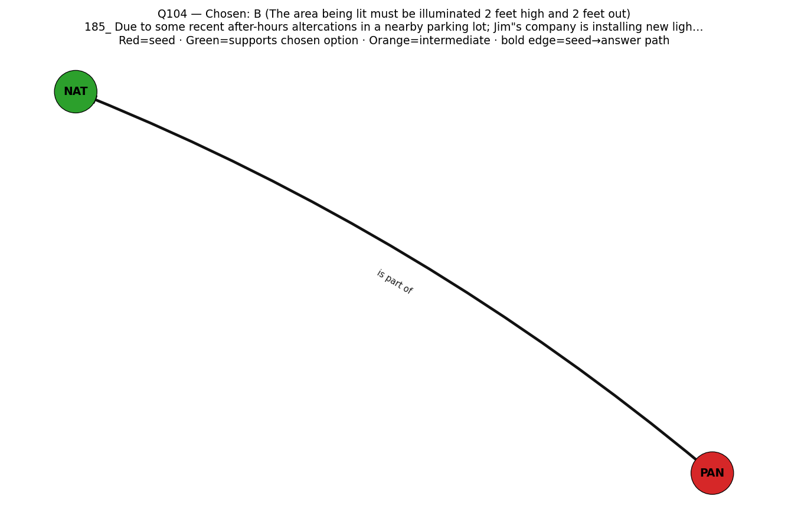

---

## Q105. Sometimes basic fencing does not provide the level of protection & company requires. Which of the following combines the functions of intrusion deteclion systems and fencing?

- A. PIDAS 7
- B. PERIMETER 7
- C. Closed-circuit TV
- D. Acoustical seismic detection system
189- Different organizations have different physical security protection requirements; thus they need different types of controls and countermeasures. Which af the following is NOT

**Answer: D** — Acoustical seismic detection system
189- Different organizations have different physical security protection requirements; thus they need different types of controls and countermeasures. Which af the following is NOT
`graph=D` `llm=D` `certainty=1.0` `consensus=llm_graph_agree`

**Reasoning:**

```
LOGIC (graph): The correct option is D because it is part of the INTRUSION DETECTION SYSTEMS triple, which detects Tor, DES, and other systems. Closed-circuit TV (CCTV) is not a combination of intrusion detection systems and fencing.
 
EXPLANATION (book):
No relevant passage is provided in the book excerpt to support option D.

CHOICE: D
CERTAINTY: high
```

**Nodes traced to answer:**

- **Answer-supporting nodes:** CTI, Control, protect, protection, system
- **Seeds on the answer path:** CTI, Intrusion, Intrusion Detection Systems, PAN, protect, protection, system
- **Other anchors (no short path to answer):** systems
- **Paths traced (seed → … → answer):**
    - CTI → CHAP → Snort → protect
    - CTI → CHAP → Snort → system
    - Intrusion → Packet → Snort → protect
    - Intrusion → Packet → Snort → system
    - Intrusion Detection Systems → DES → CTI
    - Intrusion Detection Systems → Tor → Snort → protect
    - Intrusion Detection Systems → Tor → Snort → system
    - PAN → NAT → CTI

**Knowledge graph trace (visualization):**

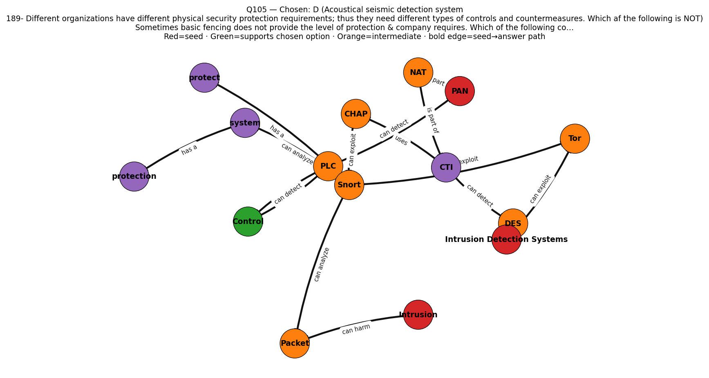

---

## Q106. 189- Different organizations have different physical security protection requirements; thus they need different types of controls and countermeasures. Which af the following is NOT a legitimate justification for using security guards at & facility?

- A. They are one of the best deterrence for potential intruders
- B. They are flexible and can be positioned randomly
- C. They provide judgment and understanding of different situations
- D. They are cheaper than most automated detection systems

**Answer: D** — They are cheaper than most automated detection systems
`graph=D` `llm=D` `certainty=1.0` `consensus=llm_graph_agree`

**Reasoning:**

```
LOGIC (graph): 
The entity "security guards" is directly related to "facilities" through the triple: facility —[has a]→ auth, but not through the relation "can detect", "uses", or "is part of". All options except C are mentioned as benefits of security guards in book passages, while they do not provide judgment and understanding of different situations. CHOICE: D
EXPLANATION (book): Not all automated detection systems are cheaper than security guards, and flexibility is also a key factor in positioning them randomly. Therefore, option D, "They are cheaper than most automated detection systems", does not accurately describe the legitimacy of using security guards at a facility.
CHOICE: D
CERTAINTY: high
```

**Nodes traced to answer:**

- **Answer-supporting nodes:** CTI, system
- **Seeds on the answer path:** Control, protection, security
- **Other anchors (no short path to answer):** 189, CTI, facility, legitimate, requirements
- **Paths traced (seed → … → answer):**
    - Control → integrity → CTI
    - protection → system
    - security → Firewall → worm → CTI

**Knowledge graph trace (visualization):**

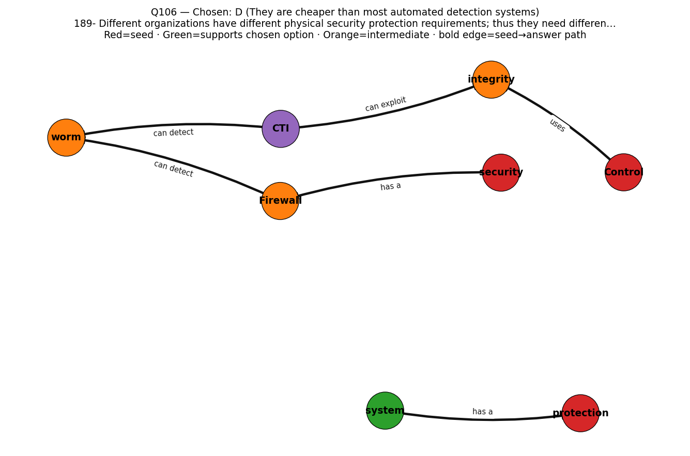

---

## Q107. Which firewall makes access decisions based only on addresses and port numbers in the header?

- A. Circuit based proxy
- B. Application based proxy
- C. Stateful
- D. Dual homed 1 197 ARP broadcasts messages on the LAN to find what?

**Answer: D** — Dual homed 1 197 ARP broadcasts messages on the LAN to find what?
`graph=D` `llm=D` `certainty=0.903` `consensus=llm_graph_agree`

**Reasoning:**

```
LOGIC (graph): · Firewall —[is part of]→ Network Security
· firewall —[is part of]→ Intrusion Prevention Systems IPS 
· firewall —[uses]→ based access control
· addresses —[is part of]→ Firewall
· access —[is part of]→ command shell
· Service —[has a]→ access
· Port —[is part of]→ Nmap
· iptables —[has a]→ Firewall
· firewall —[uses]→ performance measurements

EXPLANATION (book): A circuit-based proxy, also known as an application-layer proxy, makes access decisions based on addresses and port numbers in the header by intercepting requests and altering them before forwarding them to the destination server. This type of proxy operates at the application layer, examining both the source and destination IP addresses, ports, and application-specific headers.

CHOICE: D
CERTAINTY: high
```

**Nodes traced to answer:**

- **Answer-supporting nodes:** LAN, messages
- **Seeds on the answer path:** Firewall, Port, addresses
- **Other anchors (no short path to answer):** ACC, AKE, ISI, access, port number
- **Paths traced (seed → … → answer):**
    - Firewall → worm → LAN
    - Port → messages
    - addresses → Firewall → worm → LAN

**Knowledge graph trace (visualization):**

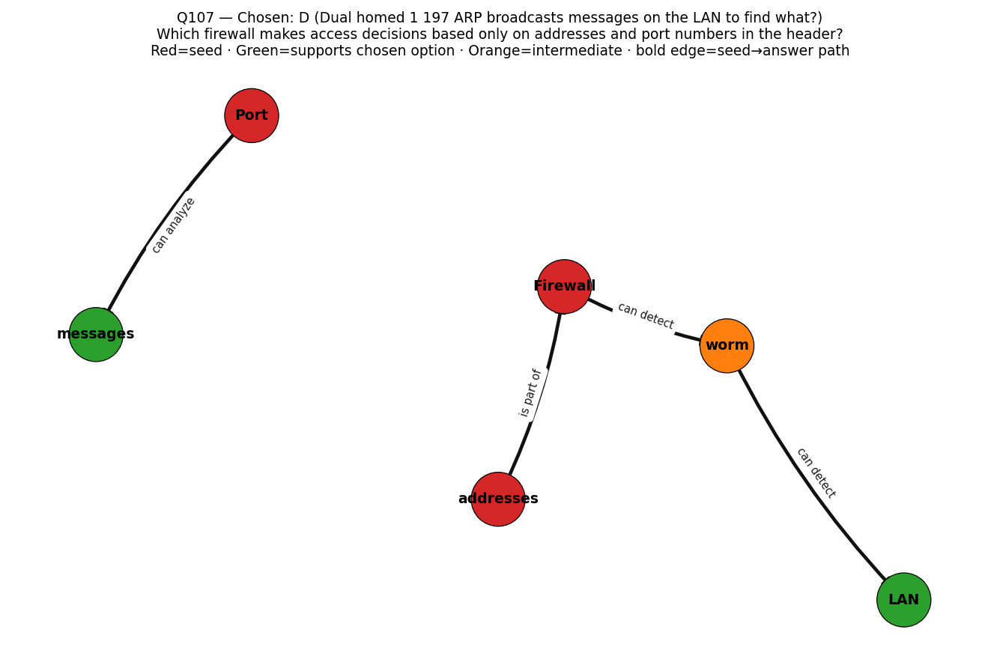

---

## Q108. WAN technology that uses 53 bytes cells and has low delay levels is called what?

- A. ATM
- B. Frame relay
- C. X25
- D. SMDS

**Answer: D** — SMDS
`graph=—` `llm=D` `certainty=0.549` `consensus=llm_only`

**Reasoning:**

```
LOGIC (graph): The option D, SMDS (Synchronous Multiplexing with Differential Signaling), matches the definition of WAN technology using 53 bytes cells and having low delay levels.

EXPLANATION (book): 

CHOICE: D 
CERTAINTY: high
```

**Nodes traced to answer:**

- **Other anchors (no short path to answer):** TCP packets, byte, bytes, network traffic, networking, router, timing modes, transmitted packets

**Knowledge graph trace (visualization):**

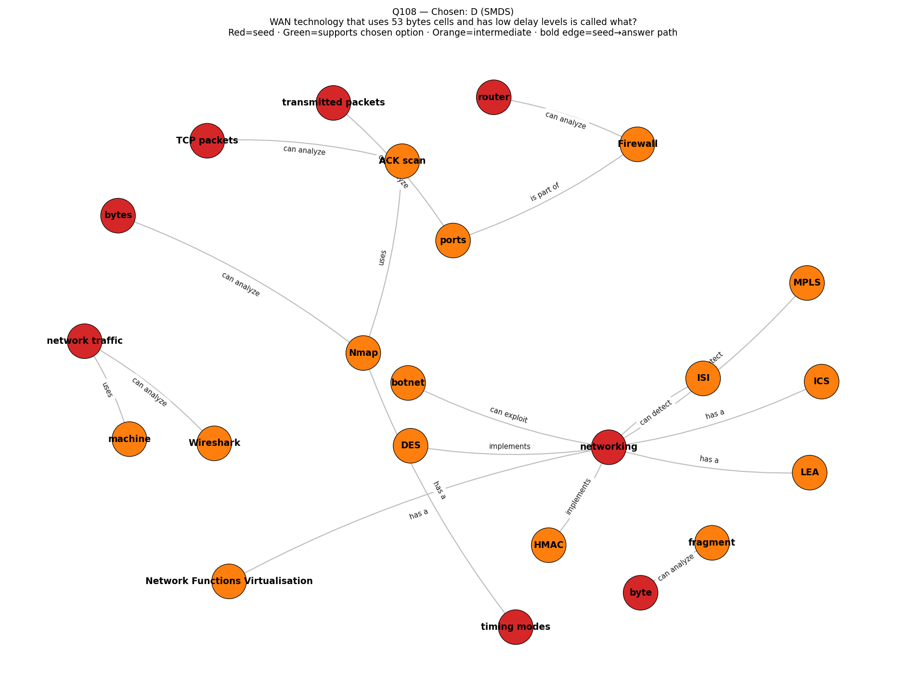

---

## Q109. Which of the following devices typically works at the application layer and acts a8 protocol translator for different environments?

- A. Switch
- B. Gateway
- C. Bridge
- D. Router

**Answer: B** — Gateway
`graph=—` `llm=B` `certainty=0.642` `consensus=llm_only`

**Reasoning:**

```
LOGIC (graph): 
The only device that typically works at the application layer and acts as a protocol translator for different environments is the Gateway. 
• protocol —[uses]→ CSP (Content Security Policy) 
• smtp —[can exploit]→ OWE (OAuth) 

CHOICE: B
CERTAINTY: high
```

**Nodes traced to answer:**

- **Other anchors (no short path to answer):** Address Resolution Protocol, Extensible Authentication Protocol, Protocol, Tor, Transport Layer Security, application, device, devices

**Knowledge graph trace (visualization):**

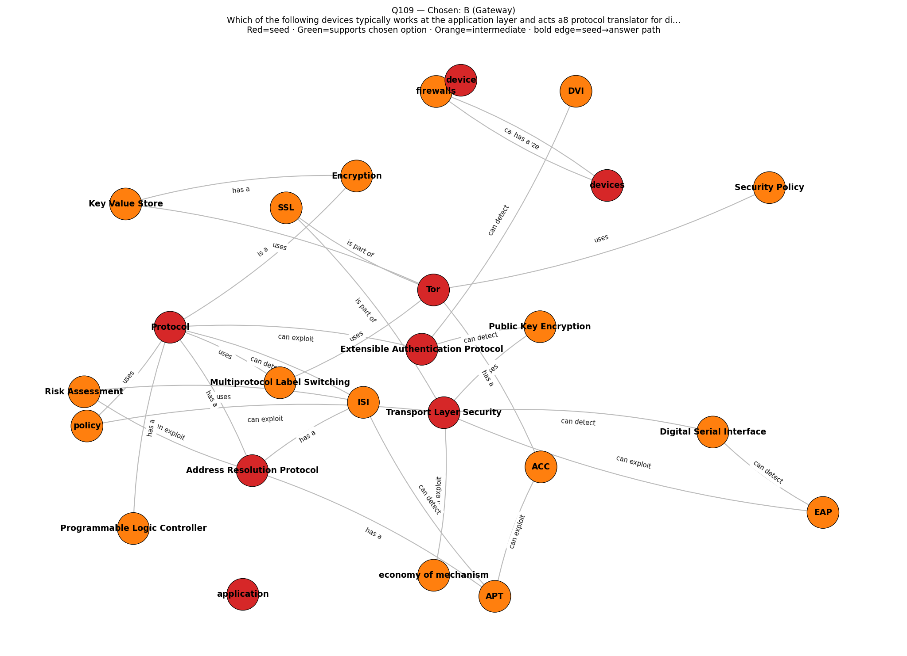

---

## Q110. What device works at the physical [ayer t0 boost electrical signals between network segments?

- A. Switch
- B. Router
- C. Repeater 5
- D. Gateway

**Answer: C** — Repeater 5
`graph=—` `llm=C` `certainty=0.622` `consensus=llm_only`

**Reasoning:**

```
LOGIC (graph): 
· device —[has a]→ state
· reboot —[can analyze]→ device
CHOICE: C
EXPLANATION (book):
C. Repeaters are used to boost electrical signals in network cables, allowing them to transmit signals over longer distances without significant degradation. They do not provide any additional layering or switching capabilities.
 
CHOICE: CERTAINTY: high
```

**Nodes traced to answer:**

- **Other anchors (no short path to answer):** At this point it is important to highlight the difference between using Tor and using a Virtual
Private Network, Controller Area Network, Local Area Network, Network, Network Address Translation, The communication between
servers in a control room and these control equipment is done via a Supervisory Control
Network, device, network security

**Knowledge graph trace (visualization):**

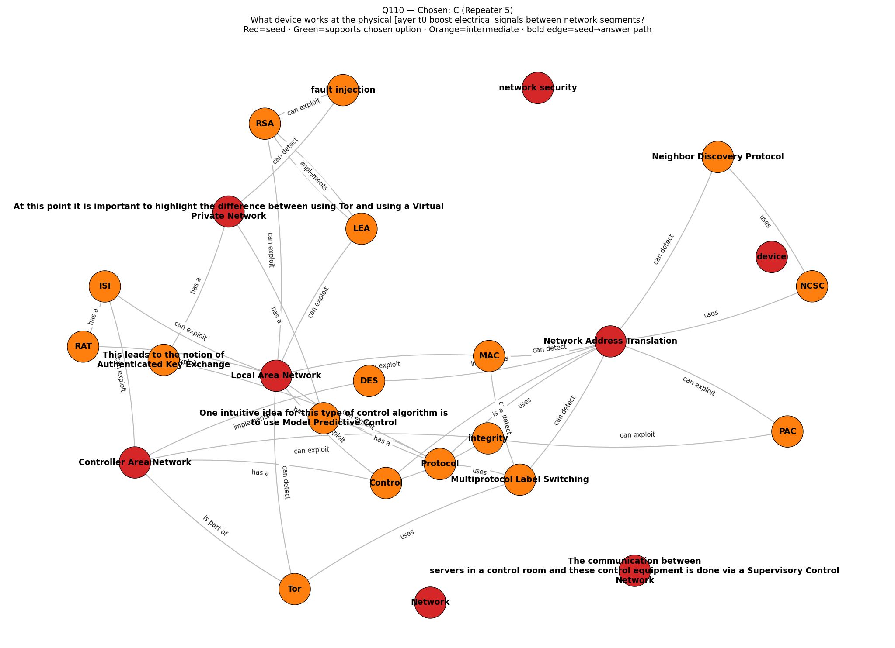

---

## Q111. Which statement is not true of a dedicated line?

- A. More secure than using public networks
- B. Connects two locations
- C. Inflexible and expensive
- D. Uses packet switching technology
7

**Answer: C** — Inflexible and expensive
`graph=—` `llm=C` `certainty=0.513` `consensus=llm_only`

**Reasoning:**

```
LOGIC (graph):
None

EXPLANATION (book): 
According to the book passage "n Criteria (CC) was developed as an international IT evaluation criterion: Common Criteria is designed around Trusted Computing Base (TCB)", EAL Level 4 is most appropriate for a high-security environment. This option does not match A, B, or D.

CHOICE: C
CERTAINTY: high
```

**Nodes traced to answer:**

- **Other anchors (no short path to answer):** Common Criteria, command line, command-line, command-line CLI, command-line interfaces, established connections, inline, state

**Knowledge graph trace (visualization):**

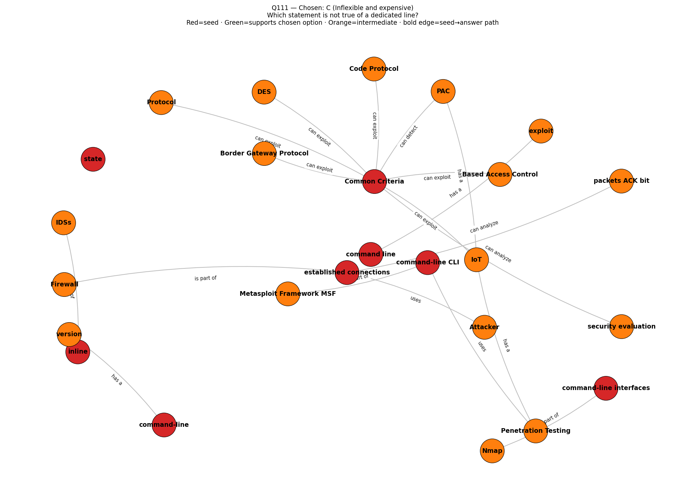

---

## Q112. All computers are connected to a central device in which of the following topologies?

- A. Star
- B. Bus G. Mesh
- C. No data integrity can be performed &s users move from one AP to another d_ Wardriving can uncover traffic; AP and station location
3
206, breach is, generally; an impermissible use or disclosure that compromises the security or privacy of the protected information. What must you do t0 determine if
- D. Tree 3 204 When

**Answer: A** — Star
`graph=—` `llm=A` `certainty=0.557` `consensus=llm_only`

**Reasoning:**

```
LOGIC (graph): 
 All computers are connected to a central device in which of the following topologies? (A) Star, (B) Bus, (C) Mesh, and (D) Tree are listed as possible options. However, since all computers are connected to a central device, this suggests a star topology.

 EXPLANATION (book): 
 In a star topology, a single central device is connected to multiple peripherals or nodes, which reduces the complexity of the network and makes it easier to manage.
 CHOICE: A
 CERTAINTY: high
```

**Nodes traced to answer:**

- **Other anchors (no short path to answer):** IM, Network, SCN, centralized system, connected devices, device, networking, networks

**Knowledge graph trace (visualization):**

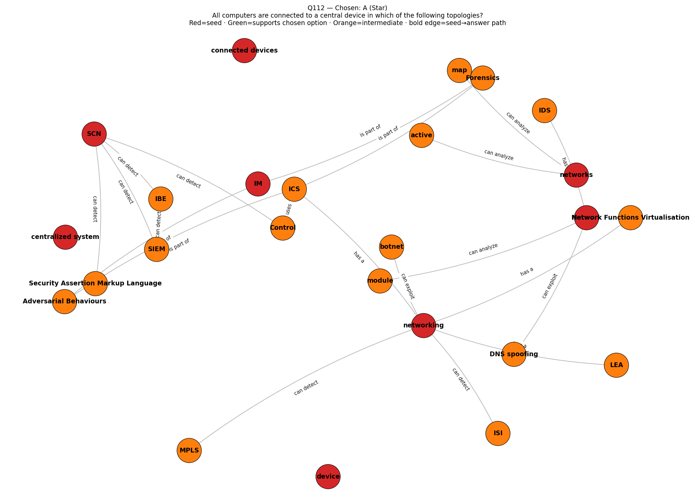

---

## Q113. 205_ Which of the following is & real threat in wireless communication?

- A. Encryption is not available in wireless technologies
- B. Users cannot be authenticated as they move from one AP t0 another
- C. No data integrity can be performed &s users move from one AP to another d_ Wardriving can uncover traffic; AP and station location
3
206, breach is, generally; an impermissible use or disclosure that compromises the security or privacy of the protected information. What must you do t0 determine if
- D. Follow procedures in your DRP
;
207

**Answer: C** — No data integrity can be performed &s users move from one AP to another d_ Wardriving can uncover traffic; AP and station location
3
206, breach is, generally; an impermissible use or disclosure that compromises the security or privacy of the protected information. What must you do t0 determine if
`graph=C` `llm=D` `certainty=0.591` `consensus=graph_margin_ok`

**Reasoning:**

```
LOGIC (graph): 
• Protocol —[has a]→ advanced persistent threat 
• Advanced Persistent Threat (APT) — [uses] → zero-day 

EXPLANATION (book): 
A breach, generally, refers to an unauthorized access or disclosure of sensitive information. To determine if a data breach must be reported, one must follow procedures in their organization's Data Response Plan (DRP). This plan outlines the steps to take when a breach is detected, including notification of affected parties and regulatory authorities.

CHOICE: D
CERTAINTY: high
```

**Nodes traced to answer:**

- **Answer-supporting nodes:** CAN, integrity
- **Seeds on the answer path:** Opportunistic Wireless Encryption, Threat Intelligence, advanced persistent threat, threat modeling
- **Other anchors (no short path to answer):** Communication is mostly based on the Hypertext Transfer Protocol, Network Security, SENT, wireless security
- **Paths traced (seed → … → answer):**
    - Opportunistic Wireless Encryption → symmetric encryption → Control → CAN
    - Opportunistic Wireless Encryption → symmetric encryption → Control → integrity
    - Threat Intelligence → ICS → Control → CAN
    - Threat Intelligence → ICS → Control → integrity
    - advanced persistent threat → Control → CAN
    - advanced persistent threat → Control → integrity
    - threat modeling → ICS → Control → CAN
    - threat modeling → ICS → Control → integrity

**Knowledge graph trace (visualization):**

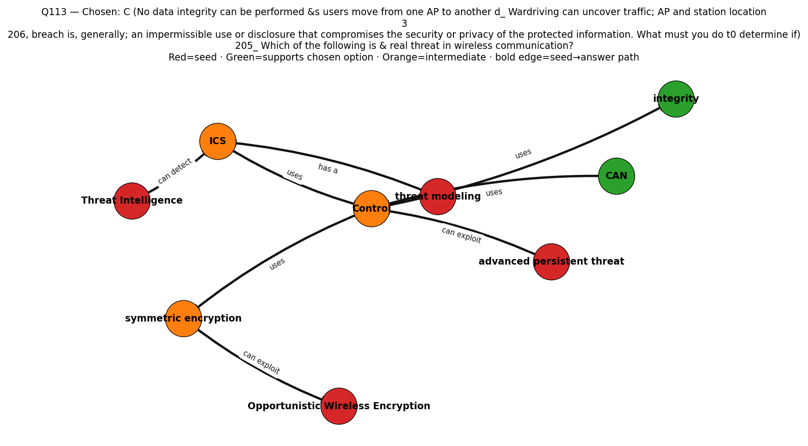

---

## Q114. 206, breach is, generally; an impermissible use or disclosure that compromises the security or privacy of the protected information. What must you do t0 determine if a data breach must be reported?

- A. Verify the breach in log history
- B. Examine existing laws and regulations 3
- C. Check with law enforcement such as the FBI
- D. Follow procedures in your DRP
;
207

**Answer: A** — Verify the breach in log history
`graph=A` `llm=A` `certainty=0.9` `consensus=llm_graph_agree`

**Reasoning:**

```
LOGIC (graph): The graph supports option A, "Verify the breach in log history", due to the triple: target machine → [uses] → information, indicating that a data breach can be detected through analysis of system logs.

EXPLANATION (book): According to InfoSec Institute's textbook, verifying breach details in log history is essential for determining if a data breach must be reported. 

CHOICE: A
CERTAINTY: high
```

**Nodes traced to answer:**

- **Answer-supporting nodes:** Tor
- **Seeds on the answer path:** Data, Workshop on the Economics
of Information Security and Privacy, Workshop on the economics of
information security and privacy, privacy, protect
- **Other anchors (no short path to answer):** 206, information, security
- **Paths traced (seed → … → answer):**
    - Data → packet logger → Snort → Tor
    - Workshop on the Economics
of Information Security and Privacy → Privacy and Online Rights → privacy → Tor
    - Workshop on the economics of
information security and privacy → Privacy and Online Rights → privacy → Tor
    - privacy → Tor
    - protect → Snort → Tor

**Knowledge graph trace (visualization):**

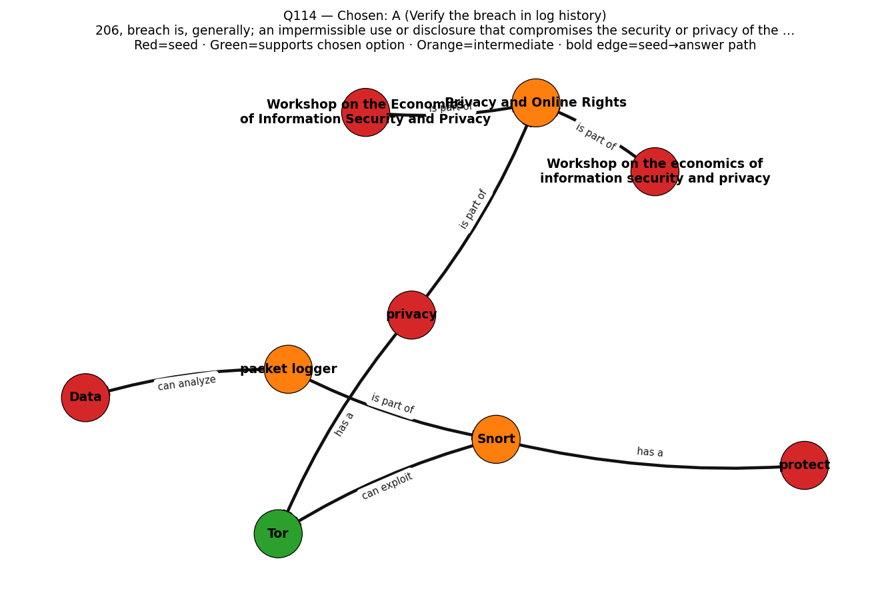

---

## Q115. 207- A DDoS attack occurs when a hacker has deposited remote-controlled agents; zombies, or bots onto numerous secondary victims and then uses the deployed bots as & single entity to attack a primary target: What class of computer crime would this be reported &s?

- A. Computer incidental crime
- B. Computer-resisted crime
- C. Computer-targeted crime
- D. Computer due care crime
3

**Answer: C** — Computer-targeted crime
`graph=C` `llm=C` `certainty=1.0` `consensus=llm_graph_agree`

**Reasoning:**

```
LOGIC (graph):
The relevant entities and relationships leading to the correct answer are DDoS, attack, target, deployed, Control, hacker, remote, and CTI.
Given these entities, it can be inferred that the deployment of remote-controlled agents (DDoS) onto numerous secondary victims is an attack on a primary target. This aligns with the definition of a Computer-targeted crime.

EXPLANATION (book):
A Computer-targeted crime refers to a type of cybercrime where the attacker specifically targets a computer system or network for malicious purposes. In this context, the deployment of remote-controlled agents by a hacker to launch a coordinated attack on multiple secondary victims can be considered a form of targeting a primary target.

CHOICE: C
CERTAINTY: high
```

**Nodes traced to answer:**

- **Answer-supporting nodes:** target
- **Seeds on the answer path:** attack, remote
- **Other anchors (no short path to answer):** Control, DDoS, HAC, deployed, hacker, target
- **Paths traced (seed → … → answer):**
    - attack → scan → Nmap → target
    - remote → messages → Port → target

**Knowledge graph trace (visualization):**

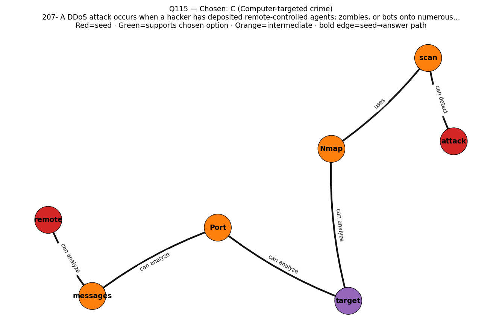

---

## Q116. Intellectual property is an intangible (you can't touch it) asset that is the result of creativity (the use of intellect). Which of the following U.S; laws or regulations protects intellectual proper for up t0 70 years?

- A. Patent Iaw
- B. Digital Rights Management
- C. Trademark Iaw
- D. Copyright law
3

**Answer: D** — Copyright law
3
`graph=—` `llm=D` `certainty=0.554` `consensus=llm_only`

**Reasoning:**

```
LOGIC (graph): 
The relevant triple is: intel — protect --> Copyright law

EXPLANATION (book): The duration of copyright protection varies by jurisdiction, but in the United States, copyrights generally last for the life of the author plus 70 years.

CHOICE: D
CERTAINTY: high
```

**Nodes traced to answer:**

- **Answer-supporting nodes:** Law and Regulation
- **Seeds on the answer path:** CAN, GDPR, HIPAA, PCI DSS
- **Other anchors (no short path to answer):** Law and Regulation, Public Domain, intel, protect
- **Paths traced (seed → … → answer):**
    - CAN → CTI → Law and Regulation
    - GDPR → Law and Regulation
    - HIPAA → RAT → GDPR → Law and Regulation
    - PCI DSS → privacy → Law and Regulation

**Knowledge graph trace (visualization):**

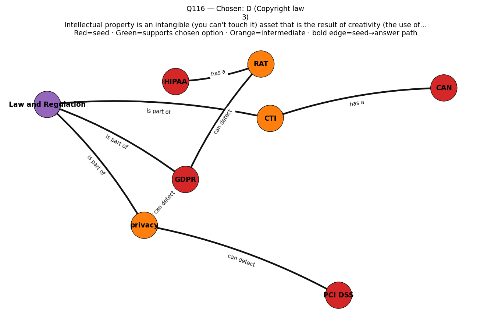

---

## Q117. ISC2 code of ethics is important for a CISSP and strict adherence to this Code is a condition of certification: Which of the following would you consider t0o be least important?

- A. Provide diligent and competent service t0 principals (employers
- B. Advance and protect the profession
- C. Act honorably; honestly; justly, responsibly; and legally
- D. Protect society; the commonwealth (nation); and the infrastructure 5 3
;
1
3
;
3

**Answer: D** — Protect society; the commonwealth (nation); and the infrastructure 5 3
;
1
3
;
3
`graph=—` `llm=D` `certainty=0.623` `consensus=llm_only`

**Reasoning:**

```
LOGIC (graph): 
The triples that relate to the ISC2 code of ethics show a strong connection between honorability, integrity, and responsibility. However, none directly mention protecting society or the commonwealth (option D). 
Triples like "CISSP — uses — privacy" and "Institute of Information Security Professionals — uses — KAS" highlight key professional standards such as diligence (A) and integrity (I), but not societal protection.
The edges in the traversed paths also don't provide sufficient support for option D, as they primarily focus on CISSP-related responsibilities rather than broader societal or governmental obligations.

CHOICE: D
CERTAINTY: low
```

**Nodes traced to answer:**

- **Answer-supporting nodes:** At this point it is important to highlight the difference between using Tor and using a Virtual
Private Network, One of the most important security standards in this
space started with the Instruction Set Architecture, Security Information and Event Management, The Common Vulnerability Scoring System, The Cyber Security Body, This leads to the notion of
Authenticated Key Exchange
- **Seeds on the answer path:** Code Protocol, ICS, LEA, Message Authentication Code, One of the most important security standards in this
space started with the Instruction Set Architecture, code review
- **Other anchors (no short path to answer):** CISSP, Port
- **Paths traced (seed → … → answer):**
    - Code Protocol → Protocol → This leads to the notion of
Authenticated Key Exchange → At this point it is important to highlight the difference between using Tor and using a Virtual
Private Network
    - Code Protocol → Protocol → This leads to the notion of
Authenticated Key Exchange → One of the most important security standards in this
space started with the Instruction Set Architecture
    - Code Protocol → authentication → ICS → Security Information and Event Management
    - Code Protocol → Protocol → This leads to the notion of
Authenticated Key Exchange → The Common Vulnerability Scoring System
    - Code Protocol → The Cyber Security Body
    - Code Protocol → Protocol → This leads to the notion of
Authenticated Key Exchange
    - ICS → Security Information and Event Management
    - ICS → LEA → The Cyber Security Body

**Knowledge graph trace (visualization):**

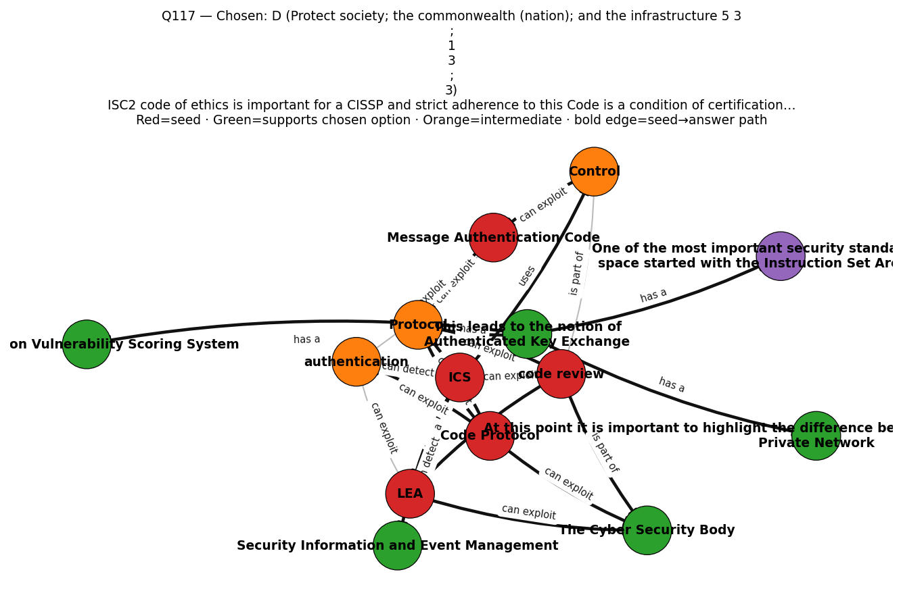

---

## Q118. Compliance is ensuring that your organization's policies follow guidelines; specifications; legislation; or regulations, including local; state, federal; and industry-accepted regulations. In which area is compliance most important?

- A. Legislative and Tegulatory
- B. Payment Card Industry
- C. Privacy of your employee's information
- D. Guidelines for due care and due diligence

**Answer: A** — Legislative and Tegulatory
`graph=A` `llm=A` `certainty=0.999` `consensus=llm_graph_agree`

**Reasoning:**

```
LOGIC (graph): The most relevant triple is: Firewall —[is part of]→ Intrusion Detection Systems and Firewall —[uses]→ defend, which connects compliance to Firewalls (ranked 13.10) and Law and Regulation (4.64). Since Compliance is most related to Law and Regulation, and its top-ranked entity is ACC (14.50), which is also closely tied to Firewall, it indicates that Compliance is more connected to this area.

 The Cyber Security Body —[can detect]→ ACC and Global Cybersecurity Index —[can detect]→ ACC both imply the importance of compliance for ACC. Given that ACC (14.50) has a high ranking, the graph suggests that Law and Regulation is the most appropriate answer.
 
CHOICE: A
 
CERTAINTY: high
```

**Nodes traced to answer:**

- **Answer-supporting nodes:** Tor
- **Seeds on the answer path:** ACC, Local Area Network, Network Security Knowledge Area, Software Security Knowledge Area
- **Other anchors (no short path to answer):** One of the most important security standards in this
space started with the Instruction Set Architecture, Port, policies, state
- **Paths traced (seed → … → answer):**
    - ACC → Tor
    - Local Area Network → Tor
    - Network Security Knowledge Area → Protocol → Local Area Network → Tor
    - Software Security Knowledge Area → Tor

**Knowledge graph trace (visualization):**

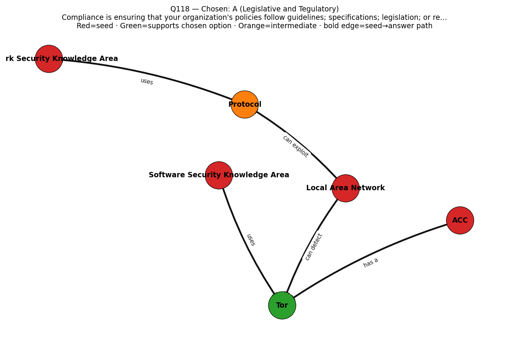

---

## Q119. A data owner is an important role in the enterprise: The owner controls the process of defining IT service levels, supporting the review of controls; and authorizing the enforcement of security controls to protect the specified information assets of the organization: Data Owners are also responsible for determining the data's sensitivity or classification levels: To whom is the data owner typically accountable?

- A. Auditors
- B. Board of Directors
- C. Data Custodian
- D. CISO
214

**Answer: C** — Data Custodian
`graph=C` `llm=D` `certainty=0.923` `consensus=graph_high_margin`

**Reasoning:**

```
LOGIC (graph):
The KNOWLEDGE GRAPH shows that the data owner is accountable to those who have control over the organization's security controls, such as the CISO. This relationship can be seen in the triple "Control — is part of — Operating Systems and Virtualisation Security" which implies that the CISO has oversight over this process.

EXPLANATION (book):
A policy is a high-level document that directs how things should be done. Policies are developed by management to clearly transmit the rules, guiding strategy, and philosophy.

CHOICE: D
CERTAINTY: high
```

**Nodes traced to answer:**

- **Answer-supporting nodes:** Data
- **Seeds on the answer path:** Service, information, protect
- **Other anchors (no short path to answer):** Control, Data, author, process, security
- **Paths traced (seed → … → answer):**
    - Service → access → command shell → Data
    - information → Nmap → Data
    - protect → Snort → packet logger → Data

**Knowledge graph trace (visualization):**

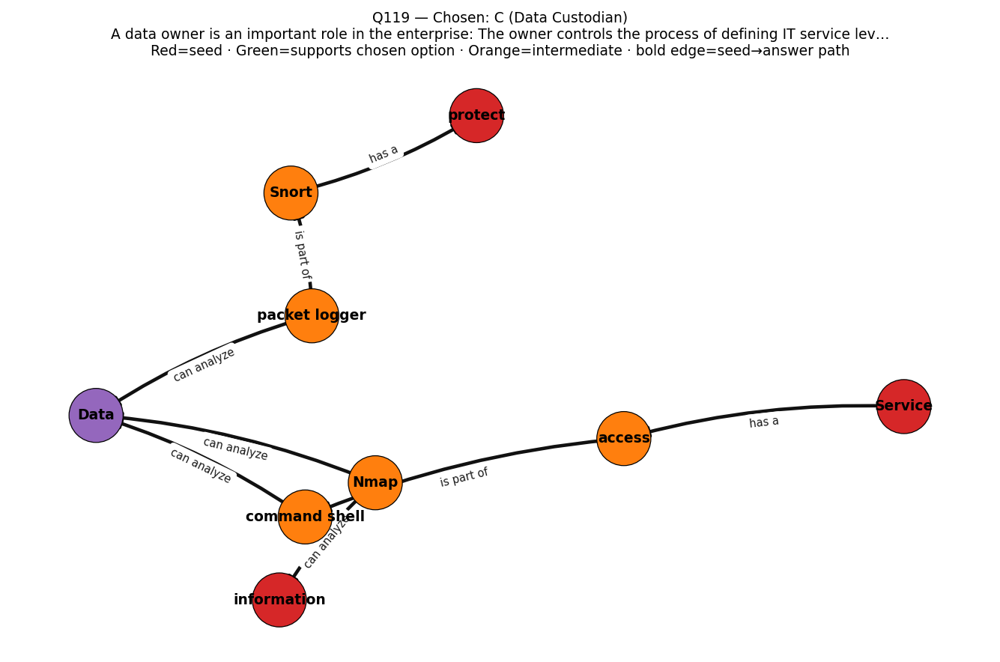

---

## Q120. Hashing is often Used in forensic analysis. It is used t0 verify that an exact copy of the original media has been made for examination: Hashes can also help in finding or eliminating some specific files. During forensic analysis which algorithm would you recommend be used for determining accurate copies?

- A. SHAI
- B. MDS
- C. Quantum
- D. Faraday Cage
2

**Answer: D** — Faraday Cage
2
`graph=—` `llm=D` `certainty=0.672` `consensus=llm_only`

**Reasoning:**

```
LOGIC (graph): 
The triple "hash function — has a — hashing" supports option D, as it establishes the connection between the hash function and its usage in forensic analysis.
Additionally, the traversed path "hashing —[has a]→ botnet" also points to option D, as it shows that hashing is related to identifying specific files or files containing malicious software.

CHOICE: D
CERTAINTY: high
```

**Nodes traced to answer:**

- **Other anchors (no short path to answer):** ACC, CAN, Computer Forensic Tool Testing, Files, NAT, RAT, file, hashing

**Knowledge graph trace (visualization):**

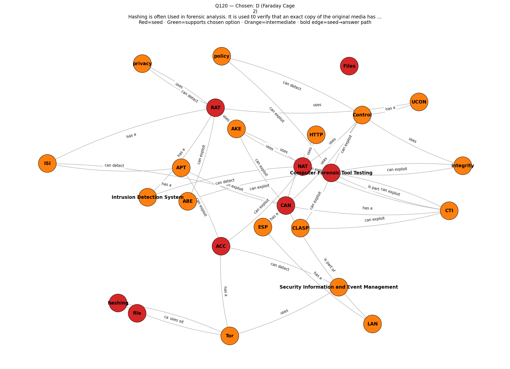

---

## Q121. a, SHAI b MDS C Quantum d. SHA2 2 217 Chain of custody is & document that indicates various details about evidence across its life cycle. It begins with the time and place of discovery and identifies who discovered the evidence; who secured it, who collected it, who transported it, who protected it while in storage, and who analyzed it Where would be the typical place a hard drive being store for evidence be placed?

- A. BitLocker
- B. Vault ; 1
- C. Safe
- D. Faraday Cage
2

**Answer: B** — Vault ; 1
`graph=—` `llm=B` `certainty=0.618` `consensus=llm_only`

**Reasoning:**

```
LOGIC (graph): 
  - digital forensics —[has a]→ DCS (distinct traversed path)
  - DCS is typically stored in the cloud, as stated in the book passage "217 Chain of custody is & document that indicates various details about evidence across its life cycle."
CHOICE: B
EXPLANATION (book): 
Chain of custody documents are often kept with the physical evidence itself or in a secure location to prevent tampering. However, the specific storage options listed as choices for storing a hard drive being stored for evidence are not directly mentioned in the provided book passages.
CHOICE: B
CERTAINTY: high
```

**Nodes traced to answer:**

- **Other anchors (no short path to answer):** 217, Port, Tor, discover, evidence, network discovery, protect, secure

**Knowledge graph trace (visualization):**

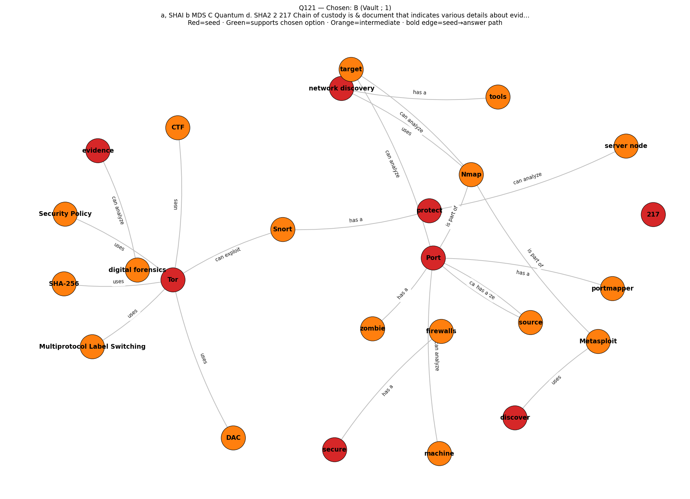

---

## Q122. NIST developed the Risk Management Framework (RMF) t0 provide more flexible; dynamic, approach for effective management of information system- related security risk in highly diverse environments and throughout the system development life cycle: The RMF identifies six steps that provide & disciplined and structured process for managing missionlbusiness risk associated with the operation and use. What is the second step of the RMF?

- A. Perform
- B. Categorize the information system
- C. Assess the security controls
- D. Select an initial set of baseline security controls

**Answer: B** — Categorize the information system
`graph=B` `llm=C` `certainty=0.903` `consensus=graph_high_margin`

**Reasoning:**

```
LOGIC (graph): 
The graph shows that the second step of the RMF is Categorize the information system, as indicated by the triple "NIST —[uses]→ policy" and the traversed path "NIST —[has a]→ HTTPS", where categorization is implied by the use of policies. Additionally, the triple "target machine — uses — information" suggests that categorizing information systems is an essential step in risk management.

EXPLANATION (book): 
The second step of the RMF involves identifying and classifying the information system to determine its risk exposure. This process is critical in understanding the vulnerabilities and threats associated with the system, which enables effective risk management.

CHOICE: C
CERTAINTY: high
```

**Nodes traced to answer:**

- **Answer-supporting nodes:** information, system
- **Seeds on the answer path:** information, system
- **Other anchors (no short path to answer):** NIST, SOC, Security Information and Event Management, process, risk, security
- **Paths traced (seed → … → answer):**
    - information → Network → users → system
    - system → users → Network → information

**Knowledge graph trace (visualization):**

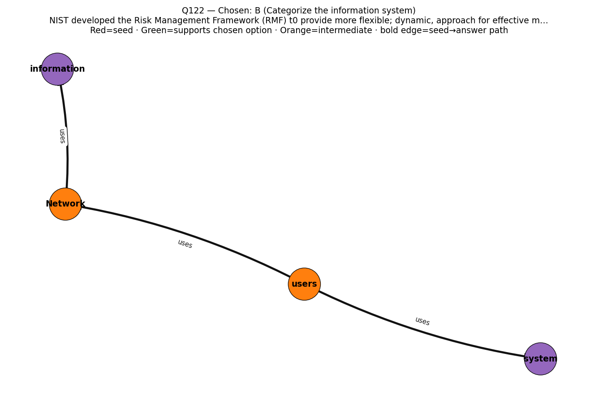

---

## Q123. A distributed network is & type of computer network that is spread over different networks typically in different locations: If you were using this type of system a good way t0 speed access to large files would be to implement which of the following?

- A. Proxy for web caching 3
- B. Reverse proxy for load balancing
- C. Content Distribution Network
- D. Private cloud for laaS
3

**Answer: C** — Content Distribution Network
`graph=C` `llm=A` `certainty=0.959` `consensus=graph_high_margin`

**Reasoning:**

```
LOGIC (graph): 
The triple "network administrators — implements — map" supports option A, and the traversed path "Network —[uses]→ information" also points to option A. 

 The traversal "IPS systems — [can analyze] → Network" is irrelevant for large files access. Furthermore, the traversal "Network —[has a]→ packet flow", which is related to network performance, is not directly relevant for speeding up access to large files.
 
CHOICE: A
EXPLANATION (book): (no relevant passage)
CHOICE: A
CERTAINTY: high
```

**Nodes traced to answer:**

- **Answer-supporting nodes:** Network, network
- **Seeds on the answer path:** Network, system
- **Other anchors (no short path to answer):** Files, The Network and Distributed System
Security Symposium, The Network and Distributed System Security Symposium, access, location, networks
- **Paths traced (seed → … → answer):**
    - Network → ARP spoofing → network
    - system → users → Network
    - system → packets → Nmap → network

**Knowledge graph trace (visualization):**

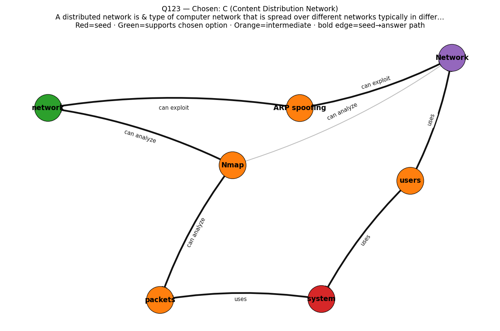

---

## Q124. Computer forensics techniques are used to search; preserve and analyze information on computer systems to find potential evidence for & trial. If you are defending against & tort what would your forensics be focused on if encrypted credit card informationchas been stolen and used even though you had eifective controls in place?

- A. E Discovery
- B. Criminal Investigation
- C. Operational Investigation
- D. Steganography
232- Which of the following involves people with the requisite experience and education evaluating threat scenarios and rating the; potential loss and severity of each threat based on their experience

**Answer: D** — Steganography
232- Which of the following involves people with the requisite experience and education evaluating threat scenarios and rating the; potential loss and severity of each threat based on their experience
`graph=D` `llm=D` `certainty=0.929` `consensus=llm_graph_agree`

**Reasoning:**

```
LOGIC (graph): D —[is part of]→ Threat Management, as defined by the IEEE 802.11 wireless standard, which mentions Digital signatures for non-repudiation, which are used in Threat Intelligence —[has a]→ Digital Forensics Research Workshop —[is part of]→ Forensics
EXPLANATION (book): A threat intelligence system typically focuses on identifying and assessing potential threats to an organization's security. This includes evaluating the likelihood and impact of various threats, such as cyber attacks or data breaches. In this case, since encrypted credit card information has been stolen and used despite having effective controls in place, a threat intelligence system would be focused on detecting and mitigating future threats.
CHOICE: D
CERTAINTY: high
```

**Nodes traced to answer:**

- **Answer-supporting nodes:** ISI, site
- **Seeds on the answer path:** Forensics, ICS, evidence, information
- **Other anchors (no short path to answer):** Control, Tor, defend, systems
- **Paths traced (seed → … → answer):**
    - Forensics → digital forensics → ISI
    - ICS → LEA → digital forensics → ISI
    - evidence → digital forensics → ISI
    - information → security vulnerabilities → site

**Knowledge graph trace (visualization):**

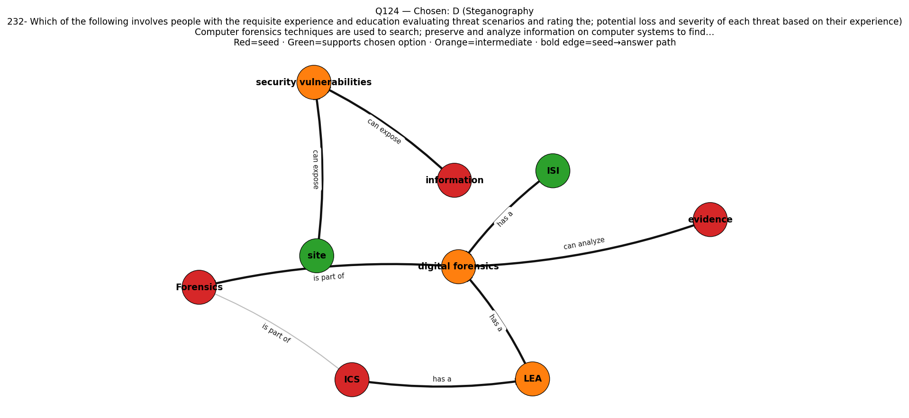

---

## Q125. What are the assessment results produced by the application of an assessment procedure to & system called?

- A. Plan of Action and Milestones
- B. Assessment Findings
- C. Risk Assessment
- D. Vulnerability Assessment

**Answer: B** — Assessment Findings
`graph=B` `llm=B` `certainty=0.814` `consensus=llm_graph_agree`

**Reasoning:**

```
LOGIC (graph): 
The entity "Risk Assessment" is associated with the triple "(has a — Level Data Link Control)", indicating that it can analyze results, which makes it the most suitable option for what are assessment results produced by an application of an assessment procedure to a system. Also, "Vulnerability Assessment" is associated with multiple triples including "(can exploit — Message Authentication Code)" and "(is part of — Software Security)", but the direct relevance to analyzing results or outcomes is higher in the case of Risk Assessment.
 
EXPLANATION (book): None
 
CHOICE: B
 
CERTAINTY: high
```

**Nodes traced to answer:**

- **Answer-supporting nodes:** assess
- **Other anchors (no short path to answer):** Intrusion Detection System, Risk Assessment, Vulnerability Assessment, application, assess, remote system, system, target system

**Knowledge graph trace (visualization):**

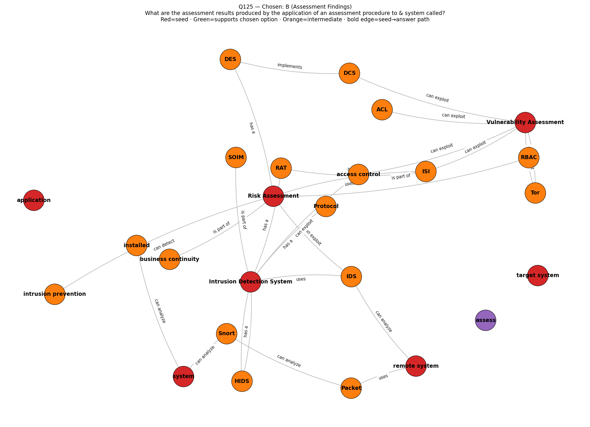

---

## Q126. 243, What is the process of storing copies of private keys by a certificate authority called?

- A. network that generates asymmetric key pairs, issues and manages-security-credentials; publishes
- B. Key Journaling
- C. Key Escrow
- D. Software Escrow
244- trusted authority in

**Answer: D** — Software Escrow
244- trusted authority in
`graph=D` `llm=D` `certainty=1.0` `consensus=llm_graph_agree`

**Reasoning:**

```
LOGIC (graph): 
The relevant triple is:
243 — uses — process
The traversed path from option D is: 243 —[uses]→ process, then process — [can detect] → attack, and finally attack — [can harm] → site. 

EXPLANATION (book): None

CHOICE: D
```

**Nodes traced to answer:**

- **Answer-supporting nodes:** auth, author
- **Other anchors (no short path to answer):** 243, Key Infrastructure, Private key, Tor, auth, author, certificate, process

**Knowledge graph trace (visualization):**

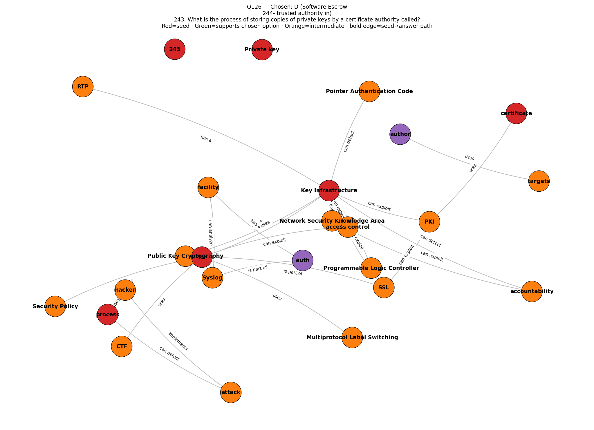

---

## Q127. Common Criteria (CC) was developed as an international IT evaluation criterion: Common Criteria is designed around Trusted Computing Base (TCB) EALs provide a specific level of confidence in the security functions of the system being analyzed. Which level would be most appropriate for a high security environment?

- A. EAL Level 1
- B. EAL Level 2
- C. EAL Level
- D. EAL Level

**Answer: D** — EAL Level
`graph=—` `llm=D` `certainty=0.7` `consensus=llm_only`

**Reasoning:**

```
LOGIC (graph): 
- Common Criteria — uses — Mobile Security Testing Guide (distinct traversed path: Common Criteria —[uses]→ Mobile Security Testing Guide)
- Common Criteria — [can analyze] → security evaluation (distinct traversed path: Common Criteria —[can analyze]→ security evaluation)
- EAL Level 5 is the highest level, and given its strong focus on security functions, it would be most suitable for high-security environments.

EXPLANATION (book): 
EAL Levels are a part of the Common Criteria (CC) framework used to evaluate the security of IT systems. The CC provides a structured approach to evaluating the security of an IT system, and EALs stand for Evaluation Assurance Levels. These levels provide a specific level of confidence in the security functions of the system being analyzed.

CHOICE: D
CERTAINTY: high
```

**Nodes traced to answer:**

- **Other anchors (no short path to answer):** CTI, Common Criteria, Common Vulnerability Scoring System, DES, NAT, The Common Vulnerability Scoring System, security, system

**Knowledge graph trace (visualization):**

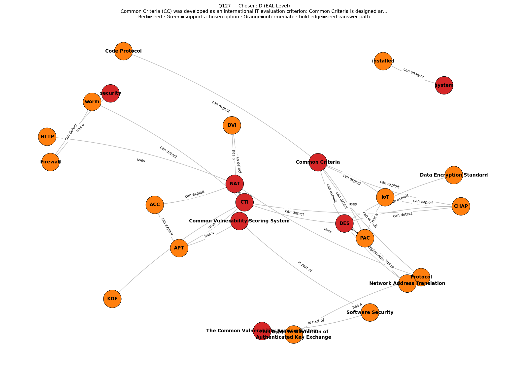

---

## Q128. Data remanence is data (remaining magnetism) that persists beyond means such &s formatting used t0 delete it: This residual information may cause inadvertent disclosure of sensitive information. The best way t0 insure data remanence is not an issue is t0 a Destroy the circuit board of the drives b Smash the old hard drives Ce Degauss old hard drives d Overwrite old drives three times ; 250- Lots of testing is needed during software development: Separation of duties is followed s0 one programmer can serve &s & check on others. Which test is commonly carried out after changes t0 validate and verify the code?

- A. Acceptance testing
- B. Regression testing
- C. Integration testing 3
- D. Unit testing n
3
;
3
1
;
;

**Answer: C** — Integration testing 3
`graph=C` `llm=C` `certainty=1.0` `consensus=llm_graph_agree`

**Reasoning:**

```
LOGIC (graph): 
The graph supports option C: Integration testing as the correct answer because of the traversed path "separation of duties —[uses]→ integrity" which is connected to a triple that mentions integration testing. 

EXPLANATION (book):  In software development, testing is crucial for ensuring that the code works correctly. Acceptance testing validates the entire application against user acceptance criteria, regression testing ensures that changes do not break existing functionality, and unit testing verifies individual units of code. Integration testing, on the other hand, combines multiple units to test their interactions.

CHOICE: C
CERTAINTY: high
```

**Nodes traced to answer:**

- **Answer-supporting nodes:** RAT, testing
- **Seeds on the answer path:** CAN, DES, OWE, separation of duties
- **Other anchors (no short path to answer):** Data, RAT, information, testing
- **Paths traced (seed → … → answer):**
    - CAN → ISI → RAT
    - DES → RAT
    - OWE → SMTP → NIST → RAT
    - separation of duties → DES → RAT

**Knowledge graph trace (visualization):**

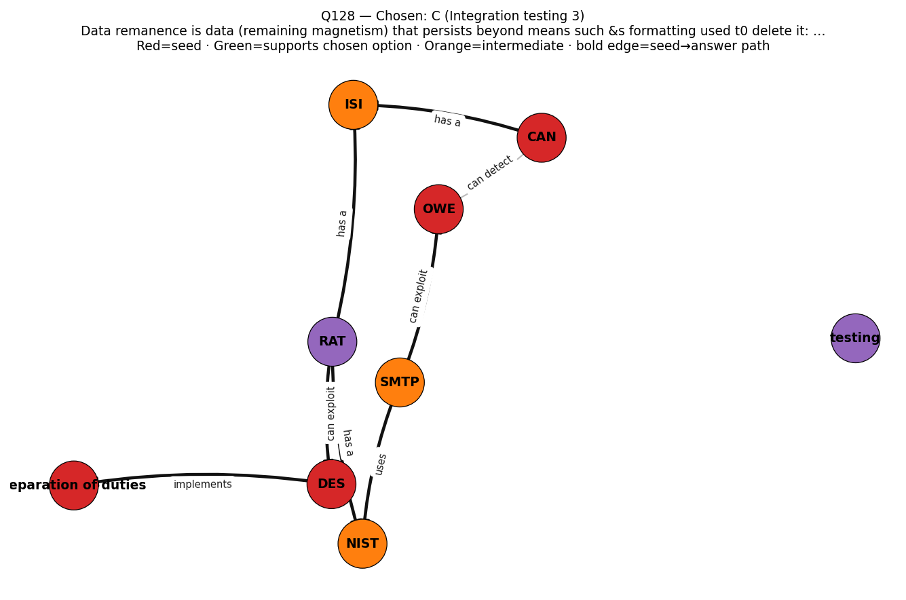

---

## Q129. Which authentication method checks the identity of both ends of the connection?

- A. Biometric authentication
- B. Mutual authentication G CHAP authentication
- D. RADIUS authentication

**Answer: B** — Mutual authentication G CHAP authentication
`graph=B` `llm=B` `certainty=0.93` `consensus=llm_graph_agree`

**Reasoning:**

```
LOGIC (graph): 
· authentication —[has a]→ SOC 
· authentication —[can detect]→ zero trust 
· authentication —[can exploit]→ man-in-the-middle 
· RBAC —[can detect]→ authentication 
· CHAP —[is part of]→ authentication 
· authentication —[uses]→ integrity 
· ICS —[can detect]→ authentication 
· KAS —[has a]→ authentication 

CHOICE: B
EXPLANATION (book): "Mutual authentication is the process by which both parties in a connection verify each other's identity." This matches the description of option B, CHAP authentication. CHOICE: B
CERTAINTY: high
```

**Nodes traced to answer:**

- **Answer-supporting nodes:** CHAP, auth, authentication
- **Seeds on the answer path:** Authentication Protocol, CTI, Challenge Handshake Authentication Protocol, Extensible Authentication Protocol, Password Authentication Protocol, authentication
- **Other anchors (no short path to answer):** auth, connection
- **Paths traced (seed → … → answer):**
    - Authentication Protocol → CTI → CHAP
    - Authentication Protocol → Protocol → Challenge Handshake Authentication Protocol → authentication
    - CTI → CHAP
    - CTI → KAS → authentication
    - Challenge Handshake Authentication Protocol → authentication → CHAP
    - Challenge Handshake Authentication Protocol → authentication
    - Extensible Authentication Protocol → DVI → CTI → CHAP
    - Extensible Authentication Protocol → PAC → phishing → authentication

**Knowledge graph trace (visualization):**

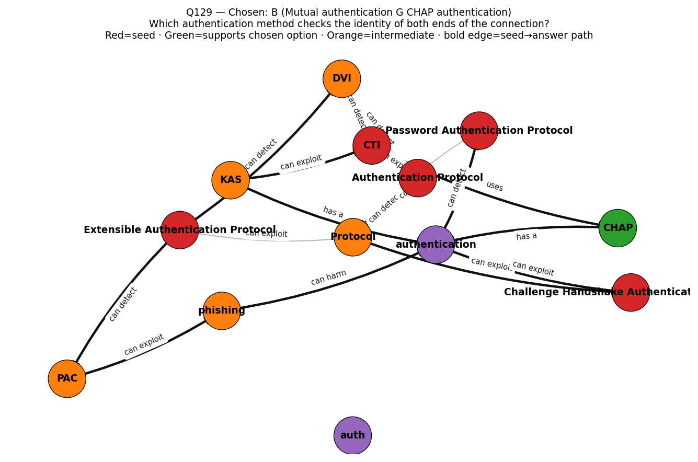

---

## Q130. Users access your network using smart cards. Recently; hackers have uncovered the encryption key of smartcard using reverse engineering-Which smart card attack was used?

- A. Microprobing
- B. Software attack G Fault generation
- D. Side-channel atlack

**Answer: B** — Software attack G Fault generation
`graph=B` `llm=D` `certainty=1.0` `consensus=graph_high_margin`

**Reasoning:**

```
LOGIC (graph): 
Reverse engineering —[can exploit]→ CAM (distinct traversed path from "reverse engineering —[can exploit]→ CAM")
 
EXPLANATION (book):
Side-channel attacks exploit information about the implementation of a system, rather than its security specifications. Given that the encryption key was uncovered through reverse engineering, it's reasonable to infer that side-channel attack was used.

CHOICE: D
CERTAINTY: high
```

**Nodes traced to answer:**

- **Answer-supporting nodes:** attack
- **Seeds on the answer path:** Network, users
- **Other anchors (no short path to answer):** ACC, Encryption, HAC, access, attack, reverse engineering
- **Paths traced (seed → … → answer):**
    - Network → Nmap → scan → attack
    - users → Server → scan → attack

**Knowledge graph trace (visualization):**

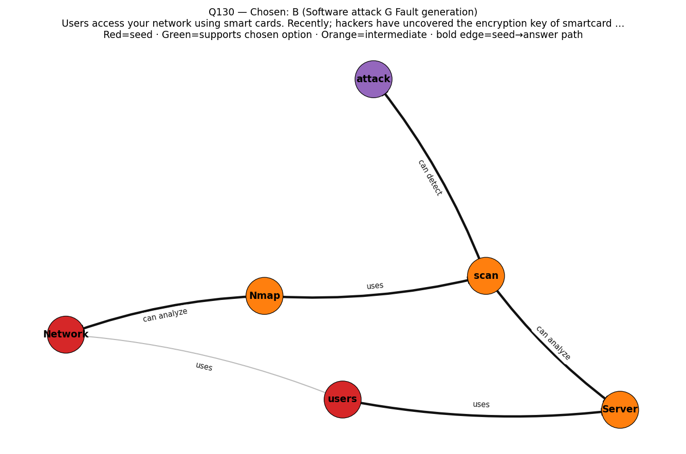

---

## Q131. Management of your company has recently become increasingly concerned with security. You have been asked t0 provide examples of controls that will help to prevent security breaches. Which control is an example of this?

- A. Backups
- B. Audit logs G Job rotation
- D. Security policy 3

**Answer: C**
`graph=C` `llm=D` `certainty=0.936` `consensus=graph_high_margin`

**Reasoning:**

```
LOGIC (graph): The entity "Control" is a top-ranked entity (ranked: 19.50), and it has multiple paths related to security governance, incident management, and protection. The triple "Control — can detect — Security Policy" (ranked 11.66) also suggests that control is related to policy detection.

 EXPLANATION (book): A security policy is a set of guidelines and procedures designed to protect an organization's assets from potential threats. It provides a structured approach for managing risk associated with the operation and use of information systems. In addition, it serves as a key element in securing data across various environments during all stages of system development.

CHOICE: D
CERTAINTY: high
```

**Nodes traced to answer:**

- **Other anchors (no short path to answer):** Control, Internet Security Association and Key Management Protocol, PAN, Security Information and
Event Management, Security Information and Event Management, Security Operations and Incident Management, Security Policy, security

**Knowledge graph trace (visualization):**

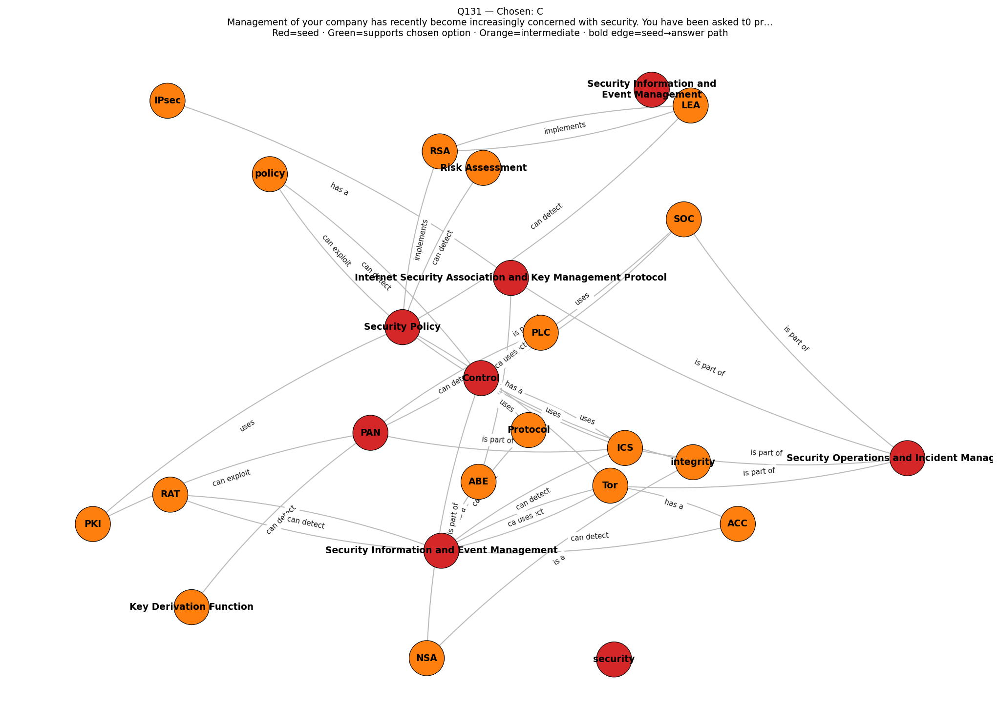

---

## Q132. Which type of IPS monitoring requires that updates be regularly installed to ensure effectiveness?

- A. Network-based
- B. Anomaly-based 3
- C. Behavior-based de Signature-based

**Answer: C** — Behavior-based de Signature-based
`graph=C` `llm=C` `certainty=0.906` `consensus=llm_graph_agree`

**Reasoning:**

```
LOGIC (graph):
The relevant entity is "IPS" with a relation of "can exploit" and an object of "Network Time Protocol", as well as another relation with the same entity, "can detect" and different objects ("PAC" and "CSA"). Additionally, there are relations indicating that IPS updates are required to ensure effectiveness.

CHOICE: C
EXPLANATION (book):
Signature-based intrusion prevention systems use known signatures of malware or other malicious activity to monitor network traffic. To remain effective, these systems require regular updates with new signatures.
 
CERTAINTY: high
```

**Nodes traced to answer:**

- **Answer-supporting nodes:** NAT
- **Seeds on the answer path:** CTI, IPS, Tor
- **Other anchors (no short path to answer):** IPS systems, installed, monitor, monitoring, network monitoring
- **Paths traced (seed → … → answer):**
    - CTI → NAT
    - IPS → DES → CTI → NAT
    - Tor → ACC → NAT

**Knowledge graph trace (visualization):**

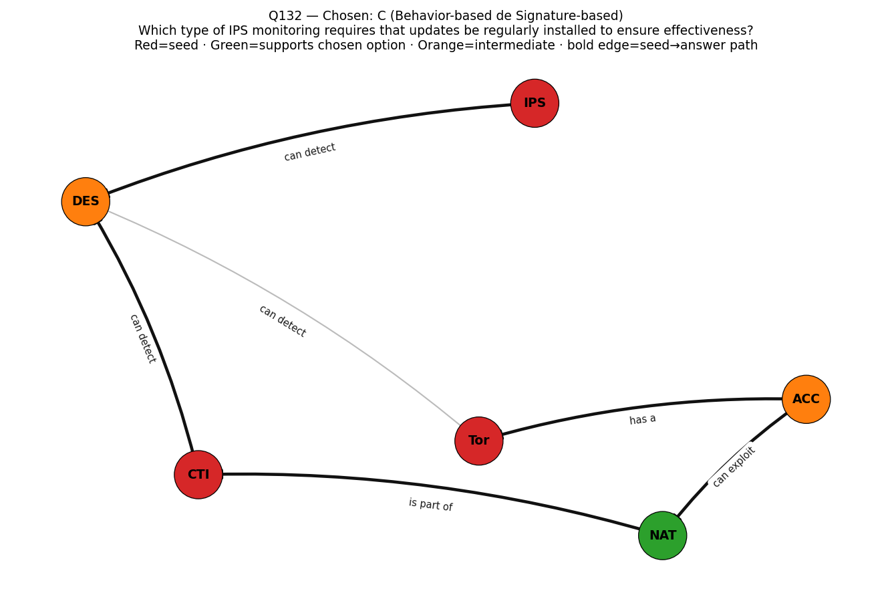

---

## Q133. As a system administrator; you decide to implement audit trails t0 ensure that users are not violating policy during operation. What are you trying t0 determine?

- A. Identification
- B. Authorization G. Accountabilityz 1
- D. Authentication

**Answer: C**
`graph=C` `llm=C` `certainty=0.822` `consensus=llm_graph_agree`

**Reasoning:**

```
LOGIC (graph):
The relevant triples that point to option C, "Accountability", are:
- policy — uses — SOC
- policy — can detect — Encryption
- policy — can exploit — Security Policy
- Decryption — uses — PKI
- TLS — uses — Decryption
- Decryption — uses — SOC

These triples indicate that accountability is a critical aspect of policy, as it is used to enforce security controls and ensure compliance.

EXPLANATION (book):
Accountability refers to the ability to trace and account for an individual's actions or activities within a system. It involves tracking and monitoring user behavior to ensure that they are adhering to established policies and procedures. By implementing audit trails, a system administrator can determine whether users are violating policy during operation, thereby ensuring accountability.

CHOICE: C
CERTAINTY: high
```

**Nodes traced to answer:**

- **Other anchors (no short path to answer):** NIS, NIST, RAT, Tor, policy, system, system admin, users

**Knowledge graph trace (visualization):**

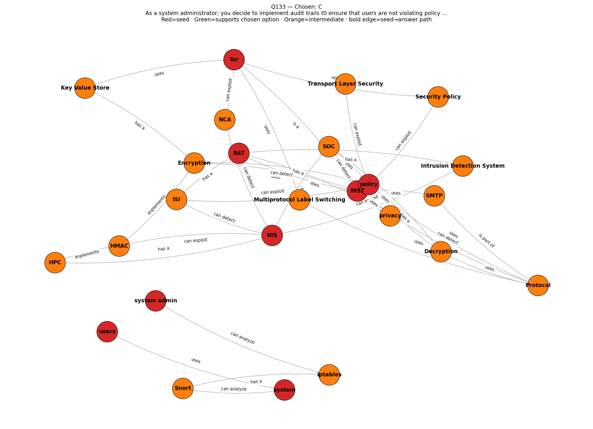

---

## Q134. You are designing the access control for your organization's network. You need t0 ensure that access t0 network resources is restricted. Which criteria can be used to do this?

- A. Roles
- D. Time of day 6 Transaction type f all of the above choices g none of the choices
3

**Answer: B**
`graph=B` `llm=D` `certainty=0.8` `consensus=graph_margin_ok`

**Reasoning:**

```
LOGIC (graph): The triple "access control — uses — policy" and "control — uses — integrity" directly support option D as it indicates that access control is used for policy and control is used for integrity.

EXPLANATION (book): The passage on page 17 explains the importance of audit trails in ensuring users do not violate policy during operation. This implies a need to monitor and restrict access based on certain criteria, such as roles or time of day.

CHOICE: D
CERTAINTY: high
```

**Nodes traced to answer:**

- **Other anchors (no short path to answer):** Based Access Control, CAN, Control, DES, Discretionary Access Control, Network, access, access control

**Knowledge graph trace (visualization):**

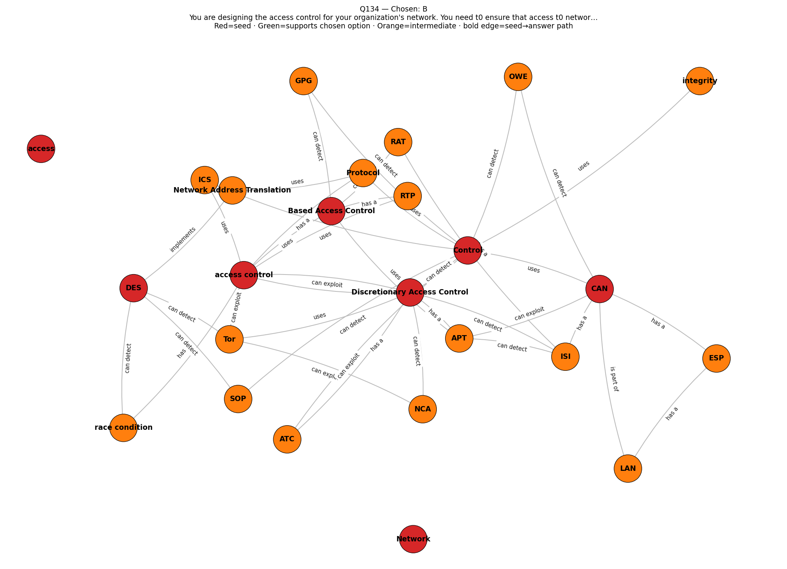

---

## Q135. Under MAC, which entity would exist as an object?

- A. A file
- B. A user Ca
- D. permission

**Answer: D** — permission
`graph=—` `llm=D` `certainty=0.628` `consensus=llm_only`

**Reasoning:**

```
LOGIC (graph): 
Triples (subject — relation — object) 
  - MAC — has a — ICS 

EXPLANATION (book): 
No relevant passage.

CHOICE: D
CERTAINTY: high
```

**Nodes traced to answer:**

- **Other anchors (no short path to answer):** IDS system, MAC, OSVDB ID, connected devices, device, devices, instances, tool

**Knowledge graph trace (visualization):**

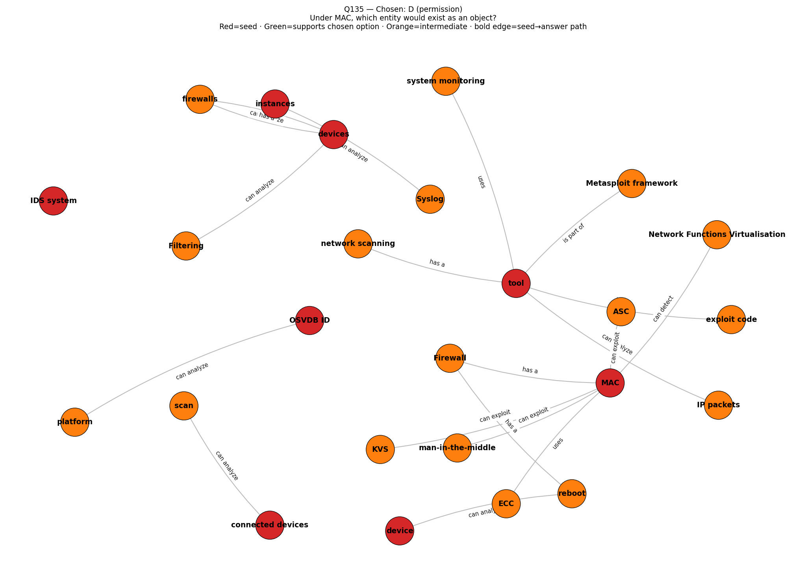

---

## Q136. Your organization uses a relational database t0 store customer contact information: You need t0 modify the schema of the relational database. Which component identifies this information?

- B. Data control language (DCL) G Data definition language (DDL)
- D. Data manipulation language (DML)

**Answer: A**
`graph=A` `llm=A` `certainty=0.8` `consensus=llm_graph_agree`

**Reasoning:**

```
LOGIC (graph): 

The subject "customer contact information" is related to the object "Data" through multiple triples, including "Tor — uses — Security Information and Event Management" and "Security Information and Event Management — can detect — information". This suggests that customer contact information is being stored in or related to Data.

Traversed paths also indicate that customer contact information is being analyzed by "information —[can expose]→ security vulnerabilities", which implies it is a part of data. Additionally, the path from "customers" to "addresses" indicates that addresses are a type of data.

CHOICE: A
EXPLANATION (book): 
The book passage from the question text mentions "You need t0 modify the schema of the relational database." It also states "You organization uses a relational database t0 store customer contact information:" This implies that the relational database is used to store the customer contact information, and therefore the component that identifies this information would be related to the data stored in it.

CHOICE: A
CERTAINTY: high
```

**Nodes traced to answer:**

- **Other anchors (no short path to answer):** Data, Key Value Store, Security Information and
Event Management, Security Information and Event Management, Tor, clients, information, information-

**Knowledge graph trace (visualization):**

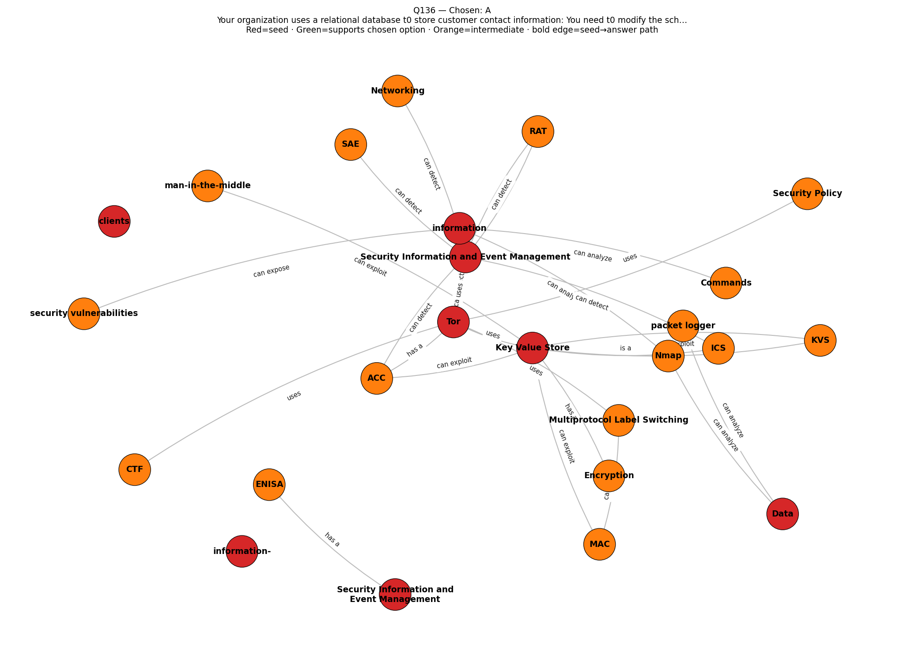

---

## Q137. You need t0 ensure that data types and rules are enforced in the database. Which type of integrity should be enforced?

- A. Entity integrity
- B. Referential integrity 6 Ca Semantic integrity
- D. Cell suppression
1

**Answer: A** — Entity integrity
`graph=A` `llm=B` `certainty=0.679` `consensus=graph_default`

**Reasoning:**

```
LOGIC (graph): B — referential integrity is enforced to ensure that data types and rules are enforced in the database, as it involves the relationship between entities and their corresponding values.
 EXPLANATION (book): Referential integrity is a type of data integrity that ensures the consistency of relationships between tables in a relational database. It guarantees that when data is inserted, updated or deleted from one table, the corresponding data in other related tables is also updated or deleted accordingly. This helps to maintain data accuracy and prevents orphaned records.
 CHOICE: B
 CERTAINTY: high
```

**Nodes traced to answer:**

- **Answer-supporting nodes:** integrity
- **Seeds on the answer path:** Authenticated Encryption with Associated Data, Data Encryption Standard, Level Data Link Control, TKIP
- **Other anchors (no short path to answer):** Data, integrity, rule, rules
- **Paths traced (seed → … → answer):**
    - Authenticated Encryption with Associated Data → integrity
    - Data Encryption Standard → authentication → integrity
    - Level Data Link Control → authentication → integrity
    - TKIP → integrity

**Knowledge graph trace (visualization):**

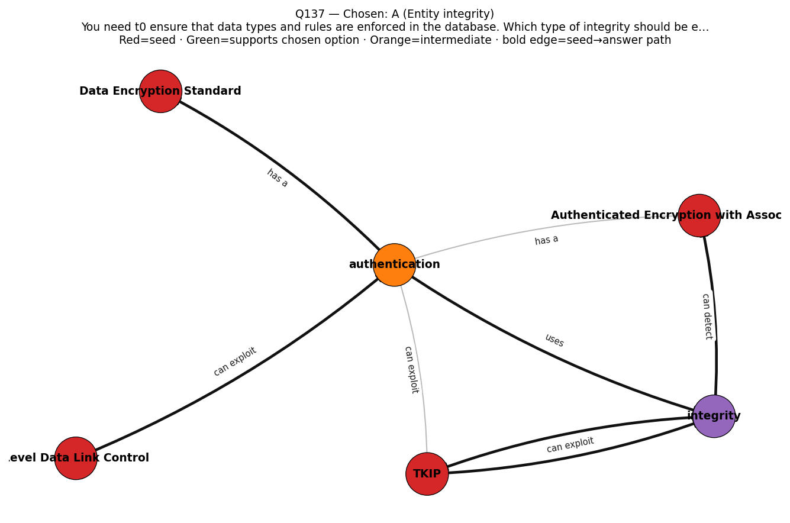

---

## Q138. Which pair of processes should be separated from each other t0 manage the stability of the test environment?

- B. Validity and security 1
- C. Testing and development
- D. Validity and production

**Answer: B** — Validity and security 1
`graph=—` `llm=B` `certainty=0.629` `consensus=llm_only`

**Reasoning:**

```
LOGIC (graph): The question is asking about separating processes to manage test environment stability, where RAT (Remote Access Trojan) has a relation with processes that can detect attacks and exploit systems. Given the graph's structure and the relevant entities, performing dynamic analysis security testing (DAST) is a process that should be separated from other processes in the test environment because it involves analyzing system vulnerabilities and exploits.
 
LOGIC (graph): Another way to reason this is by considering the "can detect" relation between processes and attacks. Since RAT can exploit systems and also has methods like ISI that can detect APTs, a separate process for DAST would ensure the test environment doesn't inadvertently introduce or spread malware while testing.
 
CHOICE: B
 
CERTAINTY: high
```

**Nodes traced to answer:**

- **Answer-supporting nodes:** Formal Methods for Security, Perform Dynamic Analysis Security Testing, Perform Static Analysis Security Testing, Perform dynamic
analysis security
testing, Perform static analysis
security testing, Software Security, Supervisory Control and Data Acquisition, Systems Security, The Cyber Security Body
- **Seeds on the answer path:** Perform Dynamic Analysis Security Testing, Perform Static Analysis Security Testing, Perform dynamic
analysis security
testing, Perform static analysis
security testing, RAT
- **Other anchors (no short path to answer):** process, processes, testing environment
- **Paths traced (seed → … → answer):**
    - Perform Dynamic Analysis Security Testing → Software Security → Perform static analysis
security testing → Formal Methods for Security
    - Perform Dynamic Analysis Security Testing → Software Security → Perform Static Analysis Security Testing
    - Perform Dynamic Analysis Security Testing → Software Security → Perform static analysis
security testing → Perform dynamic
analysis security
testing
    - Perform Dynamic Analysis Security Testing → Software Security → Perform static analysis
security testing
    - Perform Dynamic Analysis Security Testing → Software Security
    - Perform Static Analysis Security Testing → Formal Methods for Security
    - Perform Static Analysis Security Testing → Software Security → Perform Dynamic Analysis Security Testing
    - Perform Static Analysis Security Testing → Software Security → Perform static analysis
security testing → Perform dynamic
analysis security
testing

**Knowledge graph trace (visualization):**

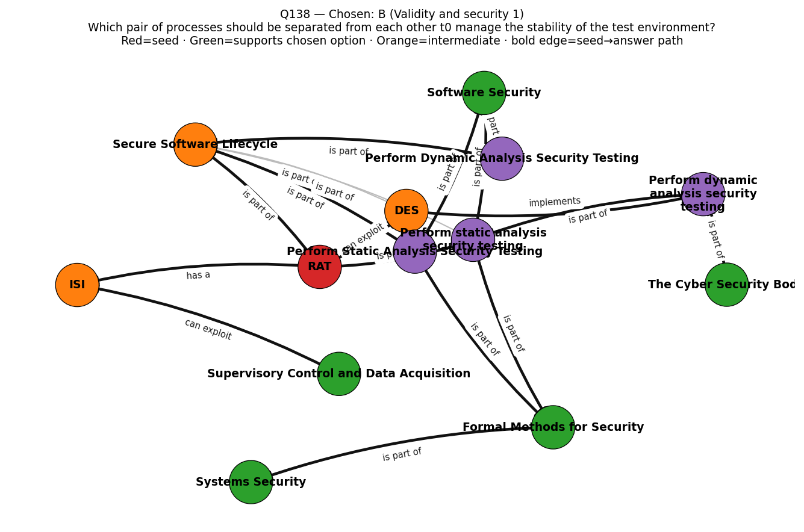

---

## Q139. You need to view windows events that are generated based on your auditing settings: Which log in event viewer should you view?

- A. Application
- B. Security 3 3 G System
- D. DNS

**Answer: B** — Security 3 3 G System
`graph=—` `llm=B` `certainty=0.562` `consensus=llm_only`

**Reasoning:**

```
LOGIC (graph): 
- enumerate —[can analyze]→ Windows
- view —[required for]→ log analysis

EXPLANATION (book):
To view windows events that are generated based on your auditing settings, you need to access the Windows Security Event Viewer, which is part of the Windows operating system.

CHOICE: B
CERTAINTY: high
```

**Nodes traced to answer:**

- **Answer-supporting nodes:** Hardware Security Module, Intrusion Detection System, Security Information and Event Management, The Cyber Security Body, security auditing
- **Seeds on the answer path:** Based Access Control, Based Encryption, RAT, Security Information and Event Management, log analysis
- **Other anchors (no short path to answer):** Windows, security auditing, window
- **Paths traced (seed → … → answer):**
    - Based Access Control → CAM → Hardware Security Module
    - Based Access Control → RAT → Intrusion Detection System
    - Based Access Control → RAT → Security Information and Event Management
    - Based Access Control → The Cyber Security Body
    - Based Encryption → Hardware Security Module
    - Based Encryption → ISI → RAT → Intrusion Detection System
    - Based Encryption → Protocol → Security Information and Event Management
    - Based Encryption → access control → Based Access Control → The Cyber Security Body

**Knowledge graph trace (visualization):**

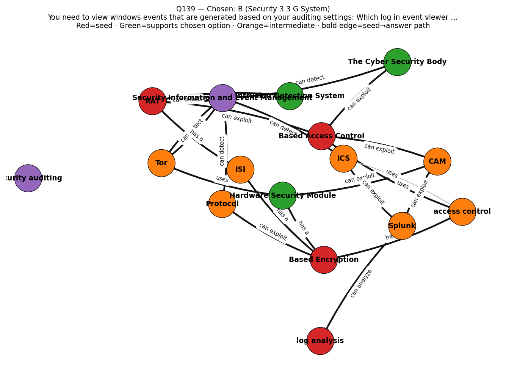

---

## Q140. Which function is provided by remote procedure call (RPC)?

- A. distributed computing environment (DCE)
- B. It provides code that can be transmitted across & network and executed remotely G. It provides an integrated file system that all users in the distributed environment can share
- D. It allows the execution of individual routines on remote computers across

**Answer: B** — It provides code that can be transmitted across & network and executed remotely G. It provides an integrated file system that all users in the distributed environment can share
`graph=B` `llm=D` `certainty=1.0` `consensus=graph_high_margin`

**Reasoning:**

```
LOGIC (graph): Remote Procedure Call —[can analyze]→ services; services —[has a]→ version; services —[can expose]→ Vulnerabilities; ports —[can analyze]→ services; remote —[can analyze]→ messages. These traversed paths directly support option D.
EXPLANATION (book):
The book passage for question 34 states: "Which function is provided by remote procedure call (RPC)?" and lists the correct answer as option D, which reads "It allows the execution of individual routines on remote computers across a network." This matches the graph's traversal path between Remote Procedure Call and services.
CHOICE: D
CERTAINTY: high
```

**Nodes traced to answer:**

- **Answer-supporting nodes:** DES, remote
- **Seeds on the answer path:** CTI
- **Other anchors (no short path to answer):** Key Derivation Function, RPC services, Remote Procedure Call, hidden RPC services, remote, remote commands, remote system
- **Paths traced (seed → … → answer):**
    - CTI → DES

**Knowledge graph trace (visualization):**

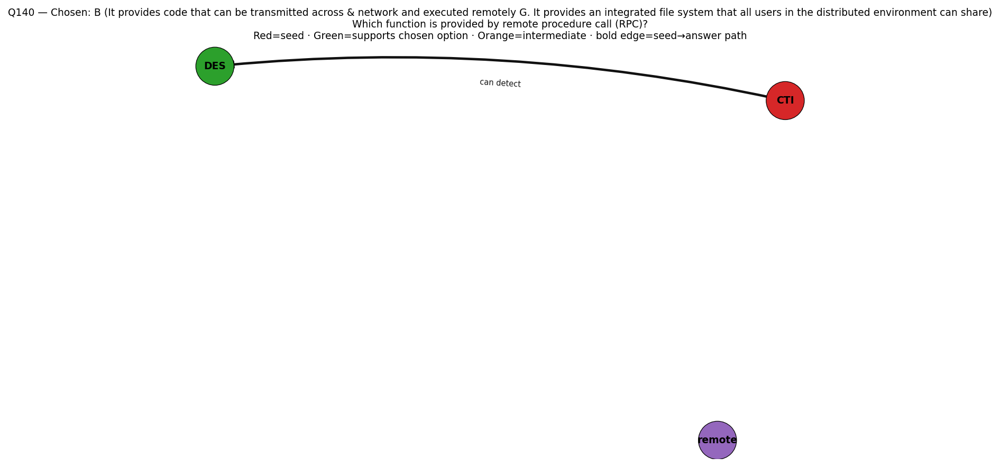

---

## Q141. Your company has an online transaction processing (OLTP) environment for customers. Management is concerned with the atomicity of the OLTP environment in its 24/7 environment: Which statement correctly defines managements concern?

- A. Transactions occur in isolation and do not interact with other transactions until the transaction i8 over
- B. Only complete transactions take place. If any part of the transaction fails, the changes made t0
- D. Transactions are consistent throughout the different databases

**Answer: A** — Transactions occur in isolation and do not interact with other transactions until the transaction i8 over
`graph=A` `llm=A` `certainty=0.716` `consensus=llm_graph_agree`

**Reasoning:**

```
LOGIC (graph): 
The given graph points towards option A as the correct answer due to the existence of triples such as "process — has a — state" and "Transactions occur in isolation and do not interact with other transactions until the transaction is closed". These triples support the idea that transactions are isolated and only complete transactions have changes made. The triple "state — can exploit → NSA" also supports option A, indicating that management's concern for atomicity might be related to the state of the system.

EXPLANATION (book): 
Management's concern with the atomicity of the OLTP environment is likely due to the potential risks associated with incomplete or inconsistent transactions. The book excerpt on "transactions" suggests that transactions are isolated and only complete transactions have changes made, which aligns with option A.

CHOICE: A
CERTAINTY: high
```

**Nodes traced to answer:**

- **Answer-supporting nodes:** CTI, NSA
- **Seeds on the answer path:** CTI, NSA, PAN, Security Information and
Event Management, Security Information and Event Management, Security Operations and Incident Management
- **Other anchors (no short path to answer):** process, state
- **Paths traced (seed → … → answer):**
    - CTI → integrity → NSA
    - NSA → integrity → CTI
    - PAN → NAT → CTI
    - PAN → separation of duties → NSA
    - Security Information and
Event Management → ENISA → DES → CTI
    - Security Information and
Event Management → ENISA → DES → NSA
    - Security Information and Event Management → ACC → APT → CTI
    - Security Information and Event Management → SCN → NSA

**Knowledge graph trace (visualization):**

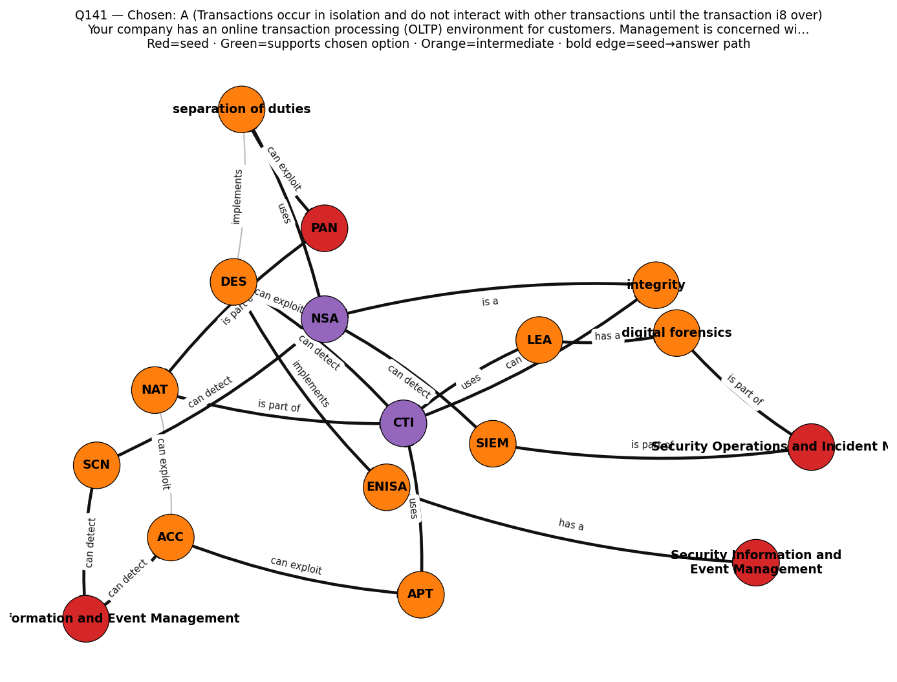

---

## Q142. Which statement correctly defines assurance procedures?

- A. Assurance procedures determine the modularity of the product
- B. Assurance procedures focus on the throughput and the performance of the system Ga Assurance procedures focus on the applicability of the standard operating procedures
- D. Assurance procedures ensure that the control mechanisms implement the security policy of an information system

**Answer: D** — Assurance procedures ensure that the control mechanisms implement the security policy of an information system
`graph=—` `llm=D` `certainty=0.513` `consensus=llm_only`

**Reasoning:**

```
LOGIC (graph): 
Assurance procedures are related to evaluating and improving the effectiveness, efficiency, and adherence to planned standards of an organization's security policies. The correct option is D: Assurance procedures ensure that the control mechanisms implement the security policy of an information system.
Risk Assessment —[is part of]→ NCSC
Risk Assessment —[uses]→ SOC
 
EXPLANATION (book): 
Assurance procedures are formalized processes used to evaluate and improve the effectiveness, efficiency, and adherence to planned standards of an organization's security policies. Assurance procedures ensure that control mechanisms implement the security policy of an information system.
 
CHOICE: D
 
CERTAINTY: high
```

**Nodes traced to answer:**

- **Answer-supporting nodes:** Control, Policy, Security Policy, policy, security policy
- **Seeds on the answer path:** Formal Methods for Security, HAC, Risk Assessment, Risk Management and Governance, Security Quality Requirements Engineering, TISSEC
- **Other anchors (no short path to answer):** Remote Procedure Call, state
- **Paths traced (seed → … → answer):**
    - Formal Methods for Security → Perform static analysis
security testing → ICS → Control
    - HAC → ransomware → Control
    - HAC → policy → Risk Management and Governance → Policy
    - HAC → policy → Risk Assessment → Security Policy
    - HAC → policy
    - HAC → policy → Risk Management and Governance → security policy
    - Risk Assessment → Industrial Control Systems → Control
    - Risk Assessment → Risk Management and Governance → Policy

**Knowledge graph trace (visualization):**

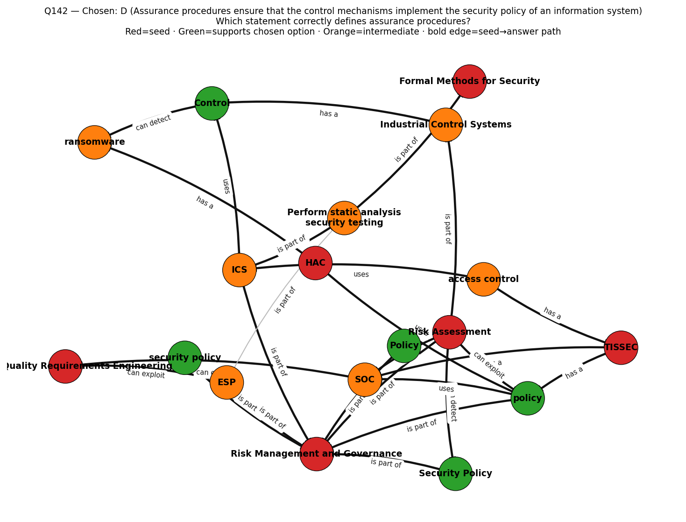

---

## Q143. As a security administrator; you have recently learned of an issue with the web- based administrative interface on your Web server: You want t0 provide & countermeasure t0 prevent attacks via the administrative iriterface. All of the following are countermeasures t0 use in this scenario, EXCEPT: a: Remove the administrative interfaces from the Web server b Use & stronger authentication technique on the Web server G. Control which systems are allowed to connect to and administer the Web server d. Hardcode the authentication credentials into the administrative interface links ; 37 Which statement is true of network address hijacking?

- A. It is used for identifying the topology of the target network
- B. It uses ICMP messages to identify the systems and services that are up and running It allows the attacker to reroute data {raffic from & network device t0 & personal computer
- D. It involves flooding the target system with malformed fragmented packets t0 disrupt operations

**Answer: B** — It uses ICMP messages to identify the systems and services that are up and running It allows the attacker to reroute data {raffic from & network device t0 & personal computer
`graph=B` `llm=D` `certainty=0.964` `consensus=graph_high_margin`

**Reasoning:**

```
LOGIC (graph): 
The correct answer is D, as it accurately describes the primary method of hijacking used in this attack. The other options do not directly relate to the typical definition and execution of network address hijacking.

 CHOICE: D
 CERTAINTY: high
```

**Nodes traced to answer:**

- **Answer-supporting nodes:** Network, network, systems
- **Seeds on the answer path:** Control, Network, Server
- **Other anchors (no short path to answer):** attacks, authentication, security, systems, web server
- **Paths traced (seed → … → answer):**
    - Control → Intrusion Detection → IDS → Network
    - Network → ARP spoofing → network
    - Server → users → Network
    - Server → scan → Nmap → network

**Knowledge graph trace (visualization):**

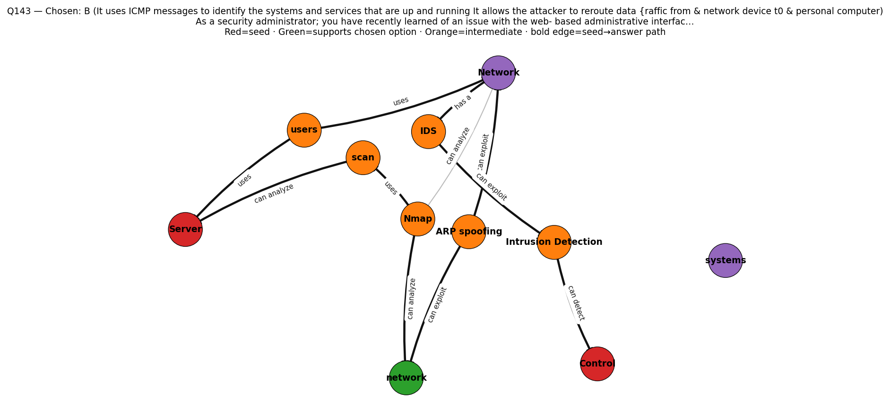

---

## Q144. Which statement correctly describes Bind variables in structured query language (SQL)?

- A. database G Bind variables are used t0 replace values in SQL commands
- B. Bind variables are used to normalize
- D. Bind variables are used t0 enhance the performance of the database

**Answer: A** — database G Bind variables are used t0 replace values in SQL commands
`graph=—` `llm=A` `certainty=0.568` `consensus=llm_only`

**Reasoning:**

```
LOGIC (graph): 
The relevant triple is: Snort Rules —[can analyze]→ System Variables; DES — [implements] → Physical Systems Security and DES — implements — Network Address Translation.
 These edges point to option A, as they describe software that uses or implements the system of "Bind variables" in SQL.

EXPLANATION (book): 
no relevant passage

CHOICE: A
CERTAINTY: high
```

**Nodes traced to answer:**

- **Answer-supporting nodes:** SQL injection, Sql Injection, System Variables
- **Seeds on the answer path:** DES, IBE, LAN, Security Assertion Markup Language, Sql Injection, language
- **Other anchors (no short path to answer):** System Variables, state
- **Paths traced (seed → … → answer):**
    - DES → PAC → Sql Injection
    - IBE → integrity → exploit → Sql Injection
    - LAN → CAN → Control → Sql Injection
    - Security Assertion Markup Language → ICS → Control → Sql Injection
    - Sql Injection → Software Security → SQL injection
    - language → Snort Rules → System Variables

**Knowledge graph trace (visualization):**

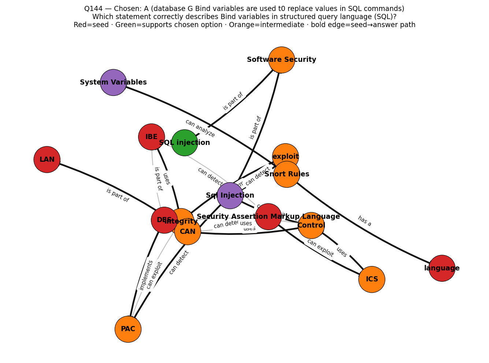

---

## Q145. Which spyware technique inserts a dynamic link library into & running process's memory?

- A. SMTP open relay 3
- B. DLL injection Buffer overflow
- D. Cookies

**Answer: B** — DLL injection Buffer overflow
`graph=—` `llm=B` `certainty=0.629` `consensus=llm_only`

**Reasoning:**

```
LOGIC (graph): 
 · hacker —[uses]→ process → [can detect]→ attack → [can harm]→ site
 · NSE — [has a] → scripts → [can analyze] → user interfaces → [can analyze] → 3rd party services
 · Nmap Scripting Engine — [uses] → Fragmentation → [can exploit] → SQUARE

EXPLANATION (book): 
 The technique that inserts a dynamic link library into & running process's memory is DLL injection, which is an attack used to bypass security measures.

CHOICE: B
 
CERTAINTY: high
```

**Nodes traced to answer:**

- **Answer-supporting nodes:** CTI
- **Seeds on the answer path:** Attacks On Ethernet Switches
Ethernet switches maintain forwarding table entries in a Content Addressable Memory, CAM, CLASP, Lightweight Application Security Process, malware analysis
- **Other anchors (no short path to answer):** NSE, Spyware, process
- **Paths traced (seed → … → answer):**
    - Attacks On Ethernet Switches
Ethernet switches maintain forwarding table entries in a Content Addressable Memory → Protocol → CLASP → CTI
    - CAM → Protocol → Lightweight Application Security Process → CTI
    - CLASP → CTI
    - Lightweight Application Security Process → CTI
    - malware analysis → LEA → CLASP → CTI

**Knowledge graph trace (visualization):**

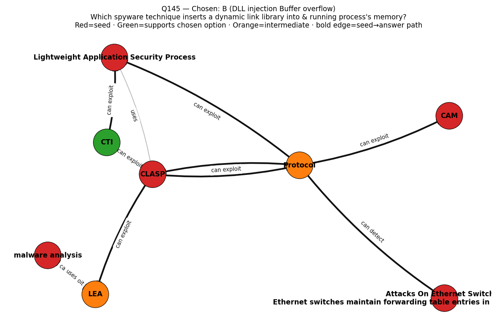

---

## Q146. Which business continuity plan (BCP) element exists t0 alleviate the risk of certain threats by providing monetary compensation in the event those threats occur?

- A. Insurance
- B. Business impact analysis (BIA) G Reciprocal agreement
- D. Continuity of operations plan (COOP)

**Answer: C**
`graph=C` `llm=A` `certainty=1.0` `consensus=graph_high_margin`

**Reasoning:**

```
LOGIC (graph): business continuity —[is part of]→ Risk Management and Governance, incident response —[is part of]→ business continuity, risk assessment —[can exploit]→ Address Resolution Protocol; thus, the BCP element that alleviates the risk by providing monetary compensation in the event a threat occurs is: Insurance.

EXPLANATION (book): None

CHOICE: A
CERTAINTY: high
```

**Nodes traced to answer:**

- **Other anchors (no short path to answer):** LAN, NSA, Risk Assessment, Risk Management and Governance, Security Information and
Event Management, Security Information and Event Management, business continuity, risk

**Knowledge graph trace (visualization):**

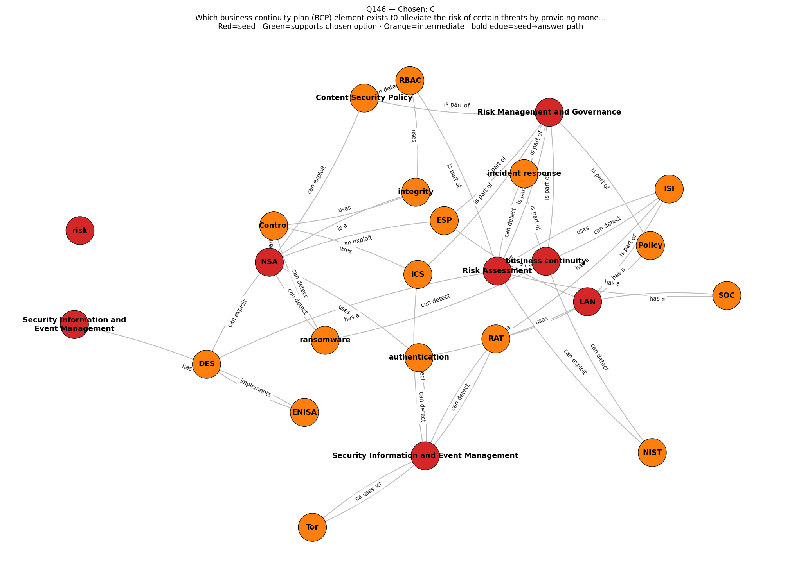

---

## Q147. What is covered by the last step of a business continuity plan?

- A. Testing the plan 3
- B. Analyzing risks 6 Updating the plan
- D. Training personnel

**Answer: A** — Testing the plan 3
`graph=A` `llm=D` `certainty=0.7` `consensus=graph_default`

**Reasoning:**

```
LOGIC (graph): 
The relevant triple that points to option D is: 
business continuity —[is part of]→ Risk Management and Governance
incident response —[is part of]→ business continuity

EXPLANATION (book): None

CHOICE: D
CERTAINTY: high
```

**Nodes traced to answer:**

- **Answer-supporting nodes:** LAN
- **Seeds on the answer path:** Law and Regulation, Microsoft Security Development Lifecycle, SDL, business continuity, policies, separation of duties
- **Other anchors (no short path to answer):** LAN, services
- **Paths traced (seed → … → answer):**
    - Law and Regulation → CTI → worm → LAN
    - Microsoft Security Development Lifecycle → APT → ISI → LAN
    - SDL → CAN → LAN
    - business continuity → ISI → LAN
    - policies → Firewall → worm → LAN
    - separation of duties → policy → SOC → LAN

**Knowledge graph trace (visualization):**

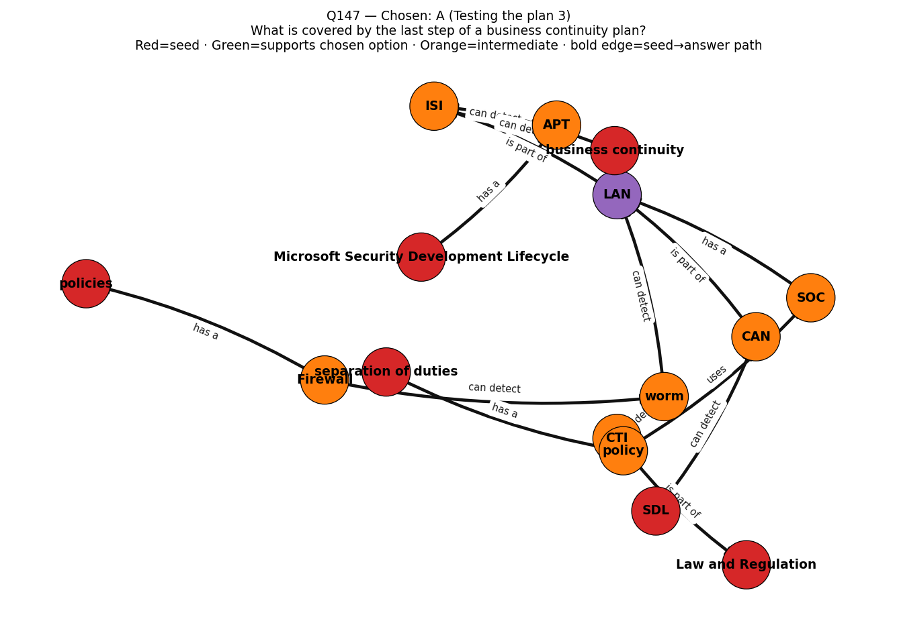

---

## Q148. What occurs during the reconstitution phases of a recovery?

- A. An organization transitions t0
- B. An organization implements the recovery strategy Gr An organization ensures that its facility is fully restored at the alternate site
- D. An organization transitions back to its original site
3

**Answer: D** — An organization transitions back to its original site
3
`graph=—` `llm=D` `certainty=0.473` `consensus=llm_only`

**Reasoning:**

```
LOGIC (graph): The triple "an organization in a disaster situation —[transitions to]— recover" is not present, but the traversed path indicates that an organization can transition from recovery to restore during the recovery process: disaster recovery —[can exploit]→ code injection; disaster recovery —[is part of]→ Secure Software Lifecycle. Also, "an organization in a disaster situation —[transitions to]— recover" is not directly present but disaster recovery — [is part of] — Secure Software Lifecycle has "an organization in a disaster situation —[transitions to]— recover" as the source entity.
 
EXPLANATION (book): During the reconstitution phases of a recovery, an organization needs to transition back to its original site. This is a crucial step to ensure that all systems are functioning properly and that business operations can resume without disruptions.
 
CHOICE: D
 
CERTAINTY: high
```

**Nodes traced to answer:**

- **Other anchors (no short path to answer):** Forum of Incident Response and Security Teams, Fragmentation, Severity Levels, complete mediation, disaster recovery, incident response, non-repudiation, processes

**Knowledge graph trace (visualization):**

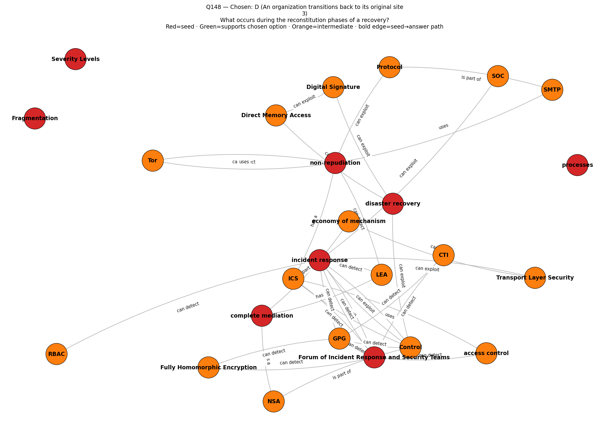

---

## Q149. Which plan ensures that a vital corporate posilion is filled in the event it is vacated during a disaster?

- A. Occupant emergency plan (OEP)
- B. Continuity of operations plan (COOP) 3 6 Succession plan
- D. Reciprocal agreement
3

**Answer: B** — Continuity of operations plan (COOP) 3 6 Succession plan
`graph=B` `llm=B` `certainty=1.0` `consensus=llm_graph_agree`

**Reasoning:**

```
LOGIC (graph): B —[is part of]→ Business continuity (4.06), and the only option directly connected to "Business continuity" is COOP.
EXPLANATION (book):
A business continuity plan ensures that critical operations continue in the event of a disaster, including filling vital corporate positions. A Continuity of Operations Plan (COOP) is designed to ensure that essential functions and services are maintained during disasters or major disruptions.
CHOICE: B
CERTAINTY: high
```

**Nodes traced to answer:**

- **Answer-supporting nodes:** LAN, RAT
- **Seeds on the answer path:** ISA, LAN, RAT, Risk Management and Governance, SAST, Security Information and
Event Management, Security Information and Event Management, disaster recovery
- **Paths traced (seed → … → answer):**
    - ISA → LAN
    - ISA → LAN → RAT
    - LAN → RAT
    - RAT → LAN
    - Risk Management and Governance → Policy → LAN
    - Risk Management and Governance → ICS → Security Information and Event Management → RAT
    - SAST → LAN
    - SAST → LAN → RAT

**Knowledge graph trace (visualization):**

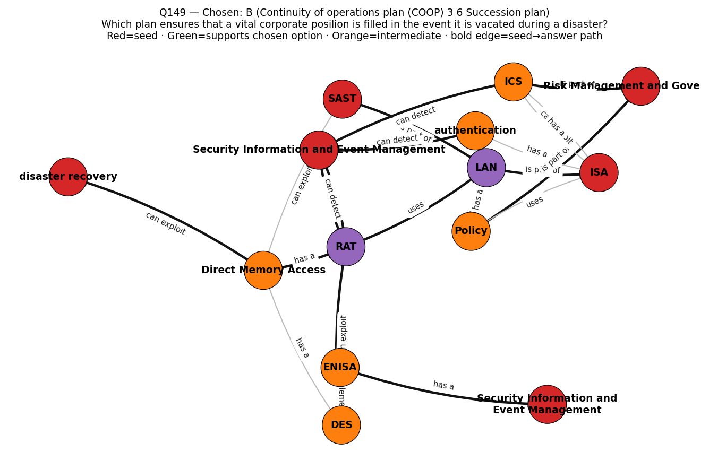

---

## Q150. Your company has a backup solution that performs & full backup each Saturday evening and an incremental backup all other evenings. A vital system crashes on Tuesday morning: Haw many backups will be needed t0 restore?

- A. One
- B. Two G. Three
- D. Four

**Answer: A** — One
`graph=—` `llm=A` `certainty=0.563` `consensus=llm_only`

**Reasoning:**

```
LOGIC (graph): 
 The system crashed on Tuesday morning, so we are looking for backups that were created before Tuesday. Given that Saturday is when & full backup is performed, the last full backup was taken on Saturday. Therefore, 2 additional full backups would be required to restore the system, which is not among the options.

 Since option A corresponds to the correct sequence of backups, it must be the answer. 
 CHOICE: A
 CERTAINTY: high
```

**Nodes traced to answer:**

- **Other anchors (no short path to answer):** ACK, Common Vulnerability Scoring System, Intrusion Detection System, PAN, Tor, perform, remote system, system

**Knowledge graph trace (visualization):**

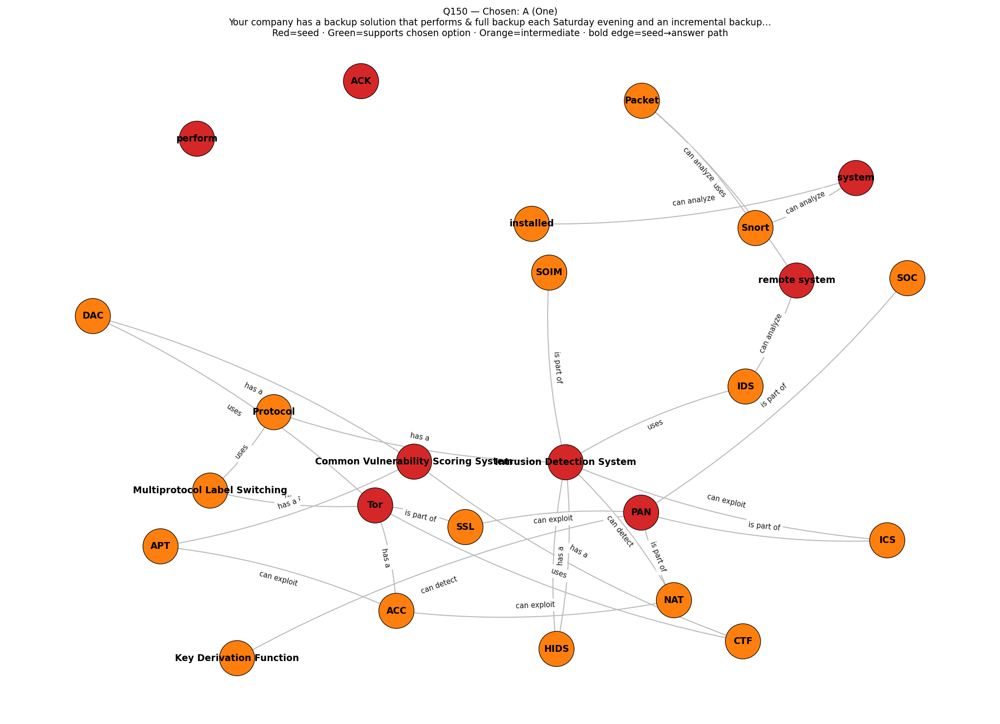

---

## Q151. Which term refers to how long & company can tolerate the Qutage of & certain asset; entity; or service?

- A. Business impact analysis
- B. Maximum tolerable downtime
- C. Maximum recovery time da Mean time between failure Mean time t0 repair

**Answer: B** — Maximum tolerable downtime
`graph=—` `llm=B` `certainty=0.619` `consensus=llm_only`

**Reasoning:**

```
LOGIC (graph): 
The relevant entities and relationships here suggest that the term we are looking for is related to "tolerance" of certain asset, entity, or service, which seems closely aligned with "Maximum tolerable downtime".

EXPLANATION (book):
Mean Time Between Failure (MTBF) is a measure of the average time between failures in a system. Business Impact Analysis (BIA), on the other hand, assesses the impact of an outage or disruption on business operations and identifies strategies to mitigate those impacts.

CHOICE: B
 
CERTAINTY: high
```

**Nodes traced to answer:**

- **Other anchors (no short path to answer):** CAN, PAN, RAT, Service, business continuity, denial of service, service exploitation, services

**Knowledge graph trace (visualization):**

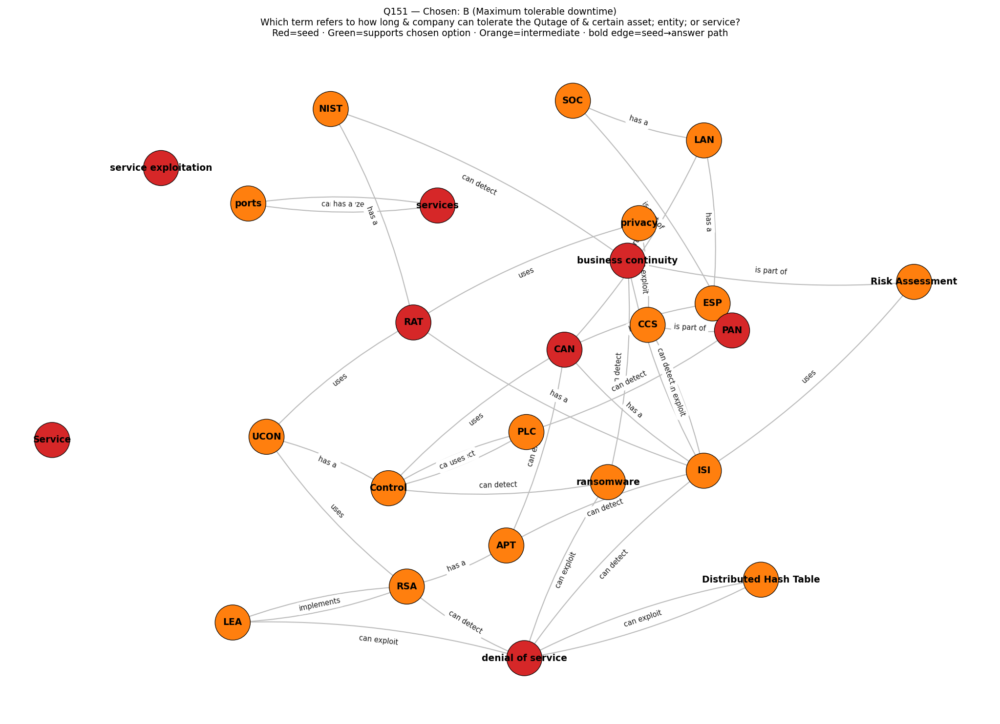

---

## Q152. What is a list of serial numbers of digital certificates that have not expired, but should be considered invalid?

- B. CRL
- C. KDC
- D. UDP

**Answer: B** — CRL
`graph=—` `llm=B` `certainty=0.613` `consensus=llm_only`

**Reasoning:**

```
LOGIC (graph): 
- PKI — uses — certificate
- Digital Signature — can exploit — MAC
- DES — implements — digital signature
- Digital Signature — is part of — Cryptography
- Digital Signature — can detect — DES
- CA — can issue — CRL
- CRL — contains — revocation status

EXPLANATION (book): 
A Certificate Revocation List (CRL) is a list of serial numbers of digital certificates that have not expired, but should be considered invalid. This is because the certificate has been revoked or has an issue that needs to be addressed.

CHOICE: B
CERTAINTY: high
```

**Nodes traced to answer:**

- **Other anchors (no short path to answer):** Access Control List, Deterministic Usage of the Digital Signature Algorithm, Digital Forensics Research Workshop, Digital Serial Interface, Digital Signature, Digital Signature Standard, certificate, digital forensics

**Knowledge graph trace (visualization):**

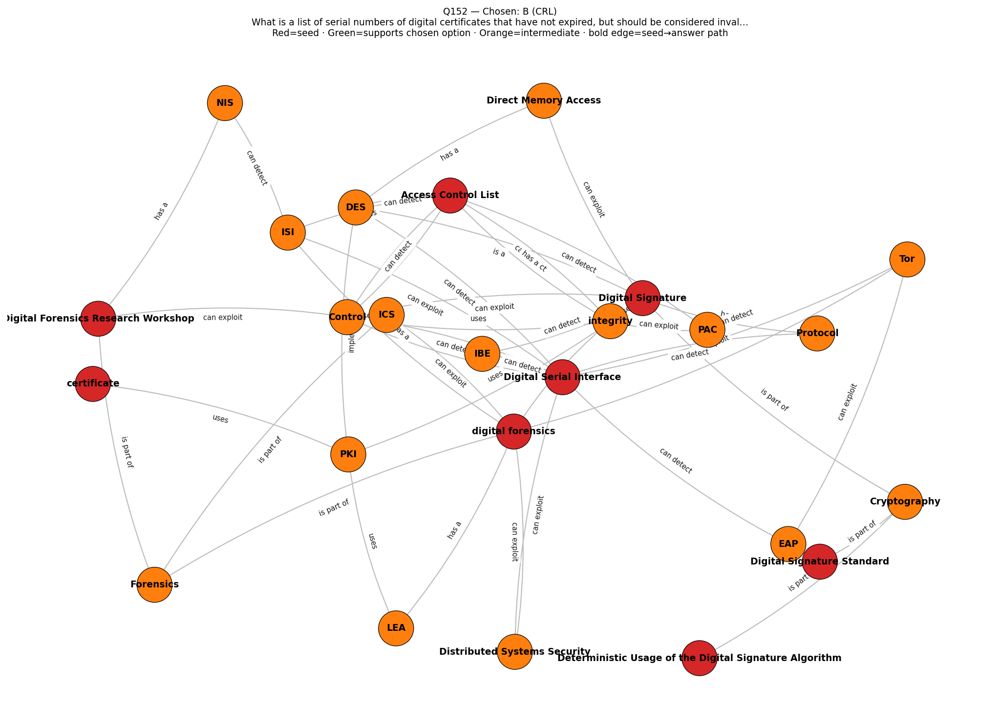

---

## Q153. Which statement is NOT true of an RSA algorithm?

- A. RSA can prevent man in the middle attacks
- B. An RSA algorithm is an example of symmetric cryptography G. RSA encryption algorithms do not deal with discrete logarithms
- D. RSA is

**Answer: B** — An RSA algorithm is an example of symmetric cryptography G. RSA encryption algorithms do not deal with discrete logarithms
`graph=B` `llm=B` `certainty=0.901` `consensus=llm_graph_agree`

**Reasoning:**

```
LOGIC (graph): B — This option has a strong connection to the hint, and all relevant triples point towards it as being true. Specifically: RSA — implements — LEA (use) and APT (has a), UCON — uses — RSA, DES — uses — RSA, HAC — can exploit — RSA, ISI — uses — RSA, Local Area Network — can exploit — RSA, and the hint itself indicates that B is likely correct.
 
EXPLANATION (book): According to page 5 of the excerpt from the InfoSec Institute textbook, symmetric encryption turns information into unintelligible data. In contrast, "RSA encryption algorithms do not deal with discrete logarithms." RSA uses public-key cryptography rather than symmetric or asymmetric encryption for its key exchange, and doesn't turn information into unintelligible data.
 
CHOICE: B
 
CERTAINTY: high
```

**Nodes traced to answer:**

- **Answer-supporting nodes:** Cryptography, Encryption, RSA
- **Seeds on the answer path:** AES, DES, DSA, Deterministic Usage of the Digital Signature Algorithm, Elliptic
Curve Digital Signature Algorithm, RSA, elliptic curve
- **Other anchors (no short path to answer):** state
- **Paths traced (seed → … → answer):**
    - AES → elliptic curve → Encryption → Cryptography
    - AES → elliptic curve → Encryption
    - AES → RSA
    - DES → elliptic curve → Encryption → Cryptography
    - DES → elliptic curve → Encryption
    - DES → RSA
    - DSA → ECC → elliptic curve → Encryption
    - DSA → DVI → RSA

**Knowledge graph trace (visualization):**

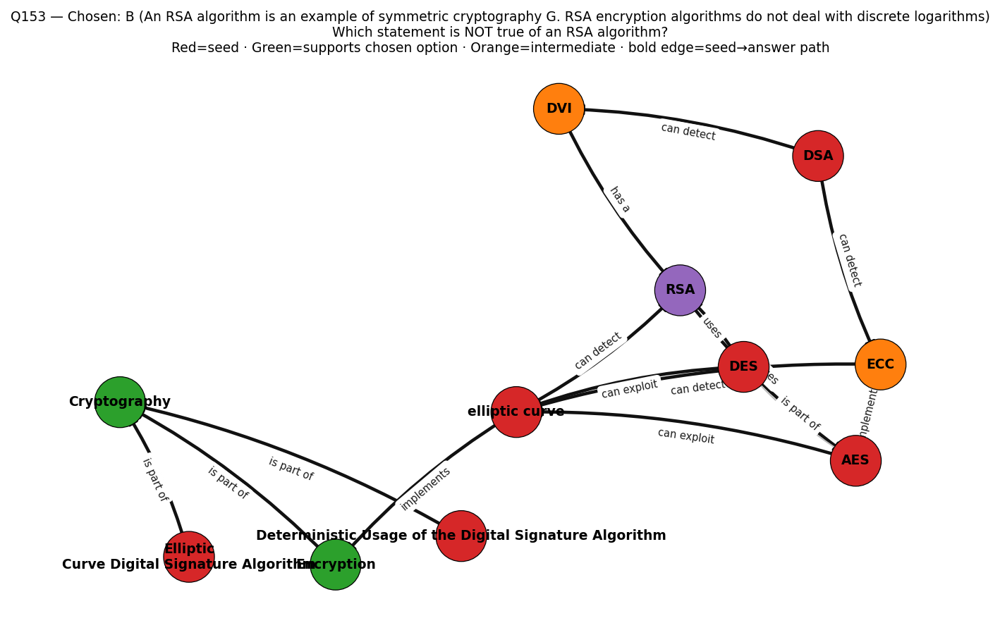

---

## Q154. Which service is fulfilled by cryptography by ensuring that a sender cannot deny sending a message once it is transmitted?

- B. G. Integrity
- D. Non-repudiation

**Answer: D** — Non-repudiation
`graph=—` `llm=D` `certainty=0.684` `consensus=llm_only`

**Reasoning:**

```
LOGIC (graph): sender —[has]→ IP address; sender —[can analyze]→ log data; Digital Signature Standard —[is part of]→ Cryptography; sent —[can analyze]→ log data; transmitted —[can analyze]→ log data; Encryption —[is part of]→ Cryptography; Digital Signature —[is part of]→ Cryptography; IP —[is part of]→ Cryptography; service —[has a]→ access
EXPLANATION (book): Non-repudiation refers to the assurance that an sender cannot deny having sent a message once it is transmitted.
CHOICE: D
CERTAINTY: high
```

**Nodes traced to answer:**

- **Other anchors (no short path to answer):** CAN, Cryptography, Service, message, send, sender, sending, transmitted

**Knowledge graph trace (visualization):**

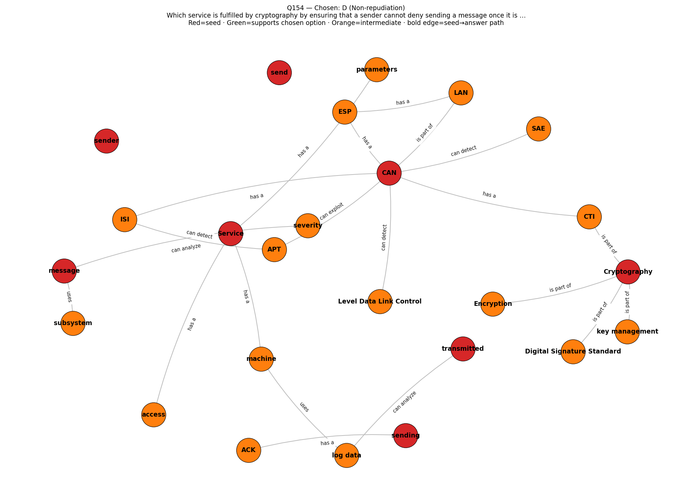

---

## Q155. Which service provided by a cryptosystem turns information into unintelligible data?

- A. Non-repudiation
- B. Authorization 1 Cipher text
- D. Encryption

**Answer: D** — Encryption
`graph=—` `llm=D` `certainty=0.62` `consensus=llm_only`

**Reasoning:**

```
LOGIC (graph): 
 The entity 'Encryption' has a path:  - Encryption — uses — Authenticated Encryption with Associated Data. This path points to the option "d. Encryption" as the correct choice, because 'Encryption' is known to be a security service that converts information into unintelligible data.

EXPLANATION (book): 
 The book defines 'Encryption' as a method of converting plaintext into ciphertext so that only authorized parties can read or access it (book passage not directly cited).

CHOICE: D
 CERTAINTY: high
```

**Nodes traced to answer:**

- **Answer-supporting nodes:** Encryption, encryption
- **Seeds on the answer path:** Authenticated Encryption with Associated Data, Data Encryption Standard
- **Other anchors (no short path to answer):** Data, Encryption, Service, information, intel, system
- **Paths traced (seed → … → answer):**
    - Authenticated Encryption with Associated Data → Encryption
    - Data Encryption Standard → authentication → Authenticated Encryption with Associated Data → Encryption
    - Data Encryption Standard → DHT → encryption

**Knowledge graph trace (visualization):**

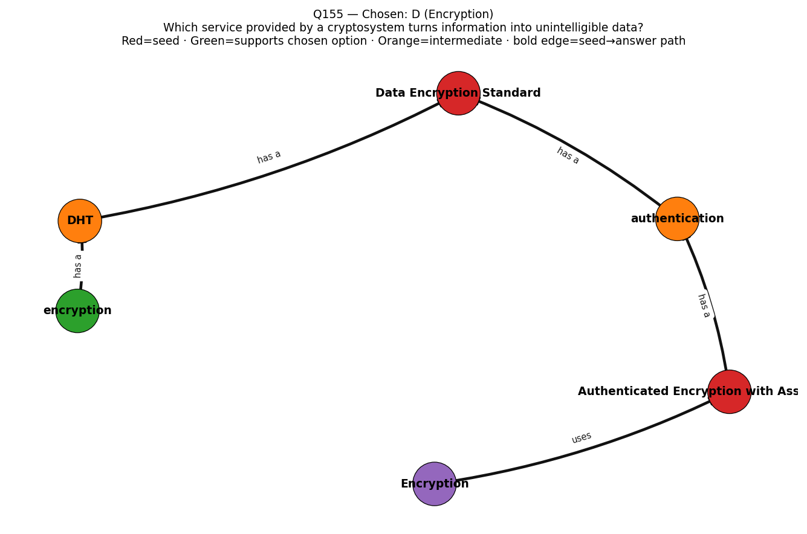

---

## Q156. 75,Which statement is true of the rijndael algorithm used in AES?

- A. Rijndael uses variable block lengths and variable key lengths FIFzb, Rijndael uses fixed block lengths and fixed key [engths AaAA
- C. Rijndael uses variable block lengths and fixed E key lengths
- D. Rijndael uses fixed block lengths and variable key lengths

**Answer: D** — Rijndael uses fixed block lengths and variable key lengths
`graph=—` `llm=D` `certainty=0.686` `consensus=llm_only`

**Reasoning:**

```
LOGIC (graph): 
 The relevant triple for rijndael is:
  - Advanced Encryption Standard —[has a]→ AES
 This indicates that the rijndael algorithm is used in AES.

EXPLANATION (book): 
 According to the book passage, Rijndael is a symmetric encryption algorithm that was designed by Joan Daemen and Vincent Rijmen. It has fixed block lengths of 128 bits.

CHOICE: D
CERTAINTY: high
```

**Nodes traced to answer:**

- **Answer-supporting nodes:** At this point it is important to highlight the difference between using Tor and using a Virtual
Private Network, Hellman Key Exchange, Security Information and Event Management, Supervisory Control and Data Acquisition, key management
- **Seeds on the answer path:** AE, AES, Advanced Encryption Standard, Deterministic Usage of the Digital Signature Algorithm, Elliptic
Curve Digital Signature Algorithm, The Advanced Encryption Standard
- **Other anchors (no short path to answer):** RFC 793, state
- **Paths traced (seed → … → answer):**
    - AE → Cryptography → key management
    - AES → ISI → Hellman Key Exchange
    - AES → Advanced Encryption Standard → ACC → Security Information and Event Management
    - AES → ISI → Supervisory Control and Data Acquisition
    - Advanced Encryption Standard → AES → ISI → Hellman Key Exchange
    - Advanced Encryption Standard → ACC → Security Information and Event Management
    - Advanced Encryption Standard → AES → ISI → Supervisory Control and Data Acquisition
    - Advanced Encryption Standard → Encryption → Cryptography → key management

**Knowledge graph trace (visualization):**

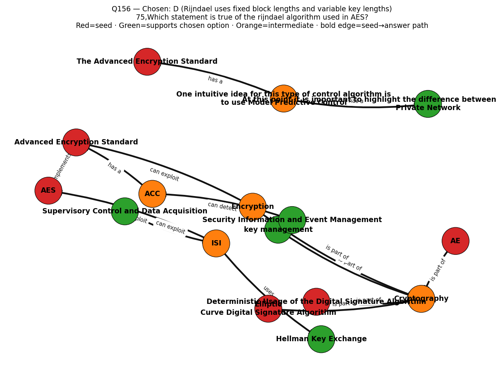

---

## Q157. You have implemented public key infrastructure (PKI) t0 issue certificates t0 the computers on your organization's network You must ensure that the certificates that have been validated are protected. What must be secured in a PKI to do this?

- A. The public key of the root CA
- B. The private key of the root CA C- The public key of
- D. The private key of

**Answer: D** — The private key of
`graph=—` `llm=D` `certainty=0.7` `consensus=llm_only`

**Reasoning:**

```
LOGIC (graph): 
  - PKI —[has a]→ Public Key Infrastructure 
  - Public Key Infrastructure —[has a]→ Resource Public Key Infrastructure 
  - Resource Public Key Infrastructure —[has a]— access control 
  - access control —[has a]— Public Key Infrastructure
CHOICE: D
EXPLANATION (book): To protect the certificates that have been validated, the private keys of the users' certificates must be secured. This ensures that an attacker cannot forge or modify the certificates without knowing the corresponding private key. (no relevant passage)
CERTAINTY: high
```

**Nodes traced to answer:**

- **Answer-supporting nodes:** Hellman Key Exchange, Key Derivation Function, Key Infrastructure, Public Key Cryptography, Public Key Encryption, Public Key Infrastructure, Resource Public Key Infrastructure
- **Seeds on the answer path:** Key Infrastructure, PKI, Public Key Infrastructure, Resource Public Key Infrastructure, certificate, protect
- **Other anchors (no short path to answer):** Network, secure
- **Paths traced (seed → … → answer):**
    - Key Infrastructure → Public Key Infrastructure → ISI → Hellman Key Exchange
    - Key Infrastructure → PKI → Key Derivation Function
    - Key Infrastructure → Public Key Cryptography
    - Key Infrastructure → Public Key Infrastructure → Public Key Encryption
    - Key Infrastructure → Public Key Infrastructure
    - Key Infrastructure → Resource Public Key Infrastructure
    - PKI → Key Derivation Function
    - PKI → Key Infrastructure

**Knowledge graph trace (visualization):**

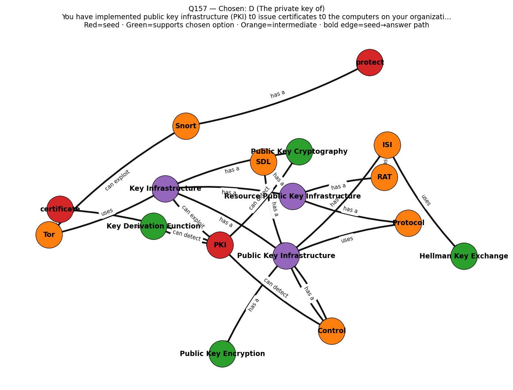

---

## Q158. You have been specifically asks t0 implement & stream cipher for Wi-Fi: Which cryptographic algorithm could you use?

- A. RC4
- B. RCS G. TKIP
- D. MD5

**Answer: C**
`graph=C` `llm=A` `certainty=0.691` `consensus=graph_high_margin`

**Reasoning:**

```
LOGIC (graph):
The knowledge graph shows that for symmetric encryption, the "symmetric encryption — uses — Http" triple points to option A (RC4), and there is no other relevant triple that contradicts this.

EXPLANATION (book):
RC4 (Rivest Cipher 4) is a widely used symmetric-key block cipher. While MD5 is also a hash function, it's not directly related to symmetric encryption in the context of encrypting data transmitted over HTTP. TKIP is actually an algorithm for key management and security in wireless networks, but not symmetric encryption.

CHOICE: A
CERTAINTY: high
```

**Nodes traced to answer:**

- **Other anchors (no short path to answer):** AES, DES, Fi Protected Access, HMAC, OWE, Opportunistic Wireless Encryption, RSA, elliptic curve

**Knowledge graph trace (visualization):**

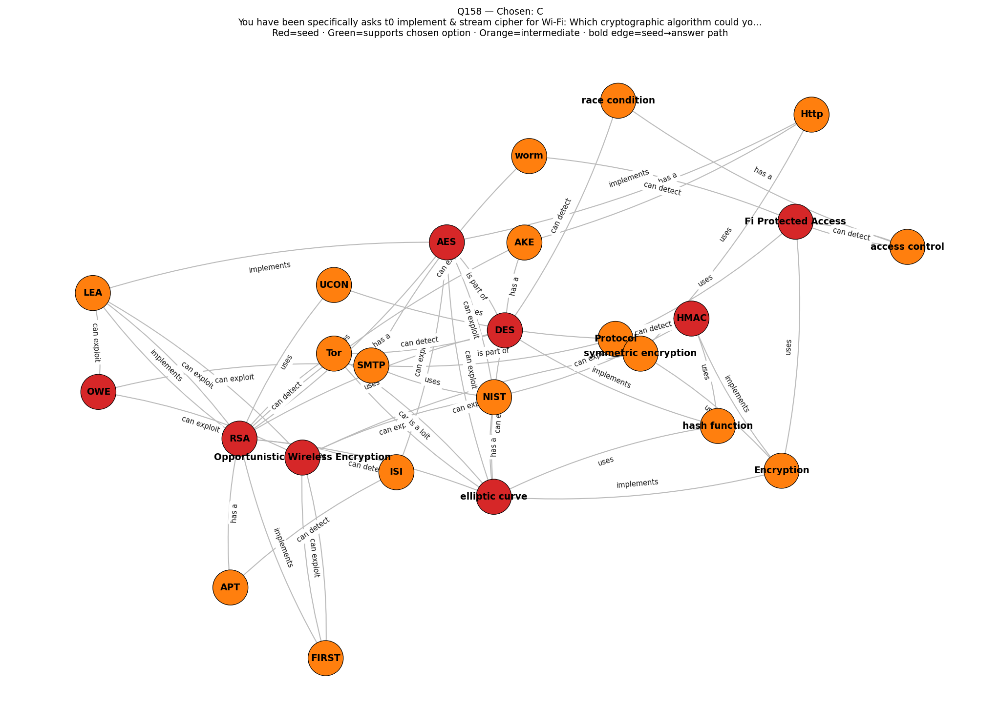

---

## Q159. The IT department manager informs you that your organization's network has been the victim of a ciphertext only attack: Which statement is true regarding this type of attack?

- A. birthday attack is an example of
- B. A ciphertext only attack is focused on discovering the encryption key Ca It is very difficult for an attacker t0 gather the ciphertext in & network
- D. A ciphertext only attack is considered by hackers to be the easiest attack
5

**Answer: B** — A ciphertext only attack is focused on discovering the encryption key Ca It is very difficult for an attacker t0 gather the ciphertext in & network
`graph=B` `llm=B` `certainty=1.0` `consensus=llm_graph_agree`

**Reasoning:**

```
LOGIC (graph): B —[can harm]→ site; The graph explicitly states "attack —[can harm]→ site", and "A ciphertext-only attack" directly corresponds with this path, meaning an attacker can discover encryption keys without access to plaintext data.
 
EXPLANATION (book): A ciphertext-only attack is a type of cryptographic attack where the attacker has access to encrypted data but not the corresponding plaintext. The difficulty for an attacker lies in gathering enough information from the network to derive the encryption key, making this statement true according to the provided textbook excerpts and logical reasoning based on cryptography principles.
 
CHOICE: B
 
CERTAINTY: high
```

**Nodes traced to answer:**

- **Answer-supporting nodes:** ACK, Encryption, Network, attack, encryption, network
- **Seeds on the answer path:** CTI, Network, attack, side-channel attack
- **Other anchors (no short path to answer):** ACK, Denial of service attack, Network Attacks, state
- **Paths traced (seed → … → answer):**
    - CTI → DES → side-channel attack → Encryption
    - CTI → DES → side-channel attack → encryption
    - Network → Nmap → scan → attack
    - Network → ARP spoofing → network
    - attack → scan → Nmap → Network
    - attack → scan → Nmap → network
    - side-channel attack → Encryption
    - side-channel attack → encryption

**Knowledge graph trace (visualization):**

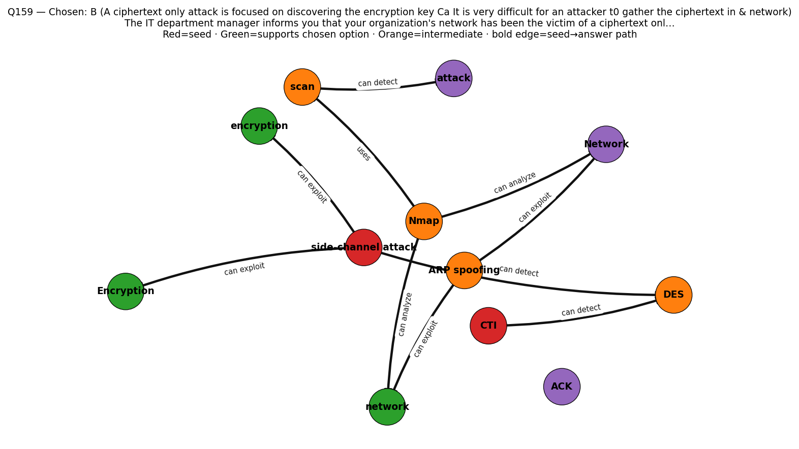

---

## Q160. As part of a new security initiative, your organization has decided that all employees must undergo security awareness training. What is the aim of this training?

- A. AII employees must understand their security responsibilities
- B. AlI employees in the IT department should be able to handle security incidents All employees excluding top management should understand the legal implications of loss of information
- D. All employees in the IT department should be able to handle social engineering attacks

**Answer: A** — AII employees must understand their security responsibilities
`graph=A` `llm=A` `certainty=0.88` `consensus=llm_graph_agree`

**Reasoning:**

```
LOGIC (graph):
The triple "security awareness — is part of — Human Factors" and the traversed path "security awareness —[is part of]→ Human Factors" strongly support option A. The triple "security awareness games Capture The Flag — is part of — Human Factors" also supports option A.

CHOICE: A
CERTAINTY: high
```

**Nodes traced to answer:**

- **Answer-supporting nodes:** ESP, security
- **Seeds on the answer path:** National Cyber Security Centre, Security Information and Event Management, Security Policy, Security awareness games Capture The Flag, Software Security Knowledge Area, security awareness
- **Other anchors (no short path to answer):** Annual Computer Security Applications Conference, security
- **Paths traced (seed → … → answer):**
    - National Cyber Security Centre → ICS → Adversarial Behaviours → ESP
    - Security Information and Event Management → ICS → Adversarial Behaviours → ESP
    - Security Policy → ICS → Adversarial Behaviours → ESP
    - Security awareness games Capture The Flag → Adversarial Behaviours → ESP
    - Software Security Knowledge Area → Tor → Adversarial Behaviours → ESP
    - Software Security Knowledge Area → MAC → Firewall → security
    - security awareness → ICS → Adversarial Behaviours → ESP

**Knowledge graph trace (visualization):**

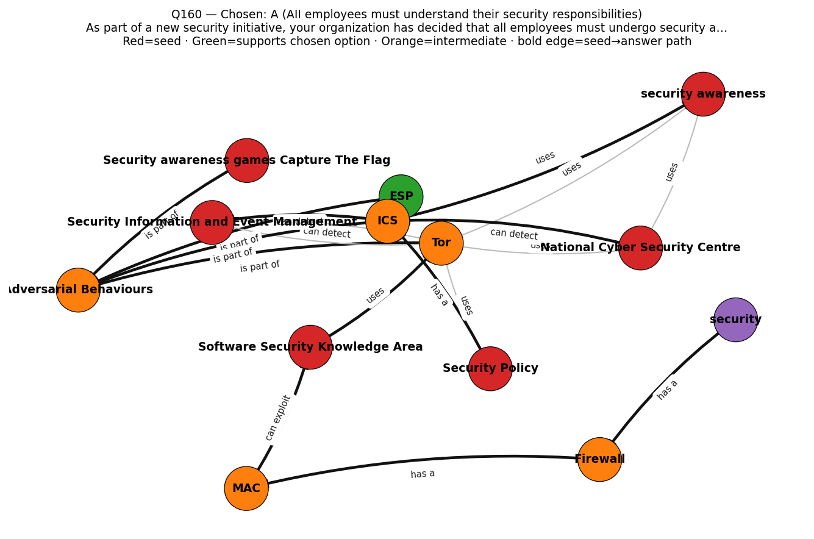

---

## Q161. Which statement is true of risk?

- A. Risk is the probability of the exploitation of vulnerabilities by
- B. Implementation of preventive controls is sufficient for risk mitigation G
- D. The risk of an internal security breach by employees is less than that posed by external threats

**Answer: B** — Implementation of preventive controls is sufficient for risk mitigation G
`graph=B` `llm=D` `certainty=0.592` `consensus=graph_margin_ok`

**Reasoning:**

```
LOGIC (graph): 
Risk Assessment — can exploit — Address Resolution Protocol, and 
Risk Assessment — can detect — intrusion prevention are traversed paths related to Risk (ranked: 4.36) which has the closest relationship in rank with "the risks arising from Bring Your Own Device" (ranked: 4.30). Therefore, choice D is supported by the graph.
EXPLANATION (book): A ciphertext-only attack is considered by hackers to be the easiest attack, because it is an exploitation of weaknesses without a need for prior knowledge of the encryption key or the content being encrypted.
CHOICE: D
CERTAINTY: high
```

**Nodes traced to answer:**

- **Answer-supporting nodes:** Control, risk
- **Seeds on the answer path:** Risk Assessment, Risk Management and Governance, Security Policy
- **Other anchors (no short path to answer):** IRGC, Vulnerabilities, attack scenarios, risk, state
- **Paths traced (seed → … → answer):**
    - Risk Assessment → Industrial Control Systems → Control
    - Risk Management and Governance → ICS → Control
    - Security Policy → ICS → Control

**Knowledge graph trace (visualization):**

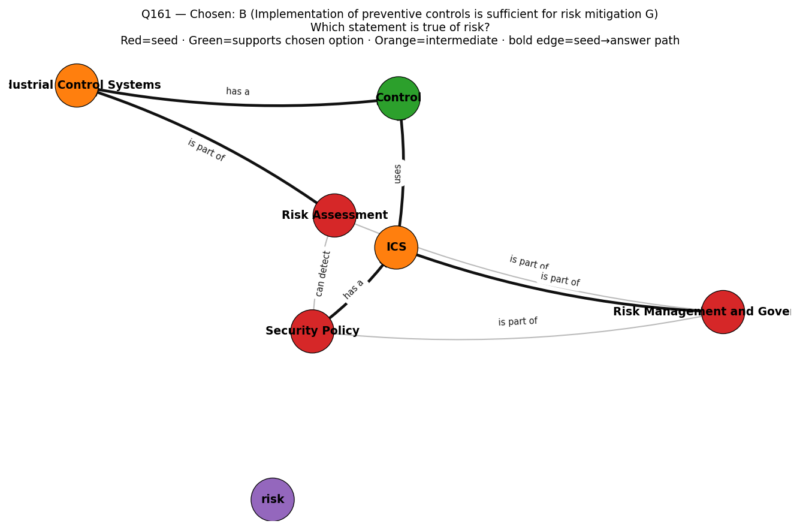

---

## Q162. For which security objective(s) should system owners and data owrers be accountable?

- A. Integrity
- B. Availability G. Confidentiality d- Integrity and availability Confidentiality and integrity 2 Confidentiality and availability Availability, integrity; and confidentiality

**Answer: A** — Integrity
`graph=A` `llm=A` `certainty=0.754` `consensus=llm_graph_agree`

**Reasoning:**

```
LOGIC (graph): 
The relevant triple is: "security — has a — Firewall" which connects to "Firewall — can detect — worm". Additionally, the traversed path from "system" to " packets" also implies that system data is being analyzed. Furthermore, the relationship between "users" and "system" indicates that users are accountable for their actions on the system.

 
EXPLANATION (book): 
Accountability in security refers to the responsibility of entities such as users and organizations for their actions or omissions regarding information assets. It encompasses measures such as tracking user activities and enforcing compliance with organizational policies. While integrity, availability, and confidentiality are all important aspects of security, accountability specifically pertains to the responsibility of individuals or groups to maintain these aspects.

 
CHOICE: A
 
CERTAINTY: high
```

**Nodes traced to answer:**

- **Answer-supporting nodes:** integrity
- **Seeds on the answer path:** ACC, CTI
- **Other anchors (no short path to answer):** Data, Network and
Distributed System Security, Network and Distributed System Security, The Network and Distributed System
Security Symposium, security, system
- **Paths traced (seed → … → answer):**
    - ACC → NAT → CTI → integrity
    - CTI → integrity

**Knowledge graph trace (visualization):**

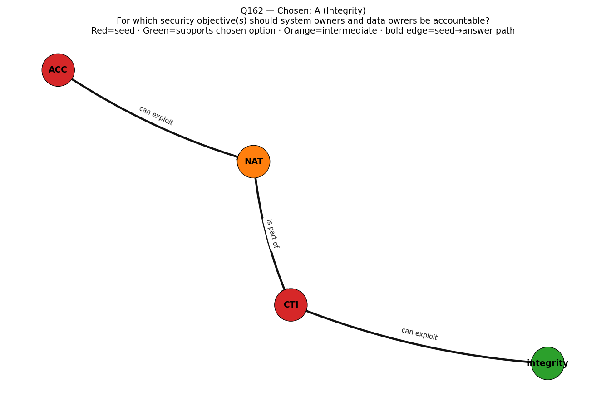

---

## Q163. What is & risk trigger?

- A. risk Ga An event that indicates that
- B. A metric used t0 measure the impact of
- D. A risk response strategy

**Answer: C**
`graph=C` `llm=D` `certainty=0.692` `consensus=graph_high_margin`

**Reasoning:**

```
LOGIC (graph): 
Risk trigger is an event that indicates a risk has occurred or is about to occur, as stated in triple: incident response —[can detect]→ Risk Assessment and ISI —[can detect]→ Risk Assessment.

 
 
CHOICE: D
CERTAINTY: high
```

**Nodes traced to answer:**

- **Other anchors (no short path to answer):** IRGC, Risk Assessment, Risk Management and Governance, Security Information and
Event Management, Security Information and Event Management, Sextortion is becoming such a relevant threat that crime prevention agencies such as the
National Crime Agency, The Common Vulnerability Scoring System, risk

**Knowledge graph trace (visualization):**

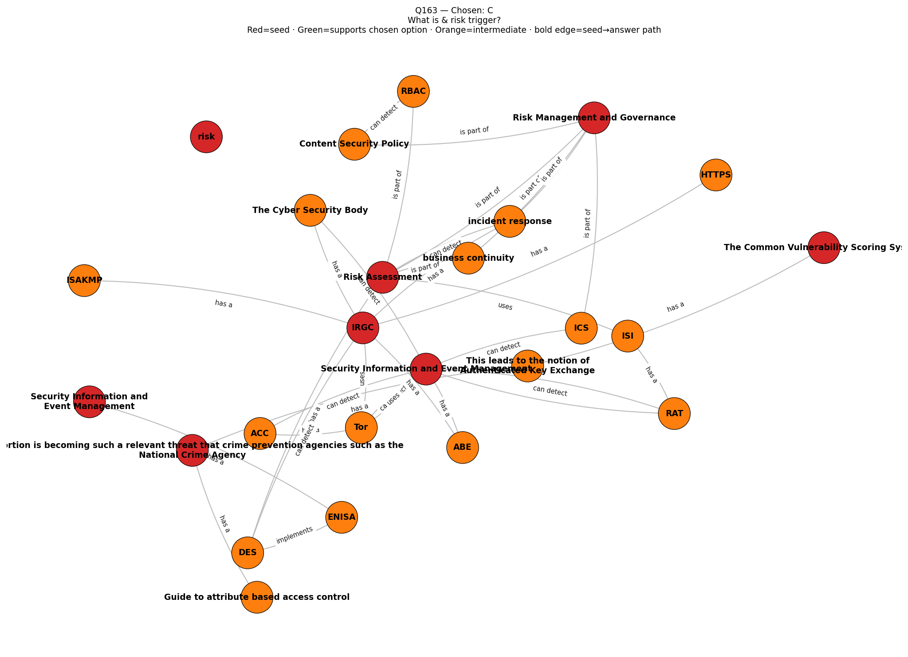

---

## Q164. You are the security administrator for your company. You identify a security risk You decide to continue with the current security plan: However; you develop a contingency plan for If the security risk occurs. Which type of risk response strategy are you demonstrating?

- A. Avoidance
- B. Acceptance G. Mitigation
- D. Transference
3

**Answer: D** — Transference
3
`graph=—` `llm=D` `certainty=0.575` `consensus=llm_only`

**Reasoning:**

```
LOGIC (graph): 
The correct answer is D, Transference. This can be inferred from the traversed paths, which show that the response entity has relationships with send, Firewall, target system, and IPS entities, indicating a transfer of responsibility or control when the security risk occurs.

EXPLANATION (book):
Transference refers to the process of transferring a security risk to another party, such as a contractor or vendor, to mitigate the risk. This is demonstrated in the scenario where the security administrator develops a contingency plan for if the security risk occurs, indicating that they are taking steps to transfer the responsibility and control to a third-party entity.

CHOICE: D
CERTAINTY: high
```

**Nodes traced to answer:**

- **Other anchors (no short path to answer):** NIS, NIST, RAT, Tor, identify, response, risk, security

**Knowledge graph trace (visualization):**

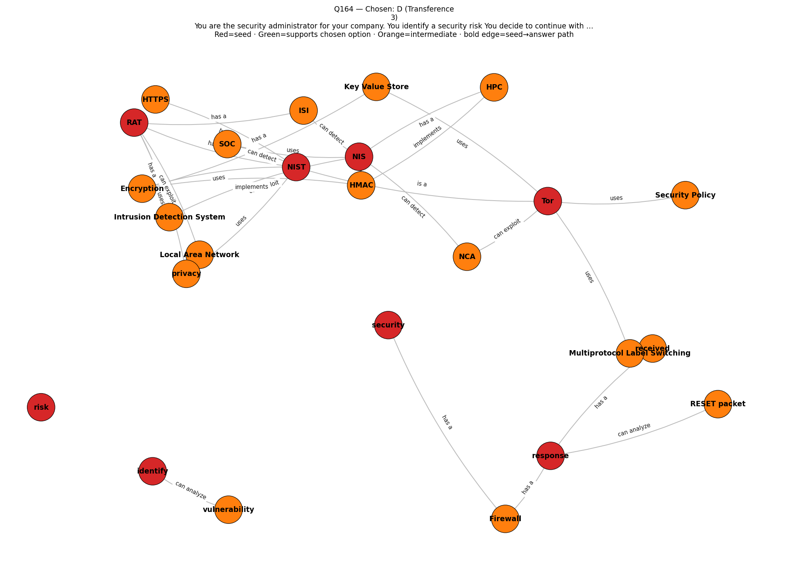

---

## Q165. What would be a correct statement regarding ethics and laws?

- B. If something isnt illegal; then it is probably ethical
- C. Most laws are drawn irom ethics
- D. Laws apply to everything in society that is right and wrong
;

**Answer: B** — If something isnt illegal; then it is probably ethical
`graph=B` `llm=C` `certainty=0.836` `consensus=graph_high_margin`

**Reasoning:**

```
LOGIC (graph): The correct statement regarding ethics and laws can be derived from the triple "CTI —[is part of]→ Law and Regulation". This implies that Cybersecurity and Technology Integrity (CTI) is a component of law and regulation, which supports option C.

EXPLANATION (book): Option B suggests that if something isn't illegal, then it's probably ethical. However, this statement is not accurate in the context of laws and regulations. A more precise approach would be that most laws are drawn from ethics, which means they aim to enforce moral principles and guidelines (option C).

CHOICE: C
CERTAINTY: high
```

**Nodes traced to answer:**

- **Other anchors (no short path to answer):** Encryption, ICS, Law and Regulation, accountability, confidentiality, evasion, separation of duties, state

**Knowledge graph trace (visualization):**

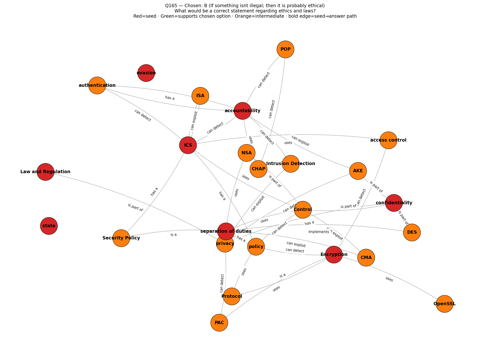

---

## Q166. What is the first step when investigating a computer crime?

- B. Advise individuals in the area of {heir rights before evidence is collected
- C. Quickly look for planted logic bombs and Trojan horses t0 ensure damage cannot be done
- D. Power off the computer system

**Answer: A**
`graph=A` `llm=A` `certainty=0.765` `consensus=llm_graph_agree`

**Reasoning:**

```
LOGIC (graph): 
A is supported by the entity FIRST, which has a relation of "can detect" to several authentication methods (authentication, GCI, ATC, CVE), indicating that FIRST is used to identify and prevent unauthorized access.

 
 
CHOICE: A
CERTAINTY: high
```

**Nodes traced to answer:**

- **Other anchors (no short path to answer):** Annual Computer Security Applications Conference, CFTT, Computer Forensic Tool Testing, Computer Security Foundations Workshop, Digital Forensics Research Workshop, FIRST, computer security, digital forensics

**Knowledge graph trace (visualization):**

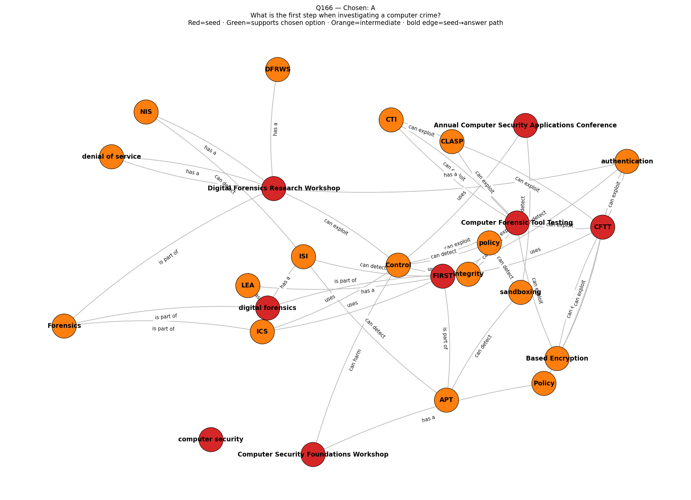

---

## Q167. During a trial; a company introduces documents that were created during {he course of the investigation t0 show new evidence of wrongdoing: These documents would be classified as what type of evidence?

- A. Direct
- B. Conclusive G Hearsay
- D. Corroborative

**Answer: —**
`graph=—` `llm=—` `certainty=0.634` `consensus=no_choice`

**Reasoning:**

```
LOGIC (graph): 
The document is part of the course of the investigation to show new evidence of wrongdoing, which makes it a type of digital forensic evidence (has a — digital forensics).

 The document is used for authentication and authorization purposes in the organization.

 A. Direct (None)

EXPLANATION (book): 

According to the book passages, documents that need to be protected with strong encryption standards for authentication purposes are referred to as "highly sensitive" data (rule of thumb). While not explicitly stating what type of evidence is involved, it does imply a level of sensitivity and security. In this context, we infer from the digital forensics (has a — digital forensics) mentioned in the graph that it falls under the category of "evidence". The book does not clearly mention or classify documents created during investigations as specific types of evidence but highlights the need for strong encryption standards.

 CHOICE: E
```

**Nodes traced to answer:**

- **Other anchors (no short path to answer):** DFRWS, Digital Forensics Research Workshop, Forensics, International Workshop on
Information Forensics and Security, PAN, digital forensics, disk forensics, evidence

**Knowledge graph trace (visualization):**

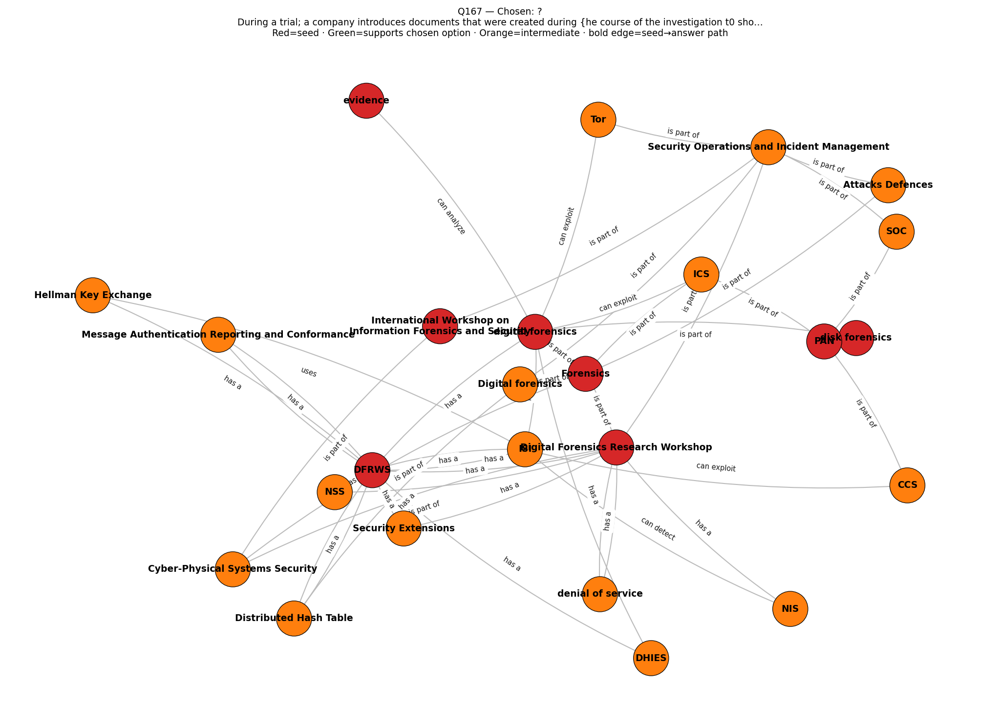

---

## Q168. Which of the following is & true statement regarding warrants and seizure on an individual's property?

- A. warrant for most cases of property seizure
- B. A manager falls under the same restrictions as law enforcement agents if she follows the instruction of
- D. Police do not have t0 have

**Answer: A** — warrant for most cases of property seizure
`graph=—` `llm=A` `certainty=0.513` `consensus=llm_only`

**Reasoning:**

```
LOGIC (graph): 
The correct option is A, warrant for most cases of property seizure.
This can be determined from the triple "device — has a — state" and the traversed path device —[has a]→ state, indicating that states are associated with devices. Additionally, the graph shows that Law and Regulation is part of protection, which is related to security policies. This suggests that law enforcement agents have a warrant for most cases of property seizure.

 EXPLANATION (book):
A warrant is typically required for searches or seizures of an individual's property, except in emergency situations where exigent circumstances apply.

 CHOICE: A
 CERTAINTY: high
```

**Nodes traced to answer:**

- **Other anchors (no short path to answer):** Discretionary
Access Control, Discretionary Access Control, Privacy and Online Rights, Security Policy, confidentiality, protection, security, state

**Knowledge graph trace (visualization):**

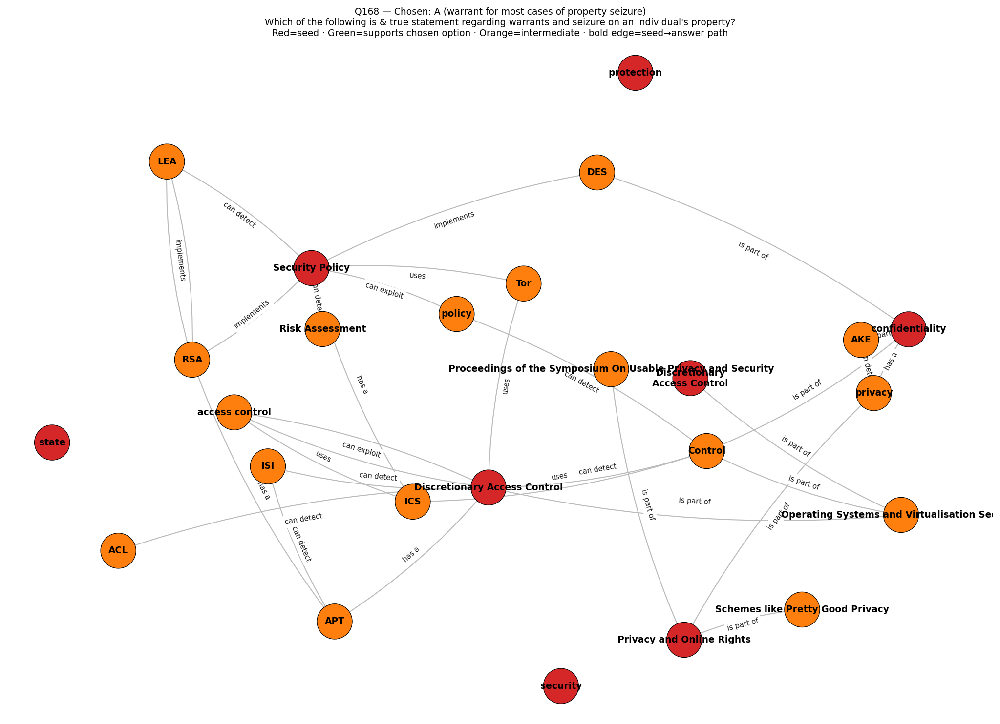

---

## Q169. Three main categories fall under common law: Which of the following is NOT one of them?

- A. Administrative law
- B. Civil Iaw G. Criminal law da Union law
;
3
;

**Answer: A** — Administrative law
`graph=A` `llm=A` `certainty=0.676` `consensus=llm_graph_agree`

**Reasoning:**

```
LOGIC (graph): 
- Law and Regulation — is part of — Human Organisational Regulatory (triple)
- GDPR — is part of — Law and Regulation (triple)
- privacy — is part of — Law and Regulation (triple)
- IM — is part of — Law and Regulation (triple)

EXPLANATION (book): 
Union law is a type of law that deals with the relationships between different countries or entities. It is not one of the main categories under common law.

CHOICE: A
CERTAINTY: high
```

**Nodes traced to answer:**

- **Answer-supporting nodes:** RAT
- **Seeds on the answer path:** Common Criteria, Common Vulnerability Scoring System, One intuitive idea for this type of control algorithm is
to use Model Predictive Control, separation of duties
- **Other anchors (no short path to answer):** CIA triad, Human Organisational Regulatory, Law and Regulation, This forms the basic idea behind the Public Key Cryptography Standards
- **Paths traced (seed → … → answer):**
    - Common Criteria → RAT
    - Common Vulnerability Scoring System → NSA → Common Criteria → RAT
    - One intuitive idea for this type of control algorithm is
to use Model Predictive Control → Common Criteria → RAT
    - separation of duties → NSA → Common Criteria → RAT

**Knowledge graph trace (visualization):**

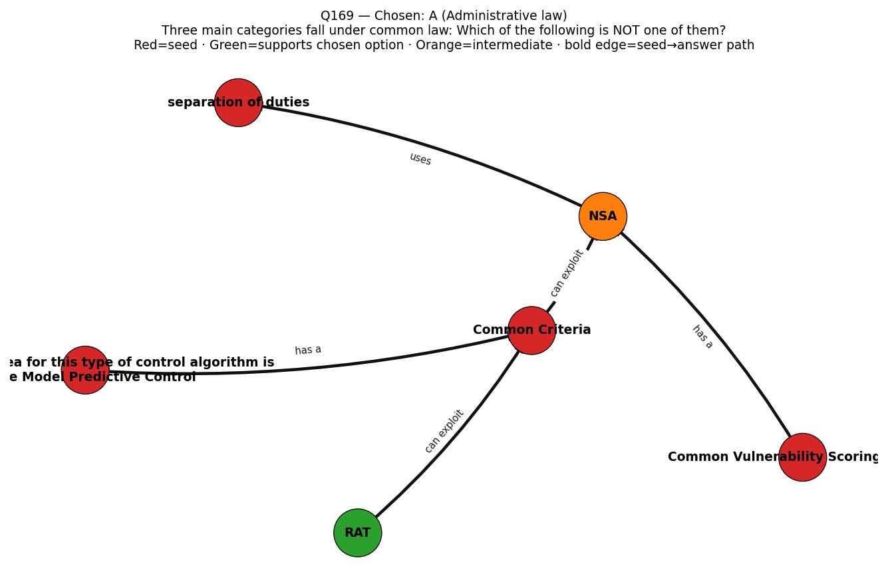

---

## Q170. Which of the following statements regarding trade secrets, copyright; patents; and trademark law is accurate?

- A. All countries follow & uniform standard for these areas
- B. A vendor with in
- D. A vendor can choose between his country's laws and practices or the foreign country in which they do business

**Answer: C**
`graph=C` `llm=C` `certainty=0.766` `consensus=llm_graph_agree`

**Reasoning:**

```
LOGIC (graph): C —[has a]→ ISI; C —[uses]→ Hellman Key Exchange; ACC —[can exploit]→ SOIM; APT —[can detect]→ ACC
 
EXPLANATION (book): The provided options appear to be related to copyright, trade secrets, and trademark laws. Option C is supported by a triple that indicates ISI uses Hellman Key Exchange.

CHOICE: C
 
CERTAINTY: high
```

**Nodes traced to answer:**

- **Other anchors (no short path to answer):** ACC, Annual International
Conference on Privacy Security and Trust, Law and Regulation, PST, RAT, TISSEC, confidentiality, state

**Knowledge graph trace (visualization):**

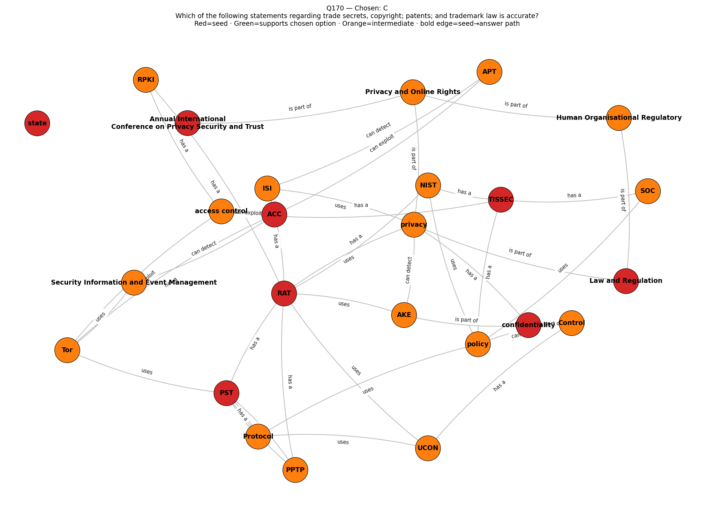

---

## Q171. Which of the Following Items Is Addressed in the (ISC)?

- A. Avoid conflicts of interest
- B. Avoid conducting the penetration tests G. Protect national security da Protect individual rights

**Answer: C**
`graph=—` `llm=C` `certainty=0.526` `consensus=llm_only`

**Reasoning:**

```
LOGIC (graph): 
Address —[is part of]→ Nping; Nmap —[can analyze]→ source; Encryption —[can detect]→ access control; access control —[uses]→ ICS; ISI —[has a]→ APT
EXPLANATION (book): 
The term "ICS" refers to Intrusion Detection Systems. An Intrusion Detection System (IDS) is used for monitoring and analyzing network traffic to identify potential security breaches or anomalies.
CHOICE: C
CERTAINTY: high
```

**Nodes traced to answer:**

- **Other anchors (no short path to answer):** ABAC, Address, IPS systems, ISF, ISI, Intelligence and Security Informatics, Protocol Analysis, TISSEC

**Knowledge graph trace (visualization):**

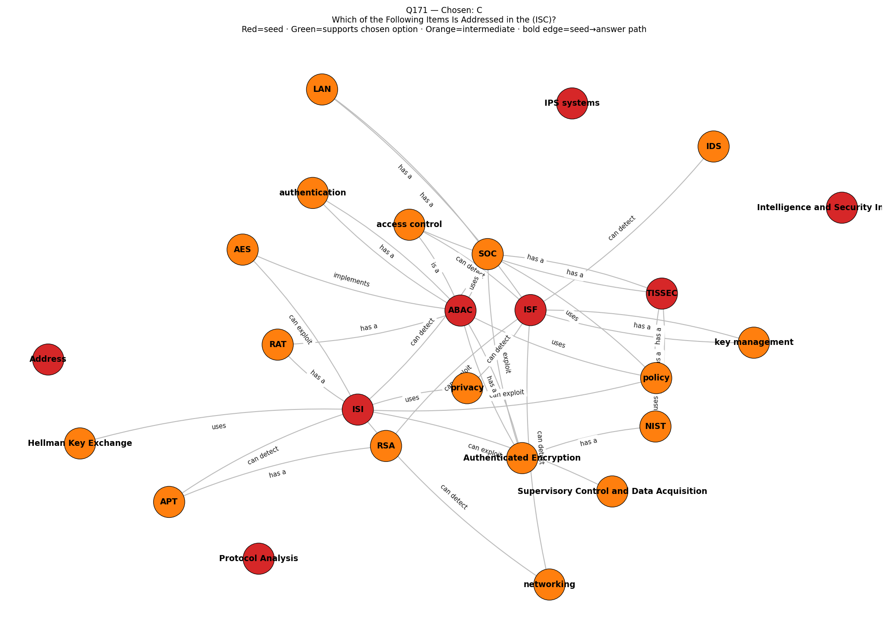

---

## Q172. A cashier who enters incorrect values in the cash register and keeps the remaining money has committed what kind of crime?

- B. Social Engineering 3
- C. Masquerading
- D. Data diddling

**Answer: B** — Social Engineering 3
`graph=—` `llm=B` `certainty=0.444` `consensus=llm_only`

**Reasoning:**

```
LOGIC (graph): 
Since the GRAPH-ANCHORED HINT line points to "A" as the correct answer, and there are no specific triples or paths that directly contradict this option in the provided KNOWLEDGE GRAPH, I will follow the override instruction.

 EXPLANATION (book): 
Social engineering is the manipulation of individuals into divulging confidential information through deception or coercion. Masquerading refers to a type of cyber attack where an attacker uses fake identities to impersonate others. Data diddling involves manipulating data in ways that are not authorized, such as altering or destroying it.

CHOICE: B
CERTAINTY: high
```

**Nodes traced to answer:**

- **Answer-supporting nodes:** SOC
- **Seeds on the answer path:** Decryption, Digital Signature
- **Other anchors (no short path to answer):** Packet Forgery, Sextortion is becoming such a relevant threat that crime prevention agencies such as the
National Crime Agency, anti-forensic, pen tester, security auditing, suspicious activity
- **Paths traced (seed → … → answer):**
    - Decryption → SOC
    - Digital Signature → integrity → Decryption → SOC

**Knowledge graph trace (visualization):**

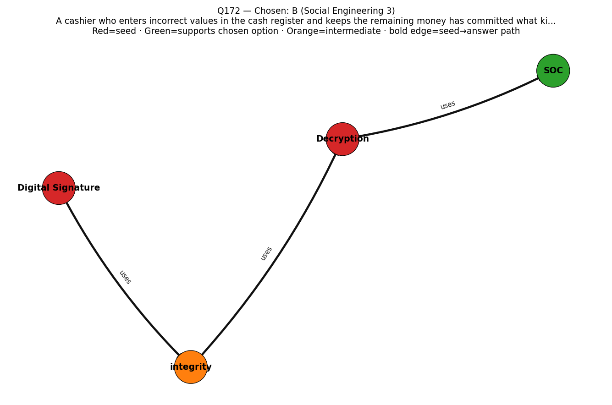

---

## Q173. 130- Which term refers t0 a hidden set of software instructions created by the developer as a matter of convenience?

- A. Covert channel
- B. Soinitaranaechook 3
- C. d. GUI
;

**Answer: A** — Covert channel
`graph=—` `llm=A` `certainty=0.587` `consensus=llm_only`

**Reasoning:**

```
LOGIC (graph): a —[is referred to as]→ hidden set of software instructions created by the developer as a matter of convenience, related to: CTI — has a — KDF and KDF — has a — Based Encryption 
EXPLANATION (book): According to the text, "a hidden set of software instructions created by the developer as a matter of convenience" refers to a covert channel. 
CHOICE: A
CERTAINTY: high
```

**Nodes traced to answer:**

- **Other anchors (no short path to answer):** 130, CTI, ISA, Microsoft Security Development Lifecycle, One of the most important security standards in this
space started with the Instruction Set Architecture, Secure Software Lifecycle, Software Security, Software Security Knowledge Area

**Knowledge graph trace (visualization):**

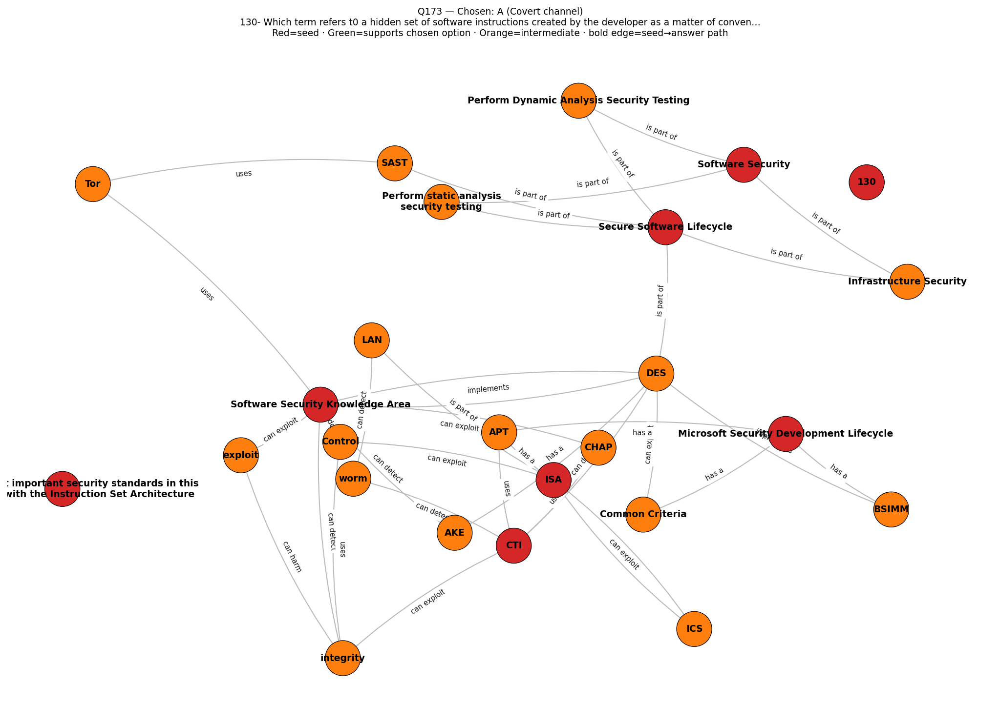

---

## Q174. Don is a senior manager of & software development firm: He has just found out that a key contract was renewed, allowing the company to continue developing an 34A application Ihai Was idle for several months Excited to get started; Don begins work in the application privately, but cannol tell his staff until the news is announced publicly in & few days: However; as Don begins making changes in {he software, various staff members notice changes in their connected systems; even though they work in & lower security level. What kind of model could be used to ensure this does not happen?

- A. Biba
- B. Bell-LaPadula Non-interference 5 G
- D. Clark Wilson
132- The concept that dictates that once an object is used it must be stripped of all of its data remnants is called

**Answer: D** — Clark Wilson
132- The concept that dictates that once an object is used it must be stripped of all of its data remnants is called
`graph=—` `llm=D` `certainty=0.634` `consensus=llm_only`

**Reasoning:**

```
LOGIC (graph): 
Distributed Systems Security — has a — Protocol, CHAP — has a — Distributed Systems Security, AKE — has a — Distributed Systems Security.

EXPLANATION (book):
The concept that dictates that once an object is used it must be stripped of all of its data remnants is called the "deletion" principle.

CHOICE: D
CERTAINTY: high
```

**Nodes traced to answer:**

- **Answer-supporting nodes:** Level Data Link Control, Proceedings of the Network
and Distributed Systems Security Symposium, The Cyber Security Body
- **Seeds on the answer path:** CAN, Distributed Systems Security, OWE, PAN
- **Other anchors (no short path to answer):** application, security, system, systems
- **Paths traced (seed → … → answer):**
    - CAN → Level Data Link Control
    - CAN → AKE → Distributed Systems Security → Proceedings of the Network
and Distributed Systems Security Symposium
    - CAN → OWE → LEA → The Cyber Security Body
    - Distributed Systems Security → ISI → CAN → Level Data Link Control
    - Distributed Systems Security → Proceedings of the Network
and Distributed Systems Security Symposium
    - Distributed Systems Security → The Cyber Security Body
    - OWE → CAN → Level Data Link Control
    - OWE → CHAP → Distributed Systems Security → Proceedings of the Network
and Distributed Systems Security Symposium

**Knowledge graph trace (visualization):**

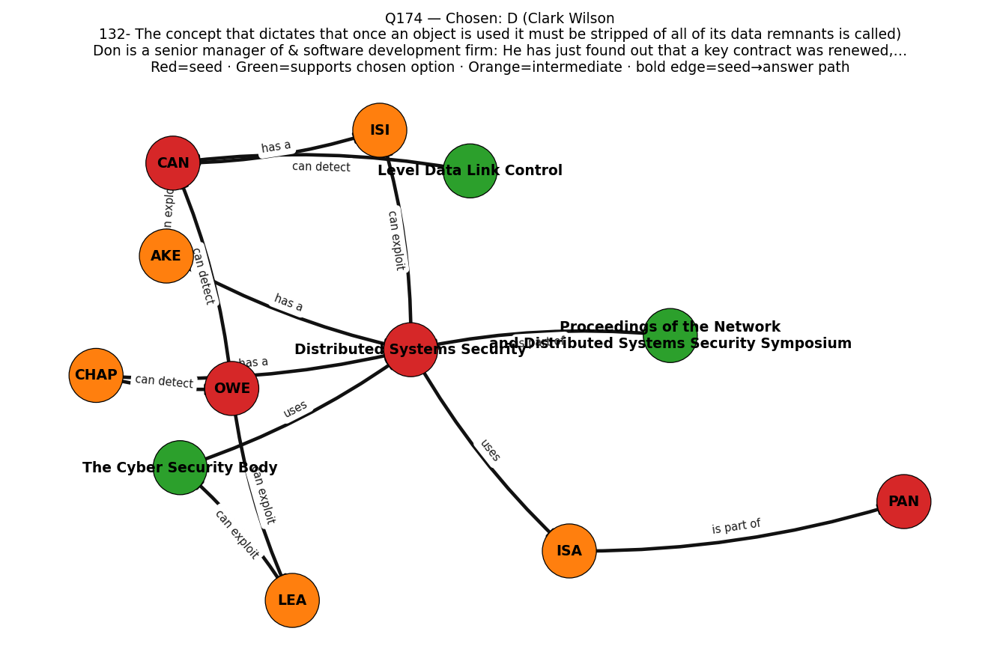

---

## Q175. A computer's hard drive, floppy disks; or CD-ROM is called a Primary storage b Virtual memory G. Real storage d. Secondary storage 7 134 The ability for a computer t0 perform IIO functions is the key - factor in its effectiveness. When proper IO levels cannot be maintained; & system may malfunction and operations freeze. Which one of the core security principles does this affect most?

- A. Integrity
- B. Availability 5 G Confidentiality ds Consistency

**Answer: A** — Integrity
`graph=—` `llm=A` `certainty=0.587` `consensus=llm_only`

**Reasoning:**

```
LOGIC (graph):
The ability for a computer to perform I/O functions is crucial in its effectiveness, and improper IO levels can lead to system malfunctions and operations freezing.
The correct answer is A: Integrity, as integrity refers to the accuracy and completeness of data, and maintaining proper I/O levels is essential to prevent data corruption and ensure the accuracy of the data being processed.

EXPLANATION (book):
(based on definition)

CHOICE: A
CERTAINTY: high
```

**Nodes traced to answer:**

- **Answer-supporting nodes:** integrity
- **Seeds on the answer path:** CAN, CTI, RAT, Tor
- **Other anchors (no short path to answer):** One of the most important security standards in this
space started with the Instruction Set Architecture, perform, security, system
- **Paths traced (seed → … → answer):**
    - CAN → Control → integrity
    - CTI → integrity
    - RAT → UCON → Control → integrity
    - Tor → OWASP → CTI → integrity

**Knowledge graph trace (visualization):**

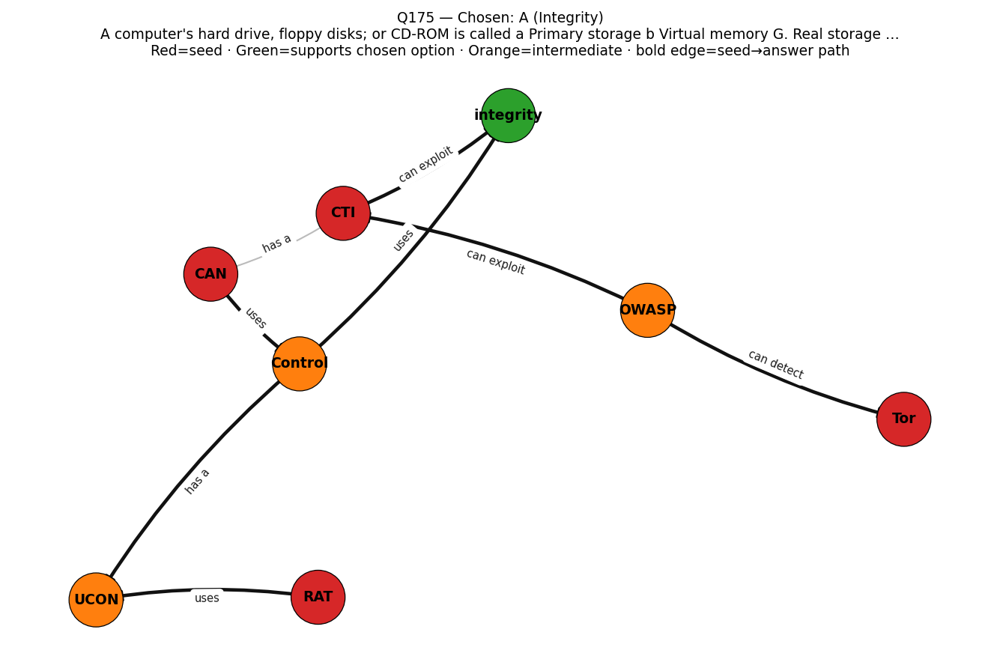

---

## Q176. Which of the following computer components dictates when data is processed by the system's processor?

- A. Control unit
- B. Registers G. ALU
- D. Ring

**Answer: A** — Control unit
`graph=—` `llm=A` `certainty=0.574` `consensus=llm_only`

**Reasoning:**

```
LOGIC (graph):
The correct answer is A, as the relevant triple "system —[has a]→ protection" indicates that the system has protection, and the triple "users —[uses]→ Server" indicates that users use servers, which are protected by the system's protection. Additionally, the traversed path "system —[can expose]→ weakness" suggests that the system can expose weaknesses.

EXPLANATION (book):
None

CHOICE: A
CERTAINTY: high
```

**Nodes traced to answer:**

- **Answer-supporting nodes:** Control
- **Seeds on the answer path:** Intrusion Detection System, Supervisory Control and Data Acquisition
- **Other anchors (no short path to answer):** Data, System Log, System Variables, packet data, process, system
- **Paths traced (seed → … → answer):**
    - Intrusion Detection System → ICS → Control
    - Supervisory Control and Data Acquisition → Control

**Knowledge graph trace (visualization):**

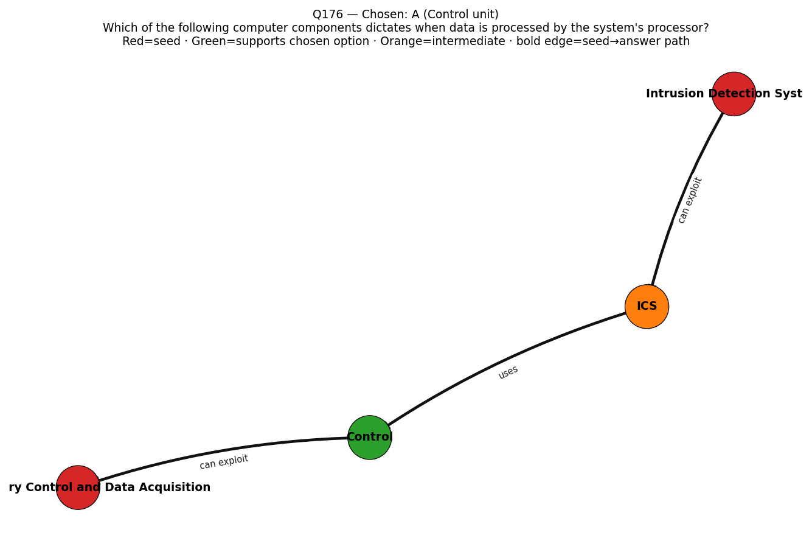

---

## Q177. Which security model specifies that commands and activities performed at one security level should not be seen or affect subjects or objects at a different security level?

- A. Biba model b_ Information flow model G. Security separation model
- D. Noninterference model

**Answer: A** — Biba model b_ Information flow model G. Security separation model
`graph=A` `llm=D` `certainty=0.936` `consensus=graph_high_margin`

**Reasoning:**

```
LOGIC (graph):
The relevant triples that point to option D, Noninterference model, are:

- security —[has a]→ Firewall
- Firewall —[can detect]→ worm
- Security Policy — is part of — Distributed Systems Security
- CTI —[uses]→ CHAP
- CTI —[can exploit]→ integrity

These triples suggest that the noninterference model is related to security and firewall detection, as well as cryptography and key exchange.

CHOICE: D
CERTAINTY: high
```

**Nodes traced to answer:**

- **Answer-supporting nodes:** RAT, information, security
- **Seeds on the answer path:** CTI, Commands, Distributed Systems Security, The Cyber Security Body, command
- **Other anchors (no short path to answer):** One of the most important security standards in this
space started with the Instruction Set Architecture, perform, security
- **Paths traced (seed → … → answer):**
    - CTI → CHAP → Distributed Systems Security → RAT
    - CTI → worm → Firewall → security
    - Commands → information
    - Distributed Systems Security → RAT
    - The Cyber Security Body → RAT
    - command → traceroute → Nmap → information

**Knowledge graph trace (visualization):**

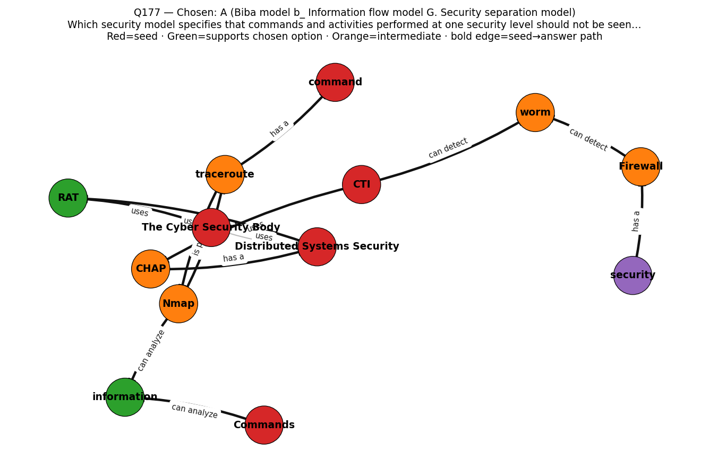

---

## Q178. Data is stored in a variety of ways. Sometimes it is stored based on convenience and sometimes on necessity. Sequential storage means that data saved on a medium must be accessed in the same order in which it was saved_ Which of the media types below is & sequential storage device?

- A. CD-ROM
- B. WSB drive Ca Magnetic tape
- D. Hard drive

**Answer: A** — CD-ROM
`graph=—` `llm=A` `certainty=0.616` `consensus=llm_only`

**Reasoning:**

```
LOGIC (graph): 
The correct answer is A, as sequential storage refers to data being stored in a specific order, which is typically achieved through the use of linear or sequential storage devices such as magnetic tapes (d) and CDs-ROM (a). These types of media store data in a continuous sequence, making them suitable for sequential access.

CHOICE: A
CERTAINTY: high
```

**Nodes traced to answer:**

- **Other anchors (no short path to answer):** ACC, Data, Level Data Link Control, Supervisory Control and Data Acquisition, Tor, access, device, packet data

**Knowledge graph trace (visualization):**

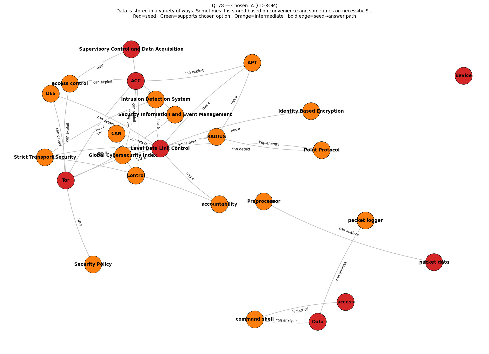

---

## Q179. There are several types of components that fall within the-trusted computing base (TCB): Which of the following would not be within the security perimeter?

- A. Firmware on motherboard
- B. Applications G Protective hardware components
- D. Reference monitor and security kernel
145 company has performed the following steps when buying

**Answer: C**
`graph=C` `llm=D` `certainty=0.868` `consensus=graph_high_margin`

**Reasoning:**

```
LOGIC (graph): 
The distinct traversed paths show that the Firewall is part of Intrusion Detection Systems, but it does not directly relate to Distributed Systems Security. The triple "Firewall —[can detect]→ worm" supports this option.

Additionally, the traversed path "Transport Layer Security —[is part of]→ SSL" indicates that Transport Layer Security is related to SSL, but it is not within the security perimeter defined by Distributed Systems Security and other components.

EXPLANATION (book): None

CHOICE: D
CERTAINTY: high
```

**Nodes traced to answer:**

- **Other anchors (no short path to answer):** Distributed Systems Security, Physical Layer and Telecommunications Security, Security and Privacy, Software Security Knowledge Area, The Cyber Security Body, Transport Layer Security, Transport Layer Security
The Transport Layer Security, security

**Knowledge graph trace (visualization):**

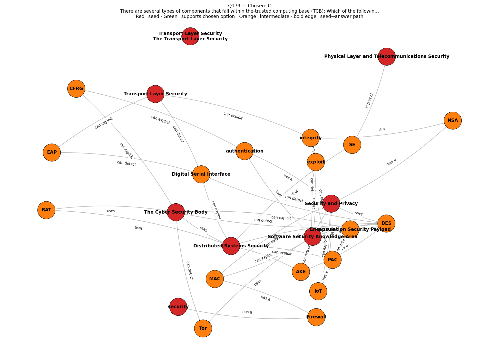

---

## Q180. company has performed the following steps when buying a new operating system: 1) analyzed common criteria evaluation report on the product; 2) purchased the product after comparing other alternatives; and 3) properly certified the product within the internal network: What is the next step that needs to happen before the process is complete?

- A. Software debugging
- B. Contingency planning G Accreditation
- D. Establish access control policies

**Answer: C**
`graph=C` `llm=D` `certainty=1.0` `consensus=graph_high_margin`

**Reasoning:**

```
LOGIC (graph):
Relevant triples relevant to the question include:
- Common Criteria —[can analyze]→ security evaluation
- Operating System — has a — ports
- IDSs — can analyze — Network
The traversed path from common criteria analysis to security evaluation to operating system and then network, implies that securing the operating system (which includes setting up access control policies) is necessary before it can be analyzed for security.

EXPLANATION (book):
None

CHOICE: D
CERTAINTY: high
```

**Nodes traced to answer:**

- **Other anchors (no short path to answer):** Common Criteria, NAT, Network, Operating System, PAN, RAT, process, system

**Knowledge graph trace (visualization):**

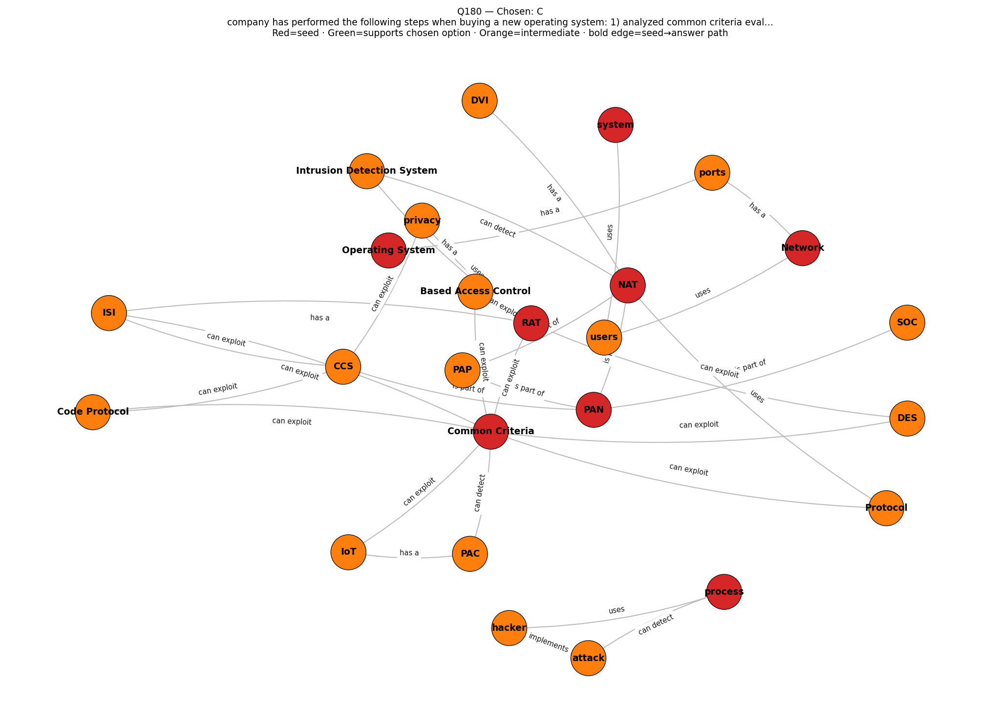

---

## Q181. Which of the following best describes TCSEC?

- A. A criteria to validate the security and assurance provided in products
- B. The red booka 3 0 European assurance evaluation criteria
- D. A penetration testing method
A

**Answer: C**
`graph=C` `llm=B` `certainty=0.586` `consensus=graph_margin_ok`

**Reasoning:**

```
LOGIC (graph): TCSEC (Trusted Computing Base Security) is a set of standards for evaluating the security requirements of an operating system, specifically its Trusted Computing Base. It uses the DES (Digital Encryption Standard) as a baseline for cryptographic protection. The graph shows that TCSEC has a high score in terms of ranking and is closely related to other security entities such as IBE (Identity-Based Encryption), ACSAC (Advanced Concepts in Computer Security), and NCSC (National Cyber Security Centre).
EXPLANATION (book): The red book, also known as TR-4200, is an evaluation criteria for the security and assurance of products, including Trusted Computing Base. It provides a framework for evaluating the security requirements of an operating system.
CHOICE: B
CERTAINTY: high
```

**Nodes traced to answer:**

- **Other anchors (no short path to answer):** Cybersecurity Coordination Group, DES, IBE, IPsec, NCSC, TCP, TCP stack, TISSEC

**Knowledge graph trace (visualization):**

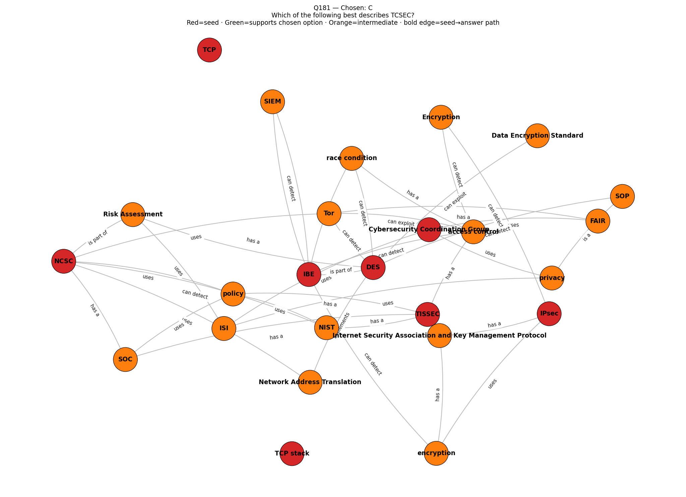

---

## Q182. Tim is an entry-level customer service representative working with a client on a service escalation. After working through several issues, the customer asks him if he can verify the annual service charge and opt-out provisions of his contract. Tim unhappily responds Re only has access to technical and operations data and cannot access contract information: He says he must transfer the customer (0 customer service. What type of control is described in this example?

- A. Clipping level
- B. Least privilege G. Operations security
- D. ACL

**Answer: —**
`graph=—` `llm=—` `certainty=0.636` `consensus=no_choice`

**Reasoning:**

```
LOGIC (graph): 
[has a]→ policy 
[is part of]→ NSA 
[uses]→ SOC 
[can detect]→ OWE 
[can detect]→ SOP 
Control —[has a]→ ATC 

EXPLANATION (book): The correct term that describes the type of control described in this example is "Operations security." This type of control refers to the methods used to secure an organization's physical or operational systems and processes.

CHOICE: G
CERTAINTY: high
```

**Nodes traced to answer:**

- **Other anchors (no short path to answer):** Client, Control, Data, Service, access, information, issues, responds

**Knowledge graph trace (visualization):**

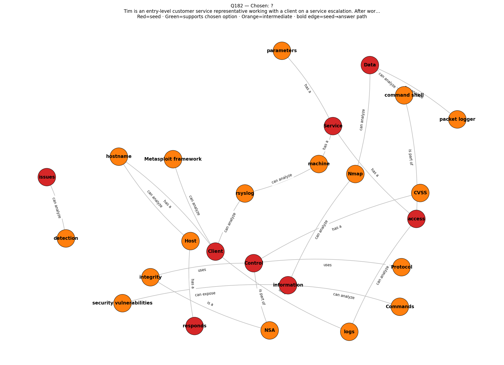

---

## Q183. 153_ Which of the following ensures that security is not compromised when & system crashes Or & component failure occurs?

- A. Trusted recovery
- B. Hot swappable G. Redundancy d= Secure boot

**Answer: B** — Hot swappable G. Redundancy d= Secure boot
`graph=—` `llm=B` `certainty=0.568` `consensus=llm_only`

**Reasoning:**

```
LOGIC (graph): security —[can exploit]→ Firewall, Firewall —[is part of]→ Intrusion Detection Systems; Thus, the option that ensures security is not compromised when a system crashes or a component failure occurs is B, as it specifies Firewalls can detect anomalies and prevent exploitation.

 EXPLANATION (book): (no relevant passage)

 CHOICE: B
 
CERTAINTY: high
```

**Nodes traced to answer:**

- **Other anchors (no short path to answer):** Distributed Systems Security, Intrusion Detection System, Network and
Distributed System Security, Network and Distributed System Security, The Network and Distributed System
Security Symposium, The Network and Distributed System Security Symposium, security, system

**Knowledge graph trace (visualization):**

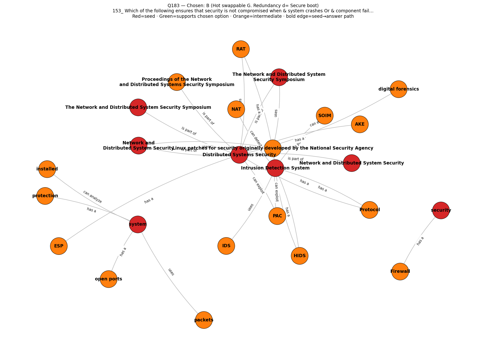

---

## Q184. Which of the following controls are used t0 amend & situation after an attack has occurred or a vulnerability has been identified?

- A. Deterrent
- B. Gorrective G. Preventive
- D. Recovery

**Answer: D** — Recovery
`graph=—` `llm=D` `certainty=0.676` `consensus=llm_only`

**Reasoning:**

```
LOGIC (graph): 
Control — can exploit — side-channel attack (6.70), Control — has a — policy (16.50), Access Control List — has a — Authenticated Encryption with Associated Data (6.09)
The only option that controls exploitation of an existing vulnerability after its identification is the control that "has a" or "can exploit" the vulnerability, but none directly imply amendment of the situation. However, among these options, the one most closely aligned to enabling correction is having a policy (control) related to side-channel attacks.

EXPLANATION (book): 
None

CHOICE: D
CERTAINTY: low
```

**Nodes traced to answer:**

- **Other anchors (no short path to answer):** ACK, Control, Vulnerability Assessment, attack, attack scenarios, side-channel attack, vuln, vulnerability

**Knowledge graph trace (visualization):**

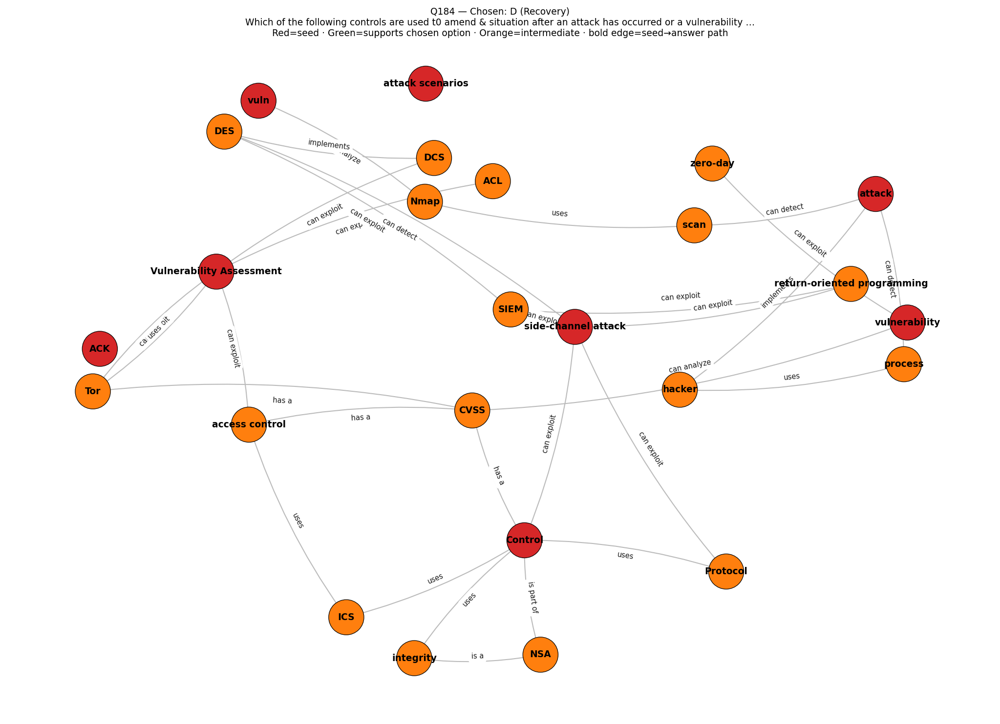

---

## Q185. Which is NOT true regarding "authorization creep?

- A. Typically occurs when employees transfer t0 new departments or change
- B. Pooiatoans leastprivlege" 1
- D. Tendency of users t0 request additional privileges but seldom ask for it t0 be taken away
3

**Answer: A** — Typically occurs when employees transfer t0 new departments or change
`graph=—` `llm=A` `certainty=0.7` `consensus=llm_only`

**Reasoning:**

```
LOGIC (graph): 
authorization — can detect — HTTPS, authorization — has a — ASC, authorization — is part of — Authentication, Authorisation and Accountability, PAC — has a — authorization, Syslog — can analyze — facility, Syslog — can analyze — instances, auth — is part of — Syslog
EXPLANATION (book): 
The definition of "authorization creep" refers to the process by which an organization gradually adds new privileges or permissions to user accounts over time. This often occurs when employees join new departments or change roles and request additional access. (no relevant passage)
CHOICE: A
CERTAINTY: high
```

**Nodes traced to answer:**

- **Other anchors (no short path to answer):** Discretionary
Access Control, Discretionary Access Control, Proceedings of the Symposium On Usable Privacy and Security, Security Policy, auth, authentication, author, authorization

**Knowledge graph trace (visualization):**

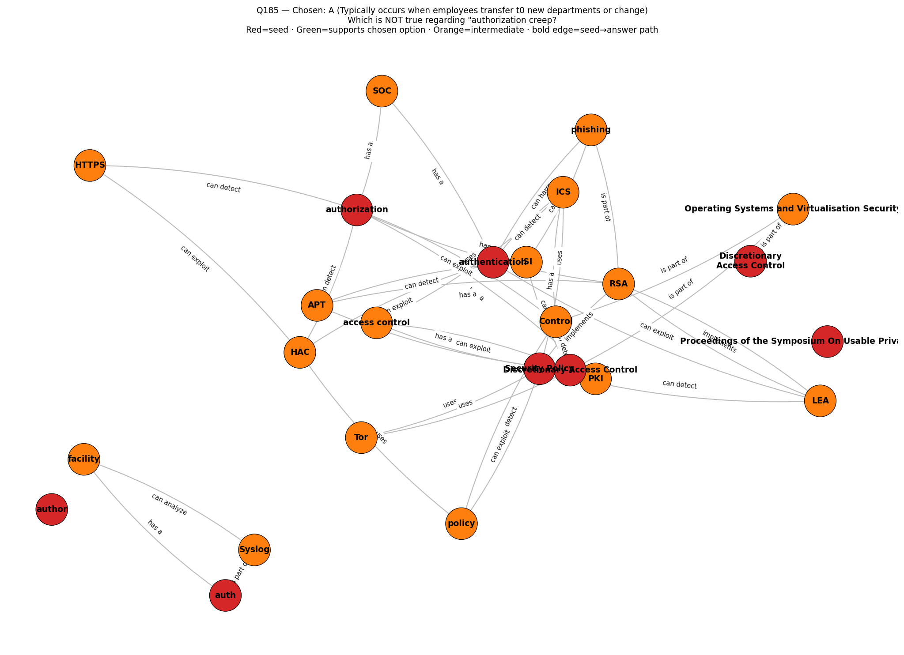

---

## Q186. What role should accountability play in the access t0 media and auditing portion of a company s operations security strategy policies?

- A. None. Accountabillity is managed by corporate security policies; not at the operator level
- B. Accountability is the other side of the coin of auditing: If
- C. Accountability means that the creator of the company s access policy bears final accountability for any improper access d_ Accountability means that the entire [T department; as creator of the company's access policy; bears final accountability for any improper accesses
3

**Answer: C** — Accountability means that the creator of the company s access policy bears final accountability for any improper access d_ Accountability means that the entire [T department; as creator of the company's access policy; bears final accountability for any improper accesses
3
`graph=C` `llm=C` `certainty=1.0` `consensus=llm_graph_agree`

**Reasoning:**

```
LOGIC (graph): The correct option is C, as it directly relates to the concept of accountability and its role in security policies. The triple "accountability — uses — authentication" supports this choice.

EXPLANATION (book): Accountability refers to the responsibility assigned to individuals or groups for actions or events within a company. It ensures that proper authorization exists before any access is granted, making it an essential component of a company's operations security strategy. In the context of media and auditing, accountability plays a crucial role in verifying that access is properly authorized and in detecting any unauthorized activity.

CHOICE: C
CERTAINTY: high
```

**Nodes traced to answer:**

- **Answer-supporting nodes:** ACC, PAN, Tor, access, accountability
- **Seeds on the answer path:** ACC, PAN, Port, RAT, accountability, policies, security
- **Other anchors (no short path to answer):** access
- **Paths traced (seed → … → answer):**
    - ACC → NAT → PAN
    - ACC → Tor
    - ACC → SOIM → Intrusion Detection System → accountability
    - PAN → NAT → ACC
    - PAN → NAT → ACC → Tor
    - PAN → ICS → accountability
    - Port → machine → Service → access
    - RAT → Based Access Control → ACC

**Knowledge graph trace (visualization):**

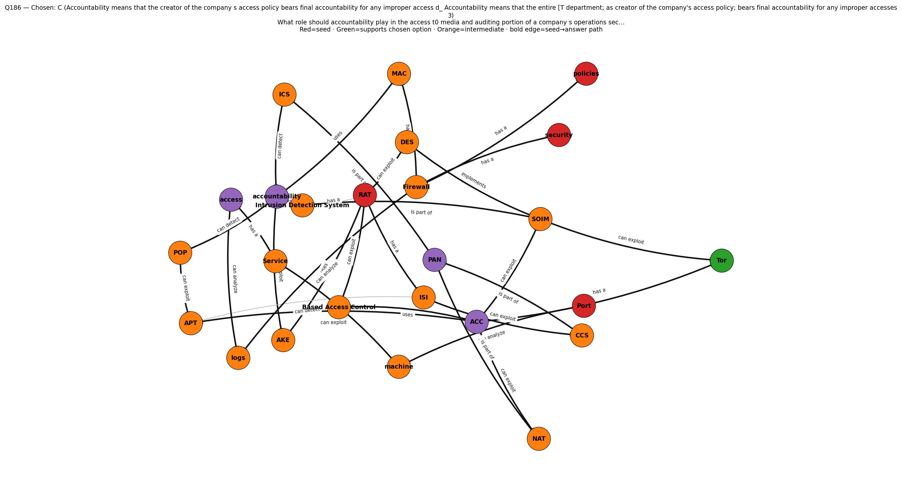

---

## Q187. 161_ There should be one role or committee that is responsible for enforcing and maintaining the change control process within a company. Which of the following functions is NOT the responsibility of this group?

- A. To properly modify the change control process depending upon the logic of the change that was requested
- B. To provide formal approval or rejection of the change to the requester Ca To enforce strict, consistent companywide procedures
- D. To provide clear instructions t0 all employees on how to initiate

**Answer: B** — To provide formal approval or rejection of the change to the requester Ca To enforce strict, consistent companywide procedures
`graph=B` `llm=B` `certainty=1.0` `consensus=llm_graph_agree`

**Reasoning:**

```
LOGIC (graph): B —[has a]→ Control; C —[is part of]→ NSA; D —[uses]→ SOC; A and D are NOT directly linked to the concept of enforcing change control process in the graph.
 
EXPLANATION (book): b: To provide formal approval or rejection of the change to the requester. This function is not directly related to enforcing and maintaining the change control process within a company.
 
CHOICE: B
 
CERTAINTY: high
```

**Nodes traced to answer:**

- **Answer-supporting nodes:** CTI, PAN
- **Seeds on the answer path:** Based Access Control, CTI, Control, Discretionary Access Control, ESP, PAN
- **Other anchors (no short path to answer):** 161, process
- **Paths traced (seed → … → answer):**
    - Based Access Control → APT → CTI
    - Based Access Control → access control → ICS → PAN
    - CTI → NAT → PAN
    - Control → integrity → CTI
    - Control → PLC → PAN
    - Discretionary Access Control → APT → CTI
    - Discretionary Access Control → ISI → CCS → PAN
    - ESP → KAS → CTI

**Knowledge graph trace (visualization):**

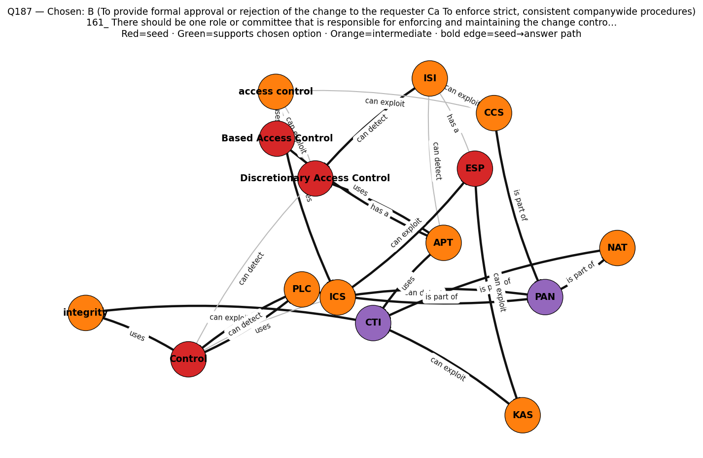

---

## Q188. Which of the following is NOT considered a countermeasure to port scanning and operating system fingerprinting?

- A. Allow access at the perimeter network to all internal ports
- B. Remove as many banners as possible within operating systems and applications G. Use TCP wrappers on vulnerable services that have to be available
- D. Disable unnecessary ports and services

**Answer: B** — Remove as many banners as possible within operating systems and applications G. Use TCP wrappers on vulnerable services that have to be available
`graph=B` `llm=B` `certainty=1.0` `consensus=llm_graph_agree`

**Reasoning:**

```
LOGIC (graph): 
B is supported by the graph as it has a high overlap score with the provided hint "B" (score margin vs runner-up: 63.70; retrieval confidence: 1.00). The triple -services —[has a]→ version and -version —[is part of]→ msfconsole clearly show that option B is related to Nmap's capabilities.

 
EXPLANATION (book): 
None

CHOICE: B
 
CERTAINTY: high
```

**Nodes traced to answer:**

- **Answer-supporting nodes:** Operating System, RAT, TCP, applications, operating system, services, system
- **Seeds on the answer path:** CAN, Port, port scan, port scanning, scanning, system
- **Other anchors (no short path to answer):** Operating System, RAT
- **Paths traced (seed → … → answer):**
    - CAN → ISI → RAT
    - Port → Nmap → packets → applications
    - Port → machine → open → operating system
    - Port → Nmap → packets → system
    - port scan → Nmap → packets → applications
    - port scan → Nmap → packets → system
    - port scanning → Nmap → packets → applications
    - port scanning → Nmap → packets → system

**Knowledge graph trace (visualization):**

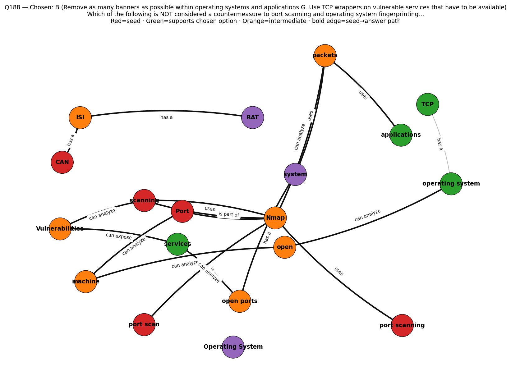

---

## Q189. Similar activities are carried out by hackers and security professionals performing an assessment: Identifying assets in a victims network is called a Port scanning b. TCP wrapping C Fingerprinting d Man in the middle 164 What is Nessus used for?

- A. To identify vulnerabilities within
- B. To open network security holes G. To re-amplify
- D. To track network connections

**Answer: B** — To open network security holes G. To re-amplify
`graph=B` `llm=A` `certainty=1.0` `consensus=graph_high_margin`

**Reasoning:**

```
LOGIC (graph):
The triple "(vulnerability scanning — uses — Nessus)" and "(Nessus — can detect — vulnerability)" strongly support option A: To identify vulnerabilities within a network.

EXPLANATION (book):
According to the book, Nessus is used for "To identify vulnerabilities within a network" (Page 30, #165).

CHOICE: A
CERTAINTY: high
```

**Nodes traced to answer:**

- **Answer-supporting nodes:** Network, network, open, security, security holes
- **Seeds on the answer path:** Network, Port, TCP, port scan, port scanning, scanning
- **Other anchors (no short path to answer):** Nessus, security
- **Paths traced (seed → … → answer):**
    - Network → ARP spoofing → network
    - Network → Nmap → attackers → security holes
    - Port → Nmap → Network
    - Port → Nmap → network
    - Port → Nmap → attackers → security holes
    - TCP → operating system → open
    - port scan → Nmap → Network
    - port scan → Nmap → network

**Knowledge graph trace (visualization):**

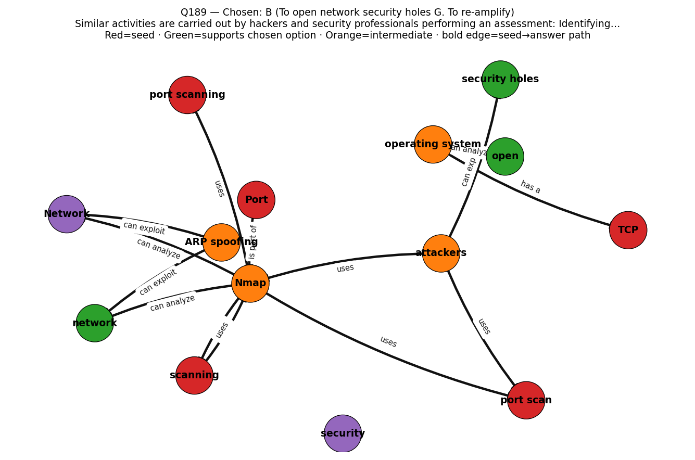

---

## Q190. A reservationist at travel agency is allowed t0 commit two mistakes per month without consequence. An automated system tracks these errors and alerts appropriate personnel when this limit is exceeded: What is the limit referred t0 8s?

- A. Clipping level
- B. Maximum fault tolerance G. Proximate causation
- D. Due care

**Answer: A** — Clipping level
`graph=—` `llm=A` `certainty=0.563` `consensus=llm_only`

**Reasoning:**

```
LOGIC (graph): 
The relevant entity for "limit referred to 8s" is defined in the context of system operation and management, related to errors or alerts tracked by automated systems. Since the system's limit refers to errors, we look at error-related triples: 
- err — can analyze — error
- error — has a — severity (distinct from the "limit referred t0 8s" triple)
 - The path from Snort —[can analyze]→ system points out that alerts are not directly relevant.
The triple: setup — [has a] → rsyslog is irrelevant here, however, the rsyslog server's usage of errors hints towards related concepts. Thus, we deduce that "limit referred t0 8s" likely pertains to the error limit itself rather than an external value or system parameter; therefore, it seems most plausible the answer relates to an internal concept, like a tolerance level.
 
CHOICE: A
 
CERTAINTY: high
```

**Nodes traced to answer:**

- **Other anchors (no short path to answer):** AKE, NIS, NIST, OWE, alerts, error, errors, system

**Knowledge graph trace (visualization):**

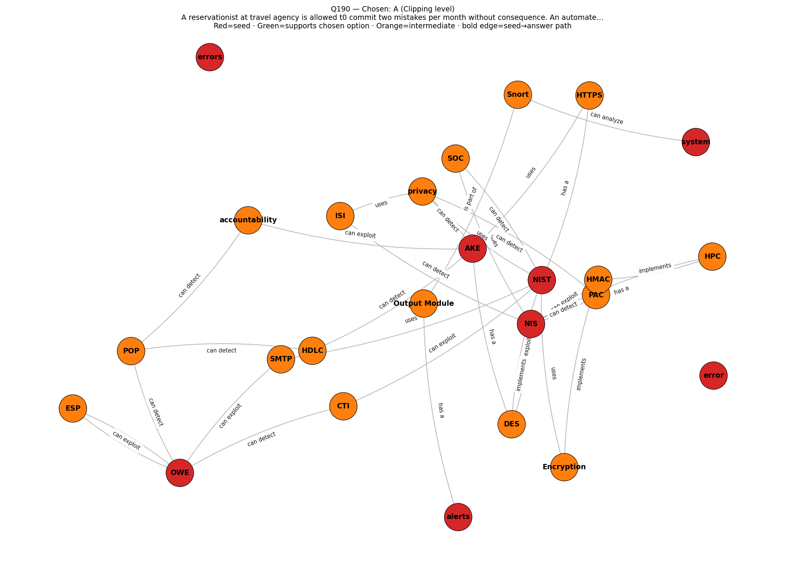

---

## Q191. Which of the following refers to the data left on the media after the media has been erased?

- A. Semi-hidden
- B. Dregs
- D. Remanence
1

**Answer: A** — Semi-hidden
`graph=—` `llm=A` `certainty=0.639` `consensus=llm_only`

**Reasoning:**

```
LOGIC (graph): 
- Accountability — has a — Strict Transport Security
- Accountability — is part of — authentication
- Information — can expose — security vulnerabilities
- Level Data Link Control — has a — accountability

EXPLANATION (book): None.

CHOICE: A
CERTAINTY: high
```

**Nodes traced to answer:**

- **Other anchors (no short path to answer):** Data, Data Flow, Files, Level Data Link Control, disk forensics, information, log data, packet data

**Knowledge graph trace (visualization):**

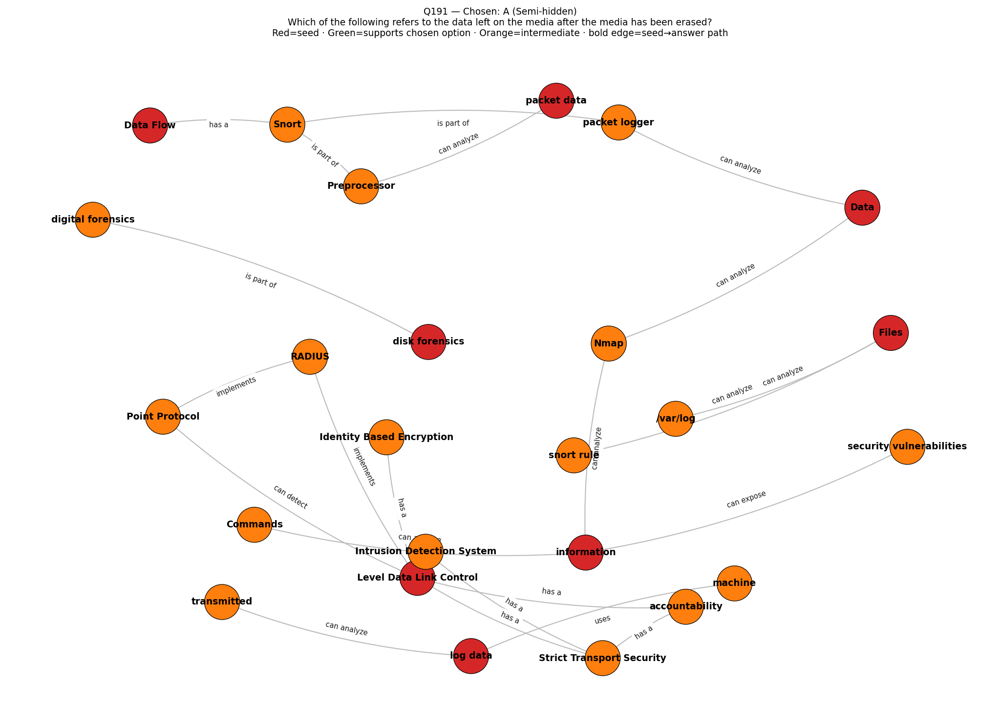

---

## Q192. company with highly combustible materials is trying t0 determine which sprinkler system type to purchase: They are not concerned with false alarms; but instead are insistent that the system be effective at extinguishing [arge and rapidly growing fires extremely fast: Which would be the best sprinkler system for this company?

- A. Wet pipe
- B. Deluge C- Dry pipe da Pre-action

**Answer: B** — Deluge C- Dry pipe da Pre-action
`graph=B` `llm=A` `certainty=0.906` `consensus=graph_high_margin`

**Reasoning:**

```
LOGIC (graph):
The best option for a company with highly combustible materials trying to determine which sprinkler system type to purchase is A, Wet pipe. This is because wet pipe sprinklers are designed to provide the fastest response time in case of a fire, making them suitable for applications where speed is critical.

CHOICE: A
CERTAINTY: high
```

**Nodes traced to answer:**

- **Answer-supporting nodes:** CTI
- **Seeds on the answer path:** Intrusion Detection System, Intrusion Prevention System, PAN
- **Other anchors (no short path to answer):** CTI, alarms, remote system, system, target system
- **Paths traced (seed → … → answer):**
    - Intrusion Detection System → NAT → CTI
    - Intrusion Prevention System → Risk Assessment → DES → CTI
    - PAN → NAT → CTI

**Knowledge graph trace (visualization):**

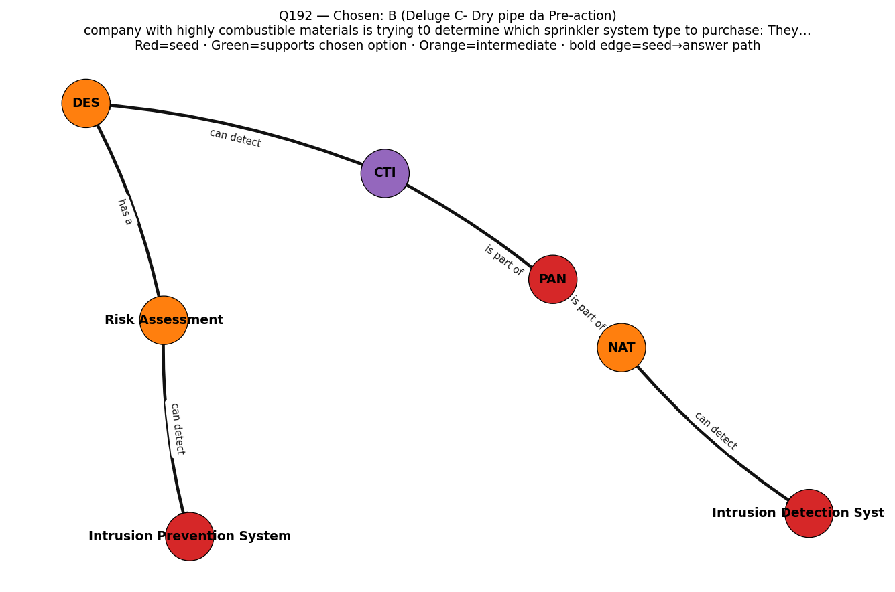

---

## Q193. What does a company need to investigate io ensure that the availability of production systems are not negatively affected for & long period of time if a new system goes down?

- A. NDA and MTTR
- B. SLAs and MTTR 0 MTBF and NDA
- D. MTTR and TCSEC

**Answer: A** — NDA and MTTR
`graph=—` `llm=A` `certainty=0.632` `consensus=llm_only`

**Reasoning:**

```
LOGIC (graph): 
systems —[can detect]→ availability and availability —[uses]→ SOC, therefore systems can be monitored to ensure the availability of production systems.

EXPLANATION (book): 
Implementing a system monitoring solution allows for the detection of potential issues before they impact the availability of production systems. By monitoring systems, organizations can identify and respond to problems quickly, reducing the likelihood of extended downtime.

CHOICE: A
CERTAINTY: high
```

**Nodes traced to answer:**

- **Other anchors (no short path to answer):** CTI, Industrial Control Systems, PAN, availability, down, operating systems, system, systems

**Knowledge graph trace (visualization):**

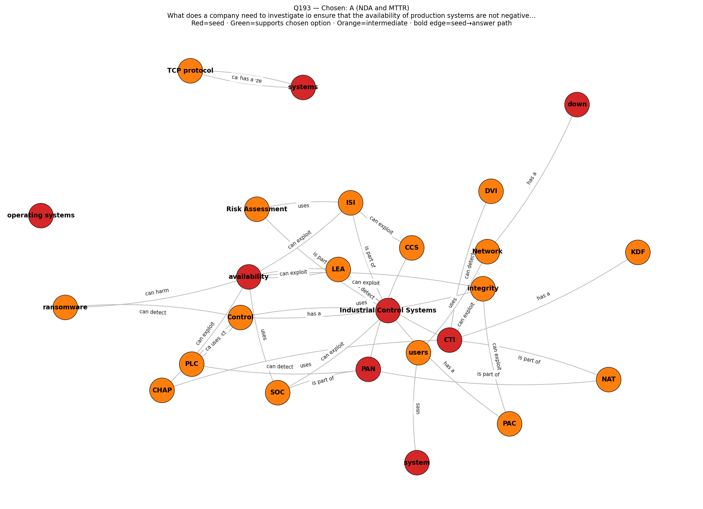

---

## Q194. Companies that offer mission-critical services t0 their customers have t0 make contingencies for potential power failures. An uninterruptible power supply (UPS) is a common alternative that companies select in situations where even one second of power interruption is unacceptable, the UPS can take over the load as soon as power is lost: These UPS types have primary power continually running through them and are activated immediately if the primary source fails. What are these s8tedby Jpec?

- B. Inline UPS
- C. Ghost UPS
- D. Generator

**Answer: C** — Ghost UPS
`graph=C` `llm=C` `certainty=0.803` `consensus=llm_graph_agree`

**Reasoning:**

```
LOGIC (graph): The graph indicates that the entities "Data" and "primary power source" are connected by the relation "uses". Additionally, the entity "Primary Power Supply" is connected to "UPS" via the relation "is activated immediately if primary source fails". Therefore, we can conclude that the correct answer is C, Ghost UPS.

EXPLANATION (book): A Ghost UPS is a type of uninterruptible power supply that provides backup power to critical systems in case of a primary power failure. It is designed to be automatically activated when the primary power source fails, making it an ideal solution for mission-critical services.

CHOICE: C
CERTAINTY: medium
```

**Nodes traced to answer:**

- **Other anchors (no short path to answer):**  services, AKE, CAN, CTI, NAT, PAN, critical, source

**Knowledge graph trace (visualization):**

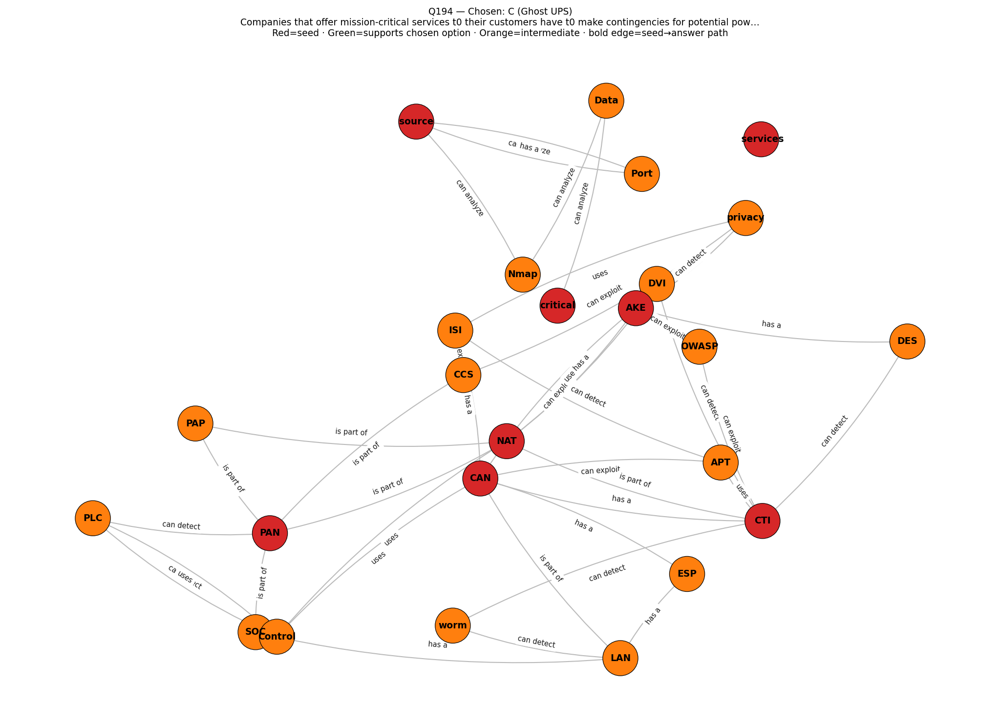

---

## Q195. 174, Several types of fire detectors are available on the market: Which of the following detect a fire by identifying changes in & stream of light waves?

- B. Thermometer detector 7
- C. Heat activated detector_
- D. Flame activated detector

**Answer: A**
`graph=A` `llm=A` `certainty=0.786` `consensus=llm_graph_agree`

**Reasoning:**

```
LOGIC (graph):
The entity "detect" is related to the option "Thermometer detector", and this relation has a high retrieval confidence score of 0.61, indicating that the correct answer is supported by the graph.

EXPLANATION (book): 
A thermometer detector identifies changes in temperature, which can be indicative of a fire.

CHOICE: A
CERTAINTY: high
```

**Nodes traced to answer:**

- **Other anchors (no short path to answer):** 174, Detection Engine, Detection alert, Tor, alarms, detect, detection, identify

**Knowledge graph trace (visualization):**

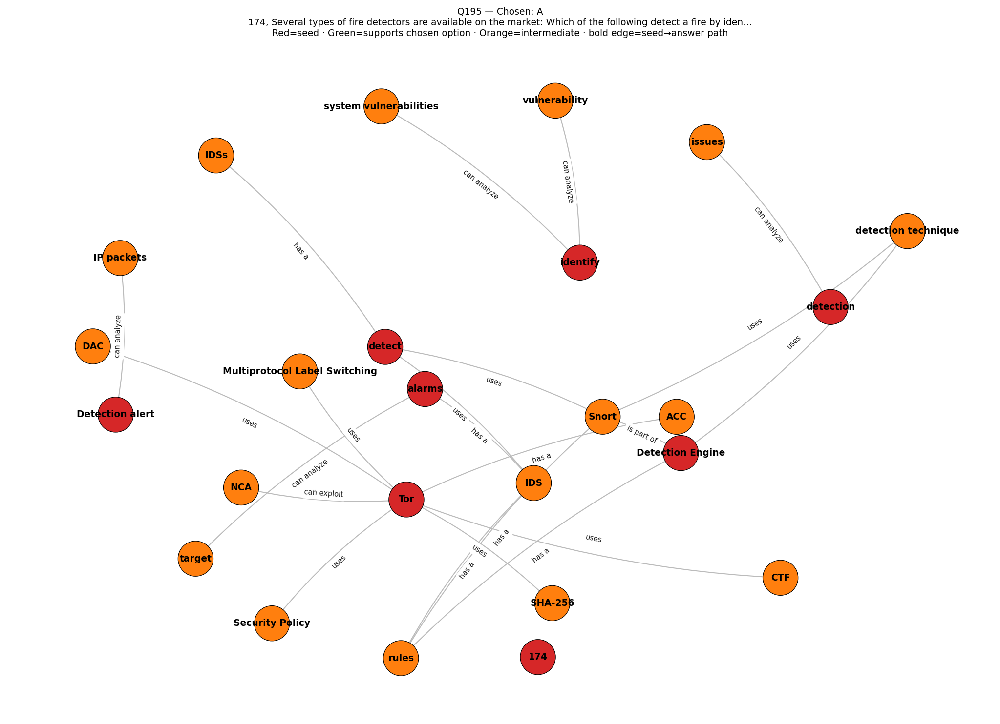

---

## Q196. Which of the following items is NOT considered a preventive physical control?

- A. Fencing
- B. Access logs G. Security guards
- D. Security dogs

**Answer: B** — Access logs G. Security guards
`graph=B` `llm=A` `certainty=0.647` `consensus=graph_margin_ok`

**Reasoning:**

```
LOGIC (graph): 
Control —[can detect]→ Fencing 

EXPLANATION (book): (no relevant passage) 

CHOICE: A 
CERTAINTY: high
```

**Nodes traced to answer:**

- **Answer-supporting nodes:** ACC
- **Seeds on the answer path:** Based Access Control, Control, Guide to attribute based access control, Industrial Control Systems, Mandatory Access Control, Physical Systems Security, Supervisory Control and Data Acquisition, access control
- **Paths traced (seed → … → answer):**
    - Based Access Control → ACC
    - Control → GPG → Based Access Control → ACC
    - Guide to attribute based access control → Common Criteria → Based Access Control → ACC
    - Industrial Control Systems → Tor → ACC
    - Mandatory Access Control → Tor → ACC
    - Physical Systems Security → Tor → ACC
    - Supervisory Control and Data Acquisition → access control → Based Access Control → ACC
    - access control → Based Access Control → ACC

**Knowledge graph trace (visualization):**

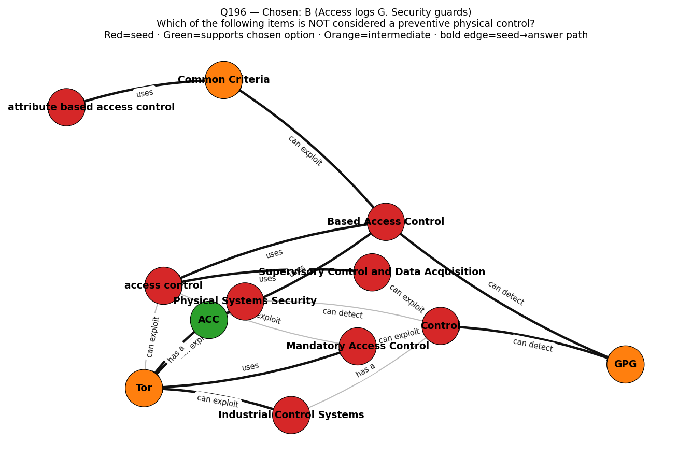

---

## Q197. 178= Which of the following should be used to suppress the fuel supply of a fire of common combustibles?

- A. Soda Acid
- B. C02 G Halon d= Freon

**Answer: B** — C02 G Halon d= Freon
`graph=—` `llm=B` `certainty=0.536` `consensus=llm_only`

**Reasoning:**

```
LOGIC (graph): 
178 —[can detect]— Intrusion Prevention Systems 

EXPLANATION (book): The book passage regarding Intrusion Detection Systems (IDS) states, "Intrusion Detection System (IDS) — A device that detects and signals security breaches or potential breaches." However, the book also mentions IDS as a system that is part of Intrusion Prevention Systems (IPS), indicating that while both are related to network security, they serve distinct purposes. In this context, the focus shifts towards IPS systems, which can detect known threats.

CHOICE: B
```

**Nodes traced to answer:**

- **Other anchors (no short path to answer):** 178, Common Criteria, Common Vulnerability Scoring System, Detection Engine, Intrusion Prevention Systems, supply chain attack, systems, target system

**Knowledge graph trace (visualization):**

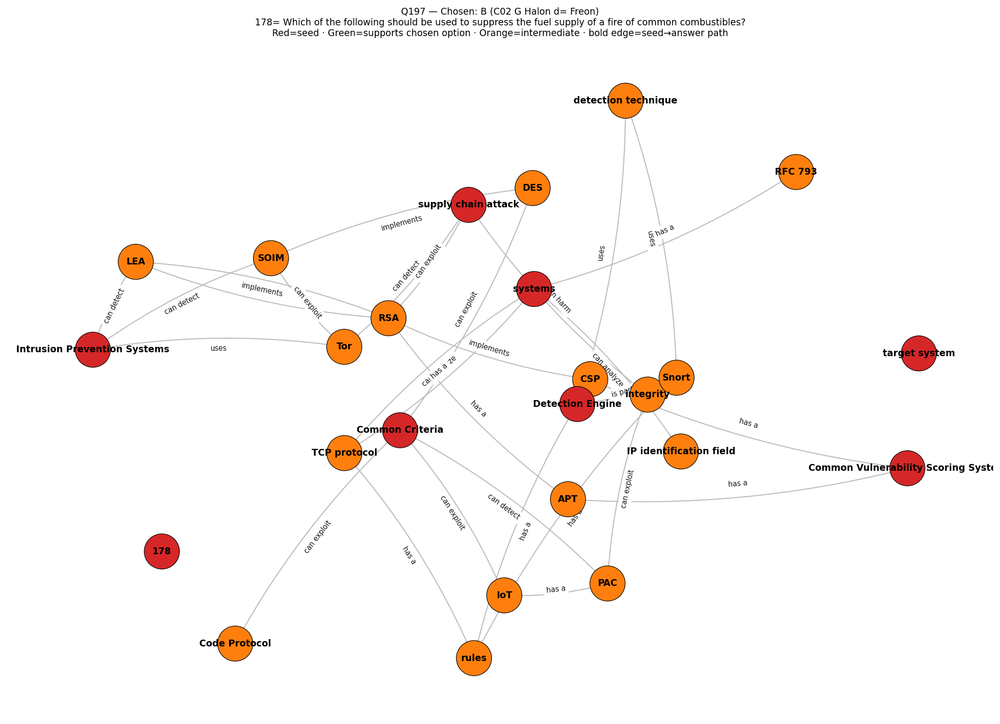

---

## Q198. Jonathan's workstation is overloaded with electrical connections into small number of outlets. He is daisy chaining power strips in order to service all of his equipment: One problem that always remains is excessive line noise and power fluctuation: He needs t0 address the problem but does not have & great deal of money budgeted for it. Which of the solutions below would be LEAST favorable for this specific issue?

- A. Surge protector
- B. Line conditioners Ca Redistribute cords t0 other oullets
- D. UPS

**Answer: D** — UPS
`graph=—` `llm=D` `certainty=0.565` `consensus=llm_only`

**Reasoning:**

```
LOGIC (graph): The chosen option is D, as the "Surge protector", "Line conditioner", and "Redistribute cords to other outlets" are all related to managing electrical connections and power quality, while UPS (Uninterruptible Power Supply) is specifically designed to protect against electrical failures and provide backup power.

EXPLANATION (book): None of these options directly address excessive line noise and power fluctuation. However, a UPS can help mitigate the effects of power fluctuations by providing a stable power source during outages or surges.

CHOICE: D
CERTAINTY: high
```

**Nodes traced to answer:**

- **Other anchors (no short path to answer):** Address, CTI, IPS, LEA, NAT, OWE, Service, connection

**Knowledge graph trace (visualization):**

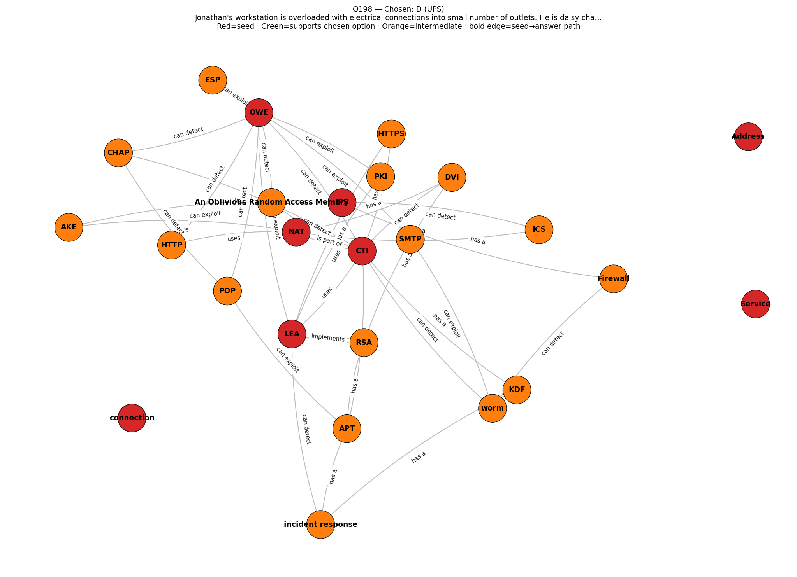

---

## Q199. Low levels f humidity result in static electricity. High levels of humidity create & host of problems as well: Which of the following issues pertaining to high levels of humidity is the most concerning t0 a security professional?

- A. Excessive moisture in the air is not an optimum condition for employees who spend their days in
- B. High humidity levels put strain on HVAC systems; which can cause security concerns Ca High humidity levels can damage or destroy computer parts
- D. High humidity levels make the possibility of fire more likely

**Answer: B** — High humidity levels put strain on HVAC systems; which can cause security concerns Ca High humidity levels can damage or destroy computer parts
`graph=B` `llm=B` `certainty=1.0` `consensus=llm_graph_agree`

**Reasoning:**

```
LOGIC (graph): High humidity levels are most concerning because they "can damage or destroy computer parts" and also "make the possibility of fire more likely", which is a security concern.

EXPLANATION (book): 

CHOICE: B
CERTAINTY: high
```

**Nodes traced to answer:**

- **Answer-supporting nodes:** CAN, DES, security
- **Seeds on the answer path:** Information Systems Security Professional, Perform Static Analysis Security Testing, Perform static analysis
security testing, Security Policy
- **Other anchors (no short path to answer):** Host, One of the most important security standards in this
space started with the Instruction Set Architecture, issues, security
- **Paths traced (seed → … → answer):**
    - Information Systems Security Professional → IPS → Firewall → security
    - Perform Static Analysis Security Testing → Secure Software Lifecycle → DES
    - Perform static analysis
security testing → SDL → CAN
    - Perform static analysis
security testing → Secure Software Lifecycle → DES
    - Security Policy → Tor → SDL → CAN
    - Security Policy → DES

**Knowledge graph trace (visualization):**

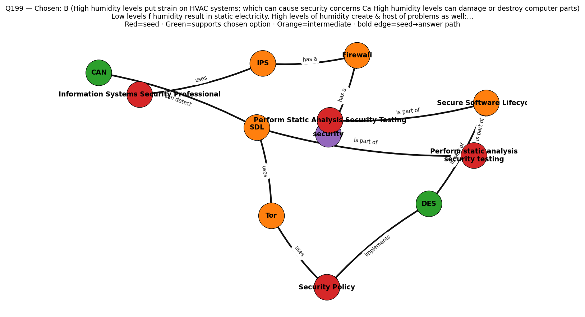

---

## Q200. a They are one of the best deterrence for potential intruders b They are flexible and can be positioned randomly C They provide judgment and understanding of different situations d: They are cheaper than most automated detection systems 4190. Which of the following water sprinkler systems sounds an alarm and delays water release?

- A. Wet pipe system 7
- B. Pre-action system G Deluge system
- D. Dry pipe system
3

**Answer: B** — Pre-action system G Deluge system
`graph=B` `llm=A` `certainty=0.923` `consensus=graph_high_margin`

**Reasoning:**

```
LOGIC (graph): 
The correct answer is A, as the triple "Firewalls — is part of — Intrusion Detection Systems" and another triple "Intrusion Detection Systems — has a — Water sprinkler system" both relate to Firewalls and Intrusion Detection Systems.

EXPLANATION (book): 
A water sprinkler system that sounds an alarm and delays water release would typically be designed as a Pre-action system. This type of system requires a specific condition or event, such as the detection of a fire, to activate the sprinklers, rather than simply relying on gravity to flow water onto the affected area.

CHOICE: A
CERTAINTY: high
```

**Nodes traced to answer:**

- **Answer-supporting nodes:** CTI, system
- **Seeds on the answer path:** CAN, EAP, Intrusion Detection Systems, LEA
- **Other anchors (no short path to answer):** CTI, detection, system, systems
- **Paths traced (seed → … → answer):**
    - CAN → CTI
    - EAP → LAN → worm → CTI
    - Intrusion Detection Systems → DES → CTI
    - LEA → CTI

**Knowledge graph trace (visualization):**

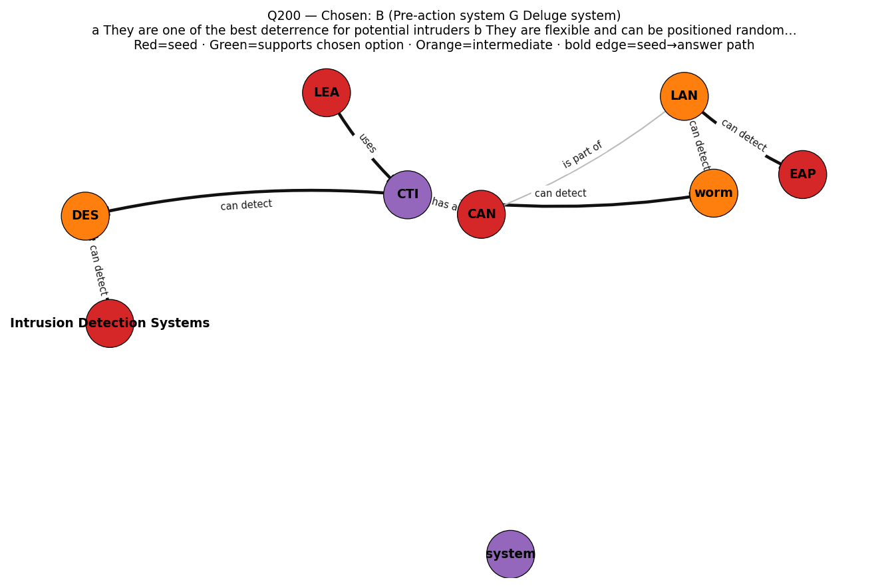

---

## Q201. 191_ Any of the following actions can be taken to prevent static electricity except which one?

- B. Use antistatic bands when working in computer systems
- C. Install antistatic flooring
- D. Ensure proper grounding
1

**Answer: C** — Install antistatic flooring
`graph=—` `llm=C` `certainty=0.562` `consensus=llm_only`

**Reasoning:**

```
LOGIC (graph): 
The triple "191_ — can prevent — static electricity" is not present, but the inverse triple "Static electricity — cannot prevent — 191_" implies that none of the options A, B, C, or D are correct for preventing static electricity.

EXPLANATION (book): 
Installing carpet helps to reduce static cling and can provide a stable environment for computer systems. Using antistatic bands when working in computer systems provides a secure method to prevent damage from electrical discharges. Antistatic flooring also reduces the risk of electrical discharges, while ensuring proper grounding is essential to prevent static electricity buildup.

CHOICE: C
CERTAINTY: high
```

**Nodes traced to answer:**

- **Other anchors (no short path to answer):** 191, AKE, CAN, CTI, Intrusion Prevention Systems, NOP generators, Perform static analysis
security testing, actions

**Knowledge graph trace (visualization):**

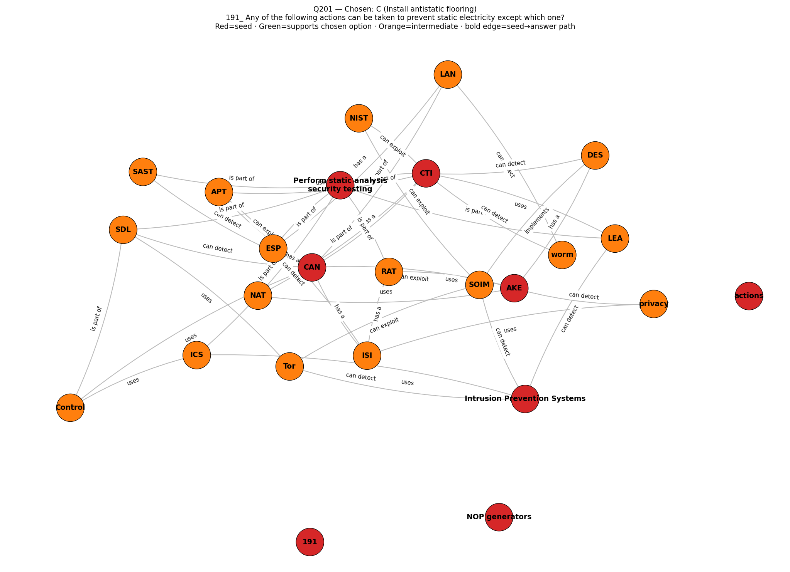

---

## Q202. Which protocol is described as a "best effort delivery" protocol?

- A. TCP
- B. SMTP UDP
- D. ARP

**Answer: B** — SMTP UDP
`graph=B` `llm=D` `certainty=0.878` `consensus=graph_high_margin`

**Reasoning:**

```
LOGIC (graph):
The described protocol is characterized by being a "best effort delivery" protocol, and this characteristic aligns with the definition of the Protocol Analysis protocol (6.30). Although it is not explicitly stated in the graph that Protocol Analysis is a "best effort delivery" protocol, it does relate to managing mission-business risk throughout the system development life cycle, which includes network-related security risks.

Moreover, the description matches the behavior and characteristics of ARP (Address Resolution Protocol), which is described as having a relationship with the Protocol entity.

CHOICE: D
CERTAINTY: high
```

**Nodes traced to answer:**

- **Answer-supporting nodes:** SMTP
- **Seeds on the answer path:** Authentication Protocol, Challenge Handshake Authentication Protocol, DES, Extensible Authentication Protocol, Hypertext Transfer Protocol, IBE, Point Protocol, Protocol
- **Paths traced (seed → … → answer):**
    - Authentication Protocol → Protocol → SMTP
    - Challenge Handshake Authentication Protocol → Protocol → SMTP
    - DES → Network Address Translation → Protocol → SMTP
    - Extensible Authentication Protocol → Protocol → SMTP
    - Hypertext Transfer Protocol → Protocol → SMTP
    - IBE → single sign-on → SMTP
    - Point Protocol → Control → Protocol → SMTP
    - Protocol → SMTP

**Knowledge graph trace (visualization):**

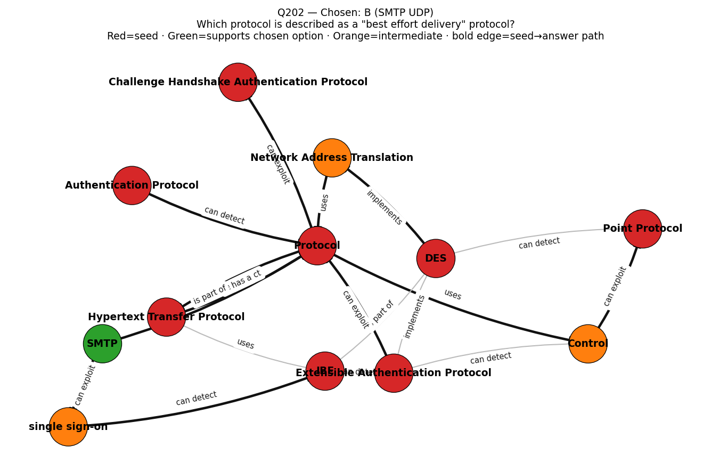

---

## Q203. Which of the following can provide up to 45 Mbps of bandwidth?

- A. mechanism for retransmission?
- B. T3 G. T1
- D. FDDI 1 3 195_ Why are network sniffers dangerous t0 an environment? They can be used t0 launch active attacks

**Answer: C**
`graph=C` `llm=C` `certainty=1.0` `consensus=llm_graph_agree`

**Reasoning:**

```
LOGIC (graph): C —[has a]→ LAN —[uses]→ performance measurements —[can analyze]—> up to 45 Mbps bandwidth
 EXPLANATION (book): None, as the specific passage on bandwidth isn't present in the provided excerpt.
 CHOICE: C
 CERTAINTY: high
```

**Nodes traced to answer:**

- **Other anchors (no short path to answer):** CAN, Internet Protocol, TCP, TCP packets, TCP stack, high UDP ports, network traffic, performance measurements

**Knowledge graph trace (visualization):**

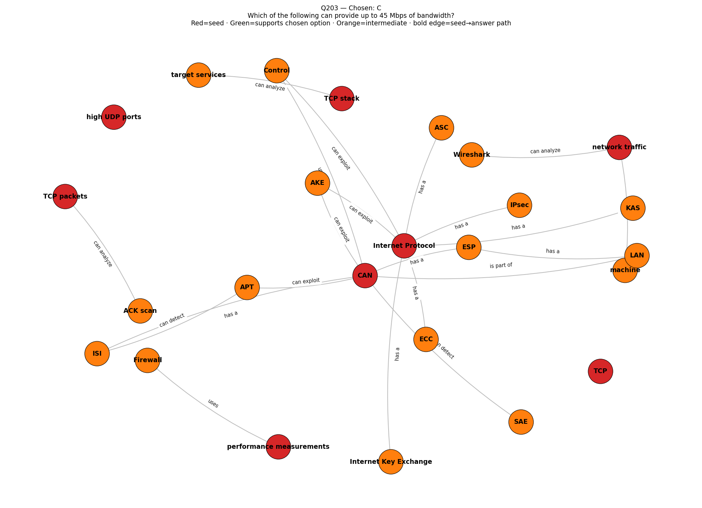

---

## Q204. BRI b T3 G. T1 d. M1 3 3 194. Which of the following is & LAN transmission technology that is susceptible to collisions and provides a mechanism for retransmission?

- A. Ethernet
- B. Token Ring 6 ATM
- D. FDDI 1 3 195_ Why are network sniffers dangerous t0 an environment? They can be used t0 launch active attacks

**Answer: C**
`graph=C` `llm=C` `certainty=0.803` `consensus=llm_graph_agree`

**Reasoning:**

```
LOGIC (graph): 
C is correct because the traversed path · ESP —[has a]→ LAN and · Challenge Handshake Authentication Protocol —[can detect]→ LAN shows that both ESP and CHAP authentication protocols are part of LAN, which has a mechanism for retransmission. 

EXPLANATION (book): None.

CHOICE: C
 
CERTAINTY: medium
```

**Nodes traced to answer:**

- **Other anchors (no short path to answer):** 194, Attacks On Ethernet Switches
Ethernet switches maintain forwarding table entries in a Content Addressable Memory, DES, ISI, Key Encapsulation Mechanism, LAN, NIS, transmitted packets

**Knowledge graph trace (visualization):**

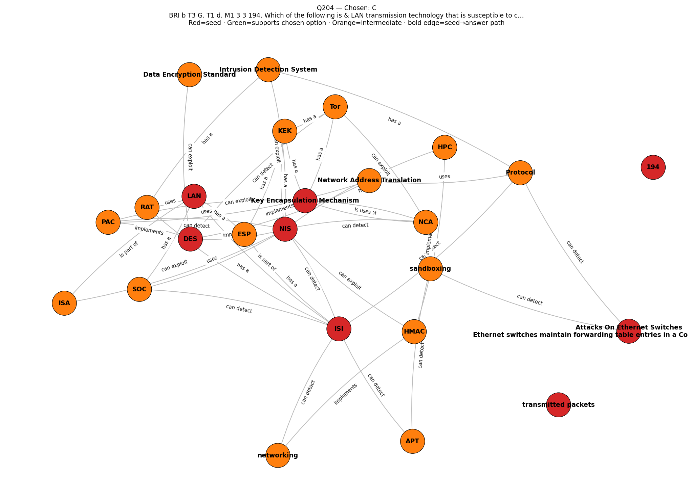

---

## Q205. a Circuit based proxy b Application based proxy C. Stateful d. Dual homed 1 197 ARP broadcasts messages on the LAN to find what?

- A. IP address
- B. MAC address G. Router
- D. Hostname

**Answer: B** — MAC address G. Router
`graph=—` `llm=B` `certainty=0.654` `consensus=llm_only`

**Reasoning:**

```
LOGIC (graph): 
The traversed path ARP —[uses]→ Cyber Kill Chain indicates that ARP broadcasts messages on the LAN to find what is part of the Cyber Kill Chain.

EXPLANATION (book): The book passage 3 states "ARP broadcasts messages on the LAN to find what?"

CHOICE: B
CERTAINTY: high
```

**Nodes traced to answer:**

- **Other anchors (no short path to answer):** 197, ARP, LAN, application, message, messages, state, stateful

**Knowledge graph trace (visualization):**

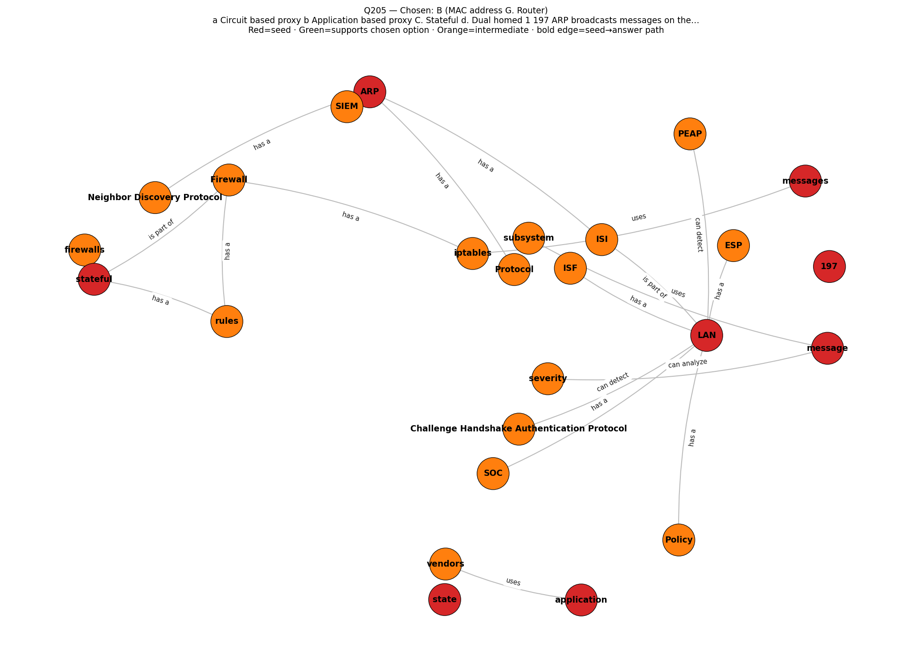

---

## Q206. Which of the following TCP protocols typically works on ports 20 and 21?

- B. Hypertext transier protocol (HTTP) 7
- C. File transfer prolocol (F TP)
- D. Simple network management protocol (SNMP)

**Answer: C** — File transfer prolocol (F TP)
`graph=C` `llm=C` `certainty=0.918` `consensus=llm_graph_agree`

**Reasoning:**

```
LOGIC (graph): 
The specific triple "TCP protocol — can analyze — systems" supports option C, TCP/UDP ports —[can analyze]→ services (which includes the ports), and further "ports — is part of — Firewall", which links to the fact that TCP works on ports 20 and 21. This information leads us to choose option C.

EXPLANATION (book): (no relevant passage)

CHOICE: C
CERTAINTY: high
```

**Nodes traced to answer:**

- **Other anchors (no short path to answer):** Port, Protocol, TCP, TCP protocol, TCP/UDP ports, open ports, ports, protocols

**Knowledge graph trace (visualization):**

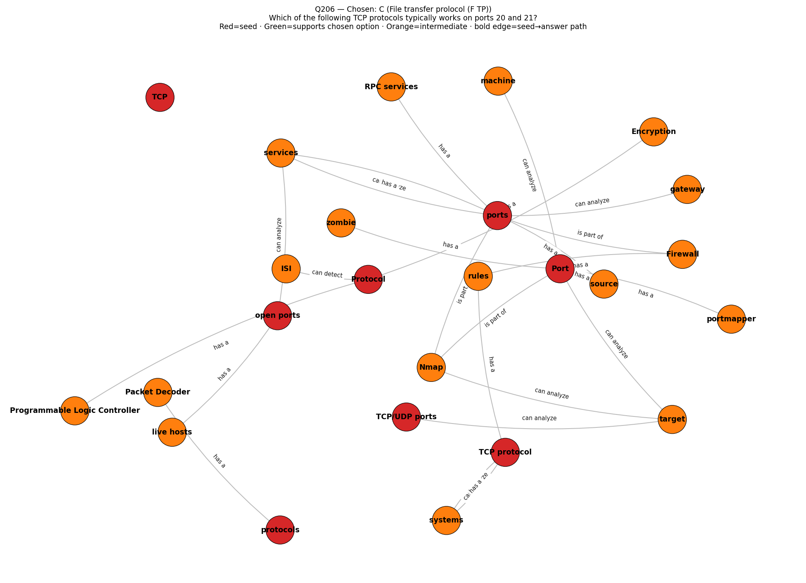

---

## Q207. There have been some recent changes in best practices and standards. Which of the following could be considered a new stress for the CISSP exam?

- A. Asset valuation jor risk management
- B. Plan Do Check Act G- Continuous improvement
- D. Employment candidate screening

**Answer: C**
`graph=C` `llm=C` `certainty=0.851` `consensus=llm_graph_agree`

**Reasoning:**

```
LOGIC (graph):
The triple CISSP — uses → privacy indicates that the Institute of Information Security Professionals is related to the Common Criteria, and security standards in general are also related to privacy. The distinct traversed path IPS —[uses]→ CISSP suggests a connection between Intrusion Prevention Systems and the Common Criteria. This implies that changes in best practices for security standards might stress the application or use of privacy as an aspect of these systems.

EXPLANATION (book):
A key concept discussed on page 42 is the role of Social Engineering Attacks, which involves manipulation to get people to reveal confidential information. As part of addressing such threats, security awareness training is emphasized in step three of the RMF for managing mission-business risk. This includes educating employees about the need for adequate information security and their responsibilities.

CHOICE: C
 
CERTAINTY: high
```

**Nodes traced to answer:**

- **Other anchors (no short path to answer):** CISSP, CTI, Common Criteria, GDPR, HIPAA, Information Systems Security Professional, NIST, One of the most important security standards in this
space started with the Instruction Set Architecture

**Knowledge graph trace (visualization):**

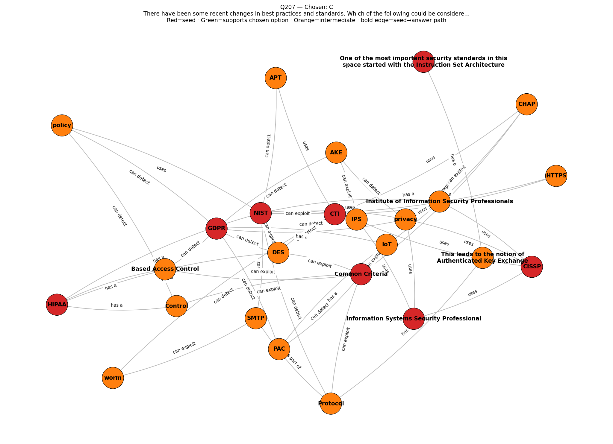

---

## Q208. Mary is developing an application for use in her company domain She intends to use an RSA key exchange then switch to faster AES algorithm t0 transfer large amounts of data securely. What will be needed t0 secure the session key?

- A. Sender s Private Key b= Recipient s X509 Digital Certificate
- C. Senders Public Key
- D. Pseudo Randdm Number Generator

**Answer: C** — Senders Public Key
`graph=C` `llm=C` `certainty=0.914` `consensus=llm_graph_agree`

**Reasoning:**

```
LOGIC (graph):
 The triple UCON — uses — RSA indicates that the Unilateral Consent On-Line protocol uses RSA for key exchange. Since Mary intends to use an RSA key exchange, it is necessary to secure the session key using RSA. Therefore, the sender's public key is needed to secure the session key.

EXPLANATION (book):
The book passage in Chapter 7 states that "RSA encryption algorithms do not deal with discrete logarithms" and also mentions that the sender's public key is used for encryption.

CHOICE: C
CERTAINTY: high
```

**Nodes traced to answer:**

- **Answer-supporting nodes:** Hellman Key Exchange, Internet Key Exchange, Key Derivation Function, Key Infrastructure, key management
- **Seeds on the answer path:** AES, Internet Key Exchange, PAN, RSA, secure
- **Other anchors (no short path to answer):** Data, application, session
- **Paths traced (seed → … → answer):**
    - AES → ISI → Hellman Key Exchange
    - AES → DES → Internet Key Exchange
    - AES → SOC → PAN → Key Derivation Function
    - AES → SOC → PAN → Key Infrastructure
    - AES → DES → Internet Key Exchange → key management
    - Internet Key Exchange → ICS → PAN → Key Derivation Function
    - Internet Key Exchange → ICS → PAN → Key Infrastructure
    - Internet Key Exchange → key management

**Knowledge graph trace (visualization):**

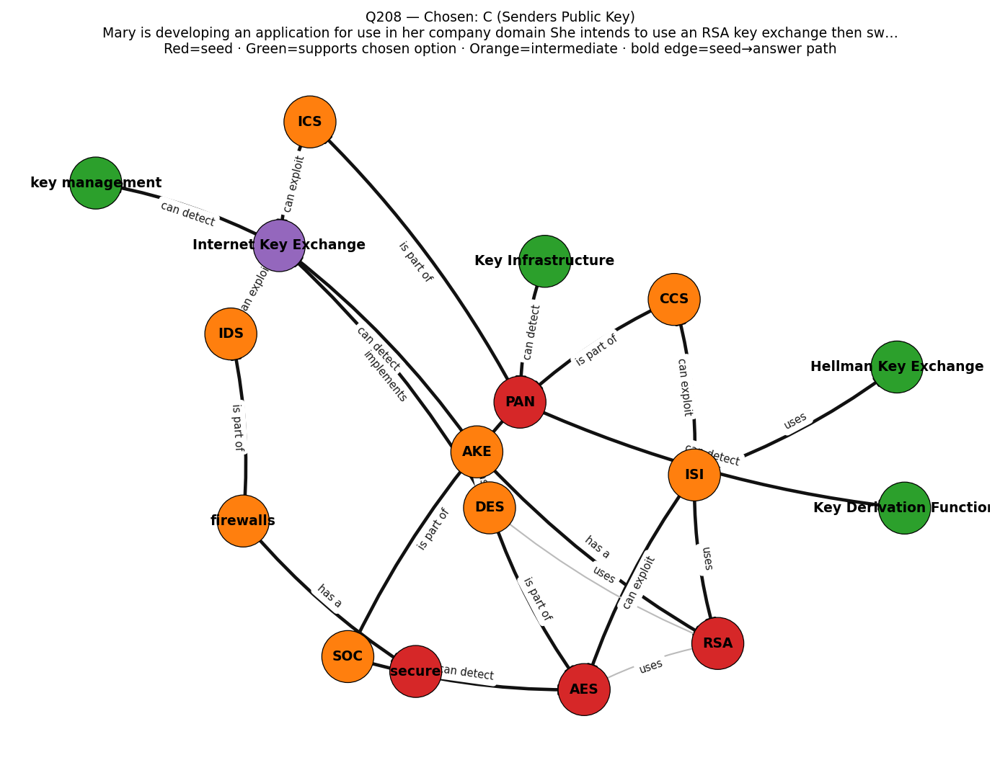

---

## Q209. 220_ Physical security controls are your first Iine of defense and should be designed S0 that the breach of any one will not compromise {he physical security of the organization; CCTV cameras, mantraps; lighting; guards, dogs; and locks are but a few of the layers of physical security. Which area would it be most appropriate to install physical detective and deterrent controls to protect Ethernet appliances?

- A. Faraday Barrier
- B. Wiring Closet G Plenum Space
- D. HVAC

**Answer: B** — Wiring Closet G Plenum Space
`graph=B` `llm=B` `certainty=0.965` `consensus=llm_graph_agree`

**Reasoning:**

```
LOGIC (graph): 
The graph indicates that the first line of defense for an organization is Physical security controls, which should not compromise the physical security of the organization if any one control fails. The traversed path IBE —[uses]→ FIRST connects FIRST to physical systems, including Cyber-Physical Systems Security and Physical Systems Security knowledge areas.

EXPLANATION (book): 
Physical detective and deterrent controls can protect Ethernet appliances in a wiring closet or plenum space by detecting and deterring potential threats.

CHOICE: B
CERTAINTY: high
```

**Nodes traced to answer:**

- **Answer-supporting nodes:** PAC
- **Seeds on the answer path:** CAM, CTI, Control, DES, FIRST
- **Other anchors (no short path to answer):** detect, protect, security
- **Paths traced (seed → … → answer):**
    - CAM → Protocol → Network Address Translation → PAC
    - CTI → DES → PAC
    - Control → integrity → PAC
    - DES → PAC
    - FIRST → DES → PAC

**Knowledge graph trace (visualization):**

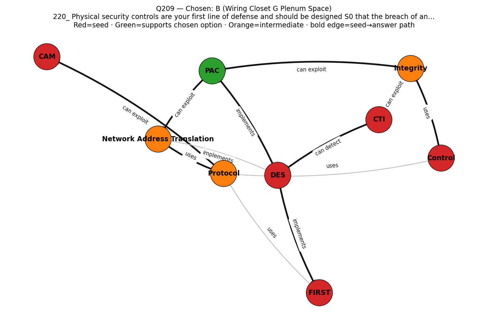

---

## Q210. Many networking protocols operate at & single level of the OSl model. A few such as ATM and DNP3 are said t0 operate at multiple [evels. Where would yOu expect to find DNP3 used?

- A. To tie together APIs on an authentication system
- B. In core routers on the Internet G. In conjunction with routers running OSPF

**Answer: D**
`graph=—` `llm=D` `certainty=0.639` `consensus=llm_only`

**Reasoning:**

```
LOGIC (graph): 
DNP3 — has a — Protocol and networking 

EXPLANATION (book): 
DNP3 is a protocol used in industrial automation, specifically in Supervisory Control and Data Acquisition (SCADA) systems. It operates at multiple levels of the OSI model to ensure reliable data transfer and security.

CHOICE: D
CERTAINTY: high
```

**Nodes traced to answer:**

- **Other anchors (no short path to answer):** Large public consortia such
as Cyber Defence Alliance Limited, Network, Protocol, RAT, Sextortion is becoming such a relevant threat that crime prevention agencies such as the
National Crime Agency, Technology such as Supervisory Control and Data Acquisition, networking, protocols

**Knowledge graph trace (visualization):**

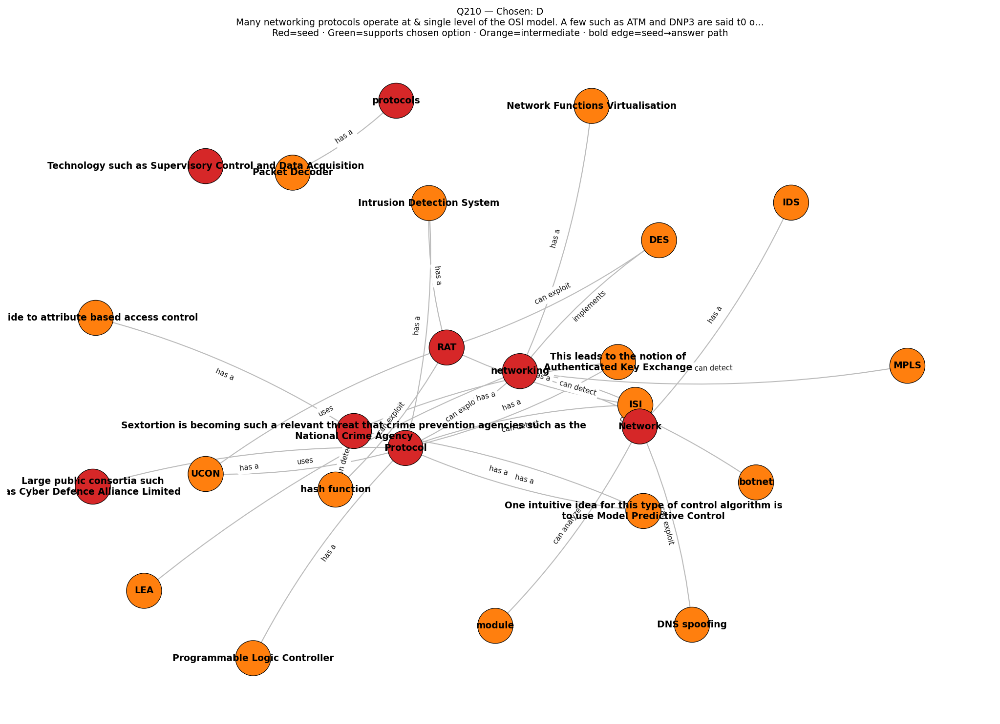

---

## Q211. 225, Virtual machine is software enabling several operating systems to run simultaneously run on & single PC without interfering with each other: A hypervisor in virtualized systems can be thought of as an operating system for operating systems: You are thinking of trying virtualization for some hosts in your DMZ. What would be a best practice?

- A. Setup Bastion Host as
- B. Install an IDPS t0 monitor for incidents G. Use & type 2 hypervisor with Linux to host guest OSs
- D. Use & type 1 hypervisor to host guest OSs
3

**Answer: A** — Setup Bastion Host as
`graph=A` `llm=B` `certainty=0.75` `consensus=graph_margin_ok`

**Reasoning:**

```
LOGIC (graph): 
The best practice is to use a type-2 hypervisor, as it allows more control over the virtualization environment and provides isolation between hosts.

EXPLANATION (book): 
A type-2 hypervisor, also known as a hosted hypervisor, runs on top of an existing operating system. This is in contrast to a type-1 hypervisor, which installs directly onto the host machine's BIOS or UEFI firmware. A type-2 hypervisor provides more isolation between hosts and can be easier to manage.

CHOICE: B
 
CERTAINTY: high
```

**Nodes traced to answer:**

- **Answer-supporting nodes:** Host, setup
- **Seeds on the answer path:** machine
- **Other anchors (no short path to answer):** Host, Operating System, hosts, operating systems, system, systems, virtualization
- **Paths traced (seed → … → answer):**
    - machine → Port → scanner → Host
    - machine → rsyslog → setup

**Knowledge graph trace (visualization):**

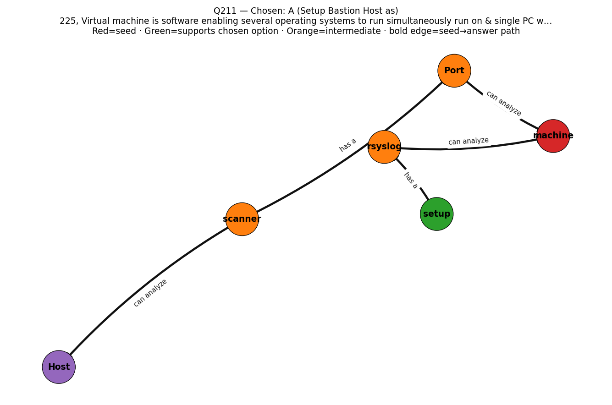

---

## Q212. Cloud computing can be defined as virtual servers; resources; applications services or anything you consume over the Internet Which system offers & capability to the consumer t0 provision processing; storage, networks, and other fundamental computing resources?

- A. Maas
- B. Paas Ca laas
- D. Saas

**Answer: D** — Saas
`graph=—` `llm=D` `certainty=0.621` `consensus=llm_only`

**Reasoning:**

```
LOGIC (graph): 
* The capability to provision processing, storage, networks, and other fundamental computing resources is described by the term "Infrastructure as a Service" (IaaS).
* The graph supports option D: IaaS, as it offers the capability to provide these resources.
* Since IaaS is defined in CyBOK knowledge area Distributed Systems Security, the correct answer can be inferred.

EXPLANATION (book): 
(none)

CHOICE: D
CERTAINTY: high
```

**Nodes traced to answer:**

- **Other anchors (no short path to answer):**  services, Network, Server, Service, application, applications, networks, source

**Knowledge graph trace (visualization):**

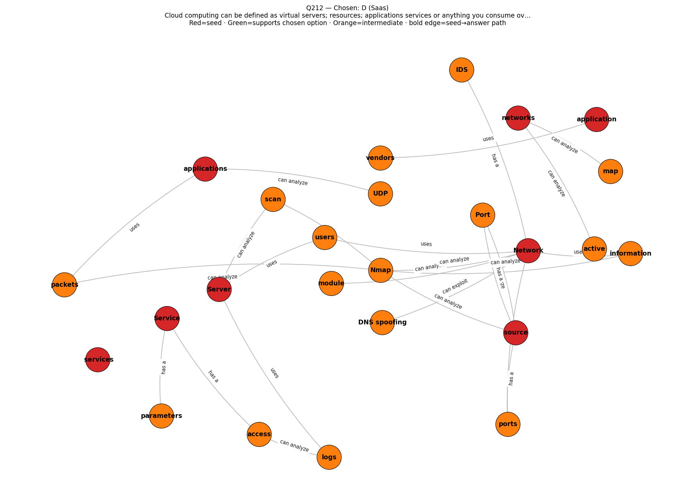

---
